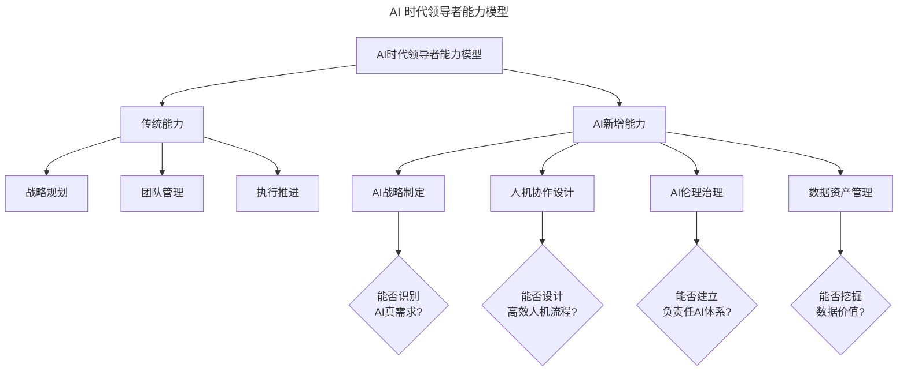
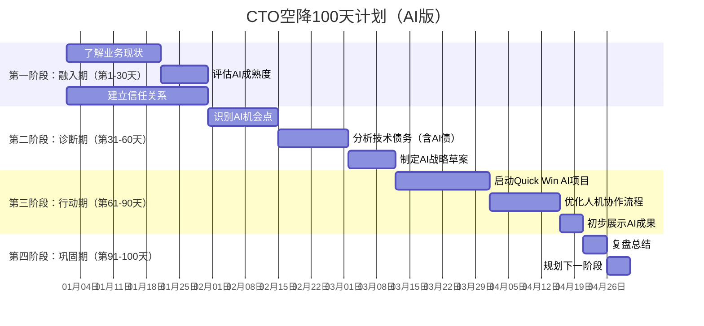

# 第44讲 | 空降技术高管的择业七计

> **适用范围**：空降技术高管候选人（CTO、VP Engineering、技术总监）、创业者、正在评估新公司机会的技术管理者，以及在 AI 时代希望科学选择雇主、顺利落地空降角色的技术领导者。适用于择业评估、空降落地、AI 战略制定等场景。
>
> **更新摘要（v2 · 2026-08 更新）**：
> - 结构化升级为 6 节骨架（导言 / 核心方法论 / 关键流程 / 工具与实战 / 常见误区 / 进阶延展）
> - 整合原"AI 时代升级注解（2026）"内容，将《孙子兵法》"七计"升级为 AI 时代择业评估
> - 为全部 Mermaid 图补充 `--- title: ... ---` frontmatter，并在每张图后追加文字解读
> - 补充 AI 时代空降 CTO 新挑战、100 天计划、Quick Win 项目选择指南
> - 将原"可执行建议"融入进阶延展

---

## 1. 导言

### 1.1 空降技术高管的时代挑战

空降技术高管往往面临全新的组织环境与挑战。2026 年，当 AI 可以完成 70% 的编码工作，Agent 能替代 3-5 人团队，CTO 的角色从"技术管理者"演变为"AI 战略制定者+人机协作架构师"——空降 CTO 的择业逻辑和落地策略需要全面升级。

### 1.2 AI 时代空降 CTO 的新挑战

| 挑战维度 | 2018 年（原文时代） | 2026 年（⭐当前） | 应对策略 |
|---------|-------------------|-----------------|---------|
| 技术债务 | 代码质量、架构老化 | **AI 技术债**：模型依赖、数据质量、Prompt 工程规范 | 建立 AI 治理框架 |
| 团队管理 | 人员招聘、绩效管理 | **人机协作管理**：AI Agent 分配、人机边界定义 | 设计新组织架构 |
| CEO 期望 | 系统稳定、快速交付 | **AI 战略空白**：不知道如何用 AI 提效 | 制定 AI 路线图 |
| 竞争优势 | 技术领先、人才储备 | **AI 应用深度**：谁更会用 AI 重构业务 | 快速试点 AI 项目 |

### 1.3 核心方法论：择业七计

原文基于《孙子兵法》的"七计"在 AI 时代依然有效，但需要增加 AI 维度。

---

## 2. 核心方法论

### 2.1 择业七计之"主孰有道"→ 哪家老板更有 AI 战略？

**新增考察点**：
- [ ] 老板是否理解 AI 的能力边界？（不是万能的）
- [ ] 公司是否有清晰的 AI 投入预算？
- [ ] AI 是核心战略还是营销噱头？

**红色警报 🚨**：
- 老板说"我们要全面 AI 化"但说不出具体场景
- AI 预算为 0 或极低，却期望 CTO 创造奇迹
- 把 AI 当作降低成本的唯一手段

### 2.2 择业七计之"将孰有能"→ 哪家领导更有 AI 思维？



图解：AI 时代领导者能力模型在传统能力（战略规划、团队管理、执行推进）基础上，新增 AI 能力（AI 战略制定、人机协作设计、AI 伦理治理、数据资产管理），并通过四个关键问题检验领导者的 AI 思维深度。

### 2.3 择业七计之"天地孰得"→ 哪个项目更适合 AI 赋能？

**判断标准**：
- ✅ 高重复性、规则明确的任务 → AI 优先
- ✅ 数据量大、模式可学习的领域 → AI 优势
- ✅ 需要个性化、实时响应的场景 → AI 强项
- ❌ 需要高度创意、情感交互的工作 → 人为主

### 2.4 择业七计之"法令孰行"→ 哪家制度支持 AI 创新？

**关键制度检查**：
- [ ] 是否允许使用 AI 辅助编程？
- [ ] 数据安全和隐私政策是否完善？
- [ ] 是否有 AI 项目的试错机制？
- [ ] 绩效评估是否考虑 AI 贡献？

### 2.5 择业七计之"兵众孰强"→ 哪家 AI 基础设施更好？

**评估清单**：
```yaml
AI基础设施评估:
  算力资源:
    - GPU/TPU集群: 有/无
    - 云服务预算: 充足/一般/不足
  
  数据基础:
    - 数据质量: 高/中/低
    - 数据孤岛: 严重/一般/良好
    - 数据治理: 完善/缺失
  
  工具链:
    - AI开发平台: 自建/采购/无
    - MLOps流程: 成熟/初步/无
    - Prompt管理系统: 有/无
  
  人才储备:
    - AI工程师数量: __人
    - ML专家: 有/无
    - 数据科学家: 有/无
```

### 2.6 择业七计之"士卒孰练"→ 哪家员工 AI 素养更高？

**团队 AI 成熟度评估**：

| 成熟度等级 | 特征 | 占比 |
|-----------|------|-----|
| L1-探索期 | 听说过 AI，偶尔使用 ChatGPT | ？% |
| L2-尝试期 | 日常使用 AI 工具，但效率不高 | ？% |
| L3-熟练期 | 能用 AI 提升 50% 以上工作效率 | ？% |
| L4-精通期 | 能设计 AI 工作流，指导他人 | ？% |
| L5-专家级 | 能开发 AI 应用，解决复杂问题 | ？% |

> 💡 **建议**：选择 L3 及以上员工占比超过 30% 的公司，否则你会花大量时间做 AI 培训。

### 2.7 择业七计之"赏罚孰明"→ 哪家薪酬更认可 AI 价值？

**薪酬结构新趋势**：
- 传统：基本工资+奖金+期权
- AI 时代新增：
  - AI 项目成功奖金
  - 数据资产贡献分成
  - AI 专利/论文奖励
  - AI 工具开发激励

---

## 3. 关键流程

### 3.1 AI 时代空降 CTO 前 100 天计划



图解：AI 时代空降 CTO 100 天计划分四个阶段：融入期（了解业务、评估 AI 成熟度、建立信任）、诊断期（识别 AI 机会点、分析技术债务、制定 AI 战略草案）、行动期（启动 Quick Win 项目、优化人机协作、展示成果）、巩固期（复盘总结、规划下一阶段）。

---

## 4. 工具与实战

### 4.1 Quick Win 项目选择指南

**原则**：选择高价值、低风险、短周期的 AI 项目快速建立信任

| 项目类型 | 周期 | 投入 | 预期收益 | 推荐度 |
|---------|------|------|---------|-------|
| AI 代码助手部署 | 1 周 | 低 | 开发效率+30% | ⭐⭐⭐⭐⭐ |
| 智能客服机器人 | 2 周 | 中 | 客服成本-40% | ⭐⭐⭐⭐ |
| 文档自动生成 | 1 周 | 低 | 文档效率+200% | ⭐⭐⭐⭐ |
| 数据分析自动化 | 2 周 | 中 | 分析效率+500% | ⭐⭐⭐⭐⭐ |
| AI 代码审查 | 1 周 | 低 | Bug 率-30% | ⭐⭐⭐⭐ |
| 智能测试生成 | 2 周 | 中 | 测试覆盖率+50% | ⭐⭐⭐⭐ |

### 4.2 空降前必做

1. **AI 能力自评**：诚实评估自己的 AI 技术水平，找到差距
2. **目标公司 AI 审计**：用公开信息+人脉了解其 AI 现状
3. **准备 AI 故事**：准备 2-3 个你主导的成功 AI 案例
4. **设计 Quick Win 方案**：提前想好入职后第一个月能做什么

### 4.3 空降后第一个月

1. **第 1 周**：专注倾听，不要急着展示 AI 能力
2. **第 2 周**：识别最容易出成绩的 AI 机会点
3. **第 3 周**：启动一个 Quick Win 项目
4. **第 4 周**：展示初步成果，建立信任

---

## 5. 常见误区

### 5.1 将 AI 视为万能工具

**误区**：认为 AI 可以解决一切问题，盲目追求"全面 AI 化"。

**正确认知**：AI 不是万能的，需要理解 AI 的能力边界。AI 优先适用于高重复性、规则明确、数据量大、需要个性化响应的任务；需要高度创意、情感交互的工作应以人为主。

### 5.2 忽视 AI 技术债

**误区**：空降时只关注传统代码质量与架构老化，忽视 AI 技术债。

**正确认知**：AI 时代的技术债包括模型依赖、数据质量、Prompt 工程规范。应建立 AI 治理框架，纳入技术债务分析。

### 5.3 忽视团队 AI 素养

**误区**：选择公司时只关注团队规模与技术水平，不评估团队的 AI 素养。

**正确认知**：如果公司 L3 及以上 AI 熟练员工占比过低，你会花大量时间做 AI 培训。建议选择 L3 及以上员工占比超过 30% 的公司。

### 5.4 空降初期急于展示能力

**误区**：空降后第一周就急着展示 AI 能力，急于证明自己。

**正确认知**：空降后第一周应专注倾听，不要急着展示 AI 能力。先识别最容易出成绩的 AI 机会点，再启动 Quick Win 项目，逐步建立信任。

---

## 6. 进阶延展

### 6.1 长期成功要素

- 成为"AI 翻译官"：帮 CEO 理解 AI，帮团队用好 AI
- 建立"AI 实验文化"：鼓励试错，快速迭代
- 培养"AI 原生代"：让年轻工程师成为 AI 主力军
- 保持"技术敏感度"：每月学习一项新的 AI 技术

### 6.2 结语

空降技术高管的成功，取决于科学的择业评估与顺利的落地执行。在 AI 时代，择业七计需要增加 AI 维度，空降落地需要融入 AI 战略与人机协作。成为"AI 战略制定者+人机协作架构师"，是空降 CTO 在新时期的核心使命。

### 6.3 延伸阅读

- 《孙子兵法》—— "七计"思想来源
- 空降技术高管系列文章（《技术领导力 300 讲》）
- 原文链接及更多 CTO 择业与落地实践

---

*本内容基于 2026 年 AI 技术领导力实践编写，帮助 CTO 在 AI 时代实现成功空降。适用对象：空降技术高管候选人、创业者、技术管理者。*
