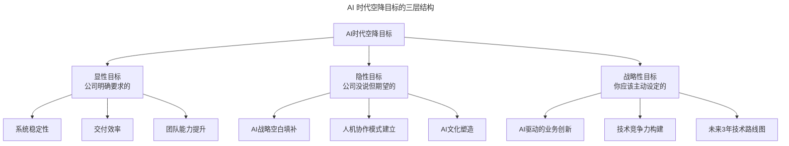
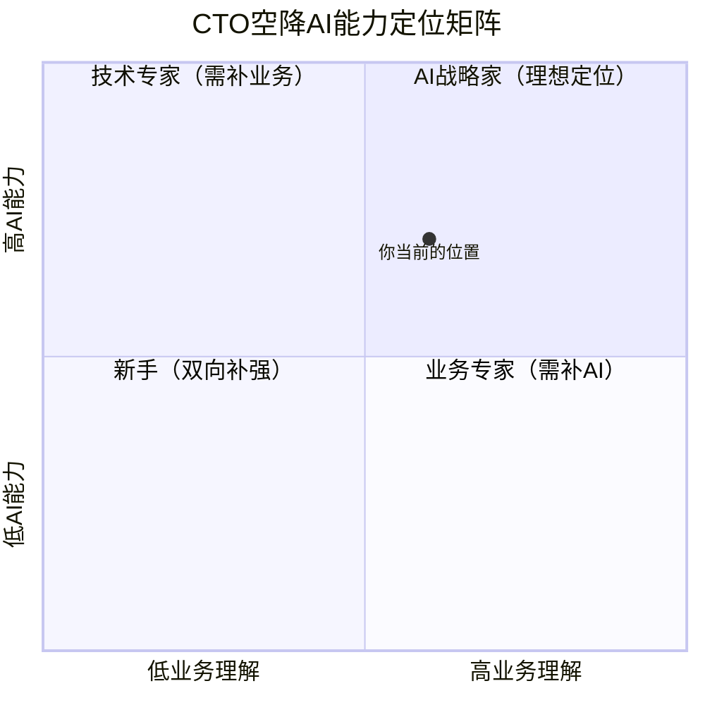
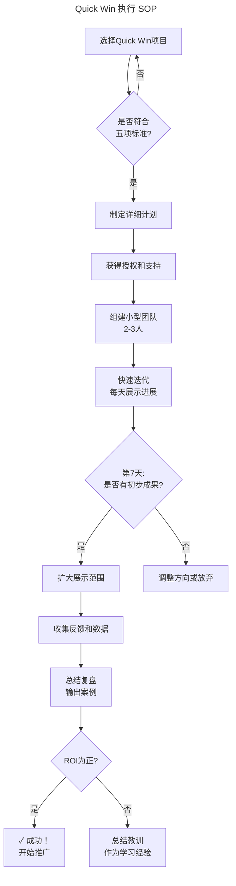
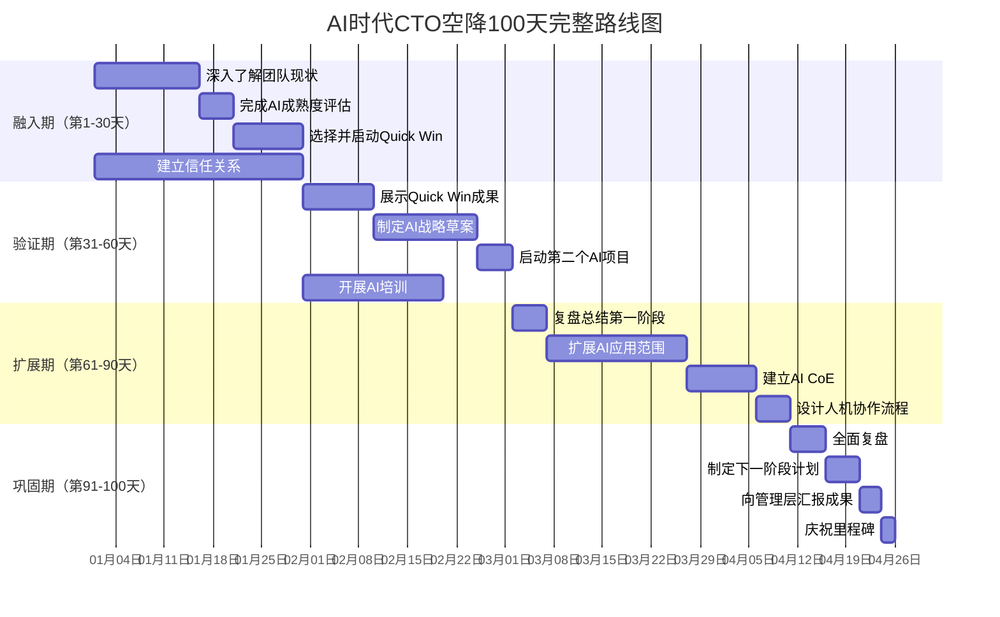

# 第47讲 | 空降领导者平稳落地要做的四道题

> **适用范围**：空降技术领导者（CTO、VP Engineering、技术总监）、即将以领导者角色进入新组织的管理者、希望通过跳槽/转调实现平稳落地的技术管理者，以及在 AI 时代希望科学空降、落地 AI 战略与治理的从业者。适用于空降落地、AI 战略制定、组织融入、Quick Win 管理等场景。
>
> **更新摘要（v2 · 2026-08 更新）**：
> - 结构化升级为 6 节骨架（导言 / 核心方法论 / 关键流程 / 工具与实战 / 常见误区 / 进阶延展）
> - 整合原上下两篇与两份"AI 时代升级注解（2026）"，将空降"四道题"升级为 AI 时代新答案
> - 为全部 Mermaid 图补充 `--- title: ... ---` frontmatter，并在每张图后追加文字解读
> - 补充 AI 时代新风险（AI 战略空白、团队能力断层、CEO 期望错位、双重债务）、Quick Win 项目、100 天路线图
> - 将原"作者简介"融入导言，原"每个人都是空降兵"融入进阶延展

---

## 1. 导言

### 1.1 空降的软着陆

2016年11月底，史海峰从当当离职，入职饿了么，担任当时饿了么北京研发中心的总经理。这种"天上掉下个领导来"的操作方式，职场上俗称"空降"。

入职一年半之后，已更名为技术创新部的北研团队规模超过90人，负责项目超过20个，并且在2017年9月，从0到1做了新零售行业风口项目"无人便利货架"。目前，团队核心成员稳定，这次"空降"算是实现了"软着陆"。

### 1.2 四道题：空降的核心问题

空降操作难度大，围绕"空降到底如何才能顺利着陆"，展开一系列问题：为什么空降？价值在哪里？可能遭遇哪些问题？需要做哪些准备？怎样判断自己是否适合？衡量成败的标准是什么？落地后要做哪些动作？该让谁满意？

这些问题总结成四条（四道题）：空降的目标是什么？空降会面临什么问题和风险？要提前做哪些准备？落地时要做哪些动作？

### 1.3 作者简介

史海峰，贝壳金服 2B2C CTO，TGO鲲鹏会北京分会会员。负责总体架构规划、技术规范制定和技术预研推广，善于把握复杂业务需求，提出创新性解决方案，在项目中对系统架构进行持续改造优化。负责技术委员会组织管理工作，发掘最佳实践、推动技术革新，组织内外部技术交流。

### 1.4 2026 年 AI 时代空降新现实

> ⭐ **2026年空降新现实**：当AI Agent能替代3-5人团队，84%开发者使用AI编程，空降领导者的核心挑战从"融入团队+展示能力"升级为"AI战略对齐+人机协作设计+双重债务治理（技术债+AI债）"——四道题需要全新的答案。

---

## 2. 核心方法论

### 2.1 第一道题：空降的目标是什么

评判空降成败的维度可以有很多方面，但空降目的一定很明确，那就是达成公司对这个职位的预期目标，在此基础之上，才能考虑个人的目标。因此，在空降之前弄清楚该公司为什么需要空降技术领导者是非常重要的。

公司需要空降的技术团队领导者，一般出于以下几个原因（很可能是多方面综合的结果）：

**1. 团队内部没有可胜任的人才，或者提拔有比较大的风险**
技术团队中技术好手很多，有领导者潜质可以做好团队管理的人才难求，有时后备力量还不足以全面接盘团队当前工作，如果晋升之后掌控不好甚至可能给团队带来二次动荡，因此需要空降。从这点出发，对空降者的能力要求会大大高于后备者。

**2. 公司内部没有合适的可调配资源**
如果该领导者自身没有好的后备者，或者对于团队非常重要调不开，则不如从外部招聘人才，把资源空缺的问题转嫁到行业其他公司，甚至竞争对手，此消彼长，一举两得。

**3. 组织结构调整或者他人兼任不是最佳选择**
如康威定律所述，技术团队的组织结构是由业务形态决定的，强行拆分合并反而会带来结构性的内部问题。他人兼任的方式更可行，但无论如何都要有能Hold住更大规模团队的人选。

**4. 团队问题需要外力解决，外来的和尚好念经**
引入外力，用新鲜血液带来更多不一样的思考和操作是不错的选择。毕竟外来的人员没有包袱，更有活力和魄力。

**5. 团队需要更强的领导者**
这是最常见的，也几乎是最主要的原因。团队领导者非常关键，要尽可能胜任，能够快速的融入团队，并带领团队有所产出。

**⭐2026 升级版：AI目标的三层结构**

图解：AI 时代空降目标分为三层——显性目标（公司明确要求：系统稳定性、交付效率、团队能力提升）、隐性目标（公司没说但期望的：AI 战略空白填补、人机协作模式建立、AI 文化塑造）、战略性目标（应主动设定的：AI 驱动的业务创新、技术竞争力构建、未来 3 年技术路线图）。

> **关键洞察**：在AI时代，**隐性目标和战略性目标往往比显性目标更重要**——很多公司招聘CTO是因为他们感到"AI焦虑"，但说不清楚具体要什么。

### 2.2 第二道题：空降会面临什么问题和风险

空降有风险，跳槽需谨慎。如果只看见表面的光鲜，风险意识不足，疏忽大意很可能开局不利马失前蹄。

**原文提到的 5 大风险（依然有效）**：

1. **团队陌生，有距离，易产生隔阂**：空降到一个团队，团队成员彼此之间都很熟、很有默契，带头大哥反而是个陌生人。团队成立的时间越长，老成员越多，越难融入。
2. **可能遭遇抵触，发生排异反应**：新的领导者作为焦点人物，一举一动都会被关注。每个人对新任领导的感受都不同，可能形成负面情绪。
3. **组织文化不熟悉**：每个组织的文化、运行机制都有各自的特点和合理性，而且多数的协调机制都不是白纸黑字明面上的。
4. **团队状态不佳**：有的团队正处在比较糟糕的状态，人心浮动，士气低迷，甚至陷入恶性循环。
5. **时间窗口窄**：留给空降领导者的时间不会太多，短则三个月，长则半年，基本就是试用期的长度。

**⭐2026 新增的 AI 特有风险**：

**风险6：AI战略空白** ⭐⭐⭐——公司想用AI但不知道怎么用；CEO听说竞争对手在用AI，要求"我们也搞AI"；没有人负责AI战略，各部门各自为战。应对：AI成熟度评估（输出 L1-L5 报告）→ AI机会识别（Top 10 清单）→ AI路线图制定（12 个月实施计划）。

**风险7：团队能力断层** ⭐⭐⭐——老员工不会用AI抗拒变化；新员工AI能力强但缺乏业务理解。应对：按 AI 代际分层（AI原生代给挑战任务、AI适应代提供培训、AI观望代展示价值、AI抵触代个别沟通）。

**风险8：CEO期望错位** ⭐⭐——CEO期望AI立刻带来10倍提效；不理解AI项目的失败率（约70%）。应对：期望管理四步法（教育期→对齐期→展示期→调整期）。

**风险9：双重债务负担** ⭐⭐——传统技术债（代码质量差、架构老化）+ 新增AI技术债（Prompt散乱无管理、模型依赖单一供应商、数据质量差、缺乏AI治理框架）。应对：双重债务治理（评估→优先级排序→分阶段治理）。

---

## 3. 关键流程

### 3.1 第三道题：要提前做哪些准备

凡事预则立不预则废。既然要空降，就要做好充足准备，以便遇到问题时能从容应对。

**1. 做好情报工作**
尽一切可能搜集团队情况，掌握团队职责、团队由来、核心成员、当前问题、leader为何空缺等信息。信息渠道包括且不限于面试考官、猎头、同行朋友、技术媒体、知乎、脉脉、内部员工。如果方便，不妨与原来的领导者直接沟通。另外，对于整个公司的发展史、创始人、CTO、技术优势、当前业务等方面的信息，也要尽可能了解。

**⭐AI情报工作清单**：技术层面（当前使用的 AI 工具、AI 项目历史、数据资产现状、AI 人才储备）；业务层面（各业务线的 AI 需求、客户对 AI 的期待、竞争对手的 AI 应用）；组织层面（管理层对 AI 的态度、AI 预算情况、AI 相关制度）。

**2. 定位优势，获得资源和支持**
结合目标，盘点自己的优势在哪方面，以及怎样才能获得支持。优势可以体现在技术能力、行业视野、影响力、所拥有的资源等。上级为了确保空降成功，一般会提供一定的支持，"扶上马送一程"。

**⭐AI能力定位矩阵**：

图解：CTO 空降 AI 能力定位矩阵按"业务理解"和"AI 能力"两个维度分为四个象限——AI 战略家（理想定位）、业务专家（需补 AI）、新手（双向补强）、技术专家（需补业务）。建议作为 CTO 至少达到 L4（架构师）级别，目标 3 个月内达到象限 1。

**3. 做预案**
未虑胜先虑败，明确了目标，对于可能面对的风险和问题，要做好充分的心理准备以及行动计划。如果软着陆失败，就得硬着陆，永远要有Plan B。墨菲定律，怕什么来什么。

### 3.2 第四道题：落地时要做哪些动作

做好了准备，调整好了心态，接下来就到了实施空降行动的时刻。开弓没有回头箭。

**1. 开场**
新官上任，一般会由上级、HR或者原领导负责引荐给团队，先核心成员见面，然后全体会，登台亮相发表"就职演说"。开场第一印象非常重要，衣着、谈吐要得体、有亲和力，最后要有互动。

**⭐AI时代的就职演说**：新增 AI 相关内容——我的 AI 理念（AI 是工具不是替代者）、我的承诺（第一个月内启动 AI Quick Win 项目）、我的期望（保持开放心态）。

**2. 观察**
走马上任之后不必着急三把火，先多观察，参加各种会，多看各种文档，摸清楚公司的技术体系、系统架构、项目和团队管理流程。对于业务型技术团队，务必在第一时间拜访业务伙伴。在观察期内发起团建活动更有利于熟悉团队文化。**用 AI 加速观察的方法**：代码库分析（用 AI 工具分析代码质量和技术债）、文档生成（让 AI 帮助整理会议纪要）、模式识别（用 AI 发现团队工作中的低效环节）。

**3. 上手**
掌握了具体情况之后，要结合实际情况调整预案，然后逐步落地，制定技术路线、优化流程、立规矩、做奖惩、建立领导权威。初期发起任何调整前都要做好充分沟通。明确关注点和量化底线很重要。一般而言，空降领导者要首先确保团队稳定。

**⭐上手期——Quick Win 项目选择与执行**：
- 选择标准：周期短（30%）、风险低（25%）、可见度高（20%）、可复制（15%）、AI含量适中（10%）
- 推荐项目：部署 AI 编程助手（周期1周）、AI 辅助代码审查+自动测试生成（周期2周）、智能日志分析+异常检测（周期2周）、AI 功能 POC（周期2-4周）

**4. 原则**
空降之后你就是团队的一员，要为公司、为团队负责，一切行动都应该把公司和团队放在前面。坚决不能把自己当外人。空降领导者自己表现得再好，团队不行，就是失败，反之，团队取得成果也就是你取得成果。

**⭐AI时代的领导原则**：
- 原则1：你是AI翻译官——对CEO说业务语言（"AI可以帮助客服团队秒级找到答案，客户满意度预计提升20%"），对工程师说技术语言（"我们可以用AI编程助手减少50%的重复编码时间"）
- 原则2：建立AI实验文化——失败是学习机会、每月1个"AI实验日"、设立AI创新基金
- 原则3：设计人机协作架构——任务分配原则（高重复规则明确→AI优先；需要创造力/情感交互→人为主；数据处理分析→AI优先；战略决策→人为主；边界模糊→人机协作）

---

## 4. 工具与实战

### 4.1 Quick Win 执行 SOP

图解：Quick Win 执行 SOP 流程为"选择项目→符合五项标准→制定计划→获得授权→组建小型团队→快速迭代（每天展示进展）→第 7 天判断是否有初步成果→扩大展示范围→收集反馈→总结复盘→ROI 判断→成功推广或总结教训"。强调小步快跑、快速验证。

### 4.2 AI 时代空降 100 天路线图

图解：AI 时代 CTO 空降 100 天路线图分四期：融入期（1-30 天，了解团队、AI 成熟度评估、启动 Quick Win、建立信任）、验证期（31-60 天，展示成果、制定 AI 战略、启动第二个项目、AI 培训）、扩展期（61-90 天，复盘、扩展应用、建立 AI CoE、设计人机协作）、巩固期（91-100 天，全面复盘、制定下一阶段、向管理层汇报）。

### 4.3 可执行建议（⭐2026）

**入职前最后检查**：
- [ ] 已完成目标公司的AI尽职调查
- [ ] 已准备好3个不同场景的Quick Win方案
- [ ] 已准备好AI相关的就职演说内容
- [ ] 已设定好前30天的具体目标和里程碑
- [ ] 已与管理层就AI期望达成初步一致

**成功标志（100天后）**：
- ✅ 至少完成2个成功的AI Quick Win项目
- ✅ 团队AI adoption rate > 50%（日常使用AI工具）
- ✅ 完成AI成熟度评估报告和战略路线图
- ✅ 建立了可持续的AI推进机制（CoE/培训/激励）
- ✅ 与管理层就下一阶段AI投入达成一致
- ✅ 团队对你的信任度和认可度明显提升

---

## 5. 常见误区

### 5.1 只看见表面光鲜、风险意识不足

**误区**：只看见空降的职位提升和表面光鲜，对风险意识不足。

**正确认知**：空降有风险，跳槽需谨慎。如果只看见表面的光鲜，疏忽大意很可能开局不利马失前蹄。凡事未虑胜先虑败，提早考虑可能的风险，并采取相应的措施规避。

### 5.2 着急烧"三把火"

**误区**：走马上任之后急于烧三把火，大刀阔斧改革。

**正确认知**：走马上任之后不必着急三把火，先多观察，参加各种会，多看各种文档，摸清楚公司的技术体系、系统架构、项目和团队管理流程。观察是为了确认团队情况是否与预期相符。

### 5.3 把自己当外人

**误区**：空降后把自己当外人，只考虑自身利益。

**正确认知**：空降之后你就是团队的一员，要为公司、为团队负责，一切行动都应该把公司和团队放在前面。坚决不能把自己当外人，你把自己当外人，就会真的成为局外人。

### 5.4 忽视 AI 时代的新风险

**误区**：只关注传统空降风险（团队陌生、文化不熟），忽视 AI 时代的新风险。

**正确认知**：2026 年空降面临 AI 战略空白、团队能力断层、CEO 期望错位、双重债务负担（技术债+AI 债）等新风险，需要系统应对。

---

## 6. 进阶延展

### 6.1 每个人都是空降兵

刘猛在小说《最后一颗子弹留给我》中，对空降兵有句概括度极高的名言——"空降兵天生就是被包围的"，后来这句话随着小说改编的电视剧《我是特种兵》热映而成为经典台词。

空降兵要定点空投、深入敌后，在险境中站稳脚跟、打开局面、完成任务。生活之中，谁又不是空降兵呢？从呱呱坠地降落人世，到离家求学，到毕业后进入职场步入社会，到组建家庭，职业调整，甚至是退休养老，都在不停地适应新环境。

**适者生存，是人生常态，每个人都是空降兵，要一次次的投入陌生的环境，能做的就是成为战场主宰，掌控自身命运，决定战局成败。**

### 6.2 2026 年核心结论

空降能否成功，无论提前做了多少准备，实际跳下去的那一瞬间，仍然要面对巨大的不确定性。在 AI 时代，空降领导者的核心挑战从"融入团队+展示能力"升级为"AI战略对齐+人机协作设计+双重债务治理"——四道题（目标、风险、准备、动作）需要全新的 AI 时代答案。隐性目标和战略性目标往往比显性目标更重要，AI 战略空白填补和人机协作模式建立是空降成败的关键。

### 6.3 延伸阅读

- 史海峰，TGO 鲲鹏会技术管理系列文章（《技术领导力 300 讲》）
- 郭士纳《谁说大象不能跳舞》、陆奇空降案例
- 本系列 AI 升级版（《技术领导力 300 讲》AI 版）

---

*本内容基于2026年AI技术领导力实践编写，提供了一套完整的AI时代空降落地方法论。祝每位空降领导者都能顺利着陆！适用对象：空降技术领导者、即将以领导者角色进入新组织的管理者。*
