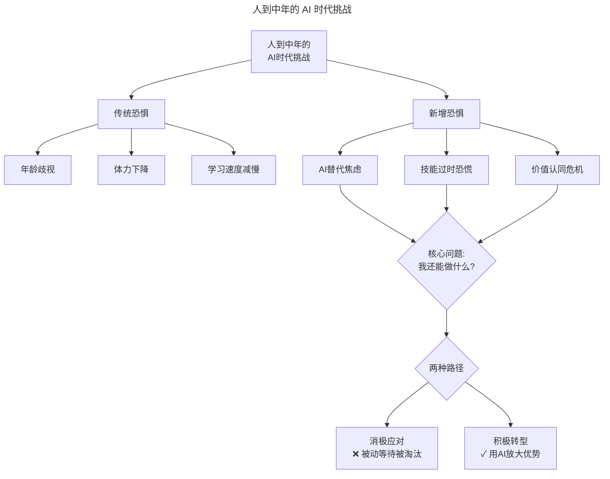
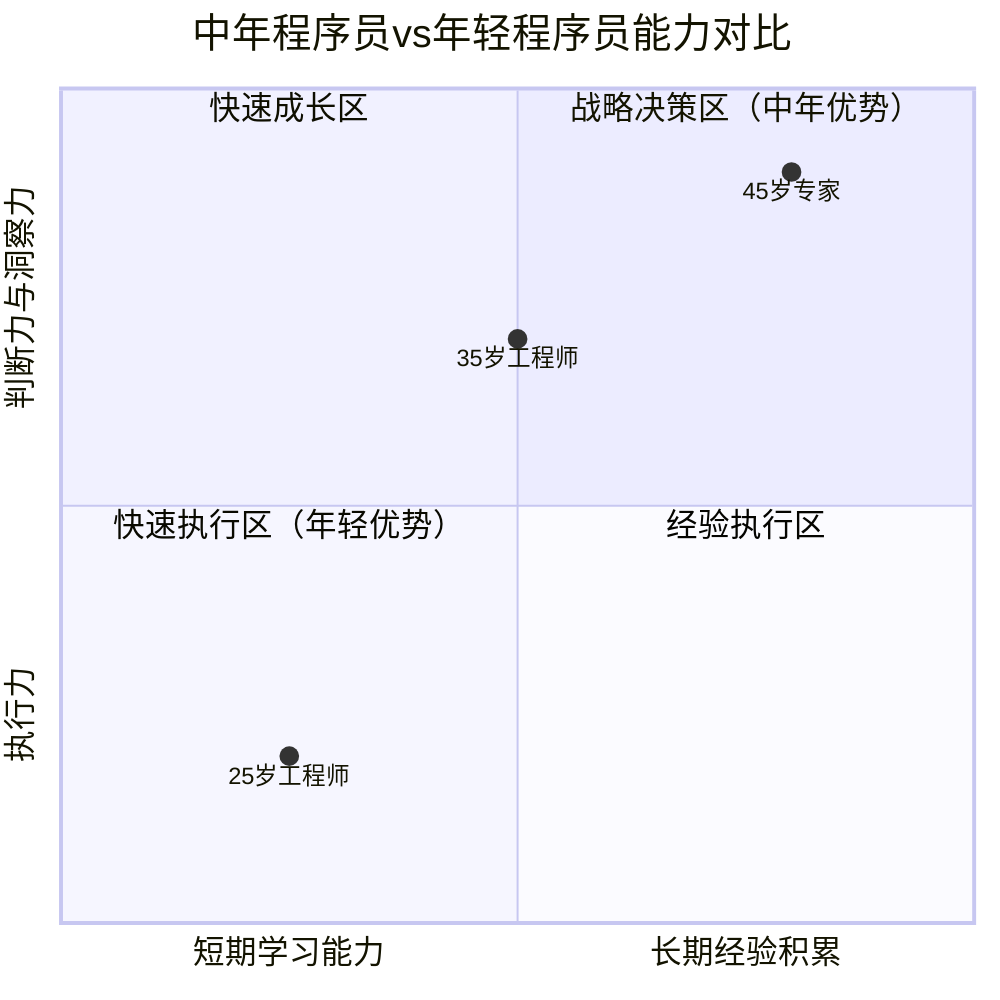
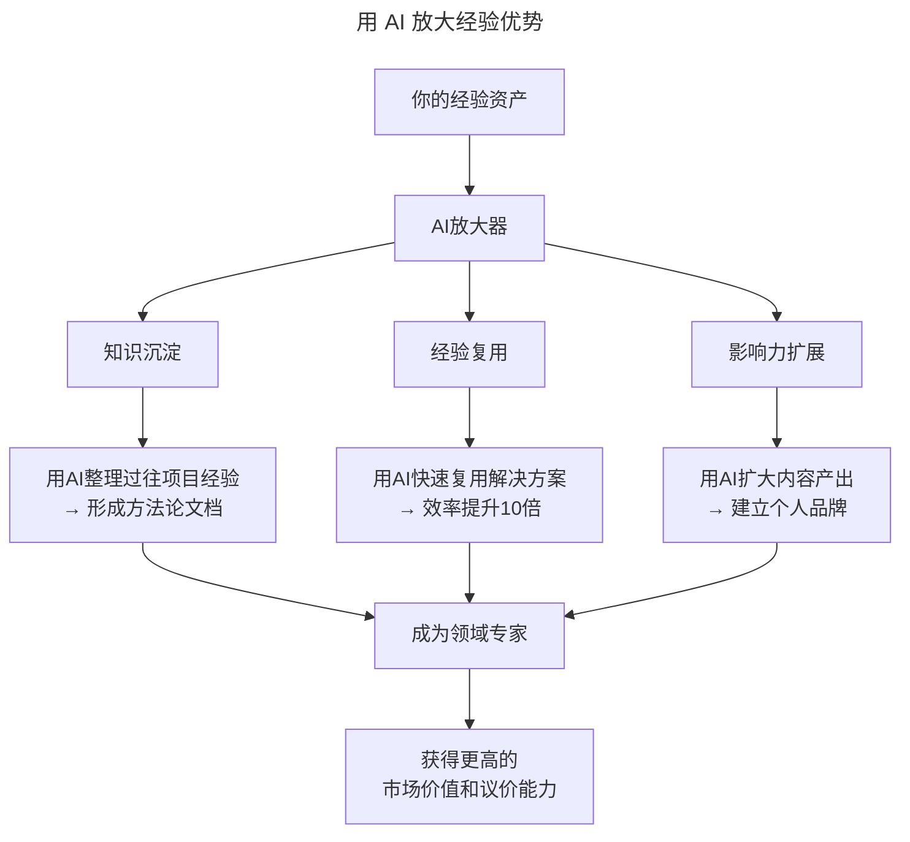
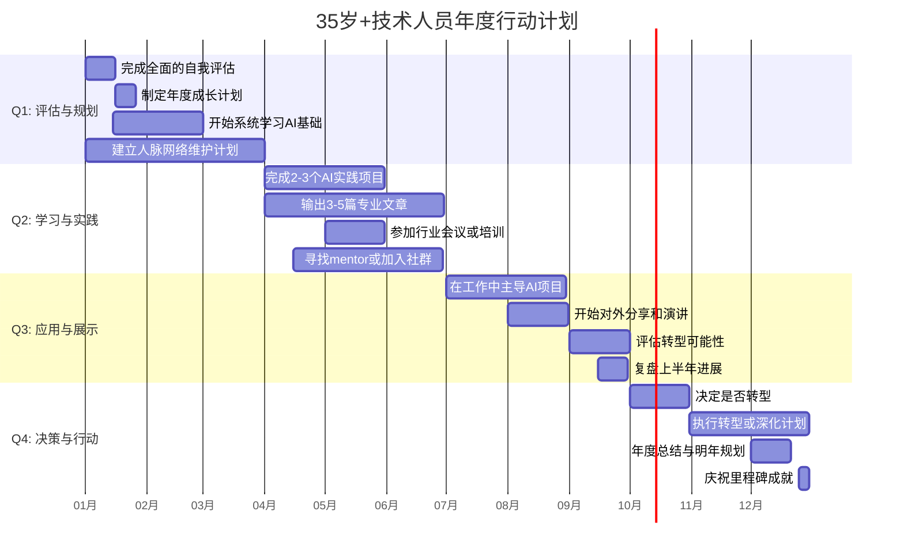

# 第158讲 | 胡峰：人到中年：失业与恐惧

> **适用范围**：35+ 岁的技术人员、技术管理者、面临职业转型与中年危机的从业者，以及在 AI 时代希望重新定位自身优势、转换核心竞争力、应对失业恐惧的技术人。适用于职业规划、危机管理、能力重塑、心态调整等场景。
>
> **更新摘要（v2 · 2026-08 更新）**：
> - 结构化升级为 6 节骨架（导言 / 核心方法论 / 关键流程 / 工具与实战 / 常见误区 / 进阶延展）
> - 整合原"AI 时代升级注解（2026）"内容，将"恐惧感→无惧感→安全感"三阶段升级为 AI 时代职业重塑路径
> - 为全部 Mermaid 图补充 `--- title: ... ---` frontmatter，并在每张图后追加文字解读
> - 保留全部中年优势矩阵、职业安全公式、不同年龄段建议、年度行动计划
> - 将原"作者简介"融入导言，原"行动号召"融入进阶延展

---

## 1. 导言

### 1.1 中年的恐惧感

刚入行的时候，听说程序员是吃青春饭的，只能干到 30 岁。过了几年，这个说法变成了 35 岁。如今走在奔四的"不惑"之路上，想到如果突然丢了工作，会怎样？还是不免为此有一些惶惑。

人到中年，突然就多了一些恐惧感。

### 1.2 三个阶段的旅程

人到中年的职业思考，是一场从"谋生的恐惧感"开始，到"舍生的无惧感"，再到"重生的安全感"的旅程：

- **谋生的恐惧**：怕丢工作，怕没有收入来源
- **无惧感**：专业让人无畏，摆脱恐惧束缚
- **安全感**：转换战场，重新定位，浴火重生

### 1.3 作者简介

胡峰，TGO鲲鹏会会员，京东成都研究院技术专家，目前承担京东咚咚产品线技术架构工作，专注于 Java 后端分布式系统技术架构相关领域。除了技术工作外，近年来也开始领导研究院技术委员会，负责人才识别，晋升选拔，关注人才梯队层次建设和个人进阶发展。

### 1.4 2026 年 AI 时代新解

> ⭐ **2026年中年危机新解**：当AI可以完成70%的编码工作，35岁+程序员的焦虑从"拼体力"转向"拼AI适应力"——但AI时代的真相是：**经验+AI的combination 才是真正的护城河**，中年人反而可能迎来职业生涯的第二春。

---

## 2. 核心方法论

### 2.1 恐惧感：谋生

当你感到害怕丢掉工作时，说明已经不再年轻了，一种为了谋生的恐惧感油然而生。

从年轻时裸辞的无所畏惧，到中年后的如履薄冰，这种变化背后是：中年，每个月比年轻那会儿挣得更多了，职位也更高了，生活变得更安适和稳定，这时**真正潜伏着的威胁开始出现：技能的上升曲线可能越过了高点，走入平缓区，甚至也许在以缓慢而不易觉察的方式下降，而我们却安之若素。**

但中年悄然而生的恐惧感，并不是阻止我们再进一步的"鸣枪示警"，而像是中场的哨声，提醒我们人生的上半场快结束了，短暂的休整之后，就该提起精神开始下半场了。**所以恐惧感不应是一种束缚，而是一种警醒。**

### 2.2 无惧感：舍生

假如你在一份工作中，对丢掉工作本身产生了恐惧，那你做工作的形式很可能会走向谨小慎微。为了保护位置所做的所有努力都会是徒劳的，因为恐惧感绊住了你，这样的工作状态，自己也是缺乏信心的，而一个对自己信心不足的人，也很难让别人对你产生信心。

而偏偏是要对工作的**无惧感**才能真正释放你的潜力，发挥你的能力，让你能够留在原地甚或更进一步。

作为程序员，我们只有一个位置：**专业阵地**。普通劳动者和专业人士的区别在于：
- 普通劳动者主要被动接受指令去执行任务，是一种劳动力资源，他们保证执行；
- 专业人士则在其领域内自己生成指令，同时在领域外还会向同事或上级提供来自该领域的输出：专业建议。专业人士保证选择的执行方向是有意义的，执行路径是优化的。

作为专业人士，我们需要去坚持和持续地打磨专业力，守住这块阵地。

### 2.3 安全感：重生

安全感，是渴望稳定、安全的心理需求，是应对事情和环境表现出的确定感与可控感。

本来丢掉工作并不可怕，如果我们很容易找到下一份工作，并能很快适应变化的话。但现实是，如果是因为经济大环境变化导致的失业或技术性淘汰，找下一份工作并不容易。

最可怕的失业就来自变革引发的技能性淘汰（如：国企下岗），其次是环境引发的萧条（如：金融危机），再次是技能虽然还有普适价值，但自身却适应不了环境变化带来的改变与调整（如：Tony的危机）。

**核心观点**：

> **中年人和年轻人本应在不同的战场上。年轻时，拼的是体力、学习力和适应能力，是做解答题的效率与能力；中年了，拼的是脑力、心力和决策能力，是做对选择题的概率。**

### 2.4 中年大脑的真相

中年了体力下降是自然生理规律，但和脑力有关的学习能力并不会有明显改变。万维钢文章讲的《成年大脑的秘密生活：令人惊讶的中年大脑天赋》中提到：

> 跟年轻的大脑相比，中年大脑在两个方面的性能是下降的：计算速度和注意力。其他方面，比如模式识别、空间想象能力、逻辑推理能力等等，性能不但没有下降，而且还提高了。

计算速度和注意力下降应该是对学习力有一些影响的，但丰富的经历和经验应该可以缩短学习路径，更有效地学习。从其他方面看，模式识别、空间想象和逻辑推理意味着中年人的大脑擅长更多高级的工作技能，所以完全没必要担心"老了"会导致学习能力下降。

### 2.5 缺乏安全感的本质

缺乏安全感，正是源自变化，变化带来的不确定性。环境和人都处在长期持续的变化中，变化总是不确定的，我们没法消除变化，只能把变化纳入考虑，承认变化是永恒的，不确定是长期的。面对这一点很难，难在反人性，我们真正需要做的是战胜自己人性里的另一面——**适应变化，无论世界怎样变化，内心依然波澜不惊**。

### 2.6 AI 时代的中年危机真相

| 恐惧 | 真相 | 应对 |
|------|------|------|
| "AI会替代我" | AI替代的是**重复性工作**，不是**经验和判断** | 成为"AI无法替代"的那个人 |
| "我学不动新技术" | 学习方式需要改变，用AI辅助学习效率提升10倍 | 掌握AI增强学习方法 |
| "年轻人比我便宜又好用" | 但他们缺乏**业务洞察和架构能力** | 强化你的差异化优势 |
| "找不到合适的工作" | 工作定义在变化，新岗位正在涌现 | 关注AI创造的新机会 |

---

## 3. 关键流程

### 3.1 AI 时代的中年挑战全景



图解：人到中年的 AI 时代挑战分为传统恐惧（年龄歧视、体力下降、学习速度减慢）和新增恐惧（AI 替代焦虑、技能过时恐慌、价值认同危机）。面对"我还能做什么"的核心问题，有两种路径：消极应对（被动等待被淘汰）或积极转型（用 AI 放大优势）。

### 3.2 中年人的六大不可替代优势



图解：中年程序员与年轻程序员能力对比矩阵中，25 岁工程师位于"快速执行区"（短期学习能力强、执行力强），35 岁工程师和 45 岁专家逐渐向"战略决策区"移动（经验积累丰富、判断力与洞察力强），体现中年人在判断力与洞察力上的独特优势。

| 优势 | 为什么AI/年轻人无法替代 | 如何进一步强化 |
|------|------------------------|---------------|
| **业务洞察力** | 需要多年行业积累 | 成为行业专家，输出方法论 |
| **架构设计能力** | 需要见过足够多的失败案例 | 总结复盘，形成知识体系 |
| **复杂问题解决** | 需要跨领域整合能力 | 主动承担高难度项目 |
| **人际网络** | 需要时间建立信任关系 | 维护并扩展你的network |
| **风险管理** | 需要经历过真正的危机 | 分享你的失败和教训 |
| **mentoring能力** | 需要有带人的经验 | 带领团队，培养新人 |

### 3.3 AI 时代的职业重塑：新战场

**战场一：AI架构师**
- 适合人群：有丰富系统设计经验的资深工程师
- 核心价值：设计人机协作的技术架构
- 成长路径：系统架构师 → AI架构师 → AI战略顾问

**战场二：AI产品负责人**
- 适合人群：有业务理解和技术背景的TL
- 核心价值：连接技术与商业，定义AI产品方向
- 成长路径：技术经理 → AI产品负责人 → AI业务GM

**战场三：AI培训师/咨询师**
- 适合人群：善于分享、有实战经验的专家
- 核心价值：帮助企业和个人掌握AI技能
- 成长路径：技术专家 → AI培训师 → 独立顾问

**战场四：AI创业者**
- 适合人群：有创业精神、愿意承担风险的人
- 核心价值：用AI解决真实问题，创造商业价值
- 关键前提：找到真需求，组建互补团队

### 3.4 AI 时代的职业安全公式

```
传统Job Security = 大公司 + 高职位 + 稳定行业

AI时代Job Security = 
  (AI适应能力 × 30%) + 
  (领域专深程度 × 25%) + 
  (人脉网络质量 × 20%) + 
  (持续学习能力 × 15%) + 
  (个人品牌影响力 × 10%)
```

**自我评估**：
- AI适应能力（1-10分）：___
- 领域专深程度（1-10分）：___
- 人脉网络质量（1-10分）：___
- 持续学习能力（1-10分）：___
- 个人品牌影响力（1-10分）：___

总分：___ / 50分（40+分相对安全；30-40分需要加强；<30分急需提升）

---

## 4. 工具与实战

### 4.1 策略一：用 AI 放大你的经验优势



图解：用 AI 放大经验优势的路径是"你的经验资产 → AI 放大器 → 成为领域专家 → 获得更高的市场价值"。AI 放大器包含三个功能：知识沉淀（整理经验形成方法论）、经验复用（效率提升 10 倍）、影响力扩展（扩大内容产出建立品牌），最终让经验资产增值。

**实操建议**：
1. **每周花2小时**：用AI工具整理你过去的项目经验
2. **每月写1篇文章**：分享你的专业见解（用AI辅助写作）
3. **每季度做1次分享**：在公司内外部分享你的方法论

### 4.2 策略二：建立"AI+X"的复合竞争力

```
不是：学会AI → 替代原来的技能
而是：原来的技能 + AI = 10倍强的复合能力

示例：
- Java后端 + AI = 能设计AI Native的后端架构
- 数据库DBA + AI = 能优化AI系统的数据层
- 测试工程师 + AI = 能设计智能测试方案
- 运维工程师 + AI = 能构建AIOps体系
- 产品经理 + AI = 能定义AI产品形态
```

### 4.3 策略三：主动转型，不要被动等待

```yaml
主动转型路线图:
  
  Phase 1: 评估期（第1个月）
    - 完成AI能力自评
    - 识别你的可迁移技能
    - 研究3-5个目标岗位的要求
  
  Phase 2: 学习期（第2-3个月）
    - 系统学习AI基础知识
    - 完成2-3个实践项目
    - 考取相关认证（如有）
  
  Phase 3: 实践期（第4-6个月）
    - 在当前工作中应用AI
    - 寻找AI相关的side project
    - 开始建立AI领域的社交网络
  
  Phase 4: 转型期（第7-12个月）
    - 更新简历和LinkedIn
    - 开始接触目标岗位的机会
    - 通过面试/项目验证自己的能力
```

### 4.4 策略四：财务和心理双重准备

**财务准备**：
- [ ] 至少6个月的紧急备用金
- [ ] 多元化收入来源（副业、投资等）
- [ ] 降低固定支出（房贷、消费等）
- [ ] 购买适当的保险

**心理准备**：
- [ ] 接受"终身学习"是常态
- [ ] 建立"成长型思维"而非"固定型思维"
- [ ] 找到工作之外的价值来源（家庭、爱好、公益）
- [ ] 建立支持系统（家人、朋友、导师）

### 4.5 35 岁+技术人员年度行动计划



图解：35 岁+技术人员年度行动计划分四个阶段：Q1 评估与规划（自我评估、制定计划、学习 AI 基础）、Q2 学习与实践（AI 实践项目、输出文章、参加行业会议）、Q3 应用与展示（主导 AI 项目、对外分享、评估转型）、Q4 决策与行动（决定是否转型、执行计划、年度总结），全年系统性地推进 AI 时代职业重塑。

---

## 5. 常见误区

### 5.1 被恐惧感绊住

**误区**：对丢掉工作本身产生恐惧，做工作谨小慎微，只想保护自己的位置。

**正确认知**：为了保护位置所做的所有努力都会是徒劳的，因为恐惧感绊住了你。一个对自己信心不足的人，很难让别人对你产生信心。对工作的无惧感才能真正释放潜力。

### 5.2 与年轻人拼体力

**误区**：中年人在体力、学习速度上硬拼年轻人。

**正确认知**：中年人和年轻人本应在不同的战场上。年轻时拼体力、学习力和适应能力；中年了拼的是脑力、心力和决策能力。中年大脑的计算速度和注意力下降，但模式识别、空间想象、逻辑推理能力反而提高了。

### 5.3 固守旧技能、拒绝变化

**误区**：认为"老了"学不动新技术，拒绝用 AI 放大自身优势。

**正确认知**：学习方式需要改变，用 AI 辅助学习效率提升 10 倍。要主动转型，不要被动等待。建立"AI+X"的复合竞争力，用 AI 放大经验优势。

### 5.4 轻视 AI 替代风险

**误区**：认为 AI 不会影响自己的岗位，或完全恐慌被 AI 取代。

**正确认知**：AI 替代的是重复性工作，不是经验和判断。真正的护城河是"经验+AI"的组合。应成为"AI 无法替代"的那个人。

---

## 6. 进阶延展

### 6.1 给不同年龄段的具体建议

| 年龄段 | 核心任务 | 关键动作 | 避免的陷阱 |
|-------|---------|---------|-----------|
| **28-32岁** | 打好基础，积累经验 | 深入一个领域，建立T型能力 | 频繁跳槽，浅尝辄止 |
| **33-37岁** | 建立差异化优势 | 成为某个细分领域的专家 | 与年轻人拼体力、拼加班 |
| **38-42岁** | 转型或深耕 | 用AI放大经验，考虑管理/架构路线 | 固守旧技能，拒绝变化 |
| **43-47岁** | 发挥影响力 | 带团队、出方法论、建个人品牌 | 自我设限，认为"太晚了" |
| **48岁以上** | 传承与咨询 | 成为行业顾问、导师、投资人 | 完全停止学习和成长 |

### 6.2 最后的鼓励

> **原文金句**："中年人和年轻人本应在不同的战场上。年轻时，拼的是体力、学习力和适应能力；中年了，拼的是脑力、心力和决策能力。"

**2026年版金句**：
> "在AI时代，中年人的真正战场是**'经验×AI'的乘法效应场**。年轻人有学习能力和体力，但他们没有你见过的那些失败、踩过的那些坑、建立的那些信任关系。**AI可以生成代码，但无法生成智慧；AI可以提供信息，但无法提供洞察；AI可以提高效率，但无法替代判断。** 你的价值不在于你能写出多少行代码，而在于你知道哪些代码值得写，哪些问题值得解，哪些方向值得投。"

**行动号召**：
- 今天就开始：花30分钟评估你的AI能力现状
- 本周就行动：选择一个AI工具开始使用
- 本月就改变：制定你的个人AI转型计划

### 6.3 结语：中场的哨声

年轻时，我们打的是突击战，左冲右突；中年了，我们打的是阵地战，稳步推进；如今，我们进入了人生的中场战事。**这场战事从谋生的恐惧感开始，给予我们警示；到舍生的无惧感，让我们摆脱束缚，整装待发；最后经过重生的安全感，推动我们再次上升。**

简言之，人到中年，转换了战场，重新定位自己的优势，转变核心竞争力，浴火重生，开启人生的下半场。

### 6.4 延伸阅读

- 胡峰，TGO 鲲鹏会技术管理系列文章（《技术领导力 300 讲》）
- 万维钢文章《成年大脑的秘密生活：令人惊讶的中年大脑天赋》
- 本系列 AI 升级版（《技术领导力 300 讲》AI 版）

---

*本内容基于2026年AI技术生态编写，旨在帮助中年技术人员在AI时代找到新的方向和信心。记住：最好的时间是十年前，其次是现在！适用对象：35+ 岁的技术人员、技术管理者、面临中年危机的从业者。*
