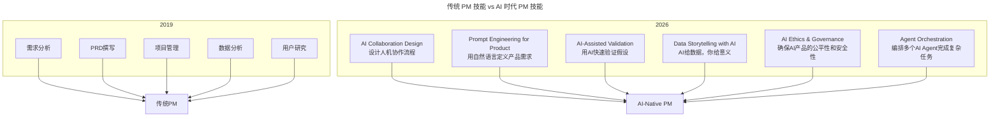

# 第96讲 | 阿禅：工程师转型产品经理可能踩到的"坑"

> **适用范围**：工程师（转型产品经理者）、产品经理、AI 产品经理、创业团队负责人，以及在 AI 时代希望避开转型陷阱、理解工程思维与产品思维差异的从业者。适用于角色转型、思维转变、跨部门沟通等场景。
>
> **更新摘要（v2 · 2026-08 更新）**：
> - 结构化升级为 6 节骨架（导言 / 核心方法论 / 关键流程 / 工具与实战 / 常见误区 / 进阶延展）
> - 整合原"AI 时代升级注解（2026）"内容，将传统 7 个坑升级为 AI 时代新形态
> - 为全部 Mermaid 图补充 `--- title: ... ---` frontmatter，并在每张图后追加文字解读
> - 保留全部 AI 时代能力要求表、新技能树、陷阱提醒、工具箱
> - 将原"作者简介"融入导言，原"总结"融入进阶延展

---

## 1. 导言

### 1.1 为什么称之为"坑"

之所以称之为"坑"，而不是"问题"，是因为阿禅自己并没有真正做过工程师，而是接触过很多工程师，也有很多工程师转型产品经理的朋友，他将所有的问题与经验总结起来并分享。

### 1.2 工程思维与产品思维

首先以手机摄像头为例，来说说工程思维与产品思维的差异。假设我们要做一款手机摄像头：
- **从工程思维的角度**：如何提高摄像头的分辨率；如何提高弱光下的快门速度；如何进行ISO调整；如何优化人像识别功能；如何使闪光灯更智能等等。
- **从产品思维的角度**：拍照场景、美颜效果，比如如何拍出来就显五官立体、肤色嫩白；如何做到自动美颜并可以立即分享朋友圈；如何从众多照片中自动选取最美的一张等等。

**核心差异**：工程思维更关注效率、如何实现，也就是"How"；而产品思维更关注"场景"，以及用户的内心需求，也就是"Why"。

在具体的产品开发中，产品思维和工程思维都很重要，需要将两者结合起来。产品思维需要工程的配合与支撑，将"场景"落实到产品开发。

### 1.3 作者简介

阿禅，连续创业者，资深微信产品与运营研究者。创办中文原创博客可能吧，轻单创始人、有可能学院CEO、极客公园前CEO、出门问问产品总监，目前担任轻芒合伙人。

（本文整理自阿禅在ArchSummit全球架构师峰会上的分享，有删减。）

### 1.4 2026 年 AI 时代新背景

站在2026年回看，**GPT-5.5、DeepSeek V4等大模型的普及**让工程师转型PM这个转型的**门槛降低了，但对能力的要求反而更高了**：

1. **技术实现不再是瓶颈**：AI可以快速将产品想法变成原型（Vibe Coding）
2. **新的核心竞争力出现**：不是"能做出来"，而是"该做什么"+"如何定义清楚"
3. **角色边界模糊化**：Engineer / PM / Designer 的界限在AI时代越来越模糊

---

## 2. 核心方法论

### 2.1 工程师转型 PM 会遇到哪些坑

在分享前，阿禅跟几位从工程师转型做产品经理的朋友聊了聊，从中摘取了四条较为典型的吐槽：
1. 视角变了，原先追求完美和逻辑性，现在是怎么快速实现目标怎么来。
2. 很多时候，用户视角的简单性与工程思维的完美性有冲突。
3. 转型这一年，踩过的坑无数，包括产品战略层面、沟通层面、团队管理层面、执行层面。
4. 以前不用做这些，现在要做很多公司内部的东西，比如对上沟通，老板永远不懂我；对下沟通，光打鸡血远远不够；还有跟兄弟团队之间因为资源不足产生的博弈。

总结出了工程师转型产品经理时，可能会踩进去的7个坑。

### 2.2 坑1：认为用户傻

> "我明明设计了一个很聪明的按钮，用户就是不用，非要用那个复杂的方法来使用我的产品。"

**开关案例**：假设产品经理设计了一个开关，用户只需向上一推就可以把灯打开，比原来向下按的方式更为省时省力。结果发现用户并不买账，可能99%的用户还是用向下按的方式去开灯。

很多产品经理容易陷入一个误区：既然有更加方便的产品使用方式，用户就该放弃原有的方式。但是，他们忽略了**用户习惯较难改变**的事实。

### 2.3 坑2：觉得同事傻

> "那帮运营和市场老给我提不靠谱的需求，一点都不懂技术和产品，瞎指挥。"

这是阿禅曾经陷入的误区之一。以前在一家公司做客户端，市场和销售的人在跟客户聊天之后就会找他提需求。在当时的他看来，这完全是瞎指挥。

后来反思，应该从两方面思考：
1. 当同事提需求时，这个需求可能已经变质，不再是客户的原始需求了。作为产品经理，应该去了解客户最原始的需求。
2. 应该考虑同事提出这个需求想达成的目的，比如他的目的可能并不是为了加一个广告位，而是为了借此达成盈利目标，那我们其实可以通过其他方式帮助他实现目标。

因此，当同事提需求时，我们应该把他和普通用户放在同一层面，花费时间与精力去认真分析这些"傻"需求背后的动因。

### 2.4 坑3：觉得同事还是傻

> "明明那么简单的道理和逻辑，这帮同事怎么就不理解呢?"

这个问题其实出在沟通层面。产品经理很重要的职责是沟通，很多时候，沟通是做成一件事的关键。

有个产品经理分享，他做工程师时不擅长沟通，也不想沟通。在他看来，这些事情都很简单，为什么还要花时间给别人解释。这是他后来转型做产品经理时很难跨过的一道鸿沟。

在公司中，不同职位与不同资历的人，彼此的认知都不同，而作为产品经理，需要团结团队里的每一个人。你必须跟所有人解释某件事的重要性、某个功能为什么存在。而且，因为认知的差别，你与每个人的沟通方式也要有差别。**提升沟通能力是工程师转型产品经理的必经之路。**

### 2.5 坑4：容易在前端呈现过多技术

> "我给用户做了一个特别炫酷的功能，用户可以自定义各种参数，但似乎他们并不怎么用。"

许多做产品的书籍都会写到，**不给用户选择，反而是最好的选择**。黑咔相机案例：功能特别简单，就是给照片中天空提供各种动态效果，操作非常简单，过程中没有任何需要技术的地方。这个产品的用户平均年龄大概50岁，由于操作简单、效果有趣，一天时间内由日活30多万迅速上涨至几百万，第二天再增长至一千万。

### 2.6 坑5：过于追求完美，害怕返工

> "用这个方法来实现产品方案太笨了，对服务器的开销太大，我们应该重写代码，用另一种方案。"

许多创业公司在开发产品前会将计划思考周到，以防未来可能出现的需求改动。但在实际开发过程中，我们还需考虑阶段性问题。我们应该允许一些不影响主功能的Bug存在，先让功能运行，再补全不完美的地方。对产品经理来讲，他需要根据每个阶段的数据变动，去观察市场反馈，从而迅速做出调整。所以，我们应该放下害怕返工的心态，接受随时推翻重做的可能性。

### 2.7 坑6：认为功能大于场景

> "我们有A功能、有B功能、有C功能……我们有非常多的功能，都是我们自己的技术实现的。"

产品经理经常犯一个错，就是总觉得应该再多开发一些功能给用户使用。然而，研究发现小程序之所以火爆，除了自身裂变属性较强外，非常重要的一点是，**它只满足用户一个功能的需求**。很多拥有多合一功能的小程序很难火起来，因为功能增多之后，会模糊用户对这个小程序的认知。

### 2.8 坑7：忽视运营

> "酒香不怕巷子深，好的产品，用户自然回来，首先要做好的是产品，运营和营销并不重要。"

其实不然，产品与运营始终不可分割，产品经理一定要与运营人员密切沟通，甚至做到产品经理即运营本身。最近几年，很多成功的产品，其成功的原因中运营占得比重甚至大过了产品本身。

我们的做法是采用AB测试，反复测试，总结结果，在这个过程中，产品经理需要跟运营不断沟通。很多时候，产品经理还需要身兼多重角色——做测试、运营、文案等细节工作，看似与技术没有太大关系，却是产品获得成功必不可少的一部分。

---

## 3. 关键流程

### 3.1 2019 vs 2026：工程师转 PM 的能力要求对比

| 能力维度 | 2019年的核心挑战 | 2026年的新挑战 |
|---------|----------------|---------------|
| **需求理解** | 从技术语言到业务语言的翻译 | **从用户模糊描述到AI可执行Prompt的翻译** |
| **优先级判断** | 技术可行性 vs 业务价值 | **AI能做的 vs 必须人做的 + ROI计算** |
| **沟通协调** | 与开发/设计/测试的沟通 | **与人类团队 + AI Agent的协同编排** |
| **数据分析** | 基础的Excel分析 | **AI辅助深度数据洞察 + 预测性分析** |
| **原型制作** | 依赖设计师或自己笨拙地画 | **用AI在几小时内生成高保真原型** |
| **文档撰写** | PRD撰写耗时 | **AI生成初稿，人聚焦差异化价值** |

### 3.2 AI 时代 PM 的新技能树



图解：传统 PM 技能（2019）包含需求分析、PRD 撰写、项目管理、数据分析、用户研究，聚焦"执行性工作"；AI 时代 PM 技能（2026）新增 AI Collaboration Design、Prompt Engineering for Product、AI-Assisted Validation、Data Storytelling、AI Ethics、Agent Orchestration，聚焦"人机协作设计"。两者共同汇入 AI-Native PM 的能力体系。

### 3.3 Prompt Engineering for Product（产品级提示工程）

不同于编程用的Prompt，产品PM需要掌握：
- **需求翻译Prompt**：将用户模糊描述转化为结构化的产品规格
- **场景模拟Prompt**：让AI扮演不同类型用户，测试产品设计
- **竞品分析Prompt**：让AI快速分析竞争对手的功能和策略

**示例**：
```
❌ 差Prompt："帮我写一个电商APP的需求文档"
✅ 好Prompt："我正在做一个面向Z世代用户的二手奢侈品交易平台。
   目标用户是18-25岁的女性大学生，她们的特点是：
   - 价格敏感但愿意为品质付费
   - 重视社交分享和社区认同
   - 习惯短视频和直播形式
   
   请帮我：
   1. 分析这类用户的核心痛点（Top 5）
   2. 提出差异化的产品定位（区别于闲鱼、红布林）
   3. 设计MVP的功能清单（不超过8个功能）
   4. 对每个功能给出优先级排序理由"
```

### 3.4 AI Collaboration Design（人机协作设计）

作为PM，你需要设计：
- **哪些任务交给AI**：自动化、标准化、大规模的任务
- **哪些任务保留给人**：需要创造力、同理心、道德判断的任务
- **人机交互界面**：用户什么时候知道他们在和AI交互？

### 3.5 AI Ethics & Governance（AI伦理与治理）

这是2026年PM必须关注的：
- **算法公平性**：你的AI产品是否对某些群体不公平？
- **透明度**：用户是否知道他们在与AI交互？
- **隐私保护**：用户数据如何被使用？
- **可解释性**：AI的决策过程能否被解释？

---

## 4. 工具与实战

### 4.1 2026 年 PM 的日常工具箱

| 场景 | 推荐工具 | 用途 |
|------|---------|------|
| **需求收集** | Notion AI + UserVoice | 整理用户反馈，提取共性需求 |
| **PRD撰写** | Claude 4.5 + GPT-5.5 | 生成PRD初稿，补充业务逻辑 |
| **原型制作** | v0.dev + Figma AI | 快速生成UI原型 |
| **数据分析** | Julius AI + Hex | 自然语言查询数据，生成洞察 |
| **竞品分析** | Perplexity + GPT-5.5 | 深度竞品调研 |
| **用户研究** | Otter.ai + ChatGPT | 访谈录音自动转录+分析 |
| **项目管理** | Linear AI + Asana | 任务分解和进度追踪 |
| **演示汇报** | Gamma + Beautiful.ai | 自动生成PPT |

### 4.2 给工程师转型 PM 的 2026 版建议

**Phase 0: 转型准备期（第1个月）**
- [ ] **建立产品思维**：读《Inspired》、《Lean Startup》等经典
- [ ] **学习AI工具**：熟练使用ChatGPT、Claude、Cursor等
- [ ] **找到导师**：找一个愿意带你的资深PM（可以是AI Coach）

**Phase 1: 试水期（第2-3个月）**
- [ ] **主动参与产品讨论**：在现有工作中多问"为什么"
- [ ] **尝试写PRD**：选一个小功能，用AI辅助写完整的PRD
- [ ] **做用户调研**：至少访谈10个用户，形成自己的用户画像

**Phase 2: 实践期（第4-6个月）**
- [ ] **负责一个小模块**：从需求到上线全流程跟进
- [ ] **建立数据敏感度**：每天看产品核心指标，思考波动原因
- [ ] **学习用数据说服**：用数据支撑你的产品决策

**Phase 3: 蜕变期（第6-12个月）**
- [ ] **独立负责一个产品/Feature**：端到端的ownership
- [ ] **形成自己的产品方法论**：总结什么有效、什么无效
- [ ] **建立个人品牌**：写文章、做分享，输出你的产品思考

---

## 5. 常见误区

### 5.1 传统 7 坑

工程师转型 PM 的 7 个坑：认为用户傻、觉得同事傻、觉得同事还是傻（沟通问题）、前端呈现过多技术、过于追求完美害怕返工、认为功能大于场景、忽视运营。

### 5.2 AI 时代新陷阱

**陷阱1: "AI能做PM的事，那还要PM干嘛？"**
> ❌ 误区：认为AI可以完全替代PM
> ✅ 真相：AI能做PM的**30%执行性工作**（写文档、画原型、整理数据），但**70%的创造性工作**依然需要人：洞察力（发现用户没说出口的需求）、判断力（信息不全时决策）、影响力（说服团队）、同理心（理解用户情感）。

**陷阱2: "我是技术背景，所以我要做技术型PM"**
> ❌ 误区：固守技术舒适区，不愿意学习商业和市场
> ✅ 真相：2026年最值钱的PM是**T-shaped人才**——有技术深度，更有商业广度。

**陷阱3: "转PM后就不碰技术了"**
> ❌ 误区：认为转PM就要彻底放弃技术
> ✅ 真相：在AI时代，**懂技术的PM更稀缺、更有价值**——能评估技术可行性（不被AI忽悠）、能与工程师平等对话、能做出更接地气的决策。

### 5.3 从传统坑到 AI 时代坑的演变

阿禅总结的工程师转型PM的"坑"在2026年**依然存在，但形态变了**：

1. **从"重实现轻体验"** → 变成 **"重AI轻人性"**（别让AI替代你对用户的理解）
2. **从"追求技术完美"** → 变成 **"追求AI炫技"**（别为了用AI而用AI）
3. **从"不善表达"** → 变成 **"依赖AI表达丧失个性"**（AI是工具，你是灵魂）
4. **从"陷入细节"** → 变成 **"失去全局把控"**（AI做了太多，你反而不知道产品往哪走）

---

## 6. 进阶延展

### 6.1 小结

本文总结出工程师转型产品经理时可能会踩到的7个坑，包括认为用户傻、觉得同事傻、在前端呈现过多技术、过于追求完美、害怕返工、认为功能大于场景、忽视运营等。

### 6.2 2026 年核心结论

> 2026年是工程师转型PM的**黄金时代**——因为AI降低了技术实现的门槛，让你能把更多精力放在真正重要的地方：**理解用户、定义价值、讲述故事、影响团队**。但同时这也是一个**危险的时代**——如果你只是把AI当作省事的工具，而不去提升真正的产品思维能力，你可能会成为一个**"AI操作员"而非真正的产品经理**。

> **记住：AI可以帮你写出完美的PRD，但它不能帮你找到那个值得做的产品方向。那是只有人才能做的事情。**

### 6.3 延伸阅读

- 阿禅在 ArchSummit 全球架构师峰会上的分享
- 本系列姊妹篇：第 97 讲《工程师转型产品经理的必备思维》
- 工程师转型产品经理相关文章（《技术领导力 300 讲》）

---

*本内容基于2026年6月的最新技术动态生成，包括GPT-5.5、DeepSeek V4的普及，以及84%开发者使用AI编程的行业现状。工程师转型PM是一条充满挑战但也极具回报的路，AI是你的加速器，而不是替代品。适用读者：工程师、产品经理、AI产品经理。*
