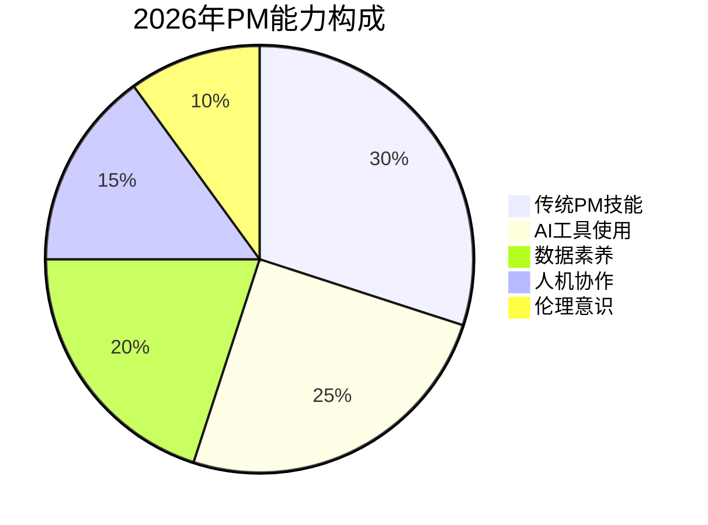
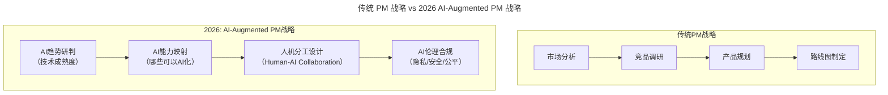
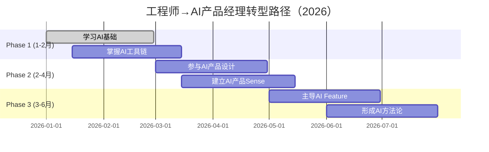

# 第97讲 | 阿禅：工程师转型产品经理的必备思维

> **适用范围**：工程师（转型产品经理者）、产品经理、AI 产品经理、创业团队负责人，以及在 AI 时代希望掌握产品思维、理解 AI 交互体验的从业者。适用于角色转型、产品思维培养、AI 产品设计等场景。
>
> **更新摘要（v2 · 2026-08 更新）**：
> - 结构化升级为 6 节骨架（导言 / 核心方法论 / 关键流程 / 工具与实战 / 常见误区 / 进阶延展）
> - 整合原"AI 时代升级注解（2026）"内容，将 8 大思维能力升级为 AI 时代新要求
> - 为全部 Mermaid 图补充 `--- title: ... ---` frontmatter，并在每张图后追加文字解读
> - 保留全部 AI 能力演进表、转型路径图、核心能力 checklist
> - 将原"作者简介"融入导言，原"转型路径"融入进阶延展

---

## 1. 导言

### 1.1 产品经理不是"写文档"

实际上，即使不是工程师转型，这些思维也需要学习。第一次学做产品经理的时候，因为是野路子出身，没有经验，不知道文档怎么写，就找了一个网易的朋友请教，他给我发了一个300页的文档参考。当时震惊了——产品经理要做这么多东西么？后来自己去做产品时才发现，**写文档并不是一个产品经理最核心的技能**。

产品经理需要具备的能力有以下几点：好奇心、同理心、逻辑力、化繁为简、不完美思维、战略思维、运营思维、利他心理。

### 1.2 作者简介

阿禅，连续创业者，资深微信产品与运营研究者。创办中文原创博客可能吧，轻单创始人、有可能学院CEO、极客公园前CEO、出门问问产品总监，目前担任轻芒合伙人。

（本文整理自阿禅在ArchSummit全球架构师峰会上的分享，有删减。）

### 1.3 2026 年 AI 时代技术背景

本文原发布于2019年，阿禅总结了工程师转型产品经理的8大核心思维能力。7年后的今天，**AI已重塑产品经理的工作方式**——84%的开发者使用AI工具，AI辅助PRD生成、用户研究、数据分析已成为常态。

---

## 2. 核心方法论

### 2.1 八大思维的 AI 时代演进总览

| 能力 | 2019年定义 | 2026年新增维度 | 变化程度 |
|------|-----------|---------------|----------|
| 好奇心 | 研究竞品、分析数据 | **+AI产品体验、Agent交互模式** | 中等 |
| 同理心 | 站在用户角度思考 | **+理解AI用户的特殊行为模式** | 高 |
| 逻辑力 | 信息梳理、优先级判断 | **+AI辅助决策框架设计** | 中等 |
| 化繁为简 | 找到最短路径 | **+AI UX自动优化、个性化路径** | 高 |
| 不完美思维 | 允许MVP、快速迭代 | **+AI加速迭代、A/B测试自动化** | 高 |
| 战略思维 | CEO视角、竞争格局 | **+AI战略布局、数据驱动决策** | 极高 |
| 运营思维 | 用户增长、留存 | **+AI运营自动化、智能推荐** | 极高 |
| 利他心理 | 跨部门协作、资源协调 | **+AI Agent协作、人机分工** | 高 |



图解：2026 年 PM 能力构成中，传统 PM 技能占 30%，AI 工具使用占 25%、数据素养占 20%、人机协作占 15%、伦理意识占 10%。AI 相关能力（工具使用+数据素养+人机协作+伦理意识）合计 70%，说明 AI 时代产品经理的能力构成已发生根本性重构。

### 2.2 好奇心：从"产品体验"到"AI交互体验"

产品经理需要有好奇心，要经常花时间与精力去研究常用产品或对手产品，只要一款产品出现在眼前，不管喜欢还是不喜欢，都应该用职业敏锐性去研究、分析它，凡事多问问为什么。

比如看抖音，并不是看完一个点赞量上百万的小视频，认为不错，感到开心，就接着刷下一条。而是要研究上百万的点赞量背后的原因，去看看主播是谁，他以往的视频点击量是高是低，视频属于哪一种类型，再试试总结哪个类型的抖音视频比较火等等。

**⭐2026 扩展**：从研究传统产品扩展到研究 AI 产品——
- ChatGPT/Claude的对话体验设计
- AI搜索（Perplexity、SearchGPT）的信息呈现
- AI生成内容（Midjourney、Sora）的创作流程
- AI Agent（AutoGPT、CrewAI）的任务执行模式

2026年新增关注：这个AI功能为什么成功/失败？Agent的交互是否符合直觉？AI推荐的准确性如何？用户对AI输出的信任度？

### 2.3 同理心：理解"AI用户"的特殊性

将自己当成核心用户，并从他们的需求角度思考产品需要解决的问题。当你认为用户"傻"的时候，不要急着否定他们，而是要以同理心去思考他们的需求。

**拼多多案例**：阿禅特别不理解拼多多，为什么一个二十几块钱的伟哥能卖四百多万份，成了当时拼多多销量最好的单品。然后他去分析拼多多的用户群体，混进了很多中老年群。结果发现，中老年人真的很闲，每天都会在群里聊天，而且群是他们很有安全感的一个舒适区，他们乐意在舒适区中表达观点，也非常乐意将自己认为优惠的产品分享到这样熟悉的圈子中。

**⭐2026 新增用户类型**：

| 用户类型 | 特征 | 产品策略 |
|----------|------|----------|
| **AI原生用户** | 习惯用自然语言交互 | 支持Prompt输入、多轮对话 |
| **AI怀疑者** | 不信任AI输出 | 提供来源引用、置信度标注 |
| **AI过度依赖者** | 盲目相信AI | 设置验证机制、防幻觉提示 |
| **AI恐惧者** | 担心被替代 | 强调人类控制权、可解释性 |

> ⭐2026 PM必须回答的问题："我的用户会如何与AI版本的产品互动？他们的期望值是什么？"

### 2.4 逻辑力与化繁为简

**逻辑力**：能够将不同部门、内外声音等所有碎片梳理成树状关联的关系。产品经理需要开很多会，所以信息的整理能力非常重要。同时，逻辑能力还包括对优先级的判断，以及高优先级条目与其它条目的关联性。有逻辑的观点会具有更强的说服力。

**化繁为简**：找到用户最真实的场景，用用户最容易使用的路径去实现。需要做到这4步：
1. 研究用户在不同场景下的不同需求，并梳理成流程图和故事；
2. 抽象出用户的需求，并列出实现方案A、B、C；
3. 像用户一样思考，寻找最简单的实现路径；
4. 谨防炫技。

其实，在做用户调研的时候，用户往往很难将内心真正的需求表达清楚。比如，你问用户哪类内容会引发他的阅读兴趣，他可能回答是比较狗血的社会新闻，但如果你因此去做标题党，你的文章并不一定火爆。因为用户真正喜欢的可能并不是狗血的社会新闻，而是其中刺激到他内心的某个点。所以，我们要挖掘用户的核心需求。

### 2.5 不完美思维

因为没有完美的解决方案，只有当下最合理的解决方案。我们要知道哪些是最重要的，哪些是暂时不重要的，要允许不完美，懂得舍弃，懂得屏蔽各种声音带来的非核心需求，毕竟优先解决当前用户的核心需求永远是最重要的。

**创业案例**：第一次创业的时候，公司只有7人，资金只有一百多万元，产品做了五个月后，遇到了很多技术瓶颈，是我们无法解决的。在一次例会中，我们决定砍掉一些不重要的功能，先想办法让公司存活下去。虽然公司最后还是没能存活，但是回头去看，对于那个阶段来讲，我们的做法并没有错。**很多时候，我们要允许存在不完美，先实现再改进。**

**⭐2026 新范式**：`2019: MVP → 用户反馈 → 迭代（周期：月级）` → `2026: AI生成MVP → A/B测试 → 自动优化（周期：周/天级）`

### 2.6 战略思维与运营思维

**战略思维**：像CEO那样去思考战略，像OKR拆解那样去执行战略。谁未来最有可能成为CEO，是产品经理，因为他必须关注面，而非点，要把很多点连成面，这就要求他们充分了解竞争格局，不仅仅是功能，还包括团队优势、融资状况等。产品经理应该把自己的思维拔到一个相对比较高的角度，思考产品对于公司的价值。

**⭐2026 补充**：**谁未来最有可能成为AI时代的CEO？是懂AI的Product Manager**

**运营思维**：好的产品是技术、运营、营销配合出来的，在产品中注入运营思维，产品会活的更持久。运营思维主要需要注意4点：
1. 产品不光要实现，还要考虑如何吸引用户，如何留住用户；
2. 洞悉用户心理，寻找用户在使用产品中的心理需求；
3. 懂得如何让用户自发传播，如何节省营销成本；
4. 产品中的运营功能应该是方案化并可重复使用的。

### 2.7 利他心理

通俗讲，知道应该找谁推动什么事，并知道应该给他什么，让他来帮助你。

**广告位案例**：阿禅有个朋友之前在百度负责广告部门，想在某些地方再加一些广告位。做的过程中遇到很大的阻力，因为需要跟好几个部门沟通协调。沟通的结果是，除了广告销售部门，并没有部门答应做这件事，因为对他们其实没有明显的好处。最后，他决定找广告销售部的负责人一起合作来推动这项计划的实施，因为这项计划能给销售部带来利益。结果是，所有阻力都被顺利攻克。

可以看出，产品经理是一个需要调动所有资源、推动产品开发的角色。要调动资源，就需要平衡人与人、人与资源之间的关系，需要具备利他心理，找到关键人，了解这些关键人最关心的是什么，并满足他们的需求。

---

## 3. 关键流程

### 3.1 AI 时代的 PM 战略职责



图解：传统 PM 战略是"市场分析→竞品调研→产品规划→路线图制定"的线性流程，2026 年 AI-Augmented PM 战略升级为"AI趋势研判→AI能力映射→人机分工设计→AI伦理合规"，聚焦 AI 时代产品经理的战略新职责。

### 3.2 AI 驱动的运营增长引擎

| 运营环节 | 2019做法 | 2026 AI增强 |
|----------|----------|-------------|
| 用户获取 | 广投放、ASO | **AI精准投放 + 内容生成** |
| 用户激活 | 引导流程优化 | **AI Onboarding个性化** |
| 用户留存 | Push/邮件 | **AI智能推送时机+内容** |
| 用户变现 | 付费墙/A/B测试 | **AI动态定价 + 个性化推荐** |
| 用户传播 | 邀请奖励 | **AI生成UGC + 社交传播预测** |

### 3.3 人机协作版的资源协调

传统关键人：技术负责人（实现功能）、设计师（用户体验）、运营（用户增长）、销售（商业变现）。

**⭐2026 新增"关键人"类型**：
- AI Engineer（模型选型/微调）
- Prompt Engineer（交互质量）
- Data Scientist（数据策略）
- AI Ethics Officer（合规审查）
- Platform Team（AI基础设施）

---

## 4. 工具与实战

### 4.1 ⭐2026 工程师转型 AI 产品经理的路径



图解：工程师转型 AI 产品经理分三个阶段：Phase 1（1-2月）学习 AI 基础、掌握 AI 工具链；Phase 2（2-4月）参与 AI 产品设计、建立 AI 产品 Sense；Phase 3（3-6月）主导 AI Feature、形成 AI 方法论，约 6 个月完成转型。

### 4.2 AI 时代的 MVP 工具链

- **PRD生成**：Notion AI / Cursor（从想法到文档：1小时）
- **原型制作**：v0.dev / Galileo（从描述到UI：分钟级）
- **用户测试**：AI模拟用户 + 真实用户混合
- **数据分析**：AI自动生成洞察报告

### 4.3 核心能力 checklist

```
□ 理解LLM能力边界（能做什么/不能做什么）
□ 掌握至少1个AI开发框架（LangChain/Vercel AI SDK）
□ 能够撰写高质量System Prompt
□ 了解RAG、Fine-tuning、Agent的基本原理
□ 具备数据敏感度（能看懂AI评估指标）
□ 有AI伦理意识（隐私、偏见、安全）
□ 能与技术团队有效沟通AI需求
□ 能向非技术人员解释AI产品的价值
```

---

## 5. 常见误区

### 5.1 认为产品经理核心是写文档

**误区**：以为产品经理的核心技能是写文档。

**正确认知**：写文档并不是一个产品经理最核心的技能。产品经理需要具备的能力是好奇心、同理心、逻辑力、化繁为简、不完美思维、战略思维、运营思维、利他心理。

### 5.2 用户反馈表面化

**误区**：用户说喜欢什么就做什么（如用户说喜欢狗血社会新闻就做标题党）。

**正确认知**：用户往往很难将内心真正的需求表达清楚。用户真正喜欢的可能并不是外在表象（狗血社会新闻），而是其中刺激到他内心的某个点。要挖掘用户的核心需求。

### 5.3 追求完美、不做取舍

**误区**：追求完美解决方案，不做取舍，什么都想做。

**正确认知**：没有完美的解决方案，只有当下最合理的解决方案。要允许不完美，懂得舍弃，懂得屏蔽各种声音带来的非核心需求。优先解决当前用户的核心需求永远是最重要的。

### 5.4 AI 时代忽视 AI 用户类型

**误区**：沿用传统用户画像，不区分 AI 时代的用户类型。

**正确认知**：2026 年需要理解 AI 用户的特殊性——AI 原生用户、AI 怀疑者、AI 过度依赖者、AI 恐惧者有不同的行为模式和产品策略。

---

## 6. 进阶延展

### 6.1 总结：八大思维与能力

本文分享了工程师转型产品经理必须要掌握的八个思维与能力，包括好奇心、同理心、逻辑力、化繁为简、不完美思维、战略思维、运营思维和利他心理。即使不是工程师转型，所有做产品的人都应该具备这些素质。

### 6.2 2026 年核心结论

AI 已重塑产品经理的工作方式。8 大能力依然有效，但每个能力都有了 AI 时代的新要求：
- **好奇心**从研究产品扩展到研究 AI 产品交互体验
- **同理心**新增对 AI 用户特殊行为模式的理解
- **化繁为简**融入 AI UX 自动优化与个性化路径
- **不完美思维**加速为 AI 驱动的 MVP 循环
- **战略思维**升级为懂 AI 的 Product Manager
- **运营思维**由 AI 驱动的增长引擎支撑
- **利他心理**扩展为 AI Agent 协作与人机分工

**AI 时代产品经理的核心价值，从"做功能"转向"设计人机协作、洞察 AI 用户、驱动 AI 战略"**。

### 6.3 延伸阅读

- 阿禅在 ArchSummit 全球架构师峰会上的分享
- 本系列姊妹篇：第 96 讲《工程师转型产品经理可能踩到的"坑"》
- 工程师转型产品经理相关文章（《技术领导力 300 讲》）

---

*本内容基于 2026 年 6 月编写，注解完成时间 2026年6月。适用读者：工程师、产品经理、AI产品经理。核心价值：将传统PM能力模型与AI时代结合，提供转型路径。*
