# 跳槽与创业 — AI浪潮下的机遇与抉择

> **适用范围**：面向AI时代（2024-2026）的技术领导者、创业者、技术合伙人，提供从赛道选择到团队搭建、从跳槽决策到股权设计的系统性知识体系
>
> **更新摘要**（v2）：基于极客时间专栏《技术领导力实战笔记》（2018-2019）精华内容全面升级，融合2025-2026年AI行业最新趋势与实践。本v2版本将原文的七章内容重组为标准6节框架，保留全部原始数据、表格、Mermaid图和案例，新增2026前言、AI创业四大层级赛道地图、3P3C决策模型可视化、AI时代求职六维竞争力模型、空降CTO前100天计划等核心内容。

---

## 一、导言

### 1.1 2026年AI时代技术人职业环境巨变

我们正处在一个前所未有的时代拐点。2026年，AI技术的发展速度和影响深度远超预期：

| 维度 | 数据 | 意义 |
|------|------|------|
| AI工具普及率 | 84%开发者已在使用或计划使用AI工具（Stack Overflow 2025开发者调查，日常使用者约51%） | AI协作已成为标配技能 |
| Agentic Coding | AI不再只是代码补全，而是能自主完成多步任务的编程Agent | 工作模式发生根本性变革 |
| 推理成本革命 | DeepSeek V4（2026年4月发布）延续低定价策略；未检索到'降低700倍'的官方口径（存疑） | AI创业门槛大幅降低 |
| Agent落地期 | 企业级AI应用从POC走向规模化 | 商业化窗口已经打开 |
| 新职业涌现 | Prompt Engineer、Agent Architect、AI Platform Engineer等 | 职业赛道正在重塑 |

**2026年AI时代的五大职业特征**：

1. **Agentic Coding成为主流开发范式**：AI Agent能自主完成需求分析→架构设计→编码实现→测试验证→部署上线，开发者角色从"写代码的人"转变为"指挥AI团队的产品经理"，单人产出提升5-10倍
2. **技术能力半衰期缩短至18个月**：2018年学的技术栈可以用3-5年，2026年AI相关技术的有效周期可能只有12-18个月
3. **"AI应用工程师"成为最大缺口岗位**：需求量是纯算法工程师的3-5倍
4. **复合型人才溢价显著**：技术+业务+AI的三重能力组合最稀缺
5. **创业成本断崖式下降**：启动资金从百万级降至十万级，MVP周期从月级降至周级

### 1.2 关键术语对照

- PMF（Product-Market Fit）：产品市场匹配
- TAM（Total Addressable Market）：总潜在市场
- ARR/MRR（Annual/Monthly Recurring Revenue）：年度/月度经常性收入
- LTV/CAC（Lifetime Value / Customer Acquisition Cost）：客户终身价值/获客成本
- Unit Economics：单位经济性，指单个客户或单笔交易的成本收益关系
- 3P3C模型：王淮提出的创业评估框架（原版为Professional专业/Passionate激情/Persistent坚持 × Crucial决断/Consistent一致/Credible可信，见《大咖对话-技术人创业前衡量自我的3P3C模型》；本文2.3节为AI时代重构版：个人维度Passion/Proficiency/Persistence × 外部条件Capital/Customer/Competition）
- BANI时代：Brittle脆弱、Anxious焦虑、Nonlinear非线性、Incomprehensible不可理解
- VUCA时代：Volatility易变、Uncertainty不确定、Complexity复杂、Ambiguity模糊

---

## 二、核心方法论

### 2.1 经典创业赛道分析框架

经纬创投董事总经理熊飞提出的技术创业三大方向——**数据**、**新技术架构变迁**、**机器学习应用**——至今仍具有参考价值：

| 原始方向 | 核心逻辑 | 时代背景 |
|---------|---------|---------|
| 数据方向 | 数据量暴涨带来存储、实时处理、新型数据格式（如图数据、IoT数据）的机会 | 大数据爆发期 |
| 新技术架构 | 容器化、Serverless、软件定义存储/网络等架构演进 | 云原生兴起 |
| 机器学习应用 | 自适应安全、自适应运维等ML落地场景 | AI初步商业化 |

熊飞强调的"赢得资本青睐四要素"同样适用于AI时代：
1. 先人一步：做1%最早看到趋势的人
2. 在大市场系统性解决问题：天花板比增速重要
3. 一流互补团队：能力互补+彼此信任
4. 深入思考发展路径：主动拉高天花板

### 2.2 2025-2026 AI创业赛道地图

当前AI创业可划分为四大层级：

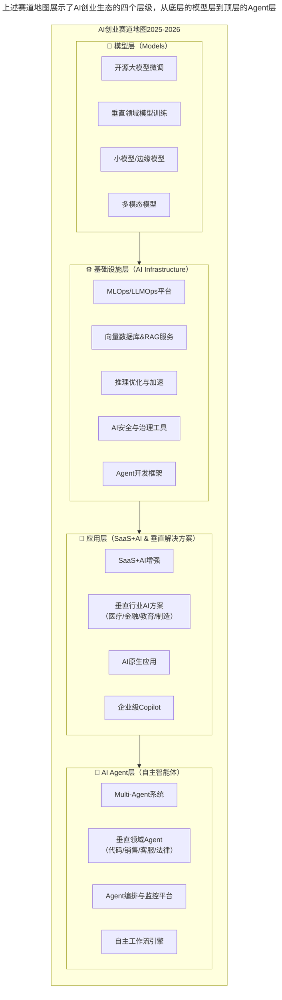

**图表说明**：上述赛道地图展示了AI创业生态的四个层级，从底层的模型层到顶层的Agent层，呈现自下而上的依赖关系。L1（Agent层）是最热赛道，L2（应用层）是最大市场，L3（基础设施层）是关键支撑，L4（模型层）门槛最高。

### 2.3 3P3C决策模型（AI时代升级版）

受线性资本王淮3P3C模型启发，结合2026年AI创业特点重构的评估框架：

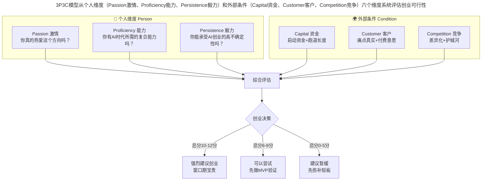

**图表说明**：3P3C模型从个人维度（Passion激情、Proficiency能力、Persistence毅力）和外部条件（Capital资金、Customer客户、Competition竞争）六个维度系统评估创业可行性。每项0-2分，总分10-12分强烈建议创业，6-9分可先做MVP验证，0-5分建议暂缓。

### 2.4 求职六维竞争力模型

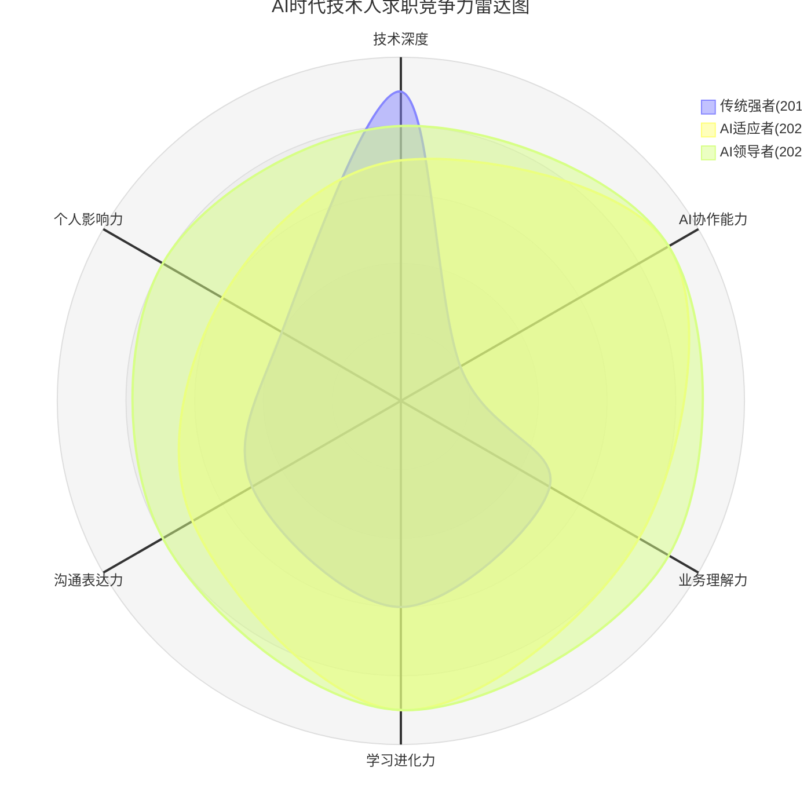

**图表说明**：该雷达图对比了三类技术人的竞争力分布。传统强者在技术深度上领先但AI协作能力极弱；AI适应者在AI协作和学习进化上突出；AI领导者则在所有维度上均衡发展。AI协作能力从2018年的"不存在"跃升为2026年的"决定性因素"。

---

## 三、关键流程

### 3.1 赛道选择决策流程

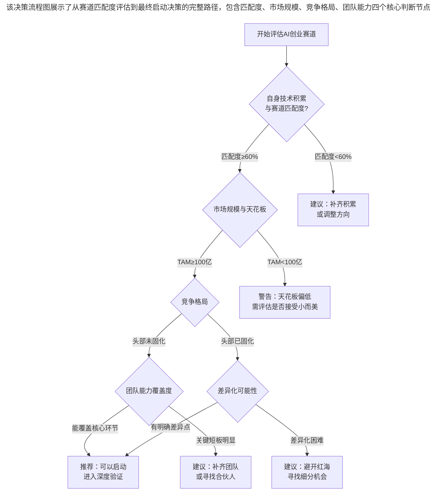

**图表说明**：该决策流程图展示了从赛道匹配度评估到最终启动决策的完整路径，包含匹配度、市场规模、竞争格局、团队能力四个核心判断节点，每个节点都有明确的通过标准和失败处理建议。

### 3.2 择业六步法

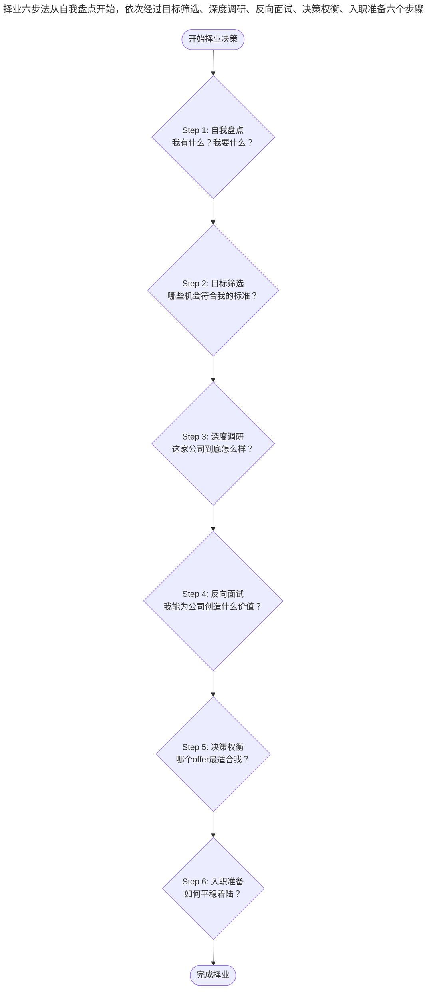

**图表说明**：择业六步法从自我盘点开始，依次经过目标筛选、深度调研、反向面试、决策权衡，最终到入职准备，形成一个完整的择业决策闭环。

### 3.3 空降CTO前100天计划

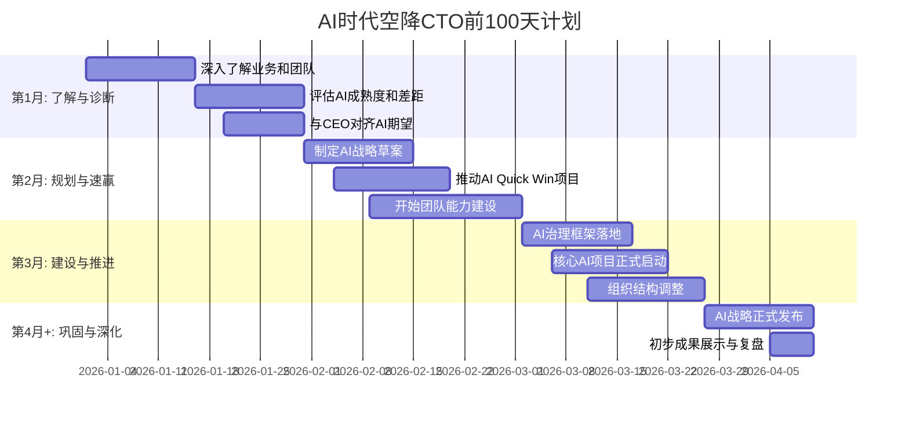

**图表说明**：该甘特图展示了空降CTO前100天的分阶段计划。第1月聚焦了解与诊断，第2月重在规划与速赢（Quick Win），第3月进入建设与推进阶段，第4月巩固成果并发布AI战略。

### 3.4 创业阶段AI适配策略

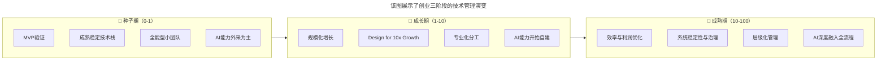

**图表说明**：该图展示了创业三阶段的技术管理演变。种子期以MVP验证为核心，AI能力以外采为主；成长期追求规模化增长，开始自建AI能力；成熟期追求效率与利润优化，AI深度融入全流程。

### 3.5 融资阶段路线图

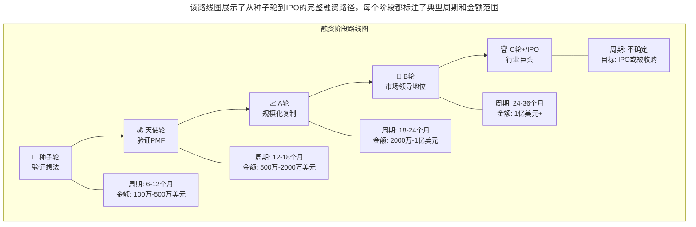

**图表说明**：该路线图展示了从种子轮到IPO的完整融资路径，每个阶段都标注了典型周期和金额范围，帮助创业者理解融资节奏和里程碑。

---

## 四、工具与实践

### 4.1 AI时代创业成本断崖式下降

| 维度 | 2018年（原始文档时期） | 2026年（现在） | 变化幅度 |
|------|----------------------|---------------|---------|
| 启动资金 | 100-500万人民币 | 10-50万人民币 | 降低90% |
| 团队规模 | 5-10人 | 1-3人（+AI Agent） | 减少70% |
| 产品MVP周期 | 3-6个月 | 2-4周 | 缩短80% |
| 技术门槛 | 需要资深工程师团队 | 1个懂AI的全栈工程师 | 大幅降低 |
| 云服务成本 | 月均2-5万 | 月均2000-5000元 | 降低90%+ |

**成本降低的核心驱动力**：
1. DeepSeek V4推理成本下降：随 V4/V4.1 发布 API 价格进一步下调（官方未给出具体倍数）
2. Agentic Coding工具成熟：AI编程Agent可完成70-80%的编码工作
3. 开源生态爆发：Llama、Qwen、DeepSeek等开源模型能力持续逼近闭源

### 4.2 2026年热门职位及薪酬范围（月薪·人民币）

| 职位 | 初级 | 中级 | 高级 | 专家/总监 | 备注 |
|------|------|------|------|----------|------|
| AI算法工程师 | 25-35K | 40-60K | 70-120K | 150-300K | 需要深厚数学/ML背景 |
| AI应用工程师 | 20-30K | 35-50K | 55-90K | 100-180K | 需求量最大的新增岗位 |
| Prompt Engineer | 18-25K | 30-45K | 50-80K | 80-150K | 新兴职业，门槛相对低 |
| Agent Architect | 30-40K | 50-80K | 90-150K | 180-350K | 最高薪的新岗位之一 |
| AI Platform Engineer | 25-35K | 45-65K | 75-130K | 150-280K | 基础设施方向，稳定高薪 |
| MLOps Engineer | 22-32K | 38-55K | 65-110K | 120-220K | 工程化落地关键角色 |
| 全栈工程师 | 15-22K | 25-40K | 45-75K | 80-150K | 传统岗位，需AI加持 |
| 传统后端工程师 | 12-18K | 20-35K | 40-65K | 70-120K | 薪资增长放缓，面临压力 |

### 4.3 公司AI成熟度评估模型

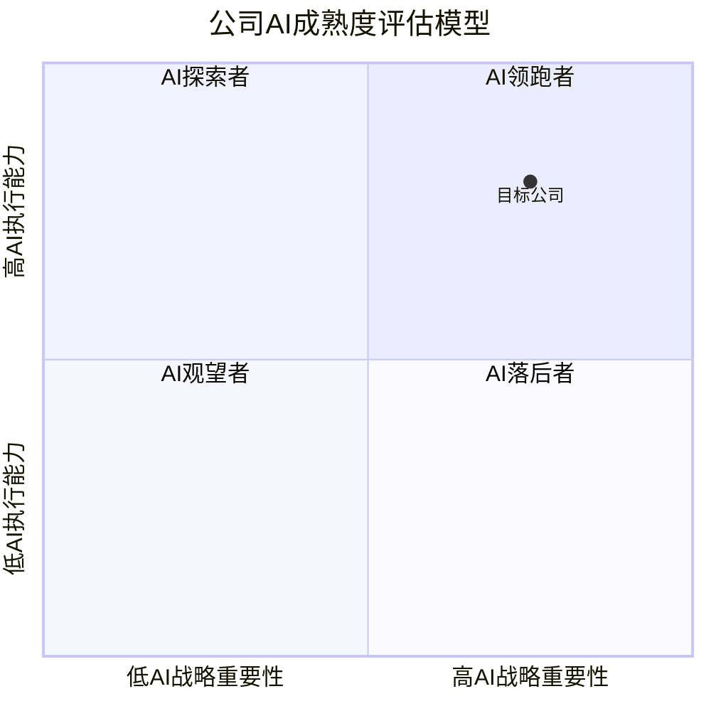

**图表说明**：该象限图以AI战略重要性为横轴、AI执行能力为纵轴，将公司分为AI领跑者（高战略高执行）、AI探索者（低战略高执行）、AI观望者（低战略低执行）、AI落后者（高战略低执行）四类，帮助求职者快速判断目标公司的AI成熟度。

### 4.4 AI创业公司典型股权结构

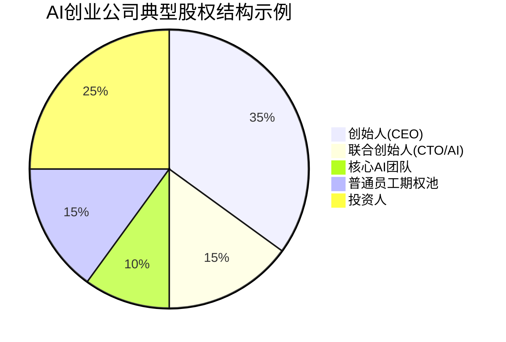

**图表说明**：该饼图展示了AI创业公司的典型股权分配。与2018年传统创业公司相比，AI公司的核心AI团队期权权重增加，员工期权池更大（15%-25%），反映AI人才市场竞争激烈。

### 4.5 赛道选择Checklist

- [ ] 我对这个赛道的理解是否超过80%的同级别创业者？
- [ ] 我的团队是否具备该赛道所需的核心能力组合？
- [ ] 这个赛道在未来3-5年的TAM是否足够大？
- [ ] 我能否找到10个愿意付费的种子客户？
- [ ] 如果巨头进入，我的护城河是什么？
- [ ] 我能接受的"烧钱周期"最长是多久？
- [ ] 最坏情况下，我的损失底线是什么？

### 4.6 跳槽前必须问自己的10个问题

**关于AI准备度**：
- Q1: 新公司的AI成熟度如何？是AI领先者还是落后者？
- Q2: 这个职位是否会被AI替代或大幅改变？
- Q3: 我能在新工作中学习和使用最新的AI技术吗？
- Q4: 公司是否有AI工具预算和培训支持？

**关于职业发展**：
- Q5: 这个职位能让我建立哪些AI时代稀缺的能力？
- Q6: 3年后，我的工作经验在市场上还有竞争力吗？
- Q7: 这家公司是在用AI增强人，还是在用AI替代人？

**关于文化与价值观**：
- Q8: 公司对AI的态度是什么？激进拥抱还是谨慎观望？
- Q9: 公司的AI伦理立场与我是否一致？

---

## 五、常见误区

### 5.1 AI创业十大风险与应对策略

| 风险类型 | 具体表现 | 应对策略 | 严重程度 |
|---------|---------|---------|---------|
| 技术快速过时 | 今天的最优解明天就过时 | 模块化架构、多供应商策略 | ⚠️⚠️⚠️⚠️⚠️ |
| 巨头降维打击 | 大厂直接进入你的赛道 | 找准细分niche、建立数据壁垒 | ⚠️⚠️⚠️⚠️⚠️ |
| 模型依赖风险 | API涨价、停服、限制使用 | 多模型适配、开源备选方案 | ⚠️⚠️⚠️⚠️ |
| 数据飞轮不足 | 无法形成数据→模型→产品的正循环 | 设计主动数据积累机制 | ⚠️⚠️⚠️⚠️ |
| 合规监管风险 | AI法规变化影响商业模式 | 提前布局合规、法务前置 | ⚠️⚠️⚠️⚠️ |
| 人才竞争激烈 | AI人才薪资暴涨，招聘困难 | 远程招聘、内部培养 | ⚠️⚠️⚠️ |
| 客户教育成本高 | 用户不理解AI产品价值 | 聚焦痛点场景、提供ROI证明 | ⚠️⚠️⚠️ |
| 盈利模式不清 | 免费习惯难以打破 | 价值定价、B端优先 | ⚠️⚠️⚠️⚠️ |
| 幻觉与可靠性 | AI输出不稳定导致信任危机 | 人机协同模式、兜底机制 | ⚠️⚠️⚠️⚠️⚠️ |
| 同质化严重 | 产品容易被复制 | 深度行业know-how、数据壁垒 | ⚠️⚠️⚠️⚠️ |

### 5.2 风险应对的三个原则

**原则一：假设最坏情况**
- 如果OpenAI下周推出了和我一样的产品怎么办？
- 如果我的主要API供应商涨价10倍怎么办？
- 如果核心AI人才被挖走怎么办？

**原则二：建立多元化缓冲**
- 技术多元化：不依赖单一模型或框架
- 客户多元化：不依赖单一客户或单一行业
- 收入多元化：不只靠一种盈利模式

**原则三：速度优于完美**
- AI领域变化太快，等"准备好了"可能机会已经没了
- 先用MVP验证，快速迭代
- 保持小团队+高效率的优势

### 5.3 技术人创业的三大误区

王鹏云（蓝创中心总经理）指出的三大误区在AI时代尤为致命：

1. **以技术为先**：最容易犯的错误，尤其在AI领域
2. **过度技术化**：能用简单方式解决的问题不要过度工程化
3. **过度理性**：创业需要直觉和决断，不能等待完美数据

### 5.4 期权评估的风险警示

余晟的警告在今天仍然振聋发聩：

> "我见过不少成功的创业公司，公司的成功与员工的回报，没有一毛钱关系。"

AI公司的期权风险更高：估值泡沫大、变现周期长、稀释频繁。在评估期权时，请务必：
- 把期权当作"彩票"而非"确定收益"
- 确保现金部分满足生活需求
- 了解期权的具体条款（特别是离职后的处理）
- 对公司估值保持理性判断

### 5.5 创业者最常见的文化破坏行为

成敏强调：**"创业者不要成为自己公司产品技术文化的破坏者。"**

| 破坏行为 | AI时代的表现 | 正确做法 |
|---------|-------------|---------|
| 用战略代替用户需求 | 看到某个新技术就想改变产品方向 | 基于数据和用户反馈调整 |
| 把自己当主流用户代表 | 你觉得某个Prompt好用≠用户觉得好用 | 通过A/B测试验证假设 |
| 忽视管理体系建设 | 只关注AI技术，忽视考核/培训体系 | 20人开始建考核，第一天就建知识库 |

---

## 六、进阶延展

### 6.1 全模块知识图谱

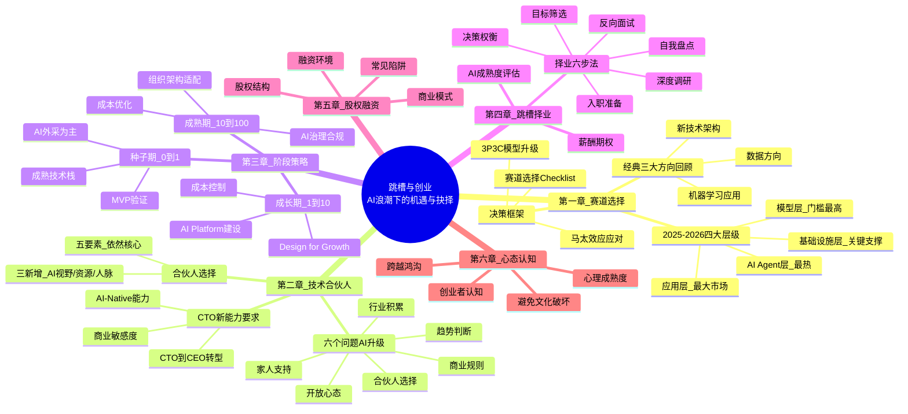

**图表说明**：该思维导图完整呈现了本模块的六大章节结构及其子知识点，可作为整体知识体系的速查导航。

### 6.2 核心要点速查表

**A. 赛道选择速查**

| 决策点 | 关键问题 | 快速判断标准 |
|-------|---------|-------------|
| 是否是好赛道？ | TAM够大吗？天花板够高吗？ | TAM≥100亿人民币 |
| 是否适合我？ | 积累匹配度？团队能力覆盖？ | 匹配度≥60% |
| 时机对吗？ | 头部固化了吗？差异化可能？ | 头部未固化或有差异点 |
| 风险可控？ | 最坏情况能承受吗？ | 有明确的损失底线 |

**B. 合伙人选择速查**

| 要素 | 权重 | 评估标准 |
|-----|------|---------|
| 契约精神 | ⭐⭐⭐⭐⭐ | 过往承诺兑现记录 |
| 知根知底 | ⭐⭐⭐⭐⭐ | 共事经历≥1年 |
| 能力互补 | ⭐⭐⭐⭐ | 覆盖技术/产品/商务 |
| AI视野 | ⭐⭐⭐⭐ | 理解AI能力边界和趋势 |
| AI资源 | ⭐⭐⭐ | 算力/数据/人才渠道 |

**C. 创业阶段策略速查**

| 阶段 | 核心目标 | AI策略重点 | 关键动作 |
|-----|---------|-----------|---------|
| 种子期 | 验证PMF | 外采为主，Hybrid架构 | 找10个付费种子客户 |
| 成长期 | 规模化增长 | Platform建设，成本控制 | Design for 10x Growth |
| 成熟期 | 效率利润优化 | 治理合规，组织适配 | 建立AI卓越中心 |

### 6.3 2026年AI创业投融资数据（截至2026-09-11 未检索到与下表数字对应的公开统计出处，存疑）

| 领域 | 2025年融资额 | 2026年H1预测 | 增长率 | 代表公司 |
|------|------------|-------------|--------|---------|
| AI Agent平台 | $8.2B | $15B | +83% | LangChain, CrewAI |
| 大模型API | $12B | $18B | +50% | OpenAI, Anthropic |
| AI+垂直行业 | $6.5B | $12B | +85% | Harvey, Hippocratic AI |
| AI基础设施 | $9B | $14B | +56% | CoreWeave, Lambda Labs |
| AI安全与治理 | $2B | $5B | +150% | Anthropic, DeepMind |

### 6.4 创业成功率数据（基于Y Combinator 2026批次）（截至2026-09-11 未检索到 YC 官方该批次统计；公开报道口径为 W25 批次约 80% 为 AI 公司、2024 年 W24/S24 约 70%-75%，与文中'2024年45%'不符，存疑）

- AI原生项目占比：78%（vs 2024年的45%）
- 6个月内达到PMF的比例：35%（AI项目）vs 22%（非AI项目）
- 12个月内获得A轮比例：28%（AI项目）vs 15%（非AI项目）
- 失败的主要原因：缺乏清晰商业模式（42%）、技术选型错误（25%）、团队分歧（18%）、资金耗尽（15%）

### 6.5 推荐行动清单

**如果你正在考虑创业**：
- [ ] 完成赛道选择的7项Checklist
- [ ] 用3P3C模型评估自己和潜在合伙人
- [ ] 与至少3位AI创业者深度交流
- [ ] 尝试一个小型AI项目验证自己的创业能力

**如果你正在考虑跳槽/择业**：
- [ ] 完成自我盘点的5个维度分析
- [ ] 确定3-5家目标公司并进行深度调研
- [ ] 准备反向面试的问题清单
- [ ] 学习期权基础知识，学会评估offer

**如果你已经是技术合伙人/CTO**：
- [ ] 评估自己的能力雷达图，找出短板
- [ ] 制定从CTO到更全面角色的成长计划
- [ ] 加强商业敏感度的培养
- [ ] 关注AI治理和合规的最新发展

### 6.6 核心观点来源

本文档基于以下极客时间专栏《技术领导力实战笔记》精华内容升级改编：

**核心讲次**：第37讲（熊飞：技术创业该如何选择赛道）、第40讲（余晟：技术人投身创业公司之前应当考虑什么）、第41讲（张新波：技术人创业前要问自己的六个问题）、第48讲（史海峰：空降领导者平稳落地要做的四道题）、第109讲（谢呈：关于垂直互联网创业的一些经验之谈）、第110讲（成敏：创业公司为什么会技术文化产品缺失）、第111讲（蔡锐涛：从0到1再到100，创业不同阶段的技术管理思考）、第122讲（黄伟坚：创业中那些永远回避不了的问题）、第123讲（黄伟坚：用系统性思维看待创业）、第137讲（成敏：创业者不要成为自己公司产品技术文化的破坏者）、第139讲（成敏：创业者应该具备的认知与思维方式）、第140讲（袁店明：创业产品必须迈过的鸿沟）、第149讲（肖德时：创业团队技术领导者必备的十个领导力技能）、第164讲（陈崇磐：心理成熟度-创业公司识人利器）、第168讲（余加林：从技术人到创业合伙人必备的三个维度的改变）

**大咖对话**：王鹏云（技术人创业该如何选择合伙人）、胡哲人（技术人创业要跨过的思维坎）、王淮（技术人创业前衡量自我的3P3C模型）、张建锋（创业可以快而大，也可以小而美）

**2025-2026参考资料**：欧盟AI Act、中国《生成式人工智能服务管理暂行办法》（"Google《AI Agent Trends 2026》"、Anthropic《2026 Agentic Coding Trends Report》两份报告截至2026-09-11未检索到公开出处，存疑）

---

> **文档版本**：v2.0 ⭐2026全面升级
>
> **适用对象**：技术领导者、创业者、技术合伙人、AI从业者
>
> **建议阅读时长**：3-4小时（精读）/ 60分钟（速查）