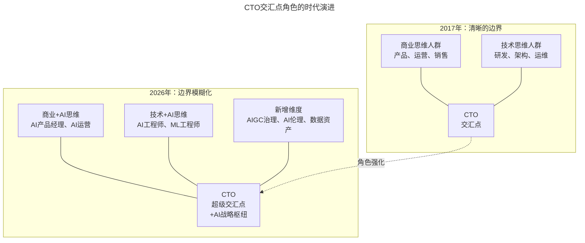
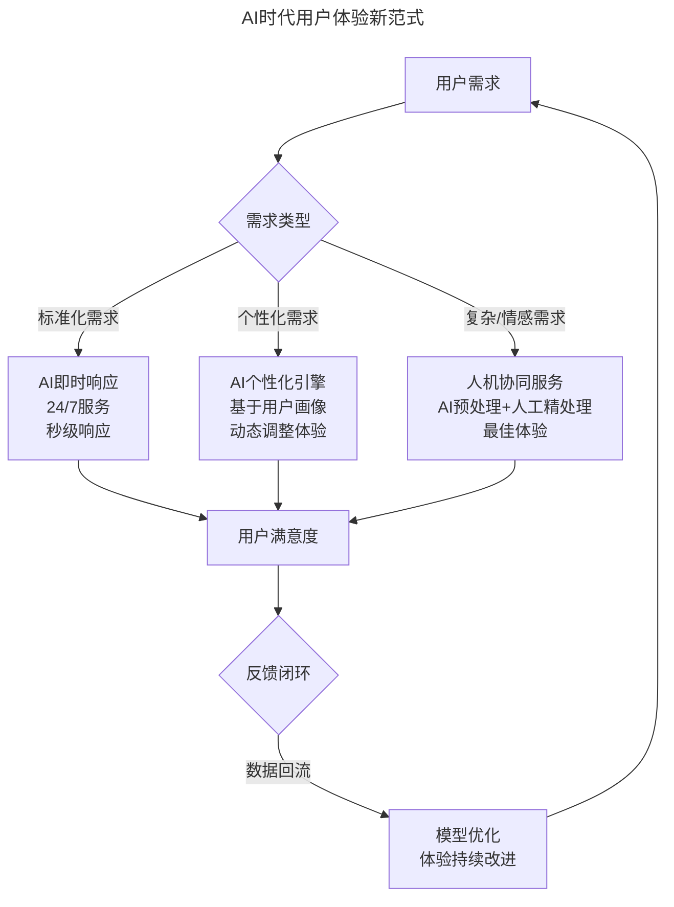
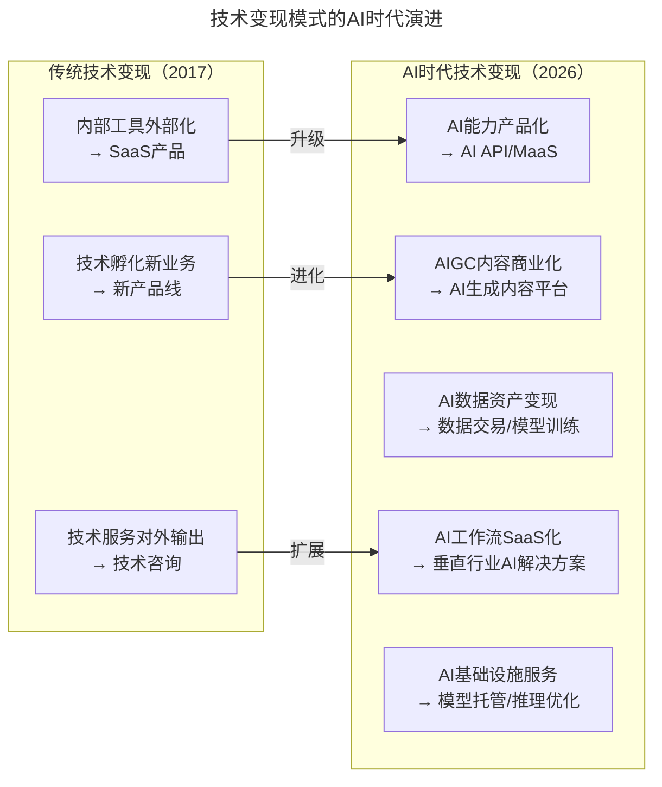

# 第9讲 | CTO是商业思维和技术思维交汇的那个点

> **适用范围**：互联网企业的CTO、技术VP及高管，尤其是处于创业阶段或正在推动技术团队从成本中心向价值中心转型的技术领导者；同样适用于希望在AI时代强化"商业+技术+AI"三重交汇能力的从业者。
>
> **更新摘要（v2 · 2026-08 更新）**：
> - 结构化升级为 6 节骨架（导言 / 核心方法论 / 关键流程 / 工具与实战 / 常见误区 / 进阶延展）
> - 将汤峥嵘2017年提出的"四种思维方式"与2026年AI时代进化整合为统一方法论体系
> - 补充AI时代CTO"超级交汇点"角色的新能力要求与行动建议
> - 保留全部Mermaid图、数据表与实战案例（DCGS动态课程匹配、vipJr青少儿编程）

---

## 1. 导言

CTO这个岗位，在今天的任何一家互联网企业中显然都是不可缺少的，特别是处于创业阶段的企业。当我在微信群里发出一条"推荐靠谱CTO"的消息后，会瞬间被无数红包砸到。但当我试图了解他们对CTO的需求时，回答却迥异。同时，在CTO的圈子里，我又经常听到对这份工作的迷惘甚至抱怨。

我非常不愿意把人群分类，用标签的形式去评价。但我认为，在任何一家对技术需求较大的企业中，确实存在两类差异较大的人群，一类偏商业性思维，另一类偏技术性思维。而CTO恰恰就是这两类人群交汇的那个点。

到了2026年，这个"交汇点"不仅没有消失，反而变得更加重要——因为**AI正在让技术思维和商业思维的边界变得前所未有的模糊**。CTO不再只是两种思维的"翻译者"，而是同时需要懂技术实现、AI能力、商业变现与AI治理的"超级交汇点"。

上图展示了CTO交汇点角色从2017年到2026年的演进：在2017年，商业思维与技术思维有清晰边界，CTO作为翻译者连接两端；到2026年，AI维度的加入使交汇点升级为"超级交汇点"，CTO不仅连接商业与技术，还需统筹AIGC治理、AI伦理与数据资产等全新议题。

**为什么交汇点更重要了？**
- **2017年：** 技术团队是"成本中心"，CTO需要"翻译"技术价值给业务方
- **2026年：** 技术团队可以通过AI直接创造收入（如汤峥嵘做的编程业务），CTO需要同时懂**技术实现 + AI能力 + 商业变现 + AI治理**

---

## 2. 核心方法论

### 2.1 CTO的"本职"工作

站在CTO的角度，以下三类工作应该算是本职工作：

1. **团队建设**：包括招新人，培养人，淘汰人。如果团队大了，还包括文化建设，制度建设，层级体系建设。
2. **还技术债**：例如TutorABC/vipJr是一家有20年历史的互联网企业，有大量的老系统，老代码。一个重要任务就是解耦和重构。边开飞机边换引擎，早已经是普遍的做法了。
3. **技术升级**：让新技术落地、开花、提振士气。2017年，TutorABC/vipJr基于WebRTC用Go语言实现的新一代音视频技术TutorMeet+，实现了在丢包率20%的不稳定网络环境下仍能顺畅双向互动；大数据系统让数据处理能力提升2个数量级，业务数据分析速度提升到秒级。

做到以上三点是必须的，是及格，但未必得高分。作为交汇点的那个人，CTO的作业还应该包括**公司的商业价值**。

### 2.2 四种思维方式

任何行动都是思维的产物。除了做好"本职"工作以外，CTO还可以做什么？以下四种思维方式都以产生商业价值为最终目标，并在2026年AI时代都有了对应的进化。

#### 效率思维 → AI效率思维

提升内部效率通常是CTO最容易切入的点。但CTO很容易陷入的一个误区是，只用报表证明自己的成绩，而非用公司的成本来衡量效率。内部效率的提升，通常不是省了钱，就是省了人。但省出来的钱或人去哪里了？公司的总费用或总人数下降了吗？

| 效率维度 | 传统方法 | AI增强方法 | 典型工具 |
|---------|---------|-----------|---------|
| **编码效率** | 代码规范、组件复用 | AI代码生成（40%代码由AI生成） | GPT-5.5、Cursor、Windsurf |
| **测试效率** | 自动化测试框架 | AI自动生成测试用例 | GitHub Copilot Testing |
| **运维效率** | 监控告警、自动化脚本 | AIOps智能运维（预测性维护） | Datadog AI、PagerDuty AI |
| **文档效率** | 模板化文档 | AI自动生成文档 | Notion AI、ChatGPT |
| **客服效率** | FAQ机器人 | AI智能客服（解决率80%+） | DeepSeek V4定制、Intercom AI |
| **数据分析** | BI工具、手动分析 | AI自然语言查询数据分析 | ChatBI、Hex AI |

关键原则更新：AI不是省人，而是释放人的创造力去做更高价值的事。某公司引入Agentic Coding后开发效率提升300%，但没有裁员，而是让工程师转型做AI Prompt Engineer和AI Workflow Designer，新产品上线速度从6个月缩短到6周。

#### 用户思维 → AI用户体验思维

CTO通常善于通过表面现象看本质，也比较喜欢系统性地根治问题。短解（解决当下问题）和长解（系统根治）需要平衡，CTO比较容易倾斜到长解这一端。但在高度竞争中，如果短解不够，不能立刻解决客户的当下问题，很可能导致客户流失。

上图中，AI将用户需求分为三类并分别匹配最优响应路径：标准化需求由AI即时响应，个性化需求由AI个性化引擎动态适配，复杂与情感需求则采用人机协同模式。反馈闭环使模型持续优化，体验不断改进。

AI个性化体验设计要点：千人千面（个性化内容推荐、学习路径、产品界面）、预测性服务（在用户提出需求前预判并准备方案）、情感计算（识别用户情绪状态，调整交互方式）。

#### 跨界思维 → AI跨界融合思维

CTO是一群经常接触互联网最先进技术、最先进商业模式的人。如果能跳出自己的行业，看看其它行业在怎样解决问题，或许能给企业带来非常大的创新机会。

TutorABC/vipJr的DCGS（动态课程匹配系统）就是跨界思维的典范——把打车软件的算法匹配逻辑迁移到在线教育，不让学生选老师，而是通过算法匹配，实现了1对多小班课和非线性个性化课程教学。

| 来源行业 | 目标行业 | AI跨界应用 | 商业价值 |
|---------|---------|-----------|---------|
| **电商推荐算法** | 在线教育 | 个性化学习路径推荐 | 学习效果提升40% |
| **金融风控模型** | 人力资源 | AI面试官+人才预测 | 招聘效率提升60% |
| **医疗影像识别** | 工业制造 | AI质检（缺陷检测） | 质检成本降低80% |
| **自动驾驶感知** | 安防监控 | AI行为识别 | 安全事故减少70% |
| **NLP大模型** | 所有行业 | 智能客服/知识库/内容生成 | 通用效率工具 |

CTO的新职责是成为"AI跨界翻译官"：识别哪些行业的AI方案可以迁移到自己的业务，评估迁移的技术可行性和商业价值，带领团队快速验证和落地。

#### 商业思维 → AI商业变现思维

绝大部分技术和产品研发在公司中属于成本中心，是后台支持部门。但如果技术逐渐强大之后，也许可以利用技术直接产生商业价值，让后台直接变成前台。

上图对比了2017年与2026年的技术变现路径：传统模式下技术变现主要依赖内部工具外部化、技术服务输出和新业务孵化；AI时代则扩展出MaaS、AIGC内容商业化、数据资产变现、垂直行业AI解决方案和基础设施服务五条新路径。

### 2.3 CTO作为"超级交汇点"的新能力要求

1. **AI战略规划能力**：制定公司3年AI路线图，判断哪些业务场景适合AI、哪些不适合（避免AI washing），评估AI投入的ROI和风险。
2. **AIGC治理能力**：建立AI使用的伦理规范（数据隐私、算法公平性、内容合规），设计AI输出的质量控制流程（Human-in-the-loop机制），应对AI相关的法律风险。
3. **组织AI能力建设能力**：推动全员AI素养提升，建立AI实践社区和知识共享机制，设计AI人才的招聘、培养、激励机制。

---

## 3. 关键流程

### 3.1 效率提升的全局视角流程

效率提升不是省钱就是省人，但关键在于省出来的资源是否被有效利用。CTO在看效率时，不仅要看局部效率的提升，还要看全局效率的提升：

1. **识别效率瓶颈**：定位最耗时/耗人力的环节
2. **引入AI提效工具**：选择合适的AI工具（编码/测试/运维/文档/客服/数据分析）
3. **评估全局影响**：省出的人去哪了？总成本下降了吗？
4. **释放创造力**：让被释放的人员转向更高价值的工作（而非裁员）
5. **形成闭环**：效率提升→资源释放→新业务探索→新价值创造

### 3.2 用户问题传递流程

问题经过层层汇报后，容易失去温度和紧急性，衰变成没有温度的数字。CTO需要建立让用户问题"原汁原味"传递的机制：

1. **系统传递**：通过系统让用户的问题原始场景传递到后台，让解决者看到当时的场景和紧急程度
2. **团队培养**：激励和培养团队的用户意识和用户思维能力
3. **短解与长解平衡**：在更多员工层面做好短解和长解的平衡，公司层面的平衡才能做到更好

### 3.3 商业价值闭环流程

以vipJr青少儿编程为例，技术部完成了从后台到前台的商业闭环：

1. **发现市场机会**：2017年看到青少年编程市场在逐渐变大
2. **内部孵化**：由研发团队内部孵化，不占用公司任何额外资源
3. **全链条闭环**：自己设计产品→做市场营销→运营微信公众号→朋友圈转发获客→程序员兼职销售→程序员兼职老师上Scratch课和Python课
4. **价值创造**：不仅为公司创造了新的商业价值，也让技术部从后台走到前台，亲身体验产品、营销、销售和服务这几个核心环节

---

## 4. 工具与实战

### 4.1 本月行动：绘制公司的"AI机会地图"

识别出5-10个可以用AI降本增效或创造新收入的场景，按照以下维度评估：

| 场景名称 | 技术可行性 | 商业价值 | 实施难度 | 优先级 |
|---------|-----------|---------|---------|-------|
| 示例：AI客服 | 高 | 高（节省30%人力） | 中 | P0 |
| ... | ... | ... | ... | ... |

### 4.2 本季度行动：启动一个"Pilot AI项目"

选择一个高价值、低风险的场景，小范围试验AI应用：
- **成功案例**：积累经验，为大规模推广做准备
- **失败教训**：低成本试错，避免全面铺开的资源浪费

### 4.3 持续行动：建立个人的"AI商业敏感度"

每周花2小时关注：
- AI领域的最新突破（GPT-5.5、DeepSeek V4等）
- 同行业的AI应用案例
- AI监管政策的变化
- AI人才市场的动向

### 4.4 实战案例：DCGS动态课程匹配系统

TutorABC/vipJr虽然是一家在线教育的公司，但做法非常跨界。在整个教育行业中，几乎所有公司都采用学生选老师的模式。但我们在很早以前就颠覆了这个思路，决定不让学生选老师，而是通过算法来匹配老师——我们做了教育行业的滴滴和Uber。

DCGS通过算法做到了把多个水平相当、兴趣相似、对老师的偏好一致、上课时间相同的学生匹配到一起，实现了1对多的小班课（类似顺风车/拼成模式）。DCGS的另外一个创新是真正实现了个性化的非线性课程教学——根据计算，某个学生可以从第8课开始，然后跳到第15课，然后再跳回到第3课。

### 4.5 实战案例：vipJr青少儿编程

我们在2017年看到了青少年编程这个市场在逐渐变大。于是我们决定由研发团队内部自己孵化，并且不占用公司任何的额外资源。我们自己设计产品，做市场营销，自己运营"vipJr青少儿编程"微信公众号，然后通过朋友圈转发来获客。我们的产品经理和程序员兼职做销售，通过微信来转换客户，引导客户去自助购买我们的课程。最后，我们的程序员兼职做老师，和家长约定时间，给小朋友上Scratch课和Python课。从产品设计，产品定价，市场营销，到销售，到服务，技术部完成了闭环。

---

## 5. 常见误区

### 5.1 效率思维误区：用报表证明成绩而非用成本衡量效率

CTO很容易陷入的一个误区是，只用报表证明自己的成绩，而非用公司的成本来衡量效率。辛辛苦苦省出来的钱或人，有没有被拿去做了效率更低的事情？如果回答不了这个问题，效率提升也许并没有真正发生。只有全局效率提升，才能为公司真正节省成本，创造价值。

### 5.2 用户思维误区：重长解轻短解

CTO比较容易倾斜到长解这一端。但在今天高度竞争的互联网环境中，如果短解不够，不能立刻解决客户的当下问题，很可能导致客户流失和失去竞争优势。问题经过层层汇报后，已经失去了当时的温度和紧急性，从而衰变成了没有温度的数字——这时候很容易选择长解而忽略短解。

### 5.3 AI时代的效率误区：省人不等于裁员

引入AI提效后，正确的做法不是裁员，而是让工程师转型做更高价值的工作。某公司引入Agentic Coding后开发效率提升300%，但没有裁员，而是让工程师转型做AI Prompt Engineer和AI Workflow Designer，新产品上线速度从6个月缩短到6周。

### 5.4 AI用户体验误区：算法黑箱导致体验不可控

当80%的用户交互由AI完成时，如何确保AI传递的温度和关怀？如何避免"算法黑箱"导致的用户体验不可控？建议建立"AI用户体验审核机制"，定期抽检AI与用户的交互记录，确保体验质量。

---

## 6. 进阶延展

### 6.1 关键洞察（2026）

- **70%** 的企业将在2027年前实施"AI First"战略（IDC 2026预测）
- **$150B+** 是全球企业AI投资规模，其中**40%** 用于行业特定AI解决方案（McKinsey 2025）
- **3x** 是成功进行AI商业化的企业的估值溢价（VC调研2025）
- **最大的挑战**不是技术，而是**找到合适的商业场景和组织变革能力**（Gartner 2025）

### 6.2 结语

汤峥嵘说："好的枢纽可以让信息沟通顺畅，让商业决策变得快速，让技术能力得以释放。"在2026年，这个"枢纽"还需要加上：**让AI能力得以正确应用，让AI价值得以真正兑现，让企业在AI浪潮中既不掉队也不翻车。**

现代的企业对于技术的依赖越来越大。CTO是企业中商业思维人群和技术思维人群的交汇点。因此，CTO在商业策略和组织策略中扮演的角色是枢纽。一个充分理解公司商业模式的技术团队，一定是公司的核心竞争力之一。CTO作为交汇点的角色，从未像今天这样重要，也从未像今天这样充满挑战和机遇。

### 6.3 作者简介与来源

本文作者汤峥嵘，TGO鲲鹏会上海分会会员。2016年10月18日正式出任iTutorGroup集团首席技术官（CTO），于2018年1月3日升任为iTutorGroup集团首席运营官（COO）。曾在阿里巴巴历任淘宝网、支付宝、B2B的资深总监及日本阿里巴巴、途牛网的CTO，并先后负责淘宝网架构迁移、支付宝网站创建、国际网站、途牛整体技术架构、淘日本的技术研发项目。

本文基于极客时间《技术领导力实战笔记》第9讲内容，并融合2026年AI时代升级注解。
