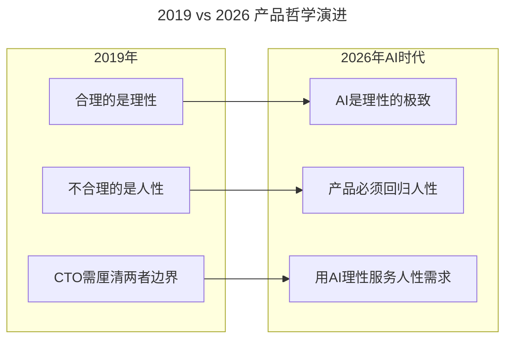
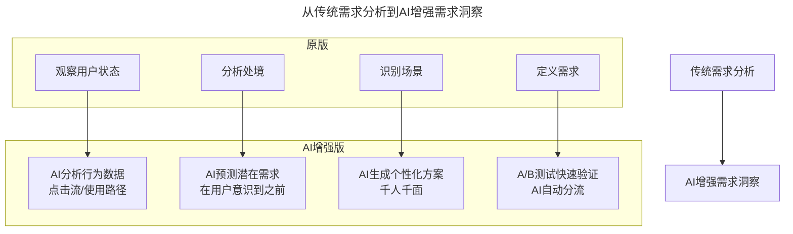

# 第38讲 | CTO要掌握的产品哲学：理性与人性的权衡

> **适用范围**：技术出身的产品决策者（CTO、技术VP、技术合伙人），尤其是习惯用理性思维做产品但希望补齐人性洞察的技术领导者；同样适用于AI时代希望在"AI理性"与"人性温度"之间找到平衡的产品经理和创业者。
>
> **更新摘要（v2 · 2026-08 更新）**：
> - 结构化升级为 6 节骨架（导言 / 核心方法论 / 关键流程 / 工具与实战 / 常见误区 / 进阶延展）
> - 整合梁宁"理性与人性"产品哲学与2026年AI时代"理性极致但需回归人性"的新平衡
> - 补充AI-Native产品体验公式与AI增强需求洞察模型
> - 保留痛点/痒点/爽点框架及其AI时代演绎

---

## 1. 导言

大家好，我是梁宁。今天主要想跟大家分享一组概念词，就是理性和人性，这也是CTO想做好产品必须厘清的概念。

合理的部分是理性，不合理的部分是人性。在生活中，理性其实只占了很小的部分。那人们为什么会按照理性做事呢？因为外界的巨大压力，只有在压力下，他才会按照理性做事。如果你没有足够的能力给他足够大的压力，其实他是会按照自己的人性做事的。

到了2026年，这个哲学在AI时代有了新的维度：**AI可以做到100%的理性（数据分析、逻辑推理、模式识别），但伟大的产品必须在理性之上注入人性的温度**。AI擅长处理海量数据、优化效率指标、预测用户行为（理性），但不擅长理解情感的细微之处、创造惊喜和感动、建立信任和连接、定义"什么是好的生活"（人性）。



上图展示了产品哲学从2019年到2026年的演进：原文强调"合理的是理性，不合理的是人性"；AI时代则升级为"AI是理性的极致，但产品必须回归人性"，核心使命是用AI的理性能力服务人性需求。

---

## 2. 核心方法论

### 2.1 好产品 = 10%生理体验 + 90%心理体验

当我们做产品的时候，我们要洞察用户需求，重视用户体验。但体验中可能只有10%是生理体验，是人的身体可以真实感受并给出反应的，剩下的90%都是心理体验。如果CTO在追求用户体验的时候，无法理解人的心理体验是怎么构成的，那就无法真正地了解用户体验，做出优秀的产品。

以衣服为例，可能两件不同价位的衣服带给人的保暖、舒适等生理体验是差不多的，但它们的差异来自于优越感、文化认同感、自卑感等心理体验的差异。技术出身的人做产品的时候，特别容易去追求理性，觉得功能达到了、做到了服务器的完美负载匹配，就已经很好了——但其实只满足了10%的生理体验。

**2026版产品体验公式：**
- 原版：好产品 = 10%生理体验 + 90%心理体验
- AI-Native版：AI-Native产品体验 = (AI增强的功能体验 × 30%) + (AI个性化的心理体验 × 50%) + (人机交互的情感体验 × 20%)

### 2.2 满足感与存在感

心理体验中，人最核心的情绪是**满足**，还有一个很关键的词是**存在感**。对人类来说，除了生物性的生存，其实还有一个社会性的存在感。存在感包括两个方面：一个是世界观（对你所生存的场域的真实认知和感受），另一个是从关系中感受自己的存在。

围绕生存和存在感，以满足为中心，会分成两组不同的情绪：
- **不满足时**：不爽、担心、着急、紧张、恼火、生气、心神不宁、忧伤、沮丧、难过、烦躁
- **被满足时**：愉悦、兴奋、喜悦、欣喜、甜蜜、精力充沛、兴高采烈、感激、感动、乐观、自信

围绕生存和存在感，还有两个词是**愤怒和恐惧**，这是一体两面的情绪，差异主要来自你对对手的感知。猫划定地盘之后，如果来的是另外一只猫，它就会感到愤怒，而如果来的是只老虎，它就会感到恐惧。

### 2.3 "应该"是角色化的产物

技术出身、偏向理性的CTO偏好抽象，但抽象往往会忽视现实的复杂性。我们经常用"应该怎样怎样"来预期一件事情，但"应该"是角色化的产物，是压力的产物——只有在给对方足够大的压力的情况下，他才会在你设定的"应该"里去工作。

这也是为什么大公司高管出来创业一开始都很不适应的原因之一：大公司有足够的组织势能和系统压力压着每个人在角色脚本里工作，但出来创业后，每个人都用他本来的人性面对你。

### 2.4 痛点 / 痒点 / 爽点框架

**不满足的状态 + 处境 + 场景 = 需求切入点**，也就是痛点、痒点和爽点。

| 类型 | 定义 | 举例 | 2026年AI如何改变 |
|------|------|------|-----------------|
| **痛点** | 恐惧——生存资源被侵犯、生命安全无法保障 | 教育是对生存机会的恐惧，医疗是对生命安全的恐惧 | AI健康预测、智能诊断降低恐惧 |
| **痒点** | 对理想化自我的追求 | 一个女孩买200只口红（3-5只够用，但心理体验没有尽头） | AI虚拟试妆、个性化推荐无限满足 |
| **爽点** | 长期被压抑的需求突然被满足 | 久旱逢甘霖、他乡遇故知、洞房花烛夜、金榜题名时 | AI让"即时满足"成为常态 |

关键警示：当AI让所有"爽点"都变得容易获得时，真正的稀缺资源变成了"等待"、"意外"和"真实的人际连接"。2026年的产品机会在于：用AI提升效率，同时保留人性化的"摩擦"和"仪式感"。

### 2.5 2C vs 2B产品的价值差异

2C和2B产品细分可以分成3类：C端产品直接卖给C、C端产品B买单、给组织用的产品。

以钉钉为例，它是典型的C端产品B买单。对普通用户来说，钉钉其实很反人性，但它给集体设计的——集体人格就是反人性的。在老板看来，钉钉能为他提供确定性，能让他觉得爽，所以愿意为此想办法克服C端的抱怨。

2B产品重要的只有一条：抓住老板的恐惧。因为2B产品需要系统灌输及系统学习的成本，如果不能抓住老板的恐惧，他们是不可能让组织付出代价去贯彻的。

---

## 3. 关键流程

### 3.1 需求洞察流程：从状态到需求

不满足的状态 → 处境 → 场景 → 需求切入点（痛点/痒点/爽点）

以饥饿为例：饥饿是一种状态而非需求。菜场、超市、便利店、餐馆、盒饭、外卖等诸多产品和服务都是在对接这个状态，所以在状态和产品之间还需要加上用户的处境。比如我饿了，但我在减肥，同时经济上还算宽裕，那么基于这样的处境和场景，我可能选择代餐或是低卡饮食，或者在健身房场景下选择冲一杯蛋白粉。

### 3.2 AI增强的需求洞察流程



上图中，传统需求分析的四个步骤（观察状态→分析处境→识别场景→定义需求）在AI增强版中分别升级为：AI行为数据分析、AI潜在需求预测、AI个性化方案生成和A/B测试快速验证，形成从数据到决策的闭环。

---

## 4. 工具与实战

### 4.1 产品设计原则（AI版）

1. **透明度原则**：明确告知用户哪些是AI生成的
2. **控制权原则**：用户始终拥有最终决定权
3. **情感设计原则**：AI交互要有"温度"，不是冷冰冰的机器
4. **包容性原则**：考虑到不同用户对AI的接受程度

### 4.2 避免AI伪人性化

```
错误做法：
- 让AI假装成真人（欺骗性）
- 过度拟人化（引起不适）
- 忽视AI局限性（过度承诺）

正确做法：
- 明确标识AI身份
- 设计符合AI能力的交互模式
- 在AI无法处理时优雅地转人工
```

### 4.3 管理实践：看着别人的眼睛说话

谈管理时，为什么非常强调管理者在说话的时候要看着别人的眼睛？因为这意味着你看到了对方的存在，你在关注他，这对他来讲是非常重要的。这是一种慈悲——给别人存在感。

---

## 5. 常见误区

### 5.1 用理性碾压用户的人性

技术出身的人做产品时，特别容易去追求理性，觉得功能达到了就已经很好了——但其实只满足了10%的生理体验。2026年的CTO更要警惕"用AI的理性去碾压用户的人性"。

### 5.2 用抽象和"应该"推测问题

技术出身、偏向理性的CTO偏好抽象，但抽象往往会忽视现实的复杂性（人性）。"应该"是角色化的产物，只有在给对方足够大的压力时才有效。大公司高管出来创业不适应，就是因为没有了组织势能，人们不再按"应该"行事。

### 5.3 把状态当作需求

孤独只是一种状态，而不是一种需求。从状态到需求之间，还有处境，还有在这个处境里解决这个状态的场景，接着才变成产品对接的点。如果直接把状态当作需求，产品就会偏离用户的真实需要。

### 5.4 忽视2B产品的恐惧驱动

2B产品如果抓不住老板的恐惧，组织不可能付出代价和时间去贯彻。2C产品的痒点和爽点在2B场景下没那么重要。

---

## 6. 进阶延展

### 6.1 核心观点总结

梁宁老师的"理性与人性"哲学在AI时代不仅没有过时，反而更加重要：

1. **AI是理性的巅峰**，但**人性是不可替代的价值源泉**
2. **技术出身的人做产品**，更要警惕"用AI的理性去碾压用户的人性"
3. **好产品的90%心理体验**，在AI时代变成了"AI个性化+人文关怀"的双重体验
4. **"应该"是角色的产物**——AI时代我们有机会打破僵化的角色脚本，真正看见每个用户的独特人性

### 6.2 2026年CTO的产品使命

**用AI的理性能力去服务人性需求，而不是用人性去适应AI的能力边界。**

### 6.3 作者简介与来源

本文整理自著名产品人梁宁在GTLC全球技术领导力峰会上的精彩分享。梁宁是湖畔大学产品模块学术主任，曾任联想、腾讯高管，工作经历横跨BAT，与京东、美团、小米等企业有长期深度交流。本文基于极客时间《技术领导力实战笔记》第38讲内容，并融合2026年AI时代升级注解。
