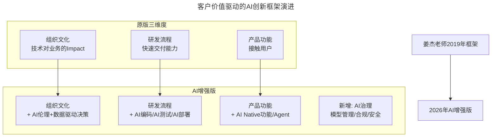

# 第39讲 | 从客户价值谈技术创新

> **适用范围**：互联网企业的CTO、技术VP及架构团队负责人，尤其是面临"业务上没啥技术挑战"瓶颈、希望探索技术创新方向的技术管理者；同样适用于AI时代希望在技术规划中融入AI能力边界评估与场景匹配的技术决策者。
>
> **更新摘要（v2 · 2026-08 更新）**：
> - 结构化升级为 6 节骨架（导言 / 核心方法论 / 关键流程 / 工具与实战 / 常见误区 / 进阶延展）
> - 整合姜杰"客户价值驱动技术创新"框架与2026年AI增强四维框架
> - 补充AI创新的ROI评估模型与"不应该做的创新"清单
> - 保留全部Mermaid图、数据表与AI工程化工具对照

---

## 1. 导言

在大多数互联网企业中，技术很多时候承担的角色类似"图灵机"的定位，主要在解决和实现产品和运营提出的相对确定性的需求。那么作为一个技术负责人，除了响应和满足这些"本职工作"外，是否需要思考技术创新呢？答案显然是肯定的。

技术创新可以应用在很多方面，往往也意味着非常大的开放性和不确定性，很容易出现为杀鸡而研发一个牛刀的过度目标设计，所以就更加需要找到相对稳固的锚点来进行重要性和优先级评判——那就是从客户中找答案。对养鸡场来讲，牛刀远不是他们最需要的产品，能增强禽类免疫力的鸡饲料才是。

企业的核心是围绕客户价值实现的，而在当今信息和数据智能的时代，企业长期的发展和利润取决于技术在客户价值上做得有多深。到了2026年，客户价值的定义扩展了——除了传统的效率和质量，**个性化、智能化、即时响应**成为新的价值维度。



上图展示了从2019年三维度框架到2026年AI增强四维框架的演进：原有的组织文化、研发流程、产品功能三个维度分别融入AI伦理、AI工程化和AI Native能力，并新增AI治理维度（模型管理/合规/安全）。

---

## 2. 核心方法论

### 2.1 技术创新要跳出技术本身思考

分享一个不成功的例子：一个做了10年中间件的候选人，做出来的中间件设计、架构、性能都非常优秀，但他离开公司的原因是老板并没有对中间件的价值有足够的认可。深入剖析后发现，当时公司的整体技术中，中间件并不是当时公司最需要的技术，公司更需要的是解决像客户端连通率等更迫切的用户侧工程问题。

**核心原则**：制定技术目标时，仅从自己的优势经验角度出发去思考，往往就会产生比较大的Gap。一定要跳出技术本身的惯性思考，把组织业务的发展需要纳入到思考维度中，而且要放在非常重要的地位。

### 2.2 技术创新要围绕客户价值

当技术发展到一定阶段，团队已经能很好地支持当前阶段业务发展的时候，有一天你会突然发现好像有你没你业务都能够顺利地开展——这时候不要急着换环境，还有一个更具挑战的选择：在当前的环境中探寻技术本身的突破，让技术未来成为业务发展的重要引擎。

创新并不意味着一定要做新产品，在产品研发、售前、售后等过程中的效率提升和成本降低也有很多的技术创新可能。技术创新要是能多从客户角度思考，就能让创新决策跟企业的中长远发展保持一致，并且能够保证持续地得到技术发展所需要的资源。

### 2.3 2026年技术创新公式

**创新 = (深度理解客户 × AI能力匹配) + (快速实验 × 数据驱动决策)**

| 维度 | 2019年观点 | 2026年AI时代升级 |
|------|-----------|-----------------|
| **创新起点** | 跳出技术惯性，纳入业务需求 | + AI能力边界评估 + 场景匹配 |
| **创新锚点** | 客户价值是稳固锚点 | + AI带来的新价值形态（效率/体验/个性化） |
| **创新路径** | 产品/售前/售后全链条 | + AI原生产品形态（Agent/对话式/生成式） |
| **创新节奏** | 最小MVP快速验证 | + AI加速MVP（天级原型→周级迭代） |
| **创新风险** | 避免憋大招 | + AI降低试错成本，但增加"AI幻觉"风险 |

---

## 3. 关键流程

### 3.1 技术团队关注客户价值的三个维度

**维度一：组织文化**

在追求技术卓越的同时要将技术对业务和战略产生Impact作为重要衡量指标，避免过度设计和炫技。对业务型团队可以推行技术合伙人制，鼓励每个同学都以技术合伙人或业务合伙人为目标。

AI时代新增的组织文化要素：数据驱动决策（而非直觉）、实验精神（A/B测试常态化）、AI透明度（可解释、可审计）、人本主义（AI辅助而非替代）、持续学习（AI技术日新月异）。

**维度二：研发流程**

构建可快速交付客户价值的能力：关键模块服务化、敏捷流程、持续集成、快速部署、自动化测试及线上回归等一切能够提升工程师效率的手段；灰度发布和线上自动化的fail over处理等高SLA保障；全链路的数据分析和用户模型。

| 环节 | 2019年工具 | 2026年AI工具 |
|------|-----------|--------------|
| 需求分析 | Jira/Confluence | AI需求澄清助手 |
| 编码实现 | IDE + 手写 | Cursor/Copilot (80%代码AI生成) |
| Code Review | 人工Review | AI静态分析 + 人工审核关键路径 |
| 测试 | 单元测试+E2E | AI生成测试用例 (覆盖率>80%) |
| 部署 | Jenkins/GitLab CI | AI智能发布（灰度+自动回滚） |
| 监控 | Prometheus+Grafana | AIOps（异常检测+根因分析） |

整体研发周期缩短40-60%。

**维度三：产品功能**

要鼓励技术能够经常接触用户。如果工程师只坐在办公室里，接收的往往都是来自产品和运营的"二手"需求，而让他们真正有机会去接触客户，直接参与客户需求反馈，往往会发挥出更多的效率创意和技术价值。通过客户轮岗日等机制设计，保证工程师获得客户一手信息。

AI-Native产品功能类型：预测型（用户流失预警、需求预测）、对话型（智能客服、AI搜索）、生成型（AI文案、AI设计、AI代码）、自主型（AI Agent自动化任务流）、个性化（千人千面的推荐/界面）。

### 3.2 技术创新不憋大招

技术价值的释放曲线是一个S型，一开始呈现出的价值会比较低。千万不要想着去做一个特别完美的技术方案然后再推到实际业务中去——做出来的所谓"完美方案"，很有可能和实际的场景、需求之间存在比较大的Gap。实践才是检验设计的唯一标准。

一定要先把技术的最小MVP快速地做出来，找一些应用场景，快速地根据反馈进行迭代。

---

## 4. 工具与实战

### 4.1 AI创新的ROI评估框架

```
AI项目ROI = (效率提升收益 + 质量改善收益 + 新收入机会)
          ──────────────────────────────────────
          (AI工具成本 + 数据成本 + 人力成本 + 维护成本)
```

| 收益类型 | 衡量指标 | 预期提升 |
|---------|---------|---------|
| 效率提升 | 人时节省率 | 30-50% |
| 质量改善 | Bug率降低 | 20-40% |
| 新收入机会 | 转化率提升 | 15-30% |
| 成本节约 | 运维成本降低 | 25-35% |

| 成本类型 | 衡量指标 | 典型范围 |
|---------|---------|---------|
| API调用费 | Token消耗 | $500-$5000/月 |
| 人力投入 | 学习+集成工时 | 2-4人周 |
| 数据成本 | 标注/存储 | 视场景而定 |
| 维护成本 | 模型更新/监控 | 10-20%初始 |

### 4.2 应该做与不应该做的创新

**应该做：**
1. 从真实痛点出发（而不是技术炫技）
2. 最小可行AI产品（MVAI - Minimum Viable AI）
3. 快速验证ROI（AI项目成本高，更要精打细算）
4. 人机协同设计（AI擅长+人类擅长=最佳组合）
5. 持续监控和迭代（AI模型会漂移，需要持续维护）

**不应该做：**
1. 为了AI而AI——强行给简单功能加LLM，增加延迟和成本
2. 忽视AI的能力边界——让AI处理需要100%准确率的金融计算
3. 憋AI大招——花6个月训练私有模型，结果开源模型更好用
4. 忽视数据质量——用垃圾数据训练模型，输出也是垃圾
5. 忽视用户体验——AI功能很强但交互很糟糕

### 4.3 客户轮岗日的AI升级

原版：工程师去客服轮岗1天。2026版：
- 分析AI客服的失败案例（了解AI边界）
- 与用户一起测试AI功能（收集反馈）
- 用AI工具分析用户反馈数据（情感分析）

### 4.4 内部团队也是客户

技术管理者需要培养不同团队产生"内部客户"意识。架构团队的目标客户就是各个业务技术团队。管理者本身也可以尝试从客户价值的角度去思考问题，把自己的技术团队和团队成员当成客户，去创造一个自由且有效率的环境。

---

## 5. 常见误区

### 5.1 从自己的优势经验角度制定目标

一个做了10年中间件的架构师，做出了优秀的中间件，但公司更需要的是解决客户端连通率等用户侧工程问题。如果制定最初的目标时仅从自己的优势经验角度出发，往往就会产生比较大的Gap。

### 5.2 为杀鸡而研发牛刀

技术创新很容易出现过度目标设计——为杀鸡而研发一个牛刀。需要找到相对稳固的锚点（客户价值）来进行重要性和优先级评判。

### 5.3 憋大招

不少项目因为一直在"推进"而迟迟没有价值产出而被砍掉。做出来的"完美方案"很可能和实际场景、需求之间存在比较大的Gap。

### 5.4 为了AI而AI

2026年新增误区：强行给简单功能加LLM，增加延迟和成本。判断标准应该是：这个AI项目能否在6个月内看到可量化的价值？

---

## 6. 进阶延展

### 6.1 核心观点总结

姜杰老师强调的"跳出技术惯性思考创新"、"围绕客户价值"、"不憋大招"三大原则在AI时代更加重要：

1. **AI是工具，不是目的**——创新起点永远是客户痛点，而不是"我们有个AI模型想找个场景"
2. **客户价值的定义扩展了**——除了传统的效率和质量，个性化、智能化、即时响应成为新的价值维度
3. **MVP思维更加重要**——AI项目的试错成本虽然降低了，但AI幻觉、偏见、合规等新风险要求更快的验证循环
4. **技术管理者要成为"AI翻译者"**——将业务需求翻译为AI解决方案，同时将AI能力边界清晰地传达给业务方

### 6.2 作者简介与来源

本文整理自百姓网CTO姜杰在GTLC全球技术领导力峰会上的精彩分享。姜杰在加入百姓网之前，曾先后在腾讯、盛大、百度等公司，带领过数个亿级规模产品的技术团队，在技术架构与研发管理方面有超过十年的丰富经验。本文基于极客时间《技术领导力实战笔记》第39讲内容，并融合2026年AI时代升级注解。
