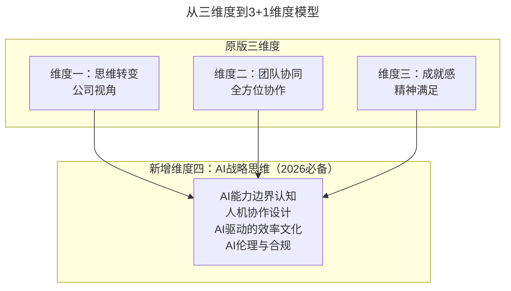
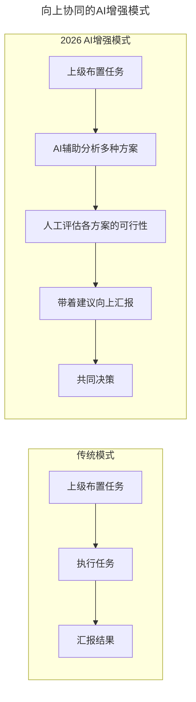

# 第168讲 | 余加林：从技术人到创业合伙人必备的三个维度的改变

> **适用范围**：正在考虑或已经参与创业的CTO、技术VP、技术高管及产品高管，尤其是从技术管理者向创业合伙人转型的技术人；同样适用于AI时代需要完成"3+1"维度升级（新增AI战略思维）的创业技术合伙人。
>
> **更新摘要（v2 · 2026-08 更新）**：
> - 结构化升级为 6 节骨架（导言 / 核心方法论 / 关键流程 / 工具与实战 / 常见误区 / 进阶延展）
> - 将原版"三个维度"升级为AI时代"3+1"维度模型（新增AI战略思维）
> - 补充AI时代各维度的具体升级路径与可执行建议
> - 保留全部Mermaid图、对比数据表与实战案例

---

## 1. 导言

从纯粹做一个码农或是一位技术管理者到选择创业，这其中角色的转变是比较大的。我将从三个方面来分享认知创业这个话题，分别是思维的转变、团队的协同、成就感的获得，内容适合于参与创业的CTO或技术VP、技术高管、产品高管等。

需要声明的是，我不鼓励创业，至少绝大部分人并不适合创业，所以请谨慎选择。

到了2026年，"从技术人到创业合伙人"的转型路径有了全新的内涵——你需要完成的不是三个维度的改变，而是**"3+1"个维度**（新增AI战略思维）。GPT-5.5多模态大模型成熟商用、DeepSeek V4开源模型性能比肩闭源方案、84%开发者日常使用AI编程工具、Agent智能体进入加速落地期——这些意味着创业合伙人必须具备AI战略思维。

上图展示了从原版三维度到AI时代"3+1"维度模型的演进：原有的思维转变、团队协同、成就感三个维度基础上，新增AI战略思维作为第四维度，涵盖AI能力边界认知、人机协作设计、AI驱动的效率文化和AI伦理与合规。

---

## 2. 核心方法论

### 2.1 维度一：思维的转变

对于创业合伙人来说，思维上的转变是指要让自己的工作立场更彻底地站在公司角度，一切以公司利益为导向，不能只想着管好自己的一亩三分地，更不能以自己的利益为上。

**对公司的思考**：当有了合伙人、联合创始人这些title时，需要考虑公司的战略、方向、财务、组织架构、人员情况等。必须理解各部门的职能、作用以及协作关系，在此基础上才可以有针对性地优化，提升效率、减少内耗。

| 思考维度 | 传统技术人视角 | 创业合伙人视角 | AI时代合伙人视角（2026） |
|---------|--------------|--------------|--------------------------|
| **战略** | 技术栈怎么选？ | 公司方向是什么？ | AI如何重塑我们的行业？我们如何利用AI建立竞争优势？ |
| **财务** | 服务器成本多少？ | 部门预算够不够？ | AI工具的ROI是多少？哪些人力成本可以被AI替代或优化？ |
| **组织** | 团队需要加人吗？ | 组织架构怎么调整？ | "人+AI Agent"的新型组织形态是怎样的？ |
| **竞争** | 对方用了什么技术？ | 对方在做什么产品？ | 对方的AI策略是什么？我们在AI应用上是否落后？ |

**对部门的思考**：作为技术部门leader时，考虑的是人不够就加人，工资给的不够就加钱。创业后需要综合考虑公司现阶段的情况，很多事情就该到你这层截止。2026年的技术合伙人，第一反应不应该是"我要招人"，而是"这个问题能不能用AI解决"。

**对产品的思考**：作为员工时，有产品开发任务就直接去做。参与创业后，为什么做这个产品，怎么做这个产品，什么时候真正需要用这个产品，甚至连市场开拓、运营推广都要去了解。AI时代还要思考：这个产品的哪些功能可以被AI增强？用户痛点有哪些是AI可以解决的？

**对利益的思考**：参与创业，是获得股份+薪资还是获得期权+薪资，具体应该怎么分配其实并无法界定。该是自己的，一定要坚持争取，千万不要碍于面子最后不了了之。在2026年，你的价值不仅取决于技术能力，还取决于AI战略能力：AI工具链搭建能力、AI系统架构能力、人机协作团队管理能力、AI驱动的业务创新能力。

### 2.2 维度二：团队的协同

**对上的协同**：技术创业者需要对所安排的工作有自己的独立思考。如果最高级决策者一意孤行，那就直接配合他尽自己的能力做好执行就好。相信我，所有创业公司的CEO都是独裁的，如果不是，过一段时间这家公司可能就不存在了。有时候退亦是进。

**对下的协同**：作为合伙人或联合创始人，公司员工对你的看法是不一样的，因为你拥有一定的话语权及影响力，所以你需要有很正的价值观。同时还需要多了解员工的情况，帮助他们解决问题，提升员工幸福感。

**对部门间的协同**：不能只管自己的一片小天地了，各部门团队需要有配合，做到真正意义上的凡事有交代，件件有着落，事事有回音。如果各部门同事都能目标一致、齐头并进，那公司的战斗力一定会提升百倍、千倍、万倍。

### 2.3 维度三：成就感的获得

创业是件很苦逼的事情，可能还没有钱拿，无法获得短期利益，而长期利益也可能遥遥无期，因此需要在精神上有所图，通过产品数据、他人认可及公司发展等来获得成就感。

比如曾做过一个商品的智能推荐，做到了千人千面，经过一段时间的优化，推荐商品的点击率得到了极大的提高，下单的转化率在排除其它影响后也提升了5%——这就会让我们特别有成就感。

### 2.4 维度四：AI战略思维（2026新增）

| 层次 | 描述 | 自评标准 |
|-----|------|---------|
| **L1：个人使用** | 自己熟练使用AI工具 | 每天工作中60%以上任务使用AI辅助 |
| **L2：团队推广** | 推动团队使用AI工具 | 团队80%以上成员日常使用AI |
| **L3：流程整合** | 将AI融入业务流程 | 核心业务流程中有明确的AI介入点 |
| **L4：战略驱动** | 用AI驱动产品和商业模式创新 | 公司的战略规划中包含AI路线图 |

---

## 3. 关键流程

### 3.1 AI时代的向上协同流程

上图对比了传统向上协同与AI增强模式：传统模式下，接受任务→执行→汇报；AI增强模式下，接受任务后先用AI辅助分析多种方案，人工评估可行性后带着建议向上汇报，形成共同决策。

实践建议：当CEO提出一个想法时，不要只说"好的"或"不行"，而是说："我让AI分析了三种可能的实现路径，这是各自的优缺点和时间预估，我建议采用方案B，原因是..."

### 3.2 部门间协同的AI消除摩擦

| 协作场景 | AI解决方案 |
|---------|-----------|
| 需求沟通 | AI辅助生成PRD初稿，减少理解偏差 |
| 进度同步 | AI自动汇总各项目状态，主动推送 |
| 问题追踪 | AI识别跨部门依赖关系，预警风险 |
| 文档共享 | AI知识库统一管理，智能检索 |

### 3.3 聚焦主营业务的人员调整流程

当公司决定聚焦主营业务，将其它不相关业务全部砍掉时：
1. 综合考虑公司利益和员工利益
2. 顾及在职员工的看法和想法
3. 作为合伙人必须果断，有魄力和决心
4. 平衡好各方利益关系

---

## 4. 工具与实战

### 4.1 本周立即行动

1. Day 1-2：用"3+1维度"框架重新审视自己的角色定位
2. Day 3-4：盘点团队的AI使用现状，找出最大的效率提升机会
3. Day 5-7：与CEO进行一次关于"AI战略"的深入对话

### 4.2 第一个月目标

- [ ] 制定个人的"AI能力提升计划"
- [ ] 为团队引入至少1个新的AI工具或工作流
- [ ] 完成一次"AI驱动的效率优化"项目

### 4.3 第一个季度目标

- [ ] 达到AI战略思维的L3层次（流程整合）
- [ ] 团队整体效率因AI提升30%以上
- [ ] 形成公司的"AI应用白皮书"（记录所有AI使用场景和效果）

### 4.4 对下协同的AI赋能实践

| 传统做法 | AI时代新增做法 |
|---------|--------------|
| 送礼物、关心生活 | 分享高效AI工具和使用技巧 |
| 带大家喝酒唱歌 | 组织AI工具培训和最佳实践分享 |
| 促膝长谈职业规划 | 帮助员工规划AI能力发展路径 |
| 肯定员工贡献 | 肯定员工的AI学习和创新尝试 |

### 4.5 实战案例：商品智能推荐

曾做过一个商品的智能推荐，做到了千人千面。经过一段时间的优化，推荐商品的点击率得到了极大的提高，下单的转化率在排除其它影响后也提升了5%。

AI时代新增的成就感来源：效率提升成就感（"用AI把推荐系统的迭代周期从2周缩短到2天"）、创新突破成就感（"AI帮我们发现了一个之前完全忽略的用户细分群体"）、赋能他人成就感（"小王在我的指导下学会了用Agent自动化测试，效率提升10倍"）、行业影响力成就感（"我们的AI驱动运营案例被行业媒体报道了"）。

---

## 5. 常见误区

### 5.1 以自己的利益为上

作为创业合伙人，不能只想着管好自己的一亩三分地，更不能以自己的利益为上。需要尽力发挥合伙人的作用，无论在工作、效率还是决策等方面都应该看得更远。

### 5.2 "我是合伙人，我的意见你必须听"

千万不要有这种想法。如果最高级决策者一意孤行，那就直接配合做好执行。所有创业公司的CEO都是独裁的——有时候退亦是进。

### 5.3 碍于面子不争取利益

该是自己的，一定要坚持争取，千万不要碍于面子最后不了了之，否则在未来的某一天，利益分配问题一定会让你头疼。

### 5.4 第一反应是"招人"而非"用AI解决"

2026年的技术合伙人，第一反应不应该是"我要招人"，而是"这个问题能不能用AI解决"。

### 5.5 过度膨胀

不要因为公司发展得不错或者融了一大笔钱就过度膨胀，这会让自己变得自大，甚至德不配位。每个人都有自己的调性，在自己的调性里做好人，做好事，要善良，要果断，要虚心。

---

## 6. 进阶延展

### 6.1 AI会让"技术合伙人"贬值吗？

核心观点：**不会贬值，但会分化。**
- 会贬值的：只会写代码、不懂业务、不会用AI的"纯技术人"
- 会升值的：懂技术、懂业务、善用AI、能带领团队的"AI增强型技术领袖"

2026年的技术创业者，请记住——**你不是在和AI竞争，你是在学习如何驾驭AI来放大你和团队的价值。学会这一点，你就是不可替代的。**

### 6.2 结语

从技术人到技术创业者，至少思考的宽度、深度都会有很大程度的提升，这不单单是一次成长，更是一次蜕变。每家公司都会经历高峰期和低谷期，不要意外，总结经验，重装上阵，一切都会慢慢变好的。如果不好，一定要有自己的主见，去思考公司的方向是否有问题，如果认可则继续跟公司一起走下去，如果不认可也要有决断，不要互相耽误。

### 6.3 作者简介与来源

余加林，TGO会员，八号空间CEO，原8天联合创始人兼CTO、副总裁，2013年底加入八天一起创业，2018年初负责8天内部孵化项目八号空间并担任CEO。从事互联网行业11年，拥有丰富的管理经验。本文基于极客时间《技术领导力实战笔记》第168讲内容，并融合2026年AI时代升级注解。
