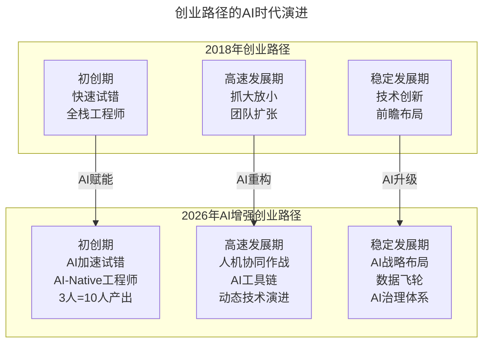
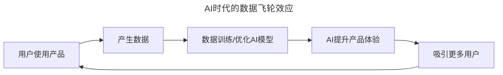
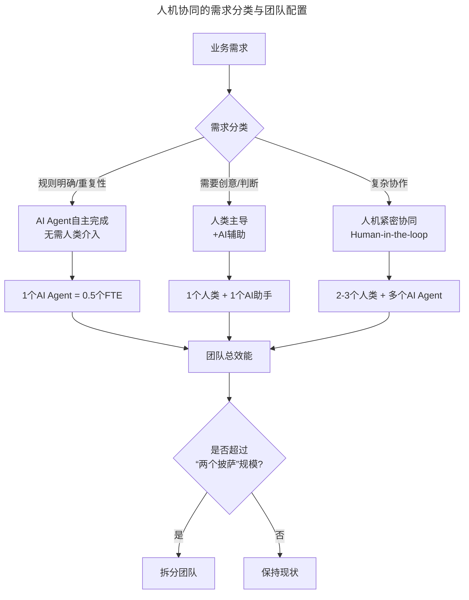

# 第10讲 | 创业公司CTO的认知升级

> **适用范围**：创业公司的CTO、联合创始人及技术负责人，尤其是经历公司从初创期到高速发展期再到稳定发展期不同阶段的技术管理者；同样适用于AI时代需要完成认知重构（从全栈工程师到AI-Native工程师、从抓大放小到人机协同作战）的创业技术领袖。
>
> **更新摘要（v2 · 2026-08 更新）**：
> - 结构化升级为 6 节骨架（导言 / 核心方法论 / 关键流程 / 工具与实战 / 常见误区 / 进阶延展）
> - 将林佳齐的三阶段成长路径与2026年AI增强创业路径整合
> - 补充AI时代"AI-Native工程师"、"AI债"、"数据飞轮"等新概念
> - 保留全部Mermaid图、数据表与三个阶段对比分析

---

## 1. 导言

在不同的行业中，以及不同公司在不同阶段，对CTO的要求是非常不一样的。同时任何一个时期，对CTO的能力要求其实都是综合的。我所在的公司是一家创业公司，我是公司的联合创始人和CTO。我想结合我在公司不同阶段的经历，谈谈我对CTO这个岗位的认识。

到了2026年，AI正在重塑每个阶段的游戏规则。DeepSeek V4让AI成本降低700倍，GPT-5.5让Agentic Coding成为标配，84%的开发者已经在使用AI工具编程——这些数字意味着：**创业公司的CTO需要一套全新的认知框架**。

上图展示了创业公司CTO成长路径从2018年到2026年的演进：初创期从全栈工程师升级为AI-Native工程师，高速发展期从抓大放小升级为人机协同作战，稳定发展期从技术创新升级为AI战略布局。

---

## 2. 核心方法论

### 2.1 初创期：快速开发、快速试错

大多数互联网创业公司一开始都是从几个人开始干起。这个阶段最重要的是如何快速开发，快速试错，通过试错不断验证自己的idea是否靠谱。而对于技术架构是否可扩展、研发流程是否规范、绩效考核等则不会过多考虑。

记得我们在开始第一个产品的时候，直接写JSP页面，不需要前后端分离，数据库则用了Schema free的文档数据库MongoDB，无它，就是追求最快迭代开发速度。

**核心认知**：创业越早期风险越高，低成本试错。

**2026年升级**：从"全栈工程师"到"AI-Native工程师"——熟练使用GPT-5.5/Cursor/Windsurf等AI编程工具，掌握Prompt Engineering，理解Agentic Workflow，具备AI伦理意识。

| 维度 | 2018年认知 | 2026年AI时代认知 |
|------|-----------|-------------------|
| **人才画像** | 全栈工程师（前后端都会） | AI-Native工程师（会指挥AI干活的工程师） |
| **团队规模** | 3-5人起步 | 2-3人即可启动（AI工具以一当十） |
| **技术选型** | 轻量级框架（MongoDB、JSP） | AI-First架构（优先考虑AI集成便利性） |
| **开发速度** | 追求最快迭代 | 追求"AI加速迭代"（Agent自动生成代码/测试/文档） |
| **成本控制** | 低成本试错 | 超低成本试错（AI降低70%+研发成本） |

### 2.2 高速发展期：抓大放小，区分主次

一旦产品通过了用户和市场验证，公司进入新的发展阶段。问题产生的速度远比你想象中快。这个阶段有三点思考非常关键：

**第一，抓大放小，区分主次。** 分析清楚当前主要矛盾和次要矛盾，重点解决主要矛盾。资源永远是有限的，次要的功能不做不会影响用户的核心流程。

亚马逊的"两个披萨原则"：如果两个披萨不足以喂饱一个项目团队，那么这个团队可能就显得太大了。2026版：一个"人+AI"混合团队不超过3-5个人类+若干AI Agent。

**第二，追根溯源，从源头解决问题。** 特斯拉的埃隆·马斯克倍受推崇的"第一性原理"思维，就是强调在基本事实的基础上探究问题的本源。

2026年新增"AI债"：过度依赖特定AI模型（模型锁定风险）、Prompt Engineering质量参差不齐（维护成本高）、AI生成代码的可解释性差（Debug困难）、数据质量问题影响AI效果（垃圾进垃圾出）。

**第三，充分放权，有效监督。** 早期小团队作战也许还能靠几个尖兵一招鲜；中后期拉开战场了，必须要依赖团队作战，依靠制度管理。2026年新增维度：AI决策权的分配（哪些AI相关决策可以下放？哪些必须CTO把控？）、AI使用的监督、AI产出的质量控制。

### 2.3 稳定发展期：技术创新与前瞻布局

经历了早期的试错和高速的发展，公司进入相对稳定的发展阶段。CTO对新技术的判断力和商业敏感度会越来越重要，CTO的视野关系着公司的未来。

前微软CTO Nathan Myhrvold所说："My job at Microsoft is to worry about technology in the future. If you want to have a great future you have to start thinking about it in the present, because when the future's here you won't have the time."

亚马逊的Vogels介绍，在过去20年间，已经有多达数千位软件工程师在亚马逊参与了机器学习项目。

**2026年升级**：CTO的新职责是成为公司的"AI战略官"。

| 职责领域 | 2018年关注点 | 2026年关注点 |
|---------|-------------|---------------|
| **技术趋势** | 云原生、微服务、容器化 | LLM Ops、Agentic AI、多模态AI、Edge AI |
| **商业敏感度** | 技术如何降本增效 | AI如何创造新收入来源、重塑商业模式 |
| **前瞻布局** | 提前1-2年布局新技术 | 提前6-12个月布局AI应用（AI迭代太快） |
| **组织能力** | 技术人才培养 | AI素养全员提升、AI文化建设 |
| **风险管理** | 技术故障、安全漏洞 | AI伦理、合规风险、模型偏见、数据隐私 |

### 2.4 AI时代的数据飞轮

上图展示了AI时代的数据飞轮：用户使用产品产生数据，数据训练和优化AI模型，AI提升产品体验，体验提升吸引更多用户，形成正循环。在AI时代，数据是新的护城河——拥有更多高质量数据的公司，其AI能力会越来越强。CTO的战略任务是设计并推动公司的"数据飞轮"运转。

---

## 3. 关键流程

### 3.1 初创期技术选型流程

1. **追求最快迭代速度**：直接写JSP页面，不需要前后端分离
2. **选择轻量级框架**：用Schema free的MongoDB，无它就是追求快
3. **不犯杀鸡用牛刀的错误**：在产品未被验证之前，过于超前地为大规模用户使用投入设计，很可能最终只能沦为摆设
4. **招人匹配性**：候选人没有创业心态、过于追求安稳就可以pass掉；全栈工程师比技术专家更能帮助团队

腾讯CTO张志东坦诚地说：如果1998年创业初期就让他做到支持500万的同时在线人数，可能就不敢创业了。当初创业时候的规划是第一年1K，第二年2K，第三年4K，第四年8K，第五年上万——而实际上第五年已经做到了500万。

### 3.2 高速发展期的需求优先级流程

1. **梳理对比**：把当前的问题、内外部需求、公司的规划进行梳理对比
2. **找出核心问题**：重点投入主要矛盾
3. **稳定性优先**：如果产品不稳定，客户是要跳起来的
4. **团队切分**：按业务或职能切分团队（两个披萨原则）
5. **事后总结制度**：参考《SRE Google运维解密》，追溯问题本质原因，建立良好的总结文化

### 3.3 人机协同的需求分类流程

上图中，业务需求按规则明确性/重复性、创意/判断需求、复杂协作三类分别匹配不同的人机协同模式，并配置对应的团队规模（AI Agent自主完成、人类+AI助手、人机紧密协同），最终以"两个披萨"规模为限决定是否拆分团队。

### 3.4 充分放权的组织设计

- 设立技术委员会、架构组等技术决策层
- 设立联席CTO——既下放了一些技术决策权，又补充了CTO可能的技术短板，同时也可以对CTO的技术决策权做一定的约束
- 参考阿里巴巴的"大中台、小前台"组织架构：前台业务更敏捷、更快速地适应市场，中台集合整个集团的运营数据能力和产品技术能力

---

## 4. 工具与实战

### 4.1 AI时代创业公司CTO的三个生存法则

**法则一：拥抱"A-First"思维，但避免"AI Washing"**
- 应该做：认真评估每个业务场景是否适合引入AI，有清晰的ROI预期
- 不应该做：为了融资或PR而强行贴AI标签
- 判断标准：这个AI项目能否在6个月内看到可量化的价值？

**法则二：投资"AI基础设施"，而非单个AI项目**
- 统一的AI开发平台（标准化AI工具链）
- Prompt Management System（提示词版本管理）
- Model Evaluation Framework（模型效果评估体系）
- AI Governance Policy（AI使用规范和合规指南）

**法则三：保持"技术清醒"，不被AI hype带偏**
- AI能做的：重复性任务、模式识别、内容生成、数据分析
- AI不能做的：真正的创新、复杂的商业判断、深度的人际关系、价值观坚守

### 4.2 2026年创业公司AI应用关键数据

- **3x** 是AI工具带来的典型生产力提升
- **70%** 成本降低是通过AI实现的（主要在编码、测试、客服环节）
- **6个月** 是创业公司从0到1推出AI产品的平均时间（vs 传统方式18个月）
- **$50K-$200K** 是创业公司每月的AI工具投入
- **最大的失败原因**：缺乏清晰的AI战略（43%的AI项目失败源于此，McKinsey 2025）

### 4.3 真实案例对比

- 2018年的创业团队：10个人，3个月做出MVP
- 2026年的AI增强创业团队：3个人 + AI工具，3周做出MVP，而且质量更好

---

## 5. 常见误区

### 5.1 杀鸡用牛刀

在产品还未被验证之前，过于超前的为大规模用户使用、超高并发和海量数据访问投入设计，很可能最终只能沦为摆设。因为产品的死亡率极高，方向也随时可能发生变化。

### 5.2 次要功能优先于稳定性

资源永远是有限的，次要的功能不做不会影响用户的核心流程，页面长得不好看也不影响用户的使用。但如果产品不稳定，那客户是要跳起来的。

### 5.3 修复完就忙于下一个需求

面对产品的故障，是每次修复完就忙于下一个需求，还是重视复盘总结问题根源？从根源上解决问题才不至于反复的疲于应付。

### 5.4 忽视技术债

技术债累积越多，后期的研发效率、问题隐患越多、维护成本越高。2026年还要警惕新增的"AI债"：过度依赖特定AI模型、Prompt质量参差不齐、AI生成代码可解释性差、数据质量问题。

### 5.5 AI Washing

为了融资或PR而强行贴AI标签。判断标准：如果去掉"AI"两个字你的产品还有价值吗？

### 5.6 过度依赖AI

过度依赖AI生成的代码可能导致后期维护困难；当所有人都在用AI时如何建立差异化也是新的挑战。

---

## 6. 进阶延展

### 6.1 AI时代的新风险清单

| 风险类型 | 具体表现 | 应对策略 |
|---------|---------|---------|
| **模型依赖风险** | 过度依赖OpenAI/DeepSeek等第三方模型 | 建立多供应商策略，考虑本地化部署 |
| **AI合规风险** | 数据隐私、算法歧视、内容审核 | 提前咨询法律专家，建立合规审查流程 |
| **人才流失风险** | AI-Native工程师被大厂高薪挖角 | 用股权激励+有挑战的AI项目留人 |
| **技术迭代风险** | AI技术每3-6个月就大变样 | 保持学习，建立技术雷达机制 |
| **成本失控风险** | API调用费用指数级增长 | 建立用量监控和成本预算机制 |

### 6.2 结语

就像电影《后会无期》中所说的："听过很多道理，却依然过不好这一生"，每个CTO的经历和挑战大不相同。在2026年："学过很多AI工具，却依然建不好AI时代的创业公司"——除非你真正内化了AI时代的认知升级。

创业公司的CTO不再只是"写代码最厉害的人"，而是**"最会用AI放大团队战斗力的人"**。你的价值不在于你自己能写多少行代码，而在于你能带领团队用AI创造出多少商业价值。

### 6.3 作者简介与来源

林佳齐，云片网络CTO，TGO鲲鹏会杭州分会会籍委员&服务委员。2010年加入淘宝，参与淘宝搜索技术的改造与优化、淘宝去IOE等项目。2012年创业，负责技术团队搭建和管理、核心产品研发和运维保障。本文基于极客时间《技术领导力实战笔记》第10讲内容，并融合2026年AI时代升级注解。
