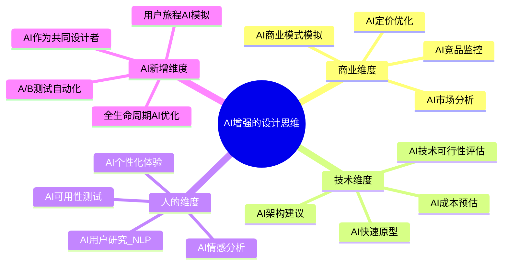
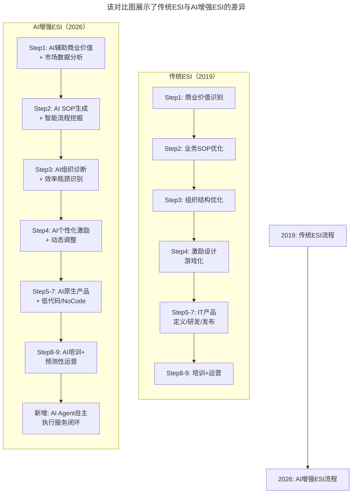
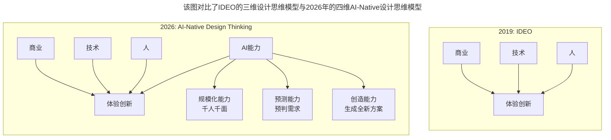

# 第195讲 | 吴晖：企业B2B服务打磨的秘诀—ESI

> **适用范围**：从事B2B企业服务创业的技术管理者、需要线上线下结合交付的服务型企业创业者、AI时代B2B服务转型实践者
>
> **更新摘要**（v2）：在保留原文ESI（Enterprise Service Iteration）方法论及三大规律（迭代认知、康威定律、设计思维）的基础上，融入2026年AI-Native B2B服务的新范式，新增AI-ESI九步法升级版、康威定律的AI时代演绎、设计思维四维模型、AI个性化激励系统等内容，将原文升级为适用于AI浪潮下的B2B服务打磨指南。

---

## 一、导言

创业公司如何打磨出一个好的B2B企业服务（B2B Enterprise Service）？这里的企业服务特指需要线上/线下结合的，面向企业客户提供的服务。

金扳手的业务是为生物制药、IDC等行业客户提供基础设施（空调、配电、锅炉等）运营服务，面临人效低、服务质量方差大、服务SOP标准不统一等实际问题。本文提出ESI（Enterprise Service Iteration，企业服务迭代）方法论，通过三大规律和九步迭代流程，实现线上线下一体化的B2B服务打磨。

**关键术语对照**：
- ESI（Enterprise Service Iteration）：企业服务迭代方法论
- SOP（Standard Operating Procedure）：标准操作手册
- 康威定律（Conway's Law）：产品的结构会拷贝组织的结构
- 设计思维（Design Thinking）：IDEO提出的商业×技术×人的体验创新框架
- AIoT（AI + IoT）：人工智能与物联网的融合技术
- Process Mining：流程挖掘，从系统日志自动还原业务流程
- MVP（Minimum Viable Product）：最小可行产品

---

## 二、核心方法论

ESI方法论基于三大规律构建，在AI时代这三大规律不仅依然成立，而且获得了强大的技术赋能。

### 2.1 规律一：通过迭代获取认知的过程

产品研发的迭代过程，是一个通过不断重复打磨，在实践中获得正确、完整认知的过程。早期搭建的MVP是一个最小可行产品，其作用是验证某个特定客户集合所感知的价值。只有通过不断的MVP迭代，每次迭代改进一些功能，提供更多的客户价值，最终才能构建一个客户认可的产品。

**AI时代的加速**：AI不是省略迭代，而是压缩每次迭代的周期。传统ESI每轮迭代4周×10轮=40周（约10个月）；AI-ESI每轮迭代1周×20轮=20周（约5个月），且能尝试更多组合。

### 2.2 规律二：康威定律

> 产品的结构会拷贝组织的结构。（Any organization that designs a system will produce a design whose structure is a copy of the organization's communication structure）

在打造企业服务的IT产品系统过程中，必须思考企业内部组织的结构。只有IT产品系统结构和企业组织结构相适配的情况下，IT系统才能充分发挥作用。如果结构不一致，将导致内部工作的混乱。

**AI时代的新演绎**：
1. AI系统架构 ≈ 组织的数据流架构：部门间数据不共享→AI模型也无法跨部门协同
2. AI Agent的边界 = 组织的权责边界：每个AI Agent对应一个清晰的组织职能
3. AI决策逻辑 ≈ 组织的业务规则：AI的推荐/判断逻辑应与组织业务规则一致
4. 反向康威定律：AI系统的设计正在反向影响组织结构

**康威定律2026版**：
> "软件系统的结构 ≈ 人类组织的结构 + AI Agent编排的结构"

### 2.3 规律三：设计思维

IDEO合伙人汤姆·凯利（Tom Kelley）所倡导的设计思维强调商业、技术和人的结合产生的体验创新：
- 商业+技术 = 流程创新（如派单改抢单）
- 技术+人 = 功能创新（如共享单车）
- 商业+人 = 情感创新（如在线音乐）
- 商业+技术+人 = 体验创新

**AI时代升级为四维模型**：AI成为第四个基础维度，带来三个新能力——规模化（千人千面）、预测（预判需求）、创造（生成全新方案）。

**图表说明**：该思维导图展示了AI增强的设计思维四维模型。在传统的商业、技术、人三个维度基础上，AI作为新增的第四维度，为每个原有维度提供赋能，同时带来全新的设计能力。

---

## 三、关键流程

### 3.1 ESI九步迭代流程

ESI建立了端到端的企业B2B服务打磨流程，包括九个步骤：

**步骤一：商业价值**——明确需要提升的商业价值，且必须可以用数字衡量。以基础设施巡检为例，一次巡检需巡视50个点，每点平均耗时3分钟，抄写3个设备参数，检查是否漏水/异响等。纯线下巡检对巡检质量及是否按时巡检很难考核。

**步骤二：业务SOP优化**——制定新的SOP，添加App巡检的操作要求，定义结果指标（如巡检质量）和过程指标（如巡检时间方差）。

**步骤三：组织结构优化**——根据SOP需要新增角色（如巡检质量分析员），调整现有岗位职责。

**步骤四：激励（游戏化）**——对每位员工每月的巡检工作进行打分，赋予相应的金币，做排名，金币可转化为红包。

**步骤五：IT产品定义**——收集SOP、组织结构及激励需求，完成产品功能需求及页面设计。

**步骤六：IT产品研发**——研发工程师根据IT产品定义完成研发工作。

**步骤七：IT产品发布**——发布对应的App及小程序。

**步骤八：培训**——培训内容不仅包括如何使用IT产品，还包括新的SOP，以及如何赚取打赏等。

**步骤九：运营**——每天/每周从IT系统中抽取相关的过程指标和结果指标，通过数据分析提出优化需求。

### 3.2 AI-ESI流程升级对比

**图表说明**：该对比图展示了传统ESI与AI增强ESI的差异。AI-ESI在每一步都引入AI能力，从人工分析到AI智能分析、从统一规则到个性化、从事后运营到预测性运营，并新增了AI Agent自主执行服务闭环这一全新环节。

### 3.3 各环节的AI增强对比

| ESI步骤 | 原文做法（2019） | AI增强（2026） |
|--------|-----------------|---------------|
| Step1: 商业价值 | 人工识别巡检质量问题 | AI分析历史工单/投诉，量化质量成本损失 |
| Step2: 业务SOP | 人工编写SOP文档 | AI从视频/专家操作中自动提取SOP步骤 |
| Step3: 组织结构 | 新增"巡检质量分析员"角色 | 该角色可由AI Agent部分替代 |
| Step4: 激励 | 积分/金币/排名游戏化 | AI个性化激励（根据员工偏好动态调整） |
| Step5: IT产品定义 | 产品经理手写PRD | AI辅助需求分析+自动生成原型 |
| Step6: IT产品研发 | 传统开发周期 | 低代码平台+AI代码生成，开发时间↓70% |
| Step7: IT产品发布 | App/小程序发布 | + AI灰度发布+自动回滚能力 |
| Step8: 培训 | 产品经理培训使用方法 | AI交互式培训（边用边学）+ 智能助手 |
| Step9: 运营 | 每日/每周抽取指标分析 | AI实时监控+异常自动告警+根因分析 |

---

## 四、工具与实践

### 4.1 2026版AI智能巡检

原文案例中，一次巡检50个点、每点3分钟、抄写3个参数、检查漏水异响。2026年AIoT让整个流程实现质的飞跃：

| 维度 | 原文方案（2019） | 2026 AIoT智能巡检 |
|------|-----------------|-------------------|
| 到达检测 | 手动签到 | GPS/蓝牙信标自动签到+人脸识别 |
| 数据采集 | 手动填写App | IoT传感器自动读取+AI视觉检测+音频AI分析 |
| 时间效率 | 每点3分钟，50点150分钟 | 每点30秒，50点25分钟（效率提升6倍） |
| 质量保障 | 事后人工审核 | AI实时异常检测+行为分析+数据自动校验 |
| 智能增值 | 无 | 预测性维护+巡检路线AI优化+实时知识推送 |

### 4.2 ESI vs AI-ESI 对比总览

| 维度 | 原版 ESI (2019) | AI-ESI (2026) | 提升幅度 |
|------|----------------|---------------|---------|
| 迭代周期 | 4-8周/轮 | 1-2周/轮 | 4x faster |
| 商业价值识别 | 人工分析 + Excel | AI数据分析 + 预测模型 | 10x faster |
| SOP优化 | 专家经验驱动 | AI流程挖掘 + 自动优化 | 5x more effective |
| IT产品定义 | 产品经理手工PRD | AI生成 + 用户反馈闭环 | 3x faster |
| IT产品研发 | 纯手工编码 | AI生成80%+代码 | 4-5x faster |
| 培训成本 | 线下集中培训 | AI个性化学习路径 | 80% cost reduction |
| 运营监控 | 人工看报表 | AI实时异常检测 + 预测 | Real-time |
| 员工激励 | 游戏化积分 | AI个性化激励 + 即时反馈 | 3x engagement |

### 4.3 AI个性化激励系统

原文采用积分/金币/排名的统一游戏化激励。2026年升级为AI个性化激励：

**第一步：AI员工画像**——分析每位员工的行为数据，识别激励敏感类型：成就型（追求排名和认可）、经济型（关心实际收益）、社交型（看重团队合作）、成长型（重视技能提升）、挑战型（喜欢有难度的目标）

**第二步：动态激励策略**——针对不同类型调整激励方式：成就型→公开表扬+排名展示+徽章；经济型→更直接的现金奖励；社交型→团队协作加分；成长型→培训课程积分奖励；挑战型→阶梯式挑战目标

**第三步：实时反馈与调整**——AI实时追踪激励效果，动态调整策略（A/B测试），防止"激励疲劳"，预测员工流失风险并提前干预

**预期效果**：员工满意度提升25-40%，留存率提升15-20%，人效提升10-18%，激励ROI提升35-50%

### 4.4 关键数据参考（2026）

| 指标 | 数据 | 来源 |
|------|------|------|
| B2B企业采用AIoT解决方案的比例 | 38% | IDC IoT Survey 2026 |
| AI增强的现场服务质量提升 | 30-50% | ServiceMax Field Service Report |
| AI预测性维护的平均ROI | 280% | McKinsey Manufacturing AI Study |
| 采用游戏化+AI激励的一线员工留存率提升 | 22% | Gartner HR Tech Survey |
| B2B服务企业的AI投资回报周期 | 平均14个月 | Forrester B2B Service Automation Report |

### 4.5 2026年B2B服务创业的AI Checklist

**Phase 0：AI-Ready Foundation（第1个月）**
- [ ] 选择AI-native技术栈：不要用legacy系统，直接上云原生+AI服务
- [ ] 建立数据飞轮意识：从第一天就设计好数据采集方案
- [ ] 组建"AI Translator"团队：既懂业务又懂AI的复合型人才

**Phase 1：AI-Powered MVP（第2-3个月）**
- [ ] 用AI加速MVP开发：目标1个月内出可用原型
- [ ] 内置AI Analytics：每个用户行为都记录
- [ ] AI客服先行：即使产品不完美，先用AI Chatbot服务早期客户

**Phase 2：AI-Augmented Operations（第4-6个月）**
- [ ] 部署AI运营Agent：自动化数据监控、异常检测、报告生成
- [ ] 建立AI反馈闭环：客户反馈→AI分析→产品优化→客户验证
- [ ] 启动AI培训体系：为客户和员工提供AI驱动的学习资源

**Phase 3：AI-Native Scaling（第7-12个月）**
- [ ] 构建AI能力中台：将验证过的AI能力产品化
- [ ] 探索AI自治系统：在低风险场景试点Self-healing、Auto-scaling
- [ ] 建立AI Governance：数据隐私、算法公平性、人机协同伦理

---

## 五、常见误区

### 陷阱一：一上来就想做大而全的AI系统

**错误做法**：很多企业失败的原因是一上来就想做大而全的AI系统。

**正确做法**：原文的宝贵经验——"第一次迭代可以没有IT产品"——在AI时代更加重要。从小处开始、快速验证、逐步扩展才是正道。在第一次迭代中，根据业务的需要可以不实施步骤五到步骤七，通过线下+Excel等方式先打磨出一个企业服务的雏形。

### 陷阱二：过度自动化导致的服务冷漠感

**错误做法**：用AI完全替代人工客服，客户感觉不被重视。

**正确做法**：Augment，not Replace（增强而非替代）。AI处理标准化问题，复杂情感问题转人工。

**黄金法则**：客户能感知到你用了AI，但感觉更好（更快、更准、更贴心）。

### 陷阱三：忽视一线员工的AI素养

**错误做法**：只关注管理层的AI dashboard，忘了培训一线工人。

**正确做法**：一线员工是AI落地的最后一公里。如果他们不会用、不愿用，一切归零。把AI做成"隐形助手"，而不是"额外负担"。最好的AI是无感的AI。

### 陷阱四：数据孤岛2.0

**错误做法**：各部门各自采购AI工具，数据不通、模型不共享。

**正确做法**：统一AI Platform，一次建设、多处复用。统一平台初期投入大，但长期TCO（Total Cost of Ownership，总拥有成本）降低60%+。

### 陷阱五：低估变革管理的难度

**错误做法**：以为有了AI就能自动改变人的行为。

**正确做法**：AI是放大器，不是魔法棒。组织文化、激励机制、领导力依然是根本。

**公式**：AI成功落地 = 技术能力 × 组织准备度 × 变革管理质量

---

## 六、进阶延展

### 6.1 AI-Native的B2B服务新模式

2026年最成熟的新型创新类型是AI原生体验创新（商业+技术+人+AI）：

| 阶段 | 传统B2B服务模式 | AI-Native B2B服务模式 |
|------|----------------|----------------------|
| 预测阶段 | 客户报修（被动响应） | IoT传感器持续监测+AI预测故障（提前72小时预警） |
| 执行阶段 | 人工维修 | AI规划最优路线+AR眼镜指导+AI实时解答 |
| 优化阶段 | 人工总结 | AI分析每次服务效率和质量+自动识别最佳实践 |
| 商业模式 | 按次收费 | 按正常运行时间收费（设备不出问题=服务商赚更多） |

**核心特征**：从被动响应到主动预测、从人工密集到人机协作、从标准化服务到超个性化、从交易关系到共生关系。

### 6.2 2026年B2B服务的关键成功指标

| 类别 | 指标 | 定义 | 目标值 |
|------|------|------|--------|
| AI利用率 | AI Task Automation Rate | 由AI自动处理的任务占比 | >60% |
| 人效提升 | Per-Capita Output Growth | 人均产出同比增速 | >50% yoy |
| 响应速度 | Mean Time to Response | 从问题发生到响应的时间 | <5分钟（AI实时） |
| 预测准确率 | Prediction Accuracy | AI预测vs实际的吻合度 | >85% |
| 客户满意度 | NPS + Sentiment Score | 净推荐值+AI情感分析 | NPS > 50 |
| 员工满意度 | eNPS + Engagement Score | 员工净推荐值+参与度 | eNPS > 30 |
| 创新速度 | Time-to-Innovation | 从想法到上线的时间 | <2周 |

### 6.3 设计思维三维到四维的演进

**图表说明**：该图对比了IDEO的三维设计思维模型与2026年的四维AI-Native设计思维模型。AI不仅是工具，而是第四个基础维度，带来规模化、预测和创造三个新能力。

### 6.4 延伸阅读与资源

**必读（2025-2026）**：
1. 《AI-Native Organizations》by Ethan Mollick——如何打造AI原生组织
2. McKinsey: The Economic Potential of Generative AI (2024 Update)——生成式AI的经济潜力
3. Harvard Business Review: How to Build an AI-First Company (2025)——AI-first公司的构建方法

**工具推荐**：
- Process Mining：Celonis, UiPath, Microsoft Process Advisor
- AI Analytics：Julius AI, Hex, Noteable
- Low-code/No-code AI：Bubble + OpenAI plugin, Retool AI
- Customer Service AI：Intercom Fin, Zendesk AI, Drift

### 6.5 ESI的AI时代宣言

> B2B服务的本质没变——为客户创造价值。
>
> 但创造价值的方式，正在从"堆人头"进化为"用AI放大每个人的能力"。
>
> ESI教我们的不是一套固定流程，而是一种持续进化的思维方式：观察数据→发现规律→设计方案→快速验证→迭代优化。
>
> 在AI时代，这个循环的速度提升了10倍，但循环本身——永远不会停止。因为最好的服务，是永远在下一次迭代中变得更好的服务。

**最后提醒**：AI是强大的工具，但不能替代对客户的真诚关怀和对一线员工的理解尊重。技术可以让服务更高效，但只有人心才能让服务有温度。做有人情味的AI-Native B2B服务——这才是最高的境界。

---

*本文基于极客时间《技术领导力实战笔记》第195讲原文升级，融入2026年AI-Native B2B服务新范式，旨在帮助B2B服务创业者在AI时代打造更高效、更有温度的企业服务。*