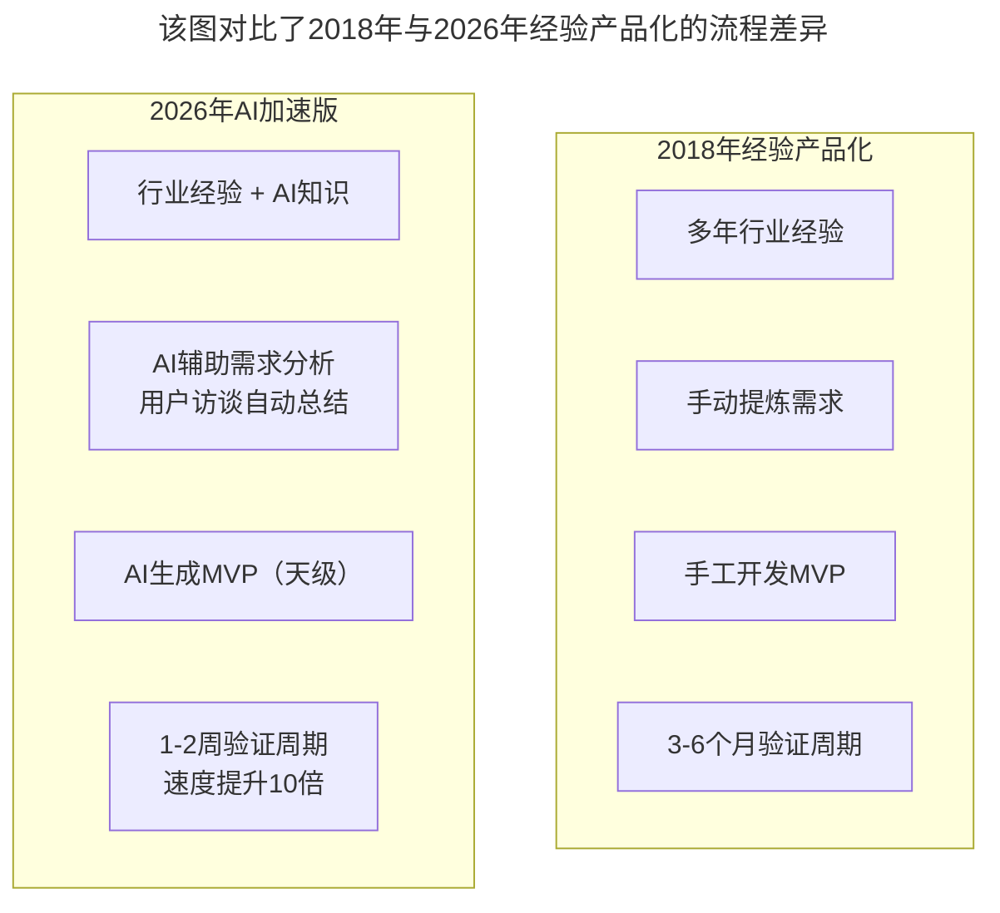
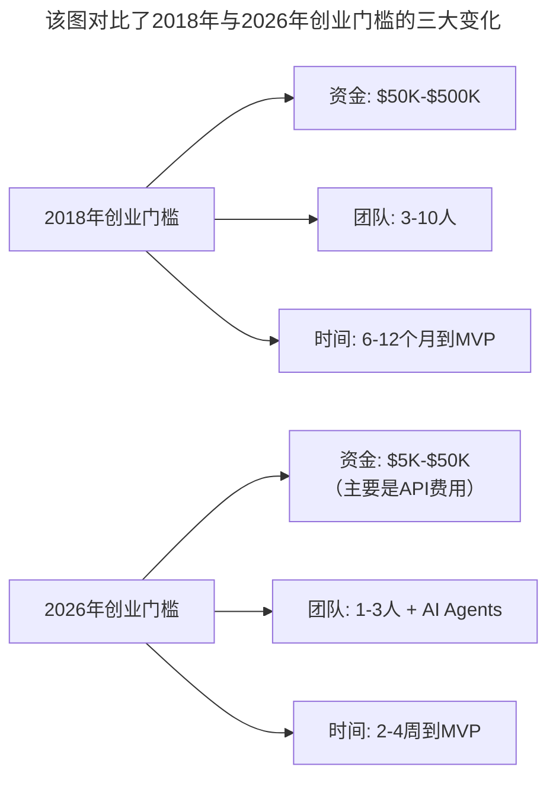
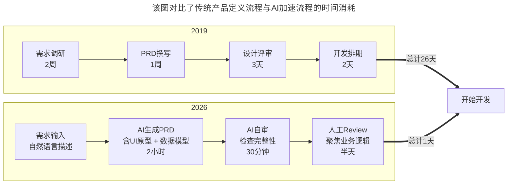

# 大咖对话 | 创业就是把自己过去的经验快速的产品化

> **适用范围**：从专业领域转型创业的技术人、设计师及行业专家，特别是AI时代考虑"经验产品化"的独立开发者和小团队创业者
>
> **更新摘要**（v2）：在保留原文范凌（特赞CEO）核心观点（经验产品化、快速学习、复杂问题简化）的基础上，融入2026年AI加速创业的新现实，新增AI时代创业启动清单、新创业能力模型、创业门槛变化对比等内容，将原文升级为适用于AI浪潮下的经验产品化指南。

---

## 一、导言

本文整理自极客时间大咖对话，嘉宾范凌是特赞创始人及CEO、同济大学设计人工智能实验室主任及教授。他分享了从设计师转型创业者的心路历程，以及技术创业者最需要具备的核心能力。

范凌在2015年决定创业时已经35岁，当时在加州大学伯克利分校做访问学者，之前在中央美院教书，也在Princeton、Harvard等学校做过研究。他的核心观点是：**创业就是把自己过去的经验快速的产品化**。

**关键术语对照**：
- 经验产品化（Experience Productization）：将积累的行业认知和经验转化为可交付产品的过程
- MVP（Minimum Viable Product）：最小可行产品
- Prompt Engineering：提示词工程，与AI协作的基础技能
- Bootstrapping：自举创业，不依赖外部融资
- AI Agent：AI智能体，能自主完成多步任务的AI系统

---

## 二、核心方法论

### 2.1 经验产品化

在设计领域积累了十几年的经验，范凌知道设计师的痛点是什么，知道客户的需求是什么，知道中间的流程哪里可以优化。所以做的产品，其实就是把过去十几年对行业的理解，快速地变成一个产品。

**AI时代的升级**：

**图表说明**：该图对比了2018年与2026年经验产品化的流程差异。AI将验证周期从3-6个月缩短到1-2周，速度提升10倍，但核心仍是"行业经验"——AI是加速器，不是替代品。

**关键数据（2026）**：
- AI辅助下，MVP开发时间从3个月缩短到1-2周
- 创业公司用AI完成产品原型的比例达到78%
- 60%的独立开发者通过AI工具实现了"一人公司"模式

### 2.2 快速学习的能力

技术变化太快，你不可能什么都懂，但你需要能够快速理解新技术，判断它对你的业务有没有价值。比如AI这么火，你不需要成为AI专家，但你需要知道AI能做什么、不能做什么，以及如何应用到你的业务中。

**2026年的"快速学习"新内涵**：

| 维度 | 传统快速学习 | 2026新增 |
|------|------------|---------|
| 学习方式 | 阅读文档和论文 | + AI辅助学习（让AI解释复杂概念） |
| 核心技能 | 参加培训课程 | + Prompt Engineering（学会问AI正确的问题） |
| 实践方法 | 项目实践经验 | + AI工具链整合能力（快速评估和采用新工具） |
| 判断力 | 技术评估 | + 判断AI能力的边界（知道什么AI能做/不能做） |

### 2.3 把复杂问题简化的能力

很多技术人员喜欢把事情搞得很复杂，但作为创业者，你需要能够把复杂的技术问题简化成用户能理解的方案。用户不关心你的技术有多牛，他们只关心你的产品能不能解决他们的问题。

**AI让简化更容易**：

| 维度 | 2018年 | 2026年 |
|------|--------|--------|
| 需求分析 | 手动整理 | AI自动提取关键点 |
| 原型制作 | 数天到数周 | AI生成（小时级） |
| 技术文档 | 手动编写 | AI自动生成 |
| 用户测试 | 组织真实用户 | AI模拟用户反馈 |

### 2.4 三句创业建议

1. **找到你真正熟悉的领域**：不要因为某个技术很火就去创业，而是要在一个你有深厚积累的领域里寻找机会。因为你对这个领域的理解，是你最大的竞争优势。

2. **从小处着手，快速验证**：不要一上来就想做一个大平台，先解决一个小问题，验证你的假设，然后再逐步扩展。特赞一开始只是帮企业找设计师的一个工具，后来才慢慢发展成现在的平台。

3. **保持耐心，但也保持敏感**：创业是一场马拉松，不是百米冲刺。你需要有耐心去坚持，但也需要对市场变化保持敏感，及时调整方向。

---

## 三、关键流程

### 3.1 AI时代创业启动清单（2026版）

**Week 1: 验证想法**
- 用AI调研市场（分析竞品、用户评价）
- 用AI生成用户画像
- 做10个用户访谈，AI辅助整理洞察

**Week 2: 构建MVP**
- 用自然语言描述产品需求
- AI生成完整原型（UI + 后端）
- 部署到Serverless平台（成本几乎为零）

**Week 3-4: 测试迭代**
- 找到前100个种子用户
- 收集反馈，AI分析共性需求
- 快速迭代（每天一个版本）

**Month 2+: 规模化**
- 引入AI Agent自动化运营
- 用AI优化转化漏斗
- 决定是否需要融资或继续bootstrapping

### 3.2 创业门槛的变化

**图表说明**：该图对比了2018年与2026年创业门槛的三大变化。资金降低90%，团队从3-10人缩减到1-3人+AI Agents，MVP周期从6-12个月缩短到2-4周，使得"一人公司"模式成为可能。

---

## 四、工具与实践

### 4.1 新的创业能力模型

**必选能力**：
1. 问题识别能力（比解决方案更重要）
2. Prompt Engineering（与AI协作的基础）
3. 快速验证思维（数据驱动决策）
4. 成本意识（API调用费用控制）

**加分能力**：
5. AI Agent设计（自动化业务流程）
6. 数据策略（训练数据的获取和使用）
7. 个人品牌建设（在AI时代建立差异化）

### 4.2 AI加速下的研发效率数据

2026年的研发效率数据（行业经验估算，供参考）：

| 任务类型 | 人工耗时 | AI辅助耗时 | 效率提升 |
|---------|---------|-----------|---------|
| 新功能开发 | 5天 | 1-1.5天 | 3-5x |
| Bug修复 | 2小时 | 20分钟 | 6x |
| 代码重构 | 3天 | 0.5天 | 6x |
| 单元测试编写 | 1天 | 1小时 | 8x |
| 文档撰写 | 0.5天 | 10分钟 | 24x |

### 4.3 AI辅助产品定义流程

**图表说明**：该图对比了传统产品定义流程与AI加速流程的时间消耗。传统流程从需求调研到开发排期需26天，AI加速流程仅需1天，且AI生成的PRD包含UI原型和数据模型。

**实际工具（2026）**：
- Cursor / GitHub Copilot Workspace：从需求描述直接生成代码框架
- v0.dev / Galileo AI：从文字描述生成UI界面
- Notion AI / Claude：快速生成PRD文档

---

## 五、常见误区

### 陷阱一：因为技术火就盲目创业

**原文警告**：不要因为某个技术很火就去创业，而是要在一个你有深厚积累的领域里寻找机会。

**AI时代的表现**：看到AI火就做AI产品，但自己没有行业积累，做出来的产品没有差异化。

**规避方法**：找到你真正熟悉的领域，AI是通用工具，但行业know-how依然是稀缺资源。最好的创业方向是"你最懂的领域×AI赋能"。

### 陷阱二：一上来就做大平台

**原文警告**：不要一上来就想做一个大平台，先解决一个小问题。

**AI时代的表现**：因为AI让开发变容易了，就想做一个大而全的产品。

**规避方法**：从小处着手，快速验证。特赞一开始只是帮企业找设计师的一个工具，后来才慢慢发展成平台。AI时代更要"从更小处着手，更快验证——AI让试错成本趋近于零"。

### 陷阱三：只追新技术不重业务理解

**原文警告**：用户不关心你的技术有多牛，他们只关心你的产品能不能解决他们的问题。

**AI时代的表现**：沉迷于选择最好的AI模型、最新的框架，忽视用户真实需求。

**规避方法**：把复杂的技术问题简化成用户能理解的方案。AI帮你学得更快，但方向还得你自己选。

### 陷阱四：忽视成本控制

**AI时代特有的陷阱**：API调用费用可能失控，尤其是产品用户量增长后。

**规避方法**：建立成本意识，监控API调用费用，设计缓存和批处理机制，根据任务复杂度选择不同成本的模型。

---

## 六、进阶延展

### 6.1 核心理念的AI时代升级

> 2018: 创业 = 把多年经验变成产品
> **2026: 创业 = 把经验 + AI能力快速变成产品（速度快10倍，成本低10倍）**

> 2018: 最重要的是快速学习能力
> **2026: 最重要的是"AI协作能力 + 问题洞察力"的组合——AI帮你学得更快，但方向还得你自己选**

> 2018: 从小处着手，快速验证
> **2026: 从更小处着手，更快验证——AI让试错成本趋近于零**

### 6.2 AI时代最大的机遇

- **一人公司时代到来**——借助AI，个人创业者可以做以前需要一个团队才能做的事
- **垂直领域专家的价值放大**——AI是通用工具，但行业know-how依然是稀缺资源
- **产品化速度革命**——从想法到产品的周期从月缩短到周

### 6.3 相关阅读建议

- 《技术创业该如何选择赛道》——赛道选择方法论
- 《技术人创业前要问自己的六个问题》——创业前自评框架
- 《大咖对话-张建锋：创业可以快而大，也可以小而美》——创业路径选择

---

*本文基于极客时间大咖对话原文升级，融入2026年AI创业生态和独立开发者趋势更新。参考：Indie Hackers 2026 Report、MicroConf Survey 2026。*