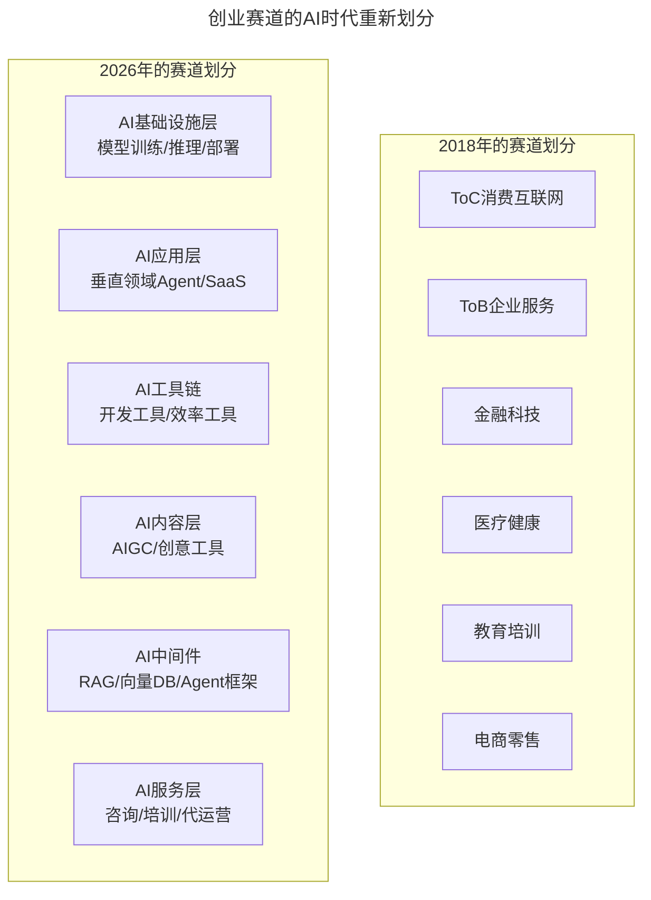
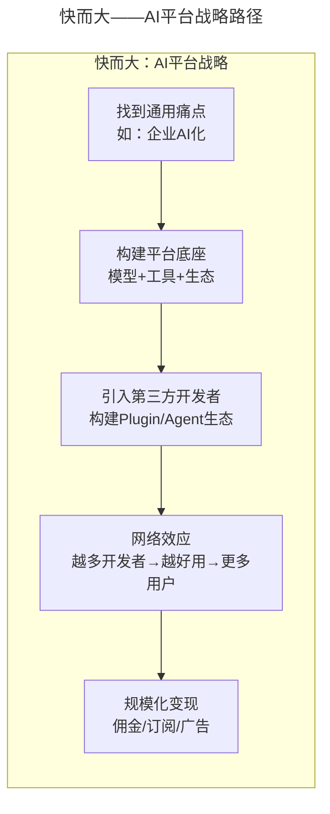
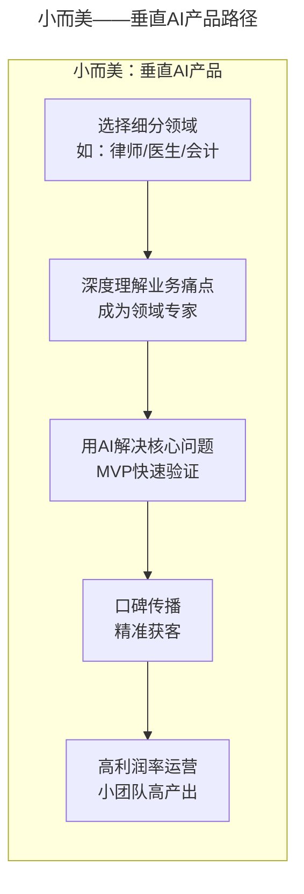
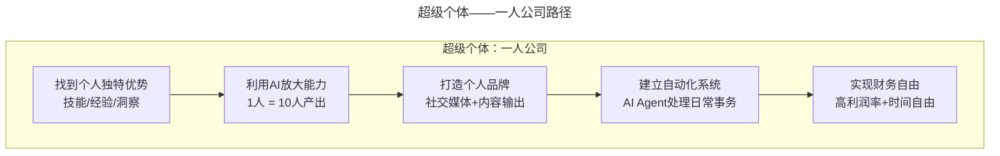

# 大咖对话 | 张建锋：创业可以快而大，也可以小而美

> **适用范围**：B端技术创业公司创始人、中间件/基础软件领域创业者，以及面临"快而大"还是"小而美"路径选择的技术创业者；同样适用于AI时代探索"超级个体"（一人公司）新模式的技术人。
>
> **更新摘要（v2 · 2026-08 更新）**：
> - 结构化升级为 6 节骨架（导言 / 核心方法论 / 关键流程 / 工具与实战 / 常见误区 / 进阶延展）
> - 将张建锋"快而大 vs 小而美"框架与2026年AI时代新增的"超级个体"路径整合
> - 补充AI创业成本革命数据与三种路径的财务模型对比
> - 保留全部Mermaid图、数据表与AI创业赛道分级

---

## 1. 导言

本周作客大咖对话的嘉宾是永源中间件共同创始人张建锋，原红帽公司JBoss应用服务器核心开发组成员，曾供职于金山软件、IONA科技公司，在分布式计算、企业应用设计、移动行业应用、DevOps等技术领域有丰富的实战经验。

张建锋在2018年的对话中提出了务实的创业观点：**快而大不错，小而美也很好**。到了2026年，这句话有了全新的可能性——AI让"小而美"不再是无奈的选择，而是最明智的策略，甚至诞生了"超级个体"（1人公司=以前10人公司的产出）的新选项。

上图展示了创业赛道从2018年到2026年的重新划分：传统的ToC/ToB/金融/医疗/教育/电商分类被AI基础设施层、AI应用层、AI工具链、AI内容层、AI中间件、AI服务层六层新分类取代。

---

## 2. 核心方法论

### 2.1 保证健康的现金流

很重要的一点就是要保证健康的现金流。互联网行业把融资看得太重了，好像没有融资就不会成功一样。我个人认为，可以把融资当作锦上添花，它能够帮助我们更快速地发展，但也需要考虑到没有融资的情况下，公司如何能够存活并健康发展。

一家创业公司最终能否成功，很大程度取决于它的商业模式是否成熟。能够将商业模式理顺，提供具有竞争力的产品和服务，同时保证健康的现金流量，这样无论处于什么样的经济环境，创业公司都可以存活，甚至稳步向前发展。

### 2.2 B端技术创业：耐着性子打磨技术

作为B端的技术创业公司，一定要耐着性子打磨技术，先打磨出一些领先性或具有独特竞争力的产品和服务。这可能跟C端的、面向用户的创业不太一样。

以永源中间件为例：在中间件这个领域有着多年的积累和领悟，能在此基础上打造出行业领先的产品。同时，相对国外的软件公司，对国内市场有更深的理解，能够按照国内市场的技术产品需求做出针对性的改进。软件本身没有国界，但对于客户来说，不同国家、不同地区都有着不同的需求。

### 2.3 创业不是只有一条路

目前很多媒体或投资者的口径是，好像创业只有一条路，就是一定要瞄准上市目标，追求公司快速发展，争做行业第一，争做独角兽。但其实创业并非只有这一条路——快而大不错，小而美也很好。你可以选择一个自己喜欢的技术方向切入，做到能在行业立足的规模。

2026年的新选项：
- 快而大 = AI平台型产品（如千问Skill市场、GPT Store）
- 小而美 = 垂直领域AI工具（3人团队=传统10人产出）
- 新选项：超级个体（1人公司=以前10人公司的产出）

### 2.4 技术人创业的两条路

技术人创业要么将注意力主要集中于技术，找一位非常合适的合伙人来承担技术之外的事情；要么自己走出舒适圈，既把控技术方向，又学着去管理团队、运营公司。技术很重要，但不是最重要，商业部分也很重要。

---

## 3. 关键流程

### 3.1 "快而大"路径：平台型AI产品

上图展示了"快而大"的AI平台战略路径：从找到通用痛点→构建平台底座→引入第三方开发者→形成网络效应→规模化变现。案例参考：千问Skill市场、GPT Store、Coze/扣子、Dify。关键成功因素：强大的技术基础、清晰的生态策略、足够的资金储备、先发优势或差异化定位。适合人群：有大厂背景的技术创业者、有丰富行业资源的连续创业者、能获得大额融资的团队。

### 3.2 "小而美"路径：垂直领域AI工具

上图展示了"小而美"的垂直AI产品路径：从选择细分领域→深度理解业务痛点→用AI解决核心问题→口碑传播→高利润率运营。案例参考：Harvey AI（法律AI助手，2025年估值已达50亿美元级）、Jasper（AI营销文案工具，2022年估值曾达17亿美元）、Copy.ai（AI写作工具，ARR达千万美元级）。关键成功因素：对目标领域的深刻理解、极致的产品体验、精准的用户获取、高客户终身价值（LTV）。适合人群：有特定行业经验的从业者、追求工作生活平衡的独立开发者。

### 3.3 "超级个体"路径：一人公司

上图展示了"超级个体"的一人公司路径：从找到个人独特优势→利用AI放大能力→打造个人品牌→建立自动化系统→实现财务自由。关键成功因素：极强的个人能力和品牌、熟练使用AI工具链、自动化的业务流程、清晰的价值主张和定价。

---

## 4. 工具与实战

### 4.1 AI创业成本革命

| 维度 | 传统模式（2018） | AI-Native模式（2026） | 变化 |
|------|-----------------|---------------------|------|
| 团队规模 | 10-15人 | 2-4人 | 70-80%↓ |
| 月固定成本 | ¥100-200万 | ¥17-38万 | 70-85%↓ |
| 启动资金 | ¥500-2000万 | ¥50-150万（甚至可自筹） | 70-85%↓ |
| 上市时间 | 6-12个月 | 1-3个月 | 3-5x↑ |

### 4.2 2026年成功的"超小型"AI创业公司

| 公司 | 团队规模 | 产品 | 月收入 | 启动资金 | 成立时间 |
|-----|---------|------|-------|---------|---------|
| LegalAI | 2人 | 法律合同审查Agent | $80K | $10K | 2025.03 |
| CodeReviewBot | 1人 | AI代码审查工具 | $25K | $5K | 2025.06 |
| DataPilot | 3人 | 数据分析助手 | $120K | $30K | 2024.11 |
| ResuMe-AI | 2人 | AI简历优化器 | $45K | $8K | 2025.01 |
| MedScribe | 4人 | 医疗病历生成Agent | $200K | $50K | 2024.08 |

> 注：上表为示意性案例（公司为化名合成），用于展示超小型AI创业公司的规模量级，非特定真实公司。

关键发现：平均团队规模2.4人，平均月收入$94K，平均启动资金$20.6K，平均盈利时间2.3个月，利润率平均85%。

### 4.3 AI创业赛道分级

**Tier 1：低门槛、高确定性（适合个人/小团队）**

| 方向 | 目标用户 | 核心价值 | 预期月收入 | 难度 |
|-----|---------|---------|-----------|------|
| 垂直领域写作助手 | 专业人士 | 效率提升10x | $10K-50K | ⭐⭐ |
| 智能客服机器人 | 中小企业 | 成本降低80% | $20K-100K | ⭐⭐ |
| 数据分析自动化 | 业务人员 | 从天到分钟 | $15K-60K | ⭐⭐⭐ |
| 代码审查/生成工具 | 开发者 | 质量提升+效率翻倍 | $20K-80K | ⭐⭐⭐ |
| 文档/报告自动生成 | 知识工作者 | 节省90%时间 | $10K-40K | ⭐⭐ |

**Tier 2：中等门槛、高天花板（适合小团队）**

| 方向 | 目标用户 | 核心价值 | 预期月收入 | 难度 |
|-----|---------|---------|-----------|------|
| 行业专用Agent | 垂直行业 | 解决复杂专业问题 | $50K-500K | ⭐⭐⭐⭐ |
| 企业AI工作流平台 | 中大型企业 | 流程自动化 | $100K-1000K | ⭐⭐⭐⭐ |
| AI教育/培训平台 | 企业/个人 | 技能提升 | $30K-200K | ⭐⭐⭐ |
| AI安全/合规工具 | 企业/G端 | 风险管控 | $50K-300K | ⭐⭐⭐⭐ |

### 4.4 三种路径财务模型对比

| 路径 | 团队规模 | 月固定成本 | 盈亏平衡点 | 24月累计利润 |
|------|---------|-----------|-----------|-------------|
| 超级个体 | 1人 | ¥2,000 | 第1个月 | ¥813,000 |
| 小而美 | 3人 | ¥90,000 | 第11个月 | ¥1,887,000 |
| 快而大 | 10人 | ¥550,000 | 第18个月+ | 需要大额融资 |

---

## 5. 常见误区

### 5.1 过度依赖融资

很多创业公司都没有成熟的盈利模式，或者盈利点难以支撑成本，所以会依赖于融资。但是资本最终都要找到一个退出机制，如果在市场不景气的情况下，难以找到令人满意的退出机制，就没有人愿意冒险投资。

### 5.2 盲目追求"快而大"

不要盲目追求"快而大"——除非你有足够的资源和清晰的路径。即使AI产品也要算清楚LTV/CAC。

### 5.3 过度依赖单一AI供应商

不要过度依赖单一AI供应商——多模型备份降低风险。

### 5.4 忽视合规和数据安全

不要忘记合规和数据安全——特别是ToB和ToG业务。

### 5.5 单打独斗（即使是solo）

不要单打独斗（即使是solo）——建立支持网络和社群。

---

## 6. 进阶延展

### 6.1 核心观点

张老师说："如果你只是想做一些自己喜欢的事，那找准方向，做一家小而美的公司也未尝不可。"在2026年，这句话的力量被AI放大了100倍——"小而美"不再是无奈的选择，而是最明智的策略。

因为在AI时代：小团队可以做出伟大的产品，个人可以创造巨大的价值，"美"（用户体验、产品品质）比"大"（规模、体量）更重要。

### 6.2 无论选择哪条路

1. **找到真正的问题**（不是伪需求）
2. **用AI高效地解决问题**（不是炫技）
3. **创造真实的用户价值**（不是自嗨）
4. **保持健康的现金流**（不要烧钱换增长）

2026年是普通人创业最好的时代。关键是：AI是你最强大的盟友。

### 6.3 来源

本文基于极客时间《技术领导力实战笔记》大咖对话内容，嘉宾为永源中间件共同创始人张建锋（原红帽公司JBoss应用服务器核心开发组成员），并融合2026年AI时代升级注解。
