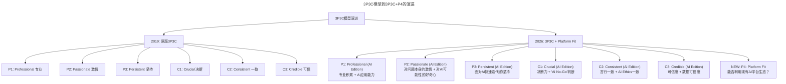

# 大咖对话 | 技术人创业前衡量自我的3P3C模型

> **适用范围**：有意向创业的技术人、正在评估自身创业准备度的技术管理者，以及投资人评估技术创业者时的参考框架；同样适用于AI时代需要用"3P3C+P4"升级模型（新增Platform Fit）进行自我衡量的创业者。
>
> **更新摘要（v2 · 2026-08 更新）**：
> - 结构化升级为 6 节骨架（导言 / 核心方法论 / 关键流程 / 工具与实战 / 常见误区 / 进阶延展）
> - 将王淮的3P3C模型与2026年AI时代"3P3C+1P"升级版整合
> - 补充"技术→产品→商业"新三段论的AI时代演变
> - 保留全部Mermaid图、对比数据表与行动清单

---

## 1. 导言

本周作客"大咖对话"的嘉宾是线性资本创始合伙人王淮。他是原Facebook中国籍的第二位工程师和第一位研发经理。做过News Feed和Social Ads后台，写过虚拟货币的前端，调过支付安全的大数据模型。还担任大众点评、百姓网和CSDN的CEO顾问。今天，我们和他聊了聊技术人创业前的考量和准备。

王淮提出的3P3C框架模型，是技术人创业前衡量自我的经典工具。到了2026年，这个模型依然有效，但需要扩展——新增第4个P（Platform Fit），因为AI平台经济的崛起使得"能否利用现有AI平台生态"成为创业成败的关键因素。

上图展示了3P3C模型从2019年到2026年的演进：原有的6个维度（Professional/Passionate/Persistent/Crucial/Consistent/Credible）全部加入AI Edition升级，并新增第4个P——Platform Fit（平台适配度），衡量创业者能否利用现有AI平台生态、是自建还是调用、能否融入AI Native用户习惯。

---

## 2. 核心方法论

### 2.1 技术人创业最大的坑：太把技术当回事

技术人创业，从最初的技术到最后做成一个成功的商业之间，还要经历技术的产品化、产品的商业化这两个大坎。这两次都是生死劫，很多技术人都经历不了这两次成长，最后可能只有5%有机会成长为一个好的技术流派的企业家。

创业不是一个纯粹的技术性问题：纯技术研究类的工作可能只占到整体的1/3，剩下的1/3是工程性工作（软件、体验、交互等，把技术变成别人可用的产品），其他工作（销售、市场、品牌、法务等）又占到1/3。初期（B轮之前）技术占的比重会更高，但等到B轮之后，非技术相关的比重会越来越高。

### 2.2 3P3C框架

**第一个P是Professional（专业）。** 对于你想解决的问题，你过去是否有很深的积累。希望创业想干的事情能跟过去的积累之间有40%到60%的重叠——重叠度太高可能就是在重复过去的事情，重叠度太少则过去的积累对未来能起的作用比较少。

举例：投的神策，就是把之前在百度积累的数据采集、整理、分析等能力产品化，同时针对电商、金融等不同业务领域构建定制化的数据分析模型。

**第二个P是Passionate（激情）。** 这种激情并不是外表体现出来的那种风风火火的样子，而是指对一件事情有发自内心的好奇心，然后有持续性的深度的思考。这种长期的思考会带来刻画在灵魂中的热情。

**第三个P是Persistent（坚持）。** 创业是一件长期的、艰难的事情。在和创业者沟通时，会考量他在面对困难时的坚持能力，会通过各种假设跟他们探讨未来可能遇到的挑战与风险（比如腾讯跟你做同样的事情你会怎么做）。

**第一个C是Crucial（决断）。** 创业的时候必须把自己有限的资源投入到最有机会让你成功的那个切入点中去。必须做全盘打算、必须有取舍、必须有决断。比如当你发现老员工已经不合适的时候，一定要Fire Fast。

**第二个C是Consistent（一致）。** 言行一致，不能想一套、说一套、做的时候又是另一套。对内跟投资人、合伙人、员工等沟通时，应该至少做到思言行一致。

**第三个C是Credible（可信的）。** 信用是需要很长时间积累的。一个有信用的、靠得住的人，即使这次创业不成功，但从长远来看也是迟早能成事的。前面5点最后都会体现在Credible上。

### 2.3 合伙人选择原则

**第一，知根知底。** 合伙人是一个非常长期的选择，一旦出问题就会很致命。你跟他待在一起的时间要比家人还多。这个人一旦选错，你就会郁闷很长时间，而且万一不成了要分开，造成的影响不比离婚来得小。

**第二，互补性。** 对技术型创业者来说，如果能找到彼此信任的、非技术偏商业的合伙人当然很棒。但如果没有，大家都是做技术的，一个偏产品、一个偏技术也是可以接受的。知根知底比互补性更关键。

2026年的"前同事"定义扩大了：包括曾经的开源社区协作者、AI社群伙伴、线上课程同学等"数字前同事"。

---

## 3. 关键流程

### 3.1 "技术→产品→商业"新三段论

| 阶段 | 2019年版 | 2026年AI增强版 | 难度变化 |
|-----|---------|---------------|---------|
| **第一阶段：技术验证** | 自己写代码做原型 | 用AI快速出MVP（1-2周 vs 2-3个月）；但技术差异化更难 | 降低但竞争加剧 |
| **第二阶段：产品化** | 设计UI/UX、打磨体验 | AI辅助设计+生成UI；但AI产品的体验设计是新挑战 | 执行降低，设计要求提高 |
| **第三阶段：商业化** | 获客、变现、规模化 | AI降低获客成本；但AI同质化严重，商业模式易被复制 | 获客降低，差异化更难 |

关键洞察：AI降低了每一段的**执行门槛**，但提高了对**差异化能力和速度**的要求。

### 3.2 创业评估流程

1. **用3P3C+P4模型自我打分**：诚实地评估自己在每个维度的得分（1-10分），找出短板
2. **做一次"AI Reality Check"**：如果你的创业想法去掉"AI"两个字还成立吗？如果成立，说明有真实价值；如果不成立，可能是AI Washing
3. **计算"AIGC Index"**：你的创业项目中，有多少比例的竞争力来自独家数据/场景/关系（vs 可被AI快速复制的部分）？
4. **找到"Non-AI Moat"**：在AI能快速复制一切的时代，什么是你的护城河？（数据飞轮？网络效应？监管牌照？品牌？）

### 3.3 Open心态的AI时代实践

| Open维度 | 传统做法 | AI增强做法 |
|---------|---------|-----------|
| 信息获取 | 参加会议、读行业报告 | AI Research Agent：自动聚合全球行业动态、论文、竞品信息 |
| 人脉拓展 | 线下活动、朋友介绍 | AI Community Matching：基于兴趣和专业背景智能推荐连接对象 |
| 思维碰撞 | 找导师、加入社群 | AI Devil's Advocate：主动让AI挑战你的假设，发现盲点 |
| 用户洞察 | 访谈、问卷 | AI User Research：分析海量用户反馈数据，提取模式 |

---

## 4. 工具与实战

### 4.1 对于正在评估是否创业的技术人

- [ ] 用3P3C+P4模型自我打分：诚实地评估自己在每个维度的得分（1-10分），找出短板
- [ ] 做一次"AI Reality Check"：如果你的创业想法去掉"AI"两个字还成立吗？
- [ ] 计算你的"AIGC Index"：有多少比例的竞争力来自独家数据/场景/关系？
- [ ] 找到你的"Non-AI Moat"：什么是你的护城河？

### 4.2 对于已经开始创业的技术人

- [ ] 重新审视技术投入占比：如果技术投入超过50%，警惕是否陷入了"技术优先"陷阱
- [ ] 建立"AI Decision Framework"：明确什么情况自研AI能力、什么情况调用API、什么情况干脆不用AI
- [ ] 每周留出20%时间做"非技术工作"：见客户、聊市场、想商业模式

### 4.3 对于寻找合伙人的创业者

- [ ] 扩展"前同事"的定义：把你参与过的开源项目、AI社群、在线课程的协作者都视为潜在合伙人池
- [ ] 评估候选人的"AI Cognitive Fit"：你们对AI的态度是否一致？
- [ ] 签订"AI Prenup"（AI婚前协议）：提前约定AI相关的股权分配、知识产权归属、AI决策权等问题

### 4.4 神策数据案例

我们投的神策，他们就是把之前在百度积累的数据采集、整理、分析等能力产品化，同时针对电商、金融等不同业务领域构建定制化的数据分析模型，打造了杀手锏式的产品。这些定制化的产品就是他们在原本的数据基础能力之上的创新，也是我们认为的专业的体现。

---

## 5. 常见误区

### 5.1 太把技术当回事

技术人创业最容易踩的一个坑就是太把自己的技术当回事。技术只是出发点，终点是要投一个能够成长起来的成功商业。

2026年"太把技术当回事"的具体表现：轻度——用最好的模型解决简单问题（杀鸡用牛刀）；中度——自研RAG/Agent框架而非调用成熟方案；重度——认为"我有GPT-5.5 API就能颠覆行业"，忽略商业闭环；致命——AI Washing：给产品套AI壳子但没有真实的AI价值主张。

### 5.2 闭门造车

创业这件事一定是不能把自己关在屋子里闭门造车的。技术人要更Open自己，不仅仅要去接触技术、产品等比较容易接触的伙伴，还要多去接触些销售、BD、人事等方方面面的人。

### 5.3 知根知底与互补性的优先级颠倒

很多人先看互补性再看知根知底，但实际上知根知底比互补性更关键。商业型的人才可以等到A轮的时候再去补充。

### 5.4 AI Washing

给产品套AI壳子但没有真实的AI价值主张。判断方法：去掉"AI"两个字看产品是否还有价值。

---

## 6. 进阶延展

### 6.1 核心金句（2026版）

> "3P3C模型依然有效，但在AI时代请加上第4个P——Platform Fit：你是在AI的浪潮上冲浪，还是在跟AI的大潮搏斗？"

> "技术人创业的最大风险不是技术不够强，而是误以为技术够强就能成功——在AI时代，这个错觉更危险，因为AI让每个人都觉得自己技术很强。"

> "Open yourself in the AI era doesn't mean consuming more information—it means curating better inputs, challenging your assumptions faster, and connecting with humans who think differently."

### 6.2 来源

本文基于极客时间《技术领导力实战笔记》大咖对话内容，嘉宾为线性资本创始合伙人王淮（原Facebook中国籍第二位工程师和第一位研发经理），并融合2026年AI时代升级注解。
