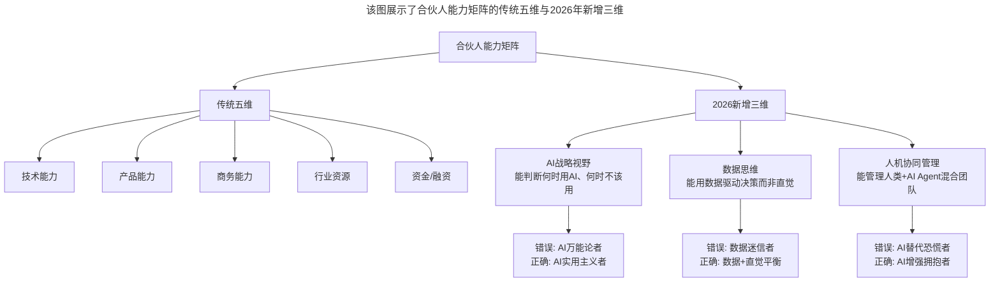
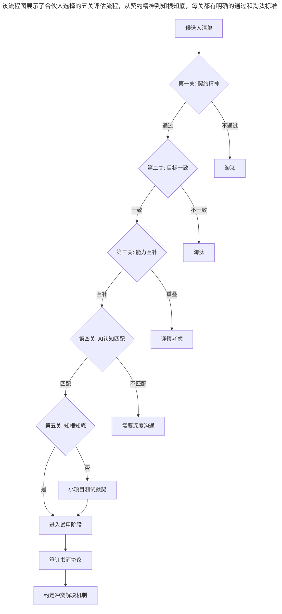

# 大咖对话 | 王鹏云：技术人创业该如何选择合伙人？

> **适用范围**：正在寻找创业合伙人的技术人、评估创业团队匹配度的早期创业者、AI时代构建复合型创业团队的技术管理者
>
> **更新摘要**（v2）：在保留原文合伙人选择五要素（契约精神、有主有从、能力互补、奇数人数、前同事优先）和创业团队稳定三要素的基础上，融入2026年AI时代合伙人能力矩阵的新维度，新增AI战略视野、数据思维、人机协同管理三大评估维度，以及AI时代创业新三大误区（AI优先陷阱、过度Agent化、过度依赖AI建议），将原文升级为适用于AI浪潮下的合伙人选择指南。

---

## 一、导言

合伙创业是这个世界上特别难的一件事，比结婚还难——因为这个团队所经历的事情要比家庭复杂得多。合伙人内斗其实是很多公司死亡的主要原因。

本文嘉宾王鹏云是蓝创中心总经理、蓝标产品技术委员会主席，前多盟联合创始人、前蓝标移动广告集团CTO。（多盟联合创始人身份与公开背景一致；'蓝创中心总经理、蓝标产品技术委员会主席'源自极客时间原文，未检索到独立公开出处，存疑）基于多年创业经历和对大量技术创业者的观察，总结了技术人创业的三大误区和合伙人选择的五个核心要素。

**关键术语对照**：
- 合伙人（Co-founder）：创业公司的联合创始人
- 契约精神（Spirit of Contract）：承诺就要兑现，并对达成一致的决定不反悔
- AI Co-founder：AI作为虚拟合伙人，辅助技术/产品/市场等职能
- Slicing Pie模型：基于实际贡献动态调整股权的分配模型
- AI Contribution Tracker：AI贡献追踪工具，自动记录成员贡献

---

## 二、核心方法论

### 2.1 技术人创业的三大误区

**误区一：以技术为先考虑问题**

技术创业者有极强的技术自信，容易以技术为先考虑问题。如果企业是纯粹的技术领先驱动型公司（如AI算法公司），技术优先没有问题。但如今绝大部分创业公司都不是真正以技术为核心驱动，多数情况下核心技术门槛没有那么高——你能做，很多公司也能做。

**AI时代的新表现——AI优先陷阱**：认为用了GPT-5.5就能颠覆行业，忽略商业模式和用户需求。

**误区二：过度技术化**

很多工作是可以由人工完成的（比如用Excel来统计分析），而技术人往往想将这种工作方式技术化。技术化应该有一个节点选择——在合适的时间、合适的环境和条件下做技术化，而不是将所有问题都用技术方式解决。

**AI时代的新表现——过度Agent化**：简单任务也搞多Agent编排，增加复杂度和成本。

**误区三：过度理性**

技术人往往容易过度理性，做任何判断与决策都希望有数据支撑。但创业本来就是九死一生，有非常多难以用理性方式去把握的东西。创业需要狂热、突围、狂奔，需要对商业和行业有洞察和直觉。

**AI时代的新表现——过度依赖AI建议**：AI给出分析就照做，缺乏独立思考和商业直觉。

### 2.2 合伙人选择五要素

| 要素 | 核心要求 | 说明 |
|------|---------|------|
| 契约精神 | 承诺就要尽最大努力兑现 | 最重要的一点，有契约精神后多方可依赖 |
| 有主有从 | 必须有一把手 | 不能因哥们义气齐头并进，"商量着办事"的企业发展到最后瓶颈都非常明显 |
| 能力互补 | 分布于技术/产品/商务/市场 | 几个人都是技术或都是商务的团队短板非常明显 |
| 奇数人数 | 三个是相对比较好的数字 | 人太多达成一致困难，人太少容易缺乏足够视角 |
| 前同事优先 | 了解能力、短板、做事风格 | 能撕破脸皮——朋友创业最大的问题是出问题时撕不下脸 |

**AI时代新增三维**：
- AI战略视野：能判断何时用AI、何时不该用
- 数据思维：能用数据驱动决策而非直觉
- 人机协同管理：能管理"人类+AI Agent"混合团队

### 2.3 创业团队稳定三要素

1. **契约精神**：承诺过就努力兑现，困难时共赴难关
2. **互相理解**：即使不同意他的做法，也理解他做事的合理性
3. **良好默契**：私下彼此信任，产生工作中达成一致的更多可能

### 2.4 2026年合伙人能力矩阵

**图表说明**：该图展示了合伙人能力矩阵的传统五维与2026年新增三维。传统维度关注技术、产品、商务、行业资源和资金；新增维度关注AI战略视野、数据思维和人机协同管理能力，每个新维度都有错误和正确的表现形式。

---

## 三、关键流程

### 3.1 技术人创业误区的规避流程

**规避方法一**：从主观上讲，一定要压制自己的技术人思维，意识到问题的存在，即使你的技术确实很强，也一定要压制自己的技术冲动，理解其他方式的合理性。

**规避方法二**：开阔眼界，了解技术之外的东西，比如产品、销售、行业现状与未来以及企业之间的协同模式。当你了解了社会与行业，再来反推公司的商业价值，就相当于了解全局再跳回来审视局部。

### 3.2 合伙人选择评估流程

**图表说明**：该流程图展示了合伙人选择的五关评估流程，从契约精神到知根知底，每关都有明确的通过和淘汰标准。通过所有关卡后进入试用阶段，最终签订书面协议并约定冲突解决机制。

### 3.3 AI时代"AI作为虚拟合伙人"的新模式

| 场景 | 传统做法 | AI增强做法 |
|------|---------|-----------|
| 缺乏技术合伙人 | 高薪招聘CTO | 使用AI Coding Agent + 兼职技术顾问 |
| 缺乏产品经验 | 联合创始人补位 | AI Product Research Agent + 用户验证工具 |
| 缺乏市场洞察 | 聘请咨询公司 | AI Market Intelligence Agent + 行业数据库 |

**重要提醒**：AI可以增强但不能完全替代人类合伙人的责任感、情感支持和危机时的担当。

---

## 四、工具与实践

### 4.1 原始观点的AI时代验证

| 原始观点 | 2026年验证 | 验证结果 |
|---------|-----------|---------|
| 技术优先是误区 | 依然成立但需细化。99%的应用层创业仍应商业优先；但AI算法型创业技术优先合理 | 细分场景 |
| 过度技术化 | 新表现：过度AI化。用大模型解决简单规则问题、自研Agent框架而非调用现有方案 | 演变 |
| 过度理性 | 更加普遍。AI时代信息过载导致分析瘫痪 | 强化 |
| 合伙人需能力互补 | 新增维度：AI认知互补。理想团队需要懂技术+懂产品+懂AI应用场景+懂商业 | 扩展 |
| 3人为佳 | 依然成立但形式变化。"3人"可以是3个人类，也可以是2个人类+1个AI Co-founder | 新形态 |

### 4.2 案例警示（以下为示意性案例，未检索到对应公开报道）

- ❌ 某创业团队花6个月自研RAG系统，结果OpenAI一键更新的功能覆盖了他们80%的场景
- ❌ 某SaaS产品强行加入AI Chatbot，用户反馈"我只想快速完成操作，不想跟AI聊天"
- ✅ 成功案例：某垂直行业工具，仅在"智能填表"一个环节引入AI，NPS提升40分

### 4.3 AI时代契约精神的新内涵

传统痛点：技术合伙人vs商业合伙人，如何公平分配股权？

2026年新工具：
- **AI Contribution Tracker**：自动记录每位成员（含AI Agent）的贡献代码量、设计稿、客户沟通等
- **Dynamic Equity Calculator**：基于实际贡献动态调整股权（如Slicing Pie模型）
- **AI Decision Log**：记录关键决策谁提出的、依据是什么，避免事后争议

### 4.4 合伙人选择Action Items

- [ ] 列出你认识的、可能成为合伙人的人选清单（至少10人）
- [ ] 对每个人按照"五要素+三新增"进行评分
- [ ] 与Top 3候选人进行至少3次深度对话（非正式场合）
- [ ] 尝试一个小合作项目测试默契度
- [ ] 明确各自的权责利，形成书面协议
- [ ] 约定冲突解决机制（如出现分歧怎么办）

---

## 五、常见误区

### 陷阱一：哥们义气代替契约精神

朋友、兄弟创业最大的问题就是容易在出现问题时撕不下脸，觉得争吵会伤害彼此的感情，结果导致负面情绪积少成多，一旦爆发就可能是不共戴天的仇人。

**规避方法**：选择前同事优先——同事之间互相争辩讨论问题已经是一种协作方式，万一争不成，彼此以前也不是兄弟，即使以后不合伙了，也不会夹杂那么多感情。

### 陷阱二：齐头并进没有一把手

不管决策人身上有这样那样的缺点，但他是你们最初共同选定、认可的人，那就遵照契约精神，在遇到各种分歧时，该妥协妥协，该配合配合。

**规避方法**：有主有从，不能因哥们义气齐头并进。"商量着办事"的企业发展到最后瓶颈都非常明显。

### 陷阱三：AI认知差距导致团队分裂

> "AI不会替代你的合伙人，但会放大你们之间的认知差距——如果一个人拥抱AI而另一个人抗拒，分裂会加速到来。"

**规避方法**：制定"AI使用共识文档"，团队对AI的态度要一致。定期进行"AI健康检查"，评估团队是否过度依赖AI或忽略了人工交互的价值。

### 陷阱四：忽视AI产出的知识产权归属

AI生成的代码/内容版权归谁？这在合伙协议中需要明确。

**规避方法**：定义AI Agent的法律地位，在合伙协议中明确AI产出物的知识产权归属。

---

## 六、进阶延展

### 6.1 2026年行动清单

**对于正在找合伙人的创业者**：
- [ ] 评估团队AI能力互补性：不要只看技术和商务互补，还要看谁能填补AI认知盲区
- [ ] 制定"AI使用共识文档"：团队对AI的态度要一致
- [ ] 考虑引入AI顾问角色：如果找不到合适的AI合伙人，可以聘请AI Strategy Advisor
- [ ] 试用AI Contribution Tracking工具：让贡献量化透明化

**对于技术人创业者**：
- [ ] 压制"AI冲动"：每当想用AI解决问题时，先问"这是否是最简单有效的方案？"
- [ ] 寻找非技术联合创始人：技术人的短板往往在商业和用户理解
- [ ] 建立"反AI Echo Chamber"机制：定期邀请非技术背景的朋友挑战你的AI假设

**对于早期团队**：
- [ ] 签订动态股权协议：明确初始分配和调整机制
- [ ] 定义AI Agent的法律地位：AI产出的知识产权归谁
- [ ] 定期进行"AI健康检查"：每季度评估团队AI使用状况

### 6.2 核心金句

> "合伙创业比结婚还难。"

> "2026年的最佳合伙组合不是'技术+商务'，而是'技术+商务+AI实用主义'。"

> "契约精神的最高体现不是'不违约'，而是'当AI给出了更好的方向时，愿意放下自己的坚持'。"

### 6.3 相关阅读建议

- 《大咖对话-王鹏云：管理方式的差异是为了更好地实现企业商业价值》——本系列配套文章
- 《大咖对话-童剑：用合伙人管理结构打造完美团队》——合伙人管理结构
- 《陈崇磐：管事与管人-如何避开创业公司组队陷阱》——团队组建陷阱

---

*本文基于极客时间大咖对话原文升级，融入2026年AI时代合伙人选择新维度，旨在帮助技术人在AI浪潮中找到最合适的创业伙伴。*