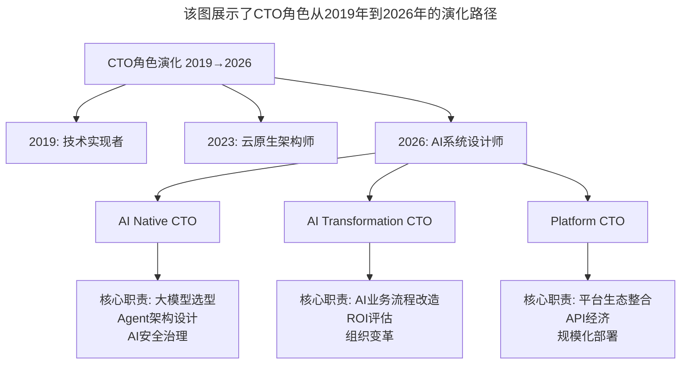

# 大咖对话 | 王鹏云：管理方式的差异是为了更好地实现企业商业价值

> **适用范围**：不同形态企业的技术管理者、面临AI转型的CTO及技术领导者、探索商业价值与技术管理平衡的创业者
>
> **更新摘要**（v2）：在保留原文核心观点（管理方式服务于商业价值、CTO没有标准模板、创业要顺势而为）的基础上，融入2026年AI时代CTO角色分化新趋势，新增AI Native CTO/AI Transformation CTO/Platform CTO三种新模式，以及AI时代"过度技术化"的新表现和产业互联网AI+落地场景，将原文升级为适用于AI浪潮下的技术管理指南。

---

## 一、导言

本文嘉宾王鹏云是蓝创中心总经理、蓝标产品技术委员会主席，2004年加入百度，2007年离开百度开始创业，2010年创立多盟（后被蓝色光标收购；其在百度任职（2004-2007）的具体年份未检索到独立公开出处，存疑）。基于在互联网公司和传统企业（蓝色光标）的双重经历，分享了技术管理方式的差异和CTO角色的本质。

核心命题：**所谓的传统企业与互联网企业的技术管理方式差异，最终都是为了服务于你所要实现的商业价值。**

**关键术语对照**：
- CTO（Chief Technology Officer）：首席技术官
- AI Native CTO：AI原生CTO，主导AI Agent架构设计、模型选型
- AI Transformation CTO：AI转型CTO，负责将AI能力注入现有业务流程
- Platform CTO：平台CTO，基于大模型平台构建垂直行业解决方案
- 产业互联网（Industrial Internet）：基于互联网平台改造和升级传统产业
- Prompt Engineering：提示词工程，与AI协作的基础技能

---

## 二、核心方法论

### 2.1 管理方式服务于商业价值

互联网公司更多依赖于平台、技术，而蓝标这样的传统公司更依赖个人及团队的能力和智慧，其中个人素质非常关键。

蓝标没有CTO。它的业务当然也会涉及产品与技术，但它不是基于产品与技术来构建团队，而是基于服务价值。互联网公司以产品和技术为主，蓝标以业务和客户价值为先导，反推需要什么样的技术工具和数据支撑。

**核心结论**：每个公司会采取不同的组织架构与形态，都是为了服务于所要实现的商业价值。

**AI时代的强化**：AI Agent时代，不同企业的技术管理差异进一步拉大——AI原生公司的CTO更像"AI架构师"，传统企业CTO则需具备"AI转型顾问"能力。

### 2.2 CTO没有标准模板

没有一个CTO能够完备地做到所有特质要求，只有**合适的CTO**。所谓"合适"，就是如何用产品、技术、平台、工具等作为支撑，帮助企业商业价值在最好的时间和场景下落地。

**关于"CTO该不该写代码"**：不能单看是与非，需要考虑CTO的工作中需不需要他写代码。如果CTO负责的是公司最核心的技术驱动，那写代码是必须的；如果在相对成熟、比较传统的业务中，CTO需要做的是优化工具、支撑业务、设计最合适的支撑体系。

**AI时代的修正**：2026年84%开发者已在使用或计划使用AI工具（Stack Overflow 2025开发者调查），CTO的核心能力从"写代码"转向"Prompt Engineering + AI系统设计 + 技术决策"——不写代码但必须能评估AI生成代码质量。

### 2.3 创业要顺势而为

创业的核心一定是实现商业价值，并达成双向收益——给用户贡献价值，同时把钱收回来，缺一不可。只收钱不提供价值是骗子公司，只贡献价值收不回钱难以维持。

**关于大势**：有些大势是显性的，有些是隐性的。乔布斯发明苹果是满足了隐性的大势——当时市场满足不了用户对智能手机的需求，但需求已经真实存在。

**关于平台**：在当前环境下，创业不要想颠覆平台，而是多想想怎么利用平台在平台上做好事。大平台已形成，颠覆大平台的可能性越来越小，但基于大平台延伸到别的领域做事情的机会并不少，比如产业互联网。

**AI时代的强验证**：GPT-5.5、DeepSeek V4等大模型平台已成基础设施，真正的机会在于垂直场景的Agent应用和行业Know-how的AI化。

---

## 三、关键流程

### 3.1 CTO角色演化路径

**图表说明**：该图展示了CTO角色从2019年到2026年的演化路径。2026年CTO分化为三种新模式：AI Native CTO主导AI架构设计，AI Transformation CTO负责AI业务流程改造，Platform CTO基于大模型平台构建行业解决方案。

### 3.2 AI时代CTO能力模型转变

| 维度 | 2019年CTO | 2026年CTO |
|------|----------|----------|
| 核心能力 | 技术深度 | AI系统思维+商业洞察+组织变革 |
| 编码能力 | 亲手写核心代码 | 评估AI生成代码质量 |
| 技术选型 | 框架/语言/数据库 | 大模型/API/Agent框架 |
| 团队管理 | 管理人类团队 | 管理"人类+AI Agent"混合团队 |
| 成功标准 | 系统稳定/性能优异 | AI ROI/业务价值实现 |

### 3.3 产业互联网AI+落地路径

王鹏云提到的"基于平台延伸到产业互联网"在2026年有了具体路径：

| 行业 | AI+落地场景 | 代表案例 |
|------|------------|---------|
| 营销（蓝标领域） | AI内容生成、智能投放、效果预测 | 蓝标已布局AI营销（具体'AI营销Agent'产品名未检索到，存疑） |
| 制造业 | AI质检、预测性维护、供应链优化 | 富士康AI质检系统 |
| 医疗 | AI辅助诊断、药物研发、患者管理 | 基于DeepSeek的医疗行业部署（如瑞金医院'瑞智病理'大模型） |
| 教育 | AI个性化教学、自动批改、学情分析 | 多家教育科技独角兽 |

---

## 四、工具与实践

### 4.1 技术人创业"30%技术+70%商业"原则

技术只是起点，商业模式、获客、留存才是决胜关键。

**选择正确的AI策略**：
- 如果是**应用层创业** → 调用大模型API，聚焦场景和用户体验
- 如果**确实有技术壁垒**（如新算法、新架构）→ 可以自研，但要快速产品化
- **利用Agent加速器期红利**：2026年是Agent商业化元年，抓住窗口期（预计18个月）

### 4.2 AI时代"过度技术化"的新表现

- ❌ 过度追求自研大模型：应该调用GPT-5.5 API而非从头训练
- ❌ 过度构建复杂Agent链：简单任务用单Agent足够，无需多Agent编排
- ❌ 过度关注技术指标：用户只关心"AI是否解决了我的问题"，不关心你用了什么模型

### 4.3 传统企业AI转型试点建议

- [ ] 选择1个高价值场景（如客服、营销、研发），3个月内见成效
- [ ] 重构人才画像：招聘时增加"AI协作能力"评估
- [ ] 建立"人机协同"管理模式：AI负责效率，人负责创意和决策
- [ ] 避免AI FOMO：不是所有业务都需要AI，先用数据证明AI的ROI再投入

---

## 五、常见误区

### 陷阱一：CTO纠结于"该不该写代码"

CTO不要给自己套太多的框，比如"我好久没写代码了，技术是不是退步了"。如果你所在的公司、所处的位置不需要你写代码，而你却将精力纠结于这件事上，反而可能落下更重要的事情。

**AI时代的对应**：不写代码但必须能判断AI写的代码是否解决了真实的商业问题。

### 陷阱二：以技术为先考虑问题

如果公司的核心竞争力不是来自于技术独到性或技术领先性，这时再用技术为先的思路主导，往往会将更核心的目标忘掉。

**AI时代的对应**：AI优先陷阱——认为用了大模型就能颠覆行业，忽略商业模式和用户需求。

### 陷阱三：想颠覆平台而非利用平台

大平台已经形成，颠覆大平台的可能性越来越小。但基于大平台延伸到别的领域做事情的机会并不少。

**AI时代的对应**：不要自研大模型，而应基于大模型API构建垂直应用。

### 陷阱四：过度理性裹足不前

创业需要狂热、突围、狂奔。创业很多时候需要对商业、对行业有洞察和直觉，不能所有决定都依赖于数据。有些数据可能是脏数据、假数据——拍着脑袋也得往前走。

**AI时代的对应**：过度依赖AI建议——AI给出分析就照做，缺乏独立思考和商业直觉。

---

## 六、进阶延展

### 6.1 核心金句

> "2026年的CTO不需要写代码，但他必须能判断AI写的代码是否解决了真实的商业问题。"

> "技术人的终极竞争力不是代码能力，而是'用AI解决商业问题'的能力。"

> "不要用大模型去解决Excel能解决的问题——这是2026年版的技术人创业第一原则。"

### 6.2 2026年行动清单

**对于技术管理者**：
- [ ] 重新定义CTO能力模型：从"技术深度"转向"AI系统思维+商业洞察+组织变革"
- [ ] 建立AI能力评估体系：评估"AI辅助开发效率提升率"
- [ ] 避免AI FOMO：先用数据证明AI的ROI再投入

**对于创业者**：
- [ ] 遵循"30%技术+70%商业"原则
- [ ] 选择正确的AI策略（应用层→调用API；有壁垒→自研但快速产品化）
- [ ] 利用Agent加速器期红利

**对于传统企业管理者**：
- [ ] 启动AI转型试点
- [ ] 重构人才画像
- [ ] 建立"人机协同"管理模式

### 6.3 相关阅读建议

- 《大咖对话-王鹏云：技术人创业该如何选择合伙人？》——本系列配套文章
- 《创业公司CTO的认知升级》——CTO角色在不同创业阶段的演变
- 《谈谈CTO在商业战略中的定位》——CTO的商业战略定位

---

*本文基于极客时间大咖对话原文升级，融入2026年AI时代CTO角色分化新趋势，旨在帮助技术管理者在AI浪潮中找到最合适的管理方式。*