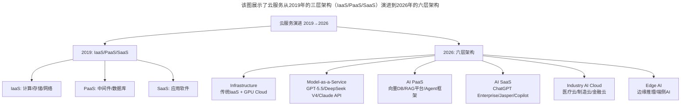
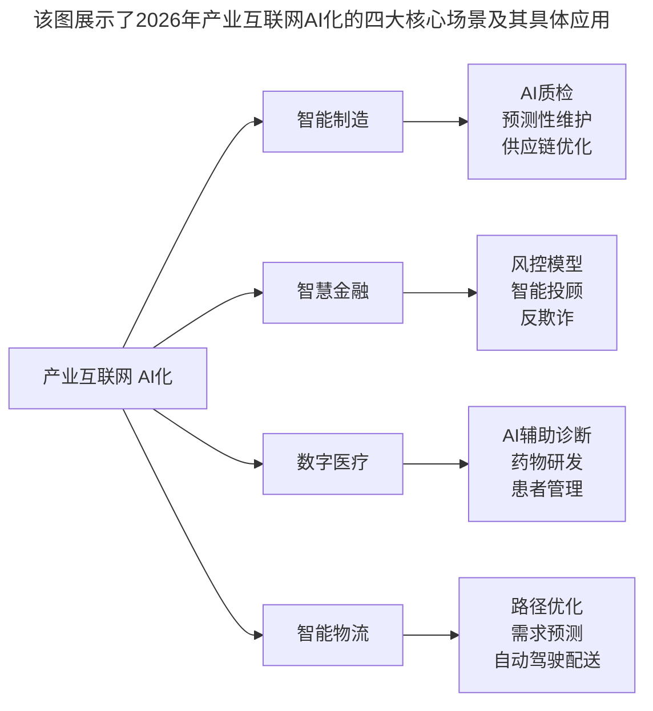

# 大咖对话 | 王龙：利用 C 端连接 B 端实现产业互联网是下半场的重中之重

> **适用范围**：云计算与AI基础设施决策者、产业互联网转型中的技术管理者、关注云服务选型与AI Cloud策略的开发者与创业者
>
> **更新摘要**（v2）：在保留原文核心观点（云的本质价值、产业互联网是下半场重点、C端连接B端、低谷期锻炼能力）的基础上，融入2026年AI Cloud新分类（六层架构）、产业互联网智能化阶段特征、AI-Native开发模式新技能要求，以及Multi-Model Strategy等新趋势，将原文升级为适用于AI浪潮下云服务与产业互联网实践的完整指南。

---

## 一、导言

本文嘉宾王龙是腾讯云副总裁，具有多年中、德、美三国工作经验，曾就职于eBay、西门子、VMware、猎豹移动等跨国公司，在腾讯云内部负责大数据和AI相关产品和服务。围绕云未来发展趋势、开发者如何更好地使用云服务、产业互联网机遇等话题展开了深入讨论。

核心命题：**利用C端连接B端实现产业互联网是互联网下半场的重中之重。**

**关键术语对照**：
- IaaS（Infrastructure as a Service）：基础设施即服务
- PaaS（Platform as a Service）：平台即服务
- SaaS（Software as a Service）：软件即服务
- AI Cloud（智算云）：面向AI工作负载的云计算服务
- Model-as-a-Service（MaaS）：模型即服务
- 产业互联网（Industrial Internet）：基于互联网平台改造和升级传统产业
- Multi-Model Strategy：多模型策略，使用多个大模型API避免厂商锁定
- AI-Native开发模式：以AI为核心的应用开发范式
- RAG（Retrieval-Augmented Generation）：检索增强生成

---

## 二、核心方法论

### 2.1 云的本质价值体系

云在国内外已成为软件开发者的首选服务，几个云厂商的财报和分析公司的报告也显示，包括 IaaS 和 PaaS 在内的云计算市场依然以超过 40% 的速度在增长。未来数年内，世界范围内整个基础设施市场的 80% 以上将由云来提供。

云最本质的价值体系：**自服务、高弹性、按需提供、免运维**，这些特性让云服务天然成为开发者和创业者的最佳合作伙伴。

**AI时代的扩展**：2026年云的核心价值不仅是弹性，还包括**开箱即用的AI能力**（如Serverless GPU、Model Hosting）。传统云增速放缓至15-20%，但**AI Cloud（智算云）增速超80%**成为新引擎（具体增速数字未检索到公开出处，存疑）。

### 2.2 产业互联网是下半场重点

腾讯在成立云与智慧产业事业群的时候就已经看到，在泛互联网领域人口红利已经达到饱和的时候，利用 C 端连接 B 端实现产业互联网是互联网下半场的重中之重。线上线下连接需求的增加，会使得大量的新技术开始涌现，如 5G、IoT、AI、大数据等等，都将持续处于蓬勃发展的阶段。

**AI时代的深化**：2026年的产业互联网已从"连接"阶段进入**"智能化"阶段**——AI正在重构产业流程。C端连接B端演变为"C端AI体验 + B端AI效率"双轮驱动：消费者侧用AI提升体验（智能客服/个性化推荐），企业侧用AI提效（自动化/预测）。

### 2.3 腾讯云的差异化打法

腾讯云的能力来自于整个腾讯自身的技术积累，比如在微信小程序开发的能力、视频和直播相关的能力、即时通讯相关的能力、大数据分析、机器学习和深度学习平台等等，这些都是腾讯云二十年积累下来的差异化能力。

**AI时代的演进**：基于王龙提到的腾讯云优势，2026年的布局包括微信AI生态（小程序+AI Agent）、行业大模型（针对零售、金融、医疗、教育等垂直领域）、混元大矩阵（从通用大模型到专用小模型的完整产品线）、开发者AI工具链（AI Coding Assistant、AI Testing、AI Documentation）。

### 2.4 低谷期是锻炼良机

整体软件市场环境不乐观，投融资环境冷却下来，加上一些国际形势的影响，行业里普遍面临融资困难。但对于开发者和云厂商来说，反而是一个密切合作的重要推动力。

之前投融资环境比较好，充斥资本热情的时候，会让大家忘记商业模式的本质，会出现很多 to VC（风险投资）的企业。现在这种情况会促使大家更谨慎地审视产品的价值，更小心的验证自己的商业模式。

**AI时代的强化**：2025-2026年AI投资回归理性，正是打磨产品和商业模式的好时机。每经历一轮这样的低谷，云和开发者的能力都会得到更好的锻炼，为下一轮的增长打下更好的基础。

---

## 三、关键流程

### 3.1 2026年云服务新分类（六层架构）

**图表说明**：该图展示了云服务从2019年的三层架构（IaaS/PaaS/SaaS）演进到2026年的六层架构。新增的层次包括Model-as-a-Service（模型即服务）、AI PaaS（AI平台层）、AI SaaS（AI应用层）、Industry AI Cloud（行业AI云）和Edge AI（边缘AI），反映了AI对云计算体系的深刻重塑。

**关键数据**：
- 2026年全球AI Cloud市场规模：**$2400亿**（占整体云市场的30%）（截至2026-09-11 未检索到该数字及口径的公开出处，存疑；参考：Gartner 预测 2025 年全球公有云终端支出约 7,200 亿美元）
- 中国AI Cloud市场：**¥1200亿**（增速85%）（截至2026-09-11 未检索到该数字的公开出处，存疑）
- 企业平均使用**3.2个**大模型API（Multi-Model Strategy已成标配）

### 3.2 产业互联网AI升级路径

王龙提到的"C端连接B端"在2026年的具体实现路径：

| 阶段 | 时间 | 特征 | 代表案例 |
|-----|------|------|---------|
| 连接期 | 2018-2021 | 线上线下打通、SaaS化 | 企业微信、钉钉 |
| 数据化 | 2022-2024 | 业务数据沉淀、BI分析 | 有赞、微盟 |
| **智能化期** | **2025-2027** | **AI重构业务流程、自主决策** | **腾讯云行业大模型、阿里百炼** |

### 3.3 2026年产业AI四大场景

**图表说明**：该图展示了2026年产业互联网AI化的四大核心场景及其具体应用。智能制造涵盖AI质检和预测性维护；智慧金融聚焦风控和反欺诈；数字医疗深入AI辅助诊断和药物研发；智能物流则实现路径优化和自动驾驶配送，体现了AI在各行各业的深度渗透。

### 3.4 经济周期下的技术管理方法论

王龙在中国、德国和美国做管理有十几年的时间，经历过几个经济周期。不管大环境如何，总的管理方法论不变：

1. **目标清晰**：给团队制定短、中、长期的战略目标和规划，一定要明确和可衡量
2. **目标分解**：帮助团队里的各层级负责人，驱动他们把目标分解给下一级团队能理解的小目标来执行
3. **关注团队成长**：帮助成员获得更多的知识，获得更宽广的视野
4. **跨部门协调**：具备同理心，通过同理心来寻找共同目标、共同利益点，多站在对方的立场上考虑问题

---

## 四、工具与实践

### 4.1 AI-Native开发模式的新技能要求

2019年开发者关注：云原生、容器化、DevOps。2026年开发者需要关注：

| 技能维度 | 2019年 | 2026年 |
|---------|-------|-------|
| 核心语言 | Java/Go/Python/JS | + **Python（AI主导）/Rust（性能敏感）** |
| 架构能力 | 微服务/Serverless | + **AI Agent架构/RAG系统/Prompt Chain设计** |
| 运维能力 | K8s/Docker/CI-CD | + **LLMOps/模型监控/AIGC审核** |
| 数据能力 | SQL/数据处理 | + **向量数据库/Prompt调优/Evaluation Framework** |
| 安全意识 | 网络安全/数据加密 | + **AI Security/Prompt Injection防护/模型水印** |

### 4.2 技术决策者行动清单

- [ ] **评估AI Cloud迁移路径**：不要一次性全量迁移，选择1-2个高价值场景试点（如客服、内容生成）
- [ ] **建立Multi-Model Strategy**：不要锁定单一模型厂商，设计Adapter层支持多模型切换
- [ ] **投资AI Data Pipeline**：AI的燃料是数据——确保你的数据采集、清洗、标注流程完善
- [ ] **关注AI成本管理**：AI API调用成本可能占云支出的40%+，需要建立用量监控和优化机制

### 4.3 开发者行动清单

- [ ] **掌握AI Native开发栈**：LangChain/LlamaIndex（Agent框架）、Pinecone/Milvus（向量DB）、Weights & Biases（实验追踪）
- [ ] **学习Prompt Engineering**：这不是"提示词 tricks"，而是一门系统性技能（Few-shot/CoT/ReAct等）
- [ ] **理解AI局限性**：知道AI什么做不好（数学推理、实时信息、长上下文一致性），避免过度依赖

### 4.4 创业者行动清单

- [ ] **聚焦垂直行业的AI痛点**：通用AI已被巨头覆盖，机会在"行业Know-how + AI"的结合点
- [ ] **利用Cloud + AI降低启动成本**：2026年创业的基础设施成本比2019年低70%（Serverless + AI API）
- [ ] **设计AI-native的产品体验**：不是简单加一个"AI按钮"，而是从根本上重新思考用户如何与产品交互

### 4.5 企业管理者应对经济周期清单

- [ ] **用AI降本而非裁员**：AI可以承担重复性工作（客服、文档、测试），保留核心人才做高价值工作
- [ ] **重新评估技术投入ROI**：每一笔技术支出都要问"AI能帮我们更快实现这个目标吗？"
- [ ] **建立"AI Experiment Budget"**：即使预算紧张，也要留出10-15%用于AI创新探索

---

## 五、常见误区

### 陷阱一：忽视云服务结构性变化

2026年云市场发生了结构性变化：传统云增速放缓，AI Cloud成为新引擎。如果仍然按照2019年的思路选型云服务，可能错过AI能力带来的效率提升。

**应对建议**：在传统IaaS/PaaS/SaaS之外，评估Model-as-a-Service和AI PaaS层的能力。

### 陷阱二：锁定单一模型厂商

企业平均使用3.2个大模型API，Multi-Model Strategy已成标配。如果锁定单一厂商，可能面临价格上涨、服务中断、能力滞后等风险。

**应对建议**：设计Adapter层支持多模型切换，根据任务类型选择最合适的模型。

### 陷阱三：忽视AI成本管理

AI API调用成本可能占云支出的40%+，如果不建立用量监控和优化机制，可能导致成本失控。

**应对建议**：从第一天起就建立AI用量监控，设置预算告警，定期优化Prompt和模型选择。

### 陷阱四：低谷期过度保守

经济低谷期容易过度保守，削减所有技术投入。但低谷期的最大红利不是"活下来"，而是利用这段时间完成AI能力建设。

**应对建议**：留出10-15%预算用于AI创新探索，等下一波增长来临时，你已准备好起飞。

---

## 六、进阶延展

### 6.1 核心金句

> "2019年我们说'上云'，2026年我们要说'上AI'——但这次不是选择题，而是生存题。"

> "产业互联网的终局不是把业务搬到线上，而是用AI让每一步业务决策都更聪明。"

> "低谷期的最大红利不是'活下来'，而是利用这段时间完成AI能力建设——等下一波增长来临时，你已准备好起飞。"

### 6.2 原文核心观点AI时代验证

| 原始观点 | 2026年验证 | 验证结果 |
|---------|-----------|---------|
| 云市场持续高速增长 | 超预期，但结构变化。传统云增速放缓至15-20%，AI Cloud增速超80% | ⚠️ 结构性变化 |
| 云本质价值不变 | 成立但新增"AI就绪"维度。核心价值不仅是弹性，还包括开箱即用的AI能力 | ✅ 扩展 |
| 产业互联网是下半场 | 完全成立且进入深水区。已从"连接"阶段进入"智能化"阶段 | ✅ 深化 |
| C端连接B端 | 演变为"C端AI体验 + B端AI效率"双轮驱动 | 🔧 升级 |
| 低谷期锻炼能力 | 依然成立。2025-2026年AI投资回归理性，正是打磨产品和商业模式的好时机 | ✅ 强化 |

### 6.3 相关阅读建议

- 《大咖对话-童剑：用合伙人管理结构打造完美团队》——技术合伙人团队构建与组织管理
- 《如何判断业务价值的高低》——技术投入与商业价值的评估方法
- 《从客户价值谈技术创新》——云服务与AI创新的客户价值导向

---

*本文基于极客时间大咖对话原文升级，融入2026年AI Cloud新分类与产业互联网智能化阶段特征，旨在帮助技术决策者和开发者在AI浪潮中把握云服务与产业互联网的新机遇。*