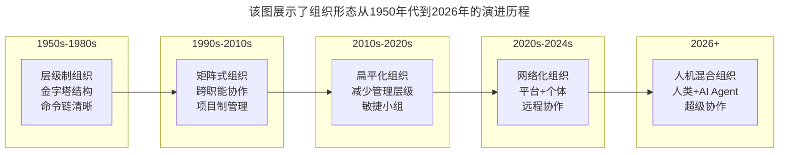
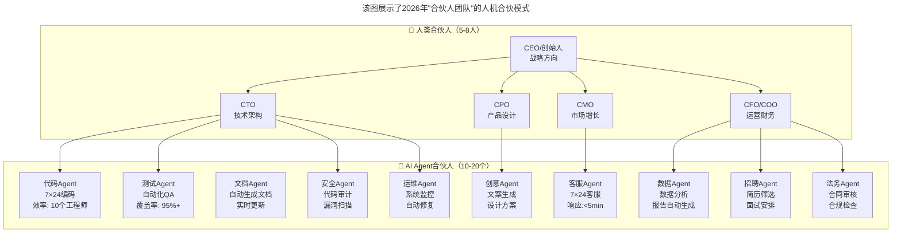
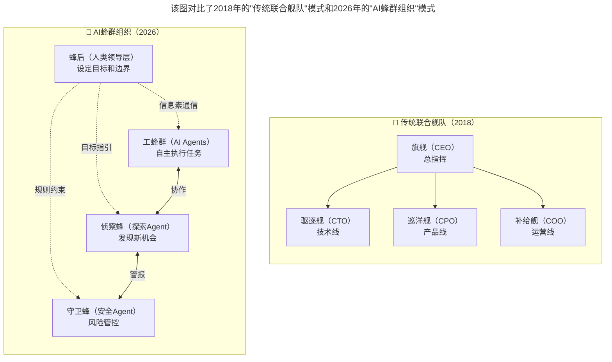
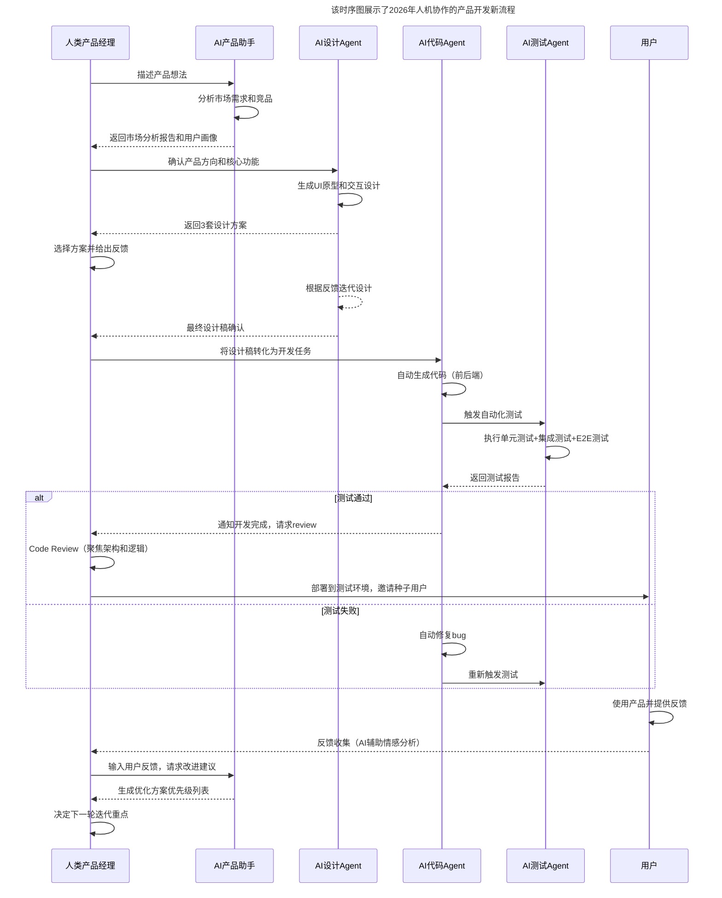

# 大咖对话 | 童剑：用合伙人管理结构打造完美团队

> **适用范围**：创业公司创始团队与技术高管、构建合伙人制度的技术领导者、关注人机混合组织与AI Agent协作模式的管理者
>
> **更新摘要**（v2）：在保留原文核心观点（合伙人管理结构、联合舰队模式、强化长板团队补短板、乐高式松耦合架构、快速迭代小步快跑）的基础上，融入2026年人机混合组织新形态，新增AI Agent作为"数字合伙人"理念、决策权分配框架、从"联合舰队"到"蜂群智能"的组织演化，以及人机协作工作流程设计，将原文升级为适用于AI时代的团队构建与组织管理指南。

---

## 一、导言

本文嘉宾童剑是国内云计算领域知名专家和早期实践者，现担任白山云科技联合创始人兼CTO。1999年至2016年初就职于新浪，离职时任新浪研发中心总经理，积累了丰富的互联网技术及云计算、大数据等行业经验。2016年5月加盟白山，迅速搭建和完善各产品线技术梯队，构筑云链产品技术体系。

核心命题：**用合伙人管理结构打造完美团队——不是打造巨轮而是编成联合舰队，每个合伙人都是舰船的掌舵人。**

**关键术语对照**：
- 合伙人管理结构（Partnership Management Structure）：以多位资深合伙人共同掌舵的组织模式
- 乐高式松耦合架构（Lego-style Loose Coupling Architecture）：模块化、可灵活组装的技术架构
- AI Agent（人工智能代理）：能自主执行多步任务的AI系统
- 人机混合组织（Human-AI Hybrid Organization）：人类员工与AI Agent协作的组织形态
- Swarm Intelligence（蜂群智能）：分布式、自适应、弹性扩展的组织智能模式
- Decision Rights Framework（决策权框架）：定义哪些决策由AI执行、哪些由人类主导的框架
- CDN（Content Delivery Network）：内容分发网络

---

## 二、核心方法论

### 2.1 合伙人管理结构：联合舰队模式

大部分初创公司创始人都不会太多，一般是3、4个人，但白山创立之初就组建了一个13人规模的合伙人团队，其理念不是打造巨轮而是编成联合舰队，每个合伙人都是舰船的掌舵人，大家一起带着业务、带着公司往前发展，效果可能比CEO一个人指挥的巨轮更好。

13人团队接近于完美的团队，每个人都能充分发挥自己的长处，而在不了解的领域，也能有其他成员帮忙补齐。

**AI时代的延伸**：2026年，这个概念可以延伸为——**AI Agent也可以成为"数字合伙人"**。一个10人的团队 + 20个AI Agent = 传统100人团队的战斗力。

### 2.2 强化个人长板，团队补齐短板

从个人发展角度来说，应该不断强化自己的优势，提升自己的长板，打造自己的核心竞争力；但从团队发展角度出发，应该尽量找到合适的人，与自己互补的人，让团队没有短板。

童剑之前的背景主要是做产品和技术，而创始人团队的其他人在商务、市场、CDN等领域非常优秀，这样跟团队的互补性就比较强，彼此都能发挥自己最大的力量。

每个合伙人都非常资深，平均有着17年的从业时间，不论是经验还是资源都很丰富，所以能更快的为公司找到更合适的人才，也能把相关领域的经验、方法带给大家。

### 2.3 乐高式松耦合架构

关于服务创新，白山说得最多的是"乐高式松耦合架构"——希望所有的技术都是松耦合架构的。当一个客户需求提过来时，对这个客户的需求做开发定制，在这个架构下，把功能模块开发出来之后，直接接入到架构里就能运行了，像搭积木一般灵活自如。

在很多传统的软件开发模式里，一个新的需求提过来之后，开发人员需要在一个很庞大的代码库里编码修改，才能完成功能的交付。这样做的复杂度高、灵活度低。

**关键收益**：过去软件行业对客户的需求都是以月为单位进行实施和交付，而通过"乐高式松耦合"的架构，能够做到以周、甚至以天为单位进行快速开发、快速交付。

### 2.4 快速迭代、小步快跑

作为一家新的创业公司更有优势的地方，是可以按照自己心目中最理想的方式去构建结构体系，保证在产品开发和交付上快速迭代、小步快跑，开发效率得到极大提升，开发模式也更加灵活。

在公司快速成长的过程中，技术怎样才能够服务好客户——关注技术体系的完善，同时不断改进技术管理思路，让技术管理的方法、工具被更多的核心团队成员接受。

---

## 三、关键流程

### 3.1 组织形态的演进史



**图表说明**：该图展示了组织形态从1950年代到2026年的演进历程。从层级制到矩阵式，再到扁平化和网络化，最终在2026年演化为"人机混合组织"——人类员工与AI Agent超级协作的新形态，这是童剑"联合舰队"理念在AI时代的自然延伸。

### 3.2 2026年"合伙人团队"：人机合伙模式



**图表说明**：该图展示了2026年"合伙人团队"的人机合伙模式。左侧为5-8位人类合伙人负责战略决策和方向把控，右侧为10-20个AI Agent合伙人负责执行层工作。人类合伙人通过目标指引和规则约束管理AI Agent，实现"一个10人团队+20个AI Agent=传统100人团队战斗力"的效能跃升。

**AI Agent作为"数字员工"的优势**：
- ✅ **7×24小时工作**：不需要休息、休假
- ✅ **一致性高**：不会情绪波动、状态起伏
- ✅ **可复制性强**：一个Prompt可以复制无数个Agent
- ✅ **成本可控**：API调用成本远低于人力成本
- ✅ **快速扩展**：业务增长时可以快速增加Agent数量

### 3.3 决策权的重新分配

童剑强调每个合伙人都是"掌舵人"，在2026年需要重新定义决策权的分配：

| 决策类型 | 2018年 | 2026年 | 说明 |
|---------|-------|-------|------|
| **战略决策** | 合伙人会议 | 👥 人类主导 + AI辅助分析 | AI提供数据和建议，人类拍板 |
| **战术决策** | 各部门负责人 | 🤖 AI自主执行（70%）+ 人工审核（30%） | 例行决策可委托AI |
| **操作决策** | 一线员工 | 🤖 AI全自动执行（90%）+ 异常上报 | 标准化操作全部自动化 |
| **创新决策** | 创新委员会 | 👥🤖 人机共创 | AI提出想法，人类判断价值 |
| **危机决策** | 应急小组 | 👥 人类主导 | 高风险决策保留给人 |

**决策权分配原则**：AI适用性评分基于决策类型权重（操作型40分/战术型25分/战略型5分）、风险等级（低风险0/-10/-25/-50）、发生频率（rare 0/occasional 10/frequent 20/constant 30）和数据可用性（poor -15/moderate 10/rich 25）综合计算。评分≥60分由AI自主执行，30-59分人机协作，<30分人类主导。

### 3.4 从"联合舰队"到"蜂群智能"



**图表说明**：该图对比了2018年的"传统联合舰队"模式和2026年的"AI蜂群组织"模式。联合舰队依赖旗舰（CEO）的中央指挥；而蜂群组织采用分布式决策，蜂后（人类领导层）仅设定目标和边界，工蜂群（AI Agents）自主执行任务，侦察蜂发现新机会，守卫蜂管控风险，体现了从集中式到分布式智能的演化。

**蜂群组织的特征**：
1. **分布式决策** —— 不需要中央指令，每个Agent都能自主行动
2. **自适应性强** —— 能根据环境变化自我调整
3. **弹性扩展** —— 可以动态增减Agent数量
4. **容错性高** —— 单个Agent失效不影响整体
5. **涌现智能** —— 整体智慧大于个体之和

### 3.5 人机协作产品开发流程



**图表说明**：该时序图展示了2026年人机协作的产品开发新流程。人类产品经理负责描述想法和做关键决策，AI产品助手负责市场分析，AI设计Agent生成方案，AI代码Agent自动编码，AI测试Agent执行测试。整个流程中人类聚焦于决策和Review，AI承担执行工作，实现了从月级到天级的交付速度提升。

---

## 四、工具与实践

### 4.1 AI成熟度评估矩阵

| 流程类别 | 自动化潜力 | 当前AI程度 | 优先级 | 预期收益 |
|---------|-----------|----------|--------|---------|
| 代码开发 | ⭐⭐⭐⭐⭐ | 40% | P0 | 效率提升300% |
| 测试质检 | ⭐⭐⭐⭐⭐ | 30% | P0 | 覆盖率提升至95%+ |
| 文档撰写 | ⭐⭐⭐⭐⭐ | 20% | P1 | 节省80%时间 |
| 数据分析 | ⭐⭐⭐⭐ | 35% | P1 | 产出提升5倍 |
| 客户服务 | ⭐⭐⭐⭐ | 45% | P1 | 响应速度提升10倍 |
| 内容创作 | ⭐⭐⭐⭐ | 25% | P2 | 产量提升10倍 |
| 招聘筛选 | ⭐⭐⭐⭐ | 15% | P2 | 效率提升5倍 |
| 财务核算 | ⭐⭐⭐ | 20% | P3 | 准确率提升至99.9% |
| 战略决策 | ⭐⭐ | 5% | P3 | 辅助分析 |

**立即行动**：选择P0级别的3-5个流程进行AI改造试点；组建"AI转型小组"（2-3人 + 若干AI Agent）；制定3个月的试点目标和衡量指标。

### 4.2 AI Agent岗位说明书示例

```yaml
# AI Agent岗位说明书示例

agent_role: "代码开发Agent"
report_to: "CTO / Tech Lead"
objectives:
  - "高质量完成编码任务，bug率 < 1%"
  - "遵循团队代码规范和架构原则"
  - "主动发现并提出优化建议"
  
kpi_metrics:
  code_output: "日均有效代码行数 > 500（经review通过）"
  bug_rate: "每千行代码bug数 < 1"
  review_pass_rate: "首次code review通过率 > 80%"
  response_time: "任务响应时间 < 5分钟"
  
tools_and_resources:
  primary_tools:
    - "Cursor Pro / Windsurf Enterprise"
    - "GitHub Copilot"
    - "内部知识库（RAG）"
  access_permissions:
    - "代码仓库读写权限"
    - "文档库读取权限"
    - "测试环境部署权限"
  constraints:
    - "不能自行合并到main分支"
    - "涉及敏感数据的代码需人工审核"
    - "重大架构变更需报批"

working_hours: "7×24（无休息日）"
compensation: "~$500/月（API调用成本）"
performance_review: "每周自动生成工作报告"
```

### 4.3 人类员工角色重塑

从"执行者"变为"指挥官"和"教练"：

| 过去的角色 | 新的角色 |
|----------|---------|
| 程序员（写代码） | AI架构师（设计系统和Prompt） |
| 测试工程师（手动测试） | 质量守护者（定义标准和审核AI输出） |
| 文档工程师（写文档） | 知识管理者（维护知识库和训练数据） |
| 客服代表（回答问题） | 体验设计师（优化人机交互） |
| 数据分析师（做报表） | 商业洞察者（解读数据和决策） |

**角色转型的支持措施**：
1. **技能重塑培训**：Prompt Engineering进阶课程、AI系统设计和架构培训、数据分析和商业洞察工作坊
2. **心理建设辅导**：帮助员工理解AI是伙伴而非威胁，创建安全的实验和学习环境
3. **职业发展新路径**：建立"AI协作专家"职级序列，提供"AI转型导师"认证，设立"人机协同创新奖"

### 4.4 童剑新浪经历的启示

童剑在新浪16年的经历提供了技术管理者成长的经典路径：
- 1999年加入新浪，做基础的技术开发
- 转做安全，意识到安全管理一定程度是治标不治本——安全最大的问题是和不完善的技术体系的斗争
- 2005年带小团队研发统一技术平台（动态应用平台、数据库平台、存储平台、CDN平台、虚拟化平台）
- 2009年新浪所有业务全部运行在统一技术平台上
- 2010年推出国内最早的公有云计算平台SAE（Sina App Engine）

**核心启示**：通过在公司内部的努力，争取自己感兴趣的工作机会——不必通过跳槽来换岗位、换环境。要有服务意识，知道怎样带领团队、怎样把业务推广出去、怎样跟内部"客户"处好关系。

---

## 五、常见误区

### 陷阱一：把AI当万能药

不是所有流程都适合AI化。在构建人机混合组织时，容易犯"过度自动化"的错误，把不适合AI化的流程也强行AI化。

**应对建议**：使用AI成熟度评估矩阵，优先选择高自动化潜力、高频率的流程进行AI改造。

### 陷阱二：忽视人类的独特价值

创造力、同理心、判断力无法被AI替代。在角色重塑过程中，容易把人类员工简单视为"AI的监督者"，而忽略了人类在创意、情感、战略思考方面的独特价值。

**应对建议**：人类角色应从"执行者"转向"指挥官"和"教练"，聚焦于AI不擅长的领域。

### 陷阱三：过度自动化，失去人工触点

保留适当的人工触点以建立信任。完全自动化的客户服务、完全自动化的代码审查，都可能导致质量下降和用户信任流失。

**应对建议**：在关键决策点保留人工审核，建立"AI提议-人类确认"的协作模式。

### 陷阱四：忽视AI的安全和伦理

建立AI使用的治理框架。AI Agent拥有代码仓库读写权限、测试环境部署权限等，如果没有完善的约束机制，可能造成安全事故。

**应对建议**：像管理员工一样管理AI Agent——制定岗位说明书、KPI指标、权限范围和约束条件。

### 陷阱五：停止投资人才

人是最重要的资产，AI只是工具。在构建人机混合组织时，容易把AI视为替代品而减少对人类员工的培训投入。

**应对建议**：持续投资人类员工的技能重塑培训，帮助员工完成从"执行者"到"指挥官"的角色转型。

---

## 六、进阶延展

### 6.1 蜂群组织实战场景

**场景：电商平台的大促活动**

传统做法：
- 项目经理制定详细计划
- 各部门分工执行
- 每日例会同步进度
- 出现问题逐级上报

蜂群做法：
- 设定目标：GMV 1亿，转化率 5%，系统可用性 99.99%
- AI Agent自主协调：
  - 营销Agent：动态调整广告投放策略
  - 库存Agent：预测销量并提前备货
  - 技术Agent：自动扩容保障性能
  - 客服Agent：根据流量调整排班
- 人类只处理异常情况和战略决策

### 6.2 人机混合组织效能计算

人机混合组织的整体效能受人类员工数量、AI Agent数量、人均产出、Agent人均产出以及协作效率系数综合影响。其中协作效率系数（0-1）受流程设计、组织文化、工具支持等因素影响——即使有了AI Agent，如果协作流程不完善，整体效能仍可能低于预期。

**关键洞察**：技术管理体系的完善是提升协作效率系数的核心——这正是童剑强调的"关注技术体系的完善，同时不断改进技术管理思路"在AI时代的新内涵。

### 6.3 核心金句

> "一个10人的团队 + 20个AI Agent = 传统100人团队的战斗力。"

> "从'联合舰队'到'蜂群智能'——组织形态的演化，本质上是决策权从集中走向分布、从人类独享走向人机共享的过程。"

> "像管理员工一样管理AI Agent——岗位说明书、KPI、权限、约束，一个都不能少。"

### 6.4 相关阅读建议

- 《大咖对话-王鹏云：技术人创业该如何选择合伙人？》——合伙人选择的五维评估框架
- 《大咖对话-胡哲人：技术人创业要跨过的思维坎》——"代码治理"到"Agent治理"的演进
- 《徐裕键：团队文化建设，保持创业公司的战斗力》——创业公司团队文化建设

---

*本文基于极客时间大咖对话原文升级，融入2026年人机混合组织与蜂群智能新理念，旨在帮助技术管理者在AI时代构建更高效、更敏捷的团队组织形态。*