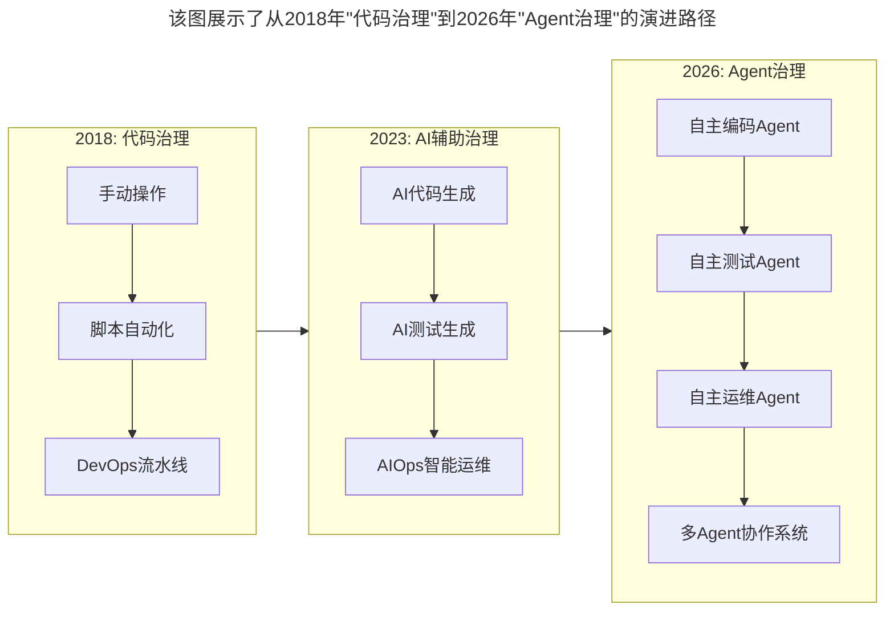
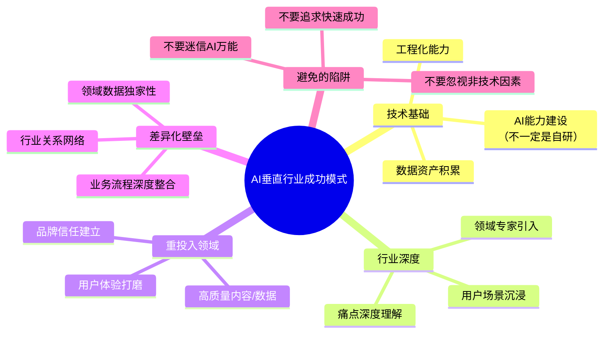

# 大咖对话 | 胡哲人：技术人创业要跨过的思维坎

> **适用范围**：从工程师转向管理者的技术创业者、垂直行业AI应用创业者、关注"代码治理"到"Agent治理"演进的技术管理者
>
> **更新摘要**（v2）：在保留原文核心观点（从工程师到管理者的转变、"代码治理"而非"人治"、垂直行业需要深耕、跨过思维的坎）的基础上，融入2026年AI时代新内涵，新增"代码治理"到"Agent治理"的演进路径、AI时代"第一反应"决策树、"轻vs重"模式的新维度分析，以及流利说模式的AI时代延展，将原文升级为适用于AI浪潮下技术人创业思维转型的完整指南。

---

## 一、导言

本文嘉宾胡哲人是流利说联合创始人兼CTO，在创立流利说前曾任美国著名互联网大数据AdTech公司Quantcast资深软件工程师，负责多个核心产品功能的前后端开发，拥有丰富的大型软件和大数据分析系统的架构经验。2018年9月，流利说在纽约证券交易所挂牌上市，被誉为"AI+教育"第一股。

核心命题：**技术人创业一定要跨过这个思维的坎——从技术视角到产品和业务视角，接受垂直行业的"重"模式。**

**关键术语对照**：
- micromanagement（微观管理）：过度细致的管理方式
- 代码治理（Code Governance）：用工具和机器自动化解决问题，而非靠人治
- Agent治理（Agent Governance）：设计让AI Agent持续自动解决问题的系统
- AdTech（Advertising Technology）：广告技术
- AI+教育：用人工智能技术解决教育环节中的问题
- MVP（Minimum Viable Product）：最小可行产品
- Unit Economics（单位经济学）：单笔交易的盈利模型

---

## 二、核心方法论

### 2.1 从工程师到管理者的转变

胡哲人创业后，逐渐地从工程师的角色转到更偏管理者的角色。老实讲，他之前并没有管理过这么大的团队，在这样一个角色转变的过程中，遇到了很多挑战。

其中之一就是思维上的转变——最开始的时候，对做管理有一点排斥或者说胆怯。因为之前一直在做技术，面对的是机器和代码，所有东西都由0和1构成，比较简单明了；而做管理的话，面对的是人，远比0和1要复杂。

**管理风格（湾区风格）**：
1. **做好榜样**：自己对团队有怎样的要求，那自己也要达到这样的要求，甚至做到更好。你怎么做要比你怎么说重要得多。
2. **不提倡micromanagement**：在把公司目标和当前要做的事情跟团队传达清楚的情况下，授权给团队，给团队更多的自由度，让他们能自主地去思考、去执行。
3. **代码治理而非人治**：相信代码可以解决很多问题，尽可能去用代码治理。

### 2.2 "代码治理"而非"人治"

当遇到问题，或内部需要做一些事情的时候，第一反应就是：这件事是否能够用工具或机器等手段自动化地去解决，之后又是否能够自动化地发现类似问题并解决。这也已成为团队很多leader的第一反应。

**AI时代的演进**："代码治理"理念在AI时代进化为"Agent治理"——不仅是用代码解决问题，更是设计一个让AI Agent持续自动解决问题的系统。

### 2.3 垂直行业需要深耕

很多技术创业者都想打造类似Facebook、Instagram、WhatsApp这样的轻资产型的产品，就是几十人的小团队，做出一个用户量庞大的超级产品。但在垂直行业，类似这样的机会已经不多了。

技术人创业一定要跨过这个思维的坎——很多时候需要摒弃一些技术人的固有想法，更多的是需要深入去了解所处的行业，了解他们真正需要什么。

**流利说的案例**：最开始想跟出版商合作，但他们的教材都太陈旧了，大部分都没有数字化。最终决定投入大量资源，引入教研相关的人才，然后教研、技术和产品三方一起，花了十八个月的时间，自主研发了一套符合移动端逻辑的英文原创教材，并将其数字化。

**教育行业的特殊性**：教育是一个非常重内容、重品质、重服务、重口碑的行业，快不是关键，走的方向对不对、走得稳不稳才是关键。教育类内容的生命周期非常长——比如新概念英语，诞生几十年了依然有人学。

### 2.4 跨过思维的坎

从技术视角到产品和业务视角，接受垂直行业的"重"模式，深入了解行业才能真正服务用户。

**AI时代的新含义**：不仅要跨过"重技术轻业务"的坎，还要跨过"迷信AI万能"的坎。AI降低了执行的门槛，但没有降低对行业理解的门槛。

---

## 三、关键流程

### 3.1 "代码治理"到"Agent治理"的演进



**图表说明**：该图展示了从2018年"代码治理"到2026年"Agent治理"的演进路径。2018年以脚本自动化和DevOps流水线为主；2023年引入AI辅助，实现AI代码生成和智能运维；2026年进入Agent治理阶段，自主编码、测试、运维Agent协同工作，形成多Agent协作系统，实现了从"用代码解决问题"到"设计系统让AI持续解决问题"的范式跃迁。

### 3.2 2026年"第一反应"决策树

胡哲人原话："我的第一反应就是，这件事是否能够用工具或机器等手段自动化地去解决"。

2026年的"第一反应"决策树：

```
遇到问题/任务时：
│
├─ Step 1: 能否完全交给AI Agent自动完成？
│   ├─ 是 → 配置/训练Agent，设定监控指标
│   └─ 否 → 进入Step 2
│
├─ Step 2: 能否由人类+AI协作完成（AI承担>50%）？
│   ├─ 是 → 设计人机协作流程，明确分工
│   └─ 否 → 进入Step 3
│
├─ Step 3: 能否用AI辅助人类完成（AI承担20-50%）？
│   ├─ 是 → 选择合适的AI工具，建立使用规范
│   └─ 否 → 进入Step 4
│
└─ Step 4: 纯人工完成（记录原因，定期review是否有优化空间）
```

**决策树说明**：该决策树将胡哲人的"第一反应"理念升级为2026年版本。遇到任何问题或任务时，首先评估能否完全交给AI Agent自动完成；若不能，则依次评估人机协作、AI辅助、纯人工完成四个层级。对于纯人工完成的任务，需记录原因并定期review是否有优化空间，体现了持续自动化的管理思维。

### 3.3 AI时代的"轻 vs 重"再思考

| 维度 | "轻"模式 | "重"模式 | AI时代建议 |
|-----|---------|---------|-----------|
| **团队规模** | <20人精锐 | 50-200人+Agent | 中等规模+AI增强 |
| **资金投入** | 自给自足 | 多轮融资 | 精细化Unit Economics |
| **行业深度** | 表面理解 | 深度Know-how | AI需要高质量领域数据 |
| **内容/资产** | UGC/轻运营 | 专业内容/重度运营 | 内容质量决定AI效果上限 |
| **技术壁垒** | 算法/工程 | 数据+场景+整合 | 行业数据成为核心壁垒 |

**⭐2026 关键洞察**：在AI时代，"轻资产"的定义变了——你可以用更少的人做更多的事（感谢AI），但你仍然需要在**行业深度**上做"重投入"。AI降低了执行的门槛，但没有降低对行业理解的门槛。

### 3.4 流利说模式的AI时代延展



**图表说明**：该思维导图展示了AI垂直行业成功模式的五个核心维度。技术基础不一定要自研AI能力，但必须积累数据资产和工程化能力；行业深度要求痛点理解、专家引入和场景沉浸；重投入领域聚焦高质量内容和用户体验；差异化壁垒来自领域数据独家性和业务流程深度整合；同时要避免迷信AI万能、追求快速成功和忽视非技术因素三大陷阱。

---

## 四、工具与实践

### 4.1 给技术创业者的可执行建议

1. **建立"自动化优先"思维（立即开始）**
   - 每周回顾：有哪些重复性工作可以自动化？
   - 优先级：高频 + 规则明确 = 最适合AI/Agent化
   - 目标：每季度将至少一个流程从人工转为自动/AI驱动

2. **评估你的"轻重"定位（本月完成）**
   - 你所在的行业是"轻"还是"重"？
   - 你是否在逃避必要的"重投入"？
   - 列出3个必须"加重"的领域

3. **制定行业深度学习计划（本季度）**
   - 与至少10个目标用户深度访谈
   - 阅读5份行业研究报告
   - 尝试亲身体验业务流程（不只是听人说）

### 4.2 给技术管理者的可执行建议

4. **培养团队的"Agent治理"意识**
   - 在团队中推广"自动化第一反应"文化
   - 建立"自动化提案"机制（员工提出可自动化的场景）
   - 设立"效率提升奖"奖励成功的自动化项目

5. **平衡"技术热情"与"业务现实"**
   - 定期（每月）用业务指标检验技术投入的回报
   - 避免"为了AI而AI"的项目
   - 保持与一线业务人员的密切沟通

### 4.3 流利说的成功要素（可复用模式）

**胡哲人总结的流利说成功要素**：
1. 技术基因（创始人都是技术出身）
2. 用AI解决真实教育痛点
3. 敢于投入重资源做内容
4. 认识到教育的特殊性

**2026年AI创业的可复用模式**：
- **技术基础**：AI能力建设（不一定是自研）、数据资产积累、工程化能力
- **行业深度**：痛点深度理解、领域专家引入、用户场景沉浸
- **重投入领域**：高质量内容/数据、用户体验打磨、品牌信任建立
- **差异化壁垒**：领域数据独家性、业务流程深度整合、行业关系网络

---

## 五、常见误区

### 陷阱一：轻资产幻想

技术创业者都想打造类似Facebook、Instagram、WhatsApp这样的轻资产型产品，就是几十人的小团队，做出一个用户量庞大的超级产品。但在垂直行业，这么做越来越困难。

**AI时代的对应**：AI降低了执行的门槛，但没有降低对行业理解的门槛。你可以用更少的人做更多的事（感谢AI），但你仍然需要在行业深度上做"重投入"。

### 陷阱二：迷信AI万能

认为用了AI就能解决所有问题，忽视行业深度、内容质量、用户体验等非技术因素。

**应对建议**：AI是加速器不是捷径。内容质量决定AI效果上限，行业数据成为核心壁垒——这些都需要"重投入"。

### 陷阱三：为了AI而AI

过度追求自研大模型、过度构建复杂Agent链、过度关注技术指标。用户只关心"AI是否解决了我的问题"，不关心你用了什么模型。

**应对建议**：定期用业务指标检验技术投入的回报，避免"为了AI而AI"的项目。

### 陷阱四：忽视内容/数据质量

流利说投入18个月研发原创教材和课程，这启示我们：内容质量决定AI效果上限。如果忽视内容/数据质量，再好的AI模型也无法发挥价值。

**应对建议**：在AI项目启动前，先评估数据采集、清洗、标注流程是否完善。

### 陷阱五：追求快速成功

教育是一个非常重内容、重品质、重服务、重口碑的行业，快不是关键，走的方向对不对、走得稳不稳才是关键。

**AI时代的对应**：不要追求快速成功。AI使0→1更快，但1→100仍需深耕。

---

## 六、进阶延展

### 6.1 原文核心观点AI时代验证

| 胡哲人2018年观点 | 2026年AI时代现实 | 验证结果 |
|---------------|----------------|---------|
| "用代码治理而非人治" | Agent使"代码治理"升级为"Agent治理" | ✅ 范围扩展 |
| "第一反应是能否自动化" | AI时代这成为核心竞争力 | ✅ 更加重要 |
| "垂直行业需要深耕" | AI降低技术门槛但提升行业理解门槛 | ✅ 完全验证 |
| "轻资产幻想要打破" | AI时代依然如此——AI是加速器不是捷径 | ✅ 警钟长鸣 |
| "从0到1再到100的过程" | AI使0→1更快，但1→100仍需深耕 | ✅ 需要平衡 |

### 6.2 核心金句

> "胡哲人老师的'代码治理'理念在AI时代进化为'Agent治理'——不仅是用代码解决问题，更是设计一个让AI Agent持续自动解决问题的系统。而'跨过思维的坎'这一洞察，在AI时代有了新的含义：不仅要跨过'重技术轻业务'的坎，还要跨过'迷信AI万能'的坎。"

> "在AI时代，'轻资产'的定义变了——你可以用更少的人做更多的事，但你仍然需要在行业深度上做'重投入'。"

> "AI降低了执行的门槛，但没有降低对行业理解的门槛。"

### 6.3 管理风格要点总结

胡哲人的管理风格（湾区风格）在AI时代依然适用，但需要升级：

| 管理要点 | 2018年版本 | 2026年升级 |
|---------|----------|-----------|
| 做好榜样 | 亲手写高质量代码 | 亲手设计高质量Prompt和Agent系统 |
| 不micromanage | 授权给团队 | 授权给团队+AI Agent |
| 代码治理 | 用工具/机器自动化 | 用AI Agent持续自动化 |
| 第一反应 | 能否自动化？ | 能否交给AI Agent？→ 人机协作？→ AI辅助？ |

### 6.4 相关阅读建议

- 《大咖对话-童剑：用合伙人管理结构打造完美团队》——"联合舰队"到"蜂群智能"的组织演化
- 《技术人投身创业公司之前，应当考虑些什么》——技术人加入创业公司的决策框架
- 《如何判断业务价值的高低》——技术投入与业务价值的评估方法

---

*本文基于极客时间大咖对话原文升级，融入2026年"代码治理"到"Agent治理"的演进路径与AI时代"轻vs重"新维度分析，旨在帮助技术创业者跨过思维之坎，在AI时代找到正确的创业方向。*