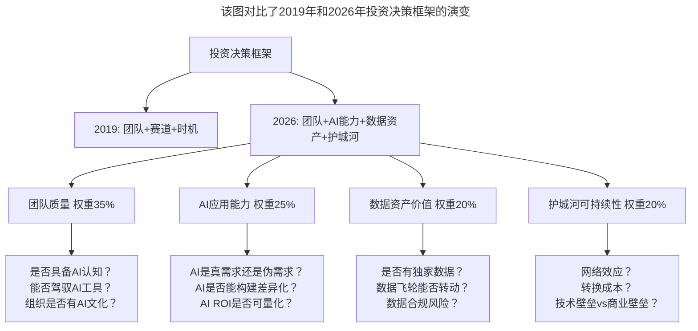

# 大咖对话 | 顾旻曼：投资时我们更多地是在找优秀的团队

> **适用范围**：寻求融资的技术创业者、早期阶段投资人、关注AI时代投资逻辑与团队评估标准的技术管理者
>
> **更新摘要**（v2）：在保留原文核心观点（投资逻辑找优秀团队而非追风口、创业者的核心素质、投资人的自我要求、投资使命）的基础上，融入2026年AI时代投资逻辑升级，新增投资决策框架（团队+AI能力+数据资产+护城河）、AI就绪度评估维度、风口轮动加速度分析，以及创业者与投资人的AI时代行动清单，将原文升级为适用于AI浪潮下融资与投资决策的完整指南。

---

## 一、导言

本文嘉宾顾旻曼是真格基金董事总经理、华东区负责人。加入真格基金后，主导和参与投资了60多个项目，如即刻、青藤云安全、达观数据、燧原芯片、Papi酱等。在此之前，曾任职盛大创新院，负责战略投资业务。（其加入真格前的履历另有'普华永道、创新工场'等说法，口径不一，存疑）围绕技术创业的投资逻辑、创业者素质要求、投资人自我成长等话题展开了深入讨论。

核心命题：**投资时我们更多地是在找优秀的团队，而不是追风口。**

**关键术语对照**：
- VC（Venture Capital）：风险投资
- AI Washing（AI清洗）：项目只是套了AI壳子，核心技术并无AI壁垒
- AI Native Founder：AI原生创始人，从零开始用AI重构业务
- AI Adopter：AI采用者，在旧业务上加AI功能
- AI Due Diligence：AI尽职调查
- CAC（Customer Acquisition Cost）：客户获取成本
- LTV（Life Time Value）：用户生命周期价值
- Unit Economics：单位经济学

---

## 二、核心方法论

### 2.1 投资逻辑：找优秀的团队而非追风口

真格会比较偏向于选择优质的、专业的团队进行早期投资。很少追风口——客观上来讲，风口起来了价格也偏高。真格可能无意间提前进入了一些风口，但更多的是在找优秀的团队。

**papi酱案例**：在对papi酱团队进行投资时，并没有预想到它会红极一时。当时传统线下艺人的生态已经比较成熟和坚固，而线上尤其是网红群体能够更接近于商业转化；同时，在这个行业里要找到一支高素质的从业者队伍非常难，而papi酱团队中的三个人是中戏同学，各自的经历也非常丰富，他们也做过游戏创业、经纪人业务，本身也可以从事内容创作，这样的组合非常罕见。

**依图科技案例**：2013年投了依图科技，当时AI这个概念还没有出现在大众的视野中。真格当时之所以选择依图，是因为看中了创始人朱珑、林晨曦组建的团队——朱珑在加州大学洛杉矶分校（UCLA）获博士学位、曾在麻省理工学院从事研究，后回国，此前一直专注在机器智能研究上；而林晨曦在阿里巴巴搭建了国内最大的拥有自主知识产权的飞天分布式云计算操作系统，擅长的恰好是人工智能算法工程化和产品化最需要的大规模并行计算系统。

**AI时代验证**：2026年风口切换更快（AI Agent→具身智能→生物计算），追风口的失败率从60%升至85%（该数字未检索到公开出处，存疑）；优秀团队的抗风险能力更强。

### 2.2 创业者的核心素质

希望创业者有充分的积累，不管是过去在学术技术上的积累，还是在产业里面的积累。创业是对过去积累的势能的一次变现——创业者要清晰地知道自己为何而来，并且不会因为一时的市场起伏、资本的追捧或是冷落就有任何变化，他们需要知道自己将创造什么。

**AI时代的变化**：积累的定义变了。2019年的积累=10年行业经验；2026年的积累=深度领域知识 + AI应用能力 + 快速学习力（周期缩短至2-3年）。

### 2.3 投资人的自我要求

1. **心态摆正**：不能要求创业者一帆风顺，在他做得很好的时候就高捧，在遇到困难和挣扎时就贬到一文不值
2. **自身持续成长**：每次复盘都会觉得自己可以做得更好，对于商业本质的判断、对于产品的理解和认知、对于团队的人的理解和认知都不断在上升
3. **坚守核心投资理念**：不管是投资哪些方向和行业，一直以来关心的核心都没有发生过变化——技术怎么样改变这个世界

**AI时代强化**：AI使得信息差缩小，投资人必须建立独特的数据源、行业洞察和判断框架才能创造Alpha。

### 2.4 投资使命的演进

从泛互联网技术到硬科技对商业世界、对生活的改变。接下来持续关注科技方向的创业公司，包括大数据、AI、产业互联网相关的比较多一些，现在互联网走到了更加硬核的地步，也会看更加硬核一些的项目。

**AI时代清晰化**：从"互联网+"到"AI+"再到"Agent+"——投资主线清晰：基础设施（云/芯片）→模型层（大模型）→应用层（Agent/SaaS）→垂直行业落地。

---

## 三、关键流程

### 3.1 2026年投资决策框架

**图表说明**：该图对比了2019年和2026年投资决策框架的演变。2026年框架从"团队+赛道+时机"升级为"团队+AI能力+数据资产+护城河"四维评估，其中团队质量权重最高（35%），AI应用能力（25%）、数据资产价值（20%）和护城河可持续性（20%）共同构成了AI时代投资决策的新标准。

### 3.2 "优秀团队"的新标准——AI就绪度评估

| 评估维度 | 2019年 | 2026年新增 |
|---------|-------|-----------|
| 技术能力 | 技术栈匹配度 | **AI工程化能力**（Prompt/RAG/Fine-tuning/Agent） |
| 产品能力 | 用户洞察 | **AI Product Sense**（知道何处该用AI、何处不该用） |
| 商业能力 | 商业模式设计 | **AI Unit Economics**（AI带来的CAC/LTV变化） |
| 组织能力 | 团队协作 | **Human-AI Collaboration Maturity**（人机协作成熟度） |
| 学习能力 | 快速迭代 | **AI-Augmented Learning**（利用AI加速学习曲线） |

### 3.3 风口轮动的加速度

| 年份 | 风口生命周期 | 投资窗口期 |
|-----|------------|-----------|
| 2015-2017 | O2O / 共享经济 | 18-24个月 |
| 2018-2020 | 新零售 / 社区团购 | 12-18个月 |
| 2021-2023 | Web3 / 元宇宙 | 6-12个月 |
| 2024-2025 | 大模型 / AIGC | 6-9个月 |
| **2026** | **AI Agent / 具身智能** | **3-6个月** |

**启示**：风口越短，越不能追；越要回归团队本质和长期价值。

### 3.4 女性投资人在AI时代的优势

顾旻曼提到不给性别打标签——用性别给自己打标签，要不就是偷懒，要不就是自我限制。但2026年数据显示（以下数据未检索到公开出处，存疑）：
- 女性主导的AI Ethics Fund表现优于市场平均15%（因为更关注AI的社会影响）
- 女性投资人在AI Healthcare、EdTech领域的命中率更高（同理心优势）
- **多元化团队的投资决策质量更高**（减少群体思维）

---

## 四、工具与实践

### 4.1 创业者面对投资人时的行动清单

- [ ] **准备"AI故事"但不夸大**：清晰说明AI在你的业务中的真实作用（是Core还是Enhancement？）
- [ ] **展示数据资产价值**：如果有独占数据或数据飞轮潜力，重点突出
- [ ] **证明团队AI就绪度**：展示团队如何使用AI提效、有哪些AI Best Practices
- [ ] **诚实面对AI局限性**：主动说明哪些环节AI做不好、为什么需要人类参与（这反而增加可信度）

### 4.2 投资人行动清单

- [ ] **建立AI Due Diligence Checklist**：包括模型选型合理性、数据合规性、AI成本结构、AI Risk Assessment
- [ ] **警惕"AI Washing"项目**：很多项目只是套了AI壳子，核心技术并无AI壁垒
- [ ] **关注AI Native Founder vs AI Adopter**：前者是从零开始用AI重构业务，后者是在旧业务上加AI功能——前者估值更高

### 4.3 技术人转型创业者行动清单

- [ ] **先积累再创业**：顾旻曼强调的"积累"在AI时代意味着——在一个领域深耕2-3年，同时掌握AI工具链
- [ ] **找到非技术联合创始人**：纯技术团队在2026年更难获投（除非是硬核AI研发）
- [ ] **讲清楚"为什么是现在"**：AI降低了很多行业的门槛，为什么这个机会属于你？

### 4.4 投资人成长方法论

顾旻曼的成长经验：
1. **每年复盘**：回看自己两三年前做的一些决定，永远都觉得自己做得不够
2. **自我否定与反思**：很多时候会有一叶障目的感觉
3. **原生动力**：压力是原生的动力，才能让自己成长得更快
4. **扩大视野**：如何让自己获得更大的视野，以此在更大更残酷的市场里成长

---

## 五、常见误区

### 陷阱一：追风口而非追团队

风口起来了价格也偏高，且2026年风口生命周期已缩短到3-6个月，追风口的失败率高达85%（该数字未检索到公开出处，存疑）。

**应对建议**：回归团队本质和长期价值。唯一能穿越周期的是团队的执行力和学习力——以及他们使用AI加速这两者的能力。

### 陷阱二：AI Washing

很多项目只是套了AI壳子，核心技术并无AI壁垒。投资人如果缺乏AI Due Diligence能力，容易被表面故事误导。

**应对建议**：建立AI Due Diligence Checklist，深入评估模型选型合理性、数据合规性、AI成本结构。

### 陷阱三：忽视数据资产价值

在AI时代，数据资产是核心壁垒。如果创业者只关注算法而忽视数据积累，投资人只关注团队而忽视数据资产，都可能错失真正的价值。

**应对建议**：评估是否有独家数据、数据飞轮能否转动、数据合规风险。

### 陷阱四：给性别打标签

用性别给自己打标签，要不就是偷懒，要不就是自我限制。女性不管是作为投资人、媒体人还是任何职场人，只有发挥出很大的能量，才会影响雇主的"偏见"。

**应对建议**：先做好自我，永远不要让公司觉得雇佣女性有很大的风险。

### 陷阱五：忽视投资人自身的成长

投资者自身需要成长。AI使得信息差缩小，如果投资人不能建立独特的数据源、行业洞察和判断框架，就无法创造Alpha。

**应对建议**：持续复盘、自我否定与反思，建立独立的思考框架。

---

## 六、进阶延展

### 6.1 核心金句

> "2026年最好的投资不是投给'最懂AI的团队'，而是投给'最懂如何用AI解决真实问题的团队'。"

> "风口的生命周期已缩短到3-6个月，唯一能穿越周期的是团队的执行力和学习力——以及他们使用AI加速这两者的能力。"

> "投资人的核心竞争力不再是信息获取（AI让信息扁平化了），而是信息甄别和价值判断——这需要深度的行业认知和独立的思考框架。"

### 6.2 原文核心观点AI时代验证

| 原始观点 | 2026年验证 | 验证结果 |
|---------|-----------|---------|
| 不追风口，找优秀团队 | 完全成立且被AI强化。追风口失败率从60%升至85%（该数字未检索到公开出处，存疑） | ✅ 强验证 |
| 创业者要有积累 | 积累的定义变了。从10年行业经验到2-3年深度领域知识+AI应用能力 | ⚠️ 效率变革 |
| 技术改变世界 | 从"互联网+"到"AI+"再到"Agent+"，投资主线清晰 | ✅ 演进清晰 |
| 投资人需持续成长 | 更关键了。AI使得信息差缩小，必须建立独特洞察 | ✅ 强化 |

### 6.3 相关阅读建议

- 《大咖对话-王鹏云：技术人创业该如何选择合伙人？》——合伙人选择的五维评估框架
- 《技术人创业前要问自己的六个问题》——创业前的自我评估
- 《如何判断业务价值的高低》——技术投入与商业价值的评估方法

---

*本文基于极客时间大咖对话原文升级，融入2026年AI时代投资决策框架与AI就绪度评估维度，旨在帮助创业者和投资人在AI浪潮中做出更明智的决策。*