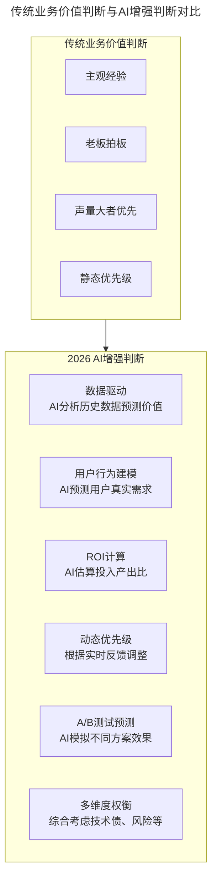
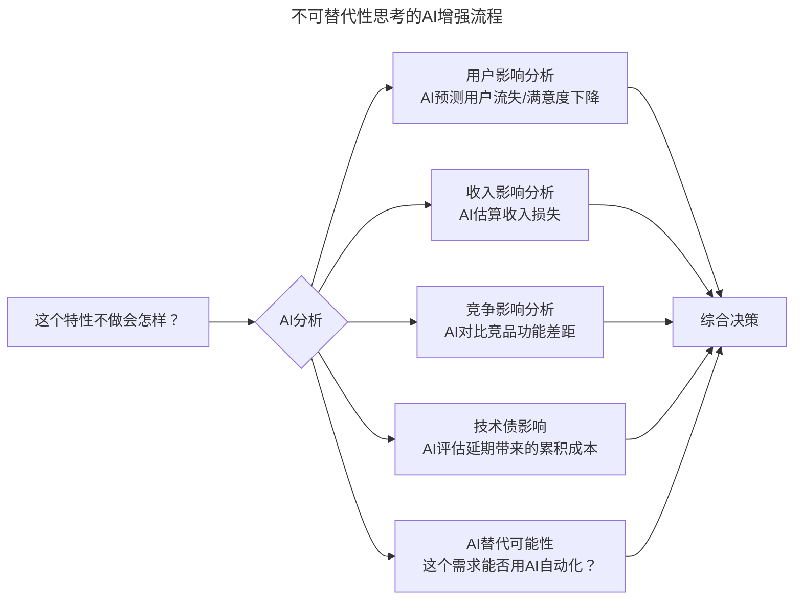
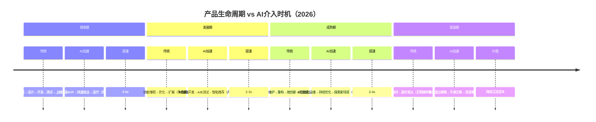

# 第64讲 | 如何判断业务价值的高低

> **适用范围**：敏捷开发团队的技术负责人、产品经理（PO）、项目经理及业务人员，尤其是需要在多需求来源中进行优先级排序的研发管理者；同样适用于在AI时代希望用数据驱动和AI辅助方法提升价值判断准确性的决策者。
>
> **更新摘要（v2 · 2026-08 更新）**：
> - 结构化升级为 6 节骨架（导言 / 核心方法论 / 关键流程 / 工具与实战 / 常见误区 / 进阶延展）
> - 整合原文"业务价值判断方法论"与2026年AI增强判断新范式
> - 补充AI时代"不可替代性"思考中的"AI可替代性"新维度
> - 保留全部Mermaid图、数据表与产品生命周期加速模型

---

## 1. 导言

众所周知，决策是在一定约束条件下，为实现个人、团队或企业目标而按照一定程序和方法，从备选方案中择优选择一个最合适方案的过程。因此，任何决策都要作出某种选择，而选择是否正确，取决于对决策对象的认知和价值判断是否正确。决策离不开价值判断。

软件开发行业也是如此，特别是在敏捷开发中，很多时候都是根据业务价值来决定特性或故事的优先级排序，可以说，**业务价值是敏捷观念的核心**。

Joe Little梳理了关心业务价值的四个原因：
1. **资源有限**：这个世界上有无数有趣的事情值得去做，问题在于决定哪些是最重要的需要去做的事情。
2. **目标一致**：业务价值有利于保证团队成员共享一个一致的目标，判断他们的行为是否正确，调动团队成员的自然动机。
3. **处变不惊**：在软件这个充满变数的混沌世界中，业务价值可以充当一个恒定的标杆。
4. **决策依据**：在变化（遗忘、客户群体变化、需求变化、评估失效）的漩涡中提供稳定的参考。

到了2026年，业务价值判断不仅是敏捷开发的核心，更因AI的介入而获得了全新的增强维度——AI可以让预测更准确（基于大数据和模式识别），但依然需要实践验证。



上图展示了从传统业务价值判断到AI增强判断的演进：传统方式依赖主观经验、老板拍板、声量大者优先和静态优先级；AI增强判断则引入数据驱动、用户行为建模、ROI计算、动态优先级、A/B测试预测和多维度权衡，使价值判断更加客观和精准。

---

## 2. 核心方法论

### 2.1 先定义价值，再找用户故事

Pascal Van Cauwenberghe认为，如果先编写用户故事然后再估计它们的业务价值，这一做法会存在严重的缺陷，因为很有可能在前期浪费大量时间在低价值甚至是零价值的用户故事上。

好的做法是首先回答："我们如何才能找到传递了业务价值的用户故事？"——即**先定义打算实现的业务价值，然后生成那些有助于业务价值实现的用户故事**。

### 2.2 产品愿景驱动的阶段性目标

姚安峰认为，包括技术、PO、业务人员在内的项目团队及相关利益者需要共同理清产品的愿景：
- 为什么开发这个产品？
- 对它的期望是什么？
- 什么是这个产品的主要卖点？
- 相比旧的版本或其他竞争对手，这个产品能带来的改进或差异化竞争力在哪儿？
- 项目相关的各方人士是否都理解并认可该愿景？
- 该产品的愿景是否与组织战略方向一致？

明确了愿景后，就要对如何达成这个愿景进行规划，产生**演进路线图**。产品生命周期决定了在不同的阶段产品应该有不同的策略，"业务价值"的内涵是一直在改变的。

### 2.3 "不可替代性"思考

在基于阶段性目标进行价值判断时，建议从"是否不可替代"的角度进行思考，即对每一个特性或故事都问问自己：
- 如果暂时不实现它，我们想要进行的探索能否达到目的？
- 想要改造的业务流程能否实现？
- 用户的期望能否得到满足？
- 是否可以暂时采用其它替代的手段达到同样目的？

### 2.4 AI增强的业务价值评估新维度

| 维度 | 传统评估 | 2026 AI增强评估 |
|-----|---------|----------------|
| **用户需求** | 访谈、问卷、猜测 | + AI分析用户行为数据、NLP挖掘反馈 |
| **市场机会** | 竞品分析、行业报告 | + AI扫描市场趋势、预测增长空间 |
| **技术可行性** | 架构师经验判断 | + AI代码生成原型验证可行性 |
| **开发成本** | 经验估算（往往不准） | + AI辅助精确估时（误差±20%） |
| **ROI预测** | 粗略计算或没有 | + AI模型基于历史项目数据预测 |
| **风险识别** | 事后发现 | + AI提前预警技术债、依赖风险 |

---

## 3. 关键流程

### 3.1 业务价值判断的标准流程

1. **定义价值**：在开始一个项目或产品之前，首先要决定想要实现什么样的价值（或利益）
2. **找到传递价值的业务流程**：找到并改善传递价值的业务流程
3. **改善辅助流程**：找到并改善使得传递价值的过程有效的辅助业务流程
4. **生成用户故事**：当团队需要用户故事的时候，采用上述步骤中积累的价值最高的流程，然后针对团队的需要以正确的粒度将其分解为用户故事

### 3.2 阶段性目标设定流程

1. **明确产品愿景**：项目团队共同理清产品愿景，确保各方理解并认可
2. **制定演进路线图**：基于产品生命周期规划各阶段策略
3. **设定阶段性目标**：大的阶段可以细分为一系列连续的小阶段、小目标（如每季度或每月的关键目标）
4. **基于目标判断价值**：只有与该目标强相关的特性或故事才能被优先纳入版本计划或迭代计划
5. **不可替代性检验**：对每个特性/故事进行"如果暂时不实现它"的思考
6. **快速迭代验证**：将目标设定得足够小，排除暂时价值还不够高的工作，更快将版本交付出去

### 3.3 "不可替代性"思考的AI加持



上图中，"不可替代性"思考在AI加持下从单一的主观判断扩展为五个维度的AI分析：用户影响、收入影响、竞争影响、技术债影响和AI替代可能性，最终汇聚为综合决策。2026年新增的关键问题是"AI可替代性"——这个需求是否可以用AI工具/Agent自动完成？如果能覆盖多少比例？

### 3.4 产品生命周期的AI加速



上图时间线展示了AI对产品生命周期各阶段的加速效果：探索期提速3-5倍（月级→周级），发展期提速2-3倍（季度级→月级），成熟期提速2-4倍（年度级→季度级），衰退期则通过AI分析降低沉没成本。

---

## 4. 工具与实战

### 4.1 阶段性目标设定的AI Benchmark

| 阶段 | 传统目标设定方式 | 2026 AI辅助设定 |
|-----|-----------------|------------------|
| **探索期** | 团队讨论、直觉 | + AI分析类似产品的成功指标 |
| **发展期** | 基于上一阶段增长外推 | + AI预测市场天花板和最优路径 |
| **成熟期** | 行业对标、竞品追赶 | + AI识别差异化机会和创新点 |
| **衰退期** | 被动应对 | + AI预警衰退信号、建议转型方向 |

### 4.2 业务价值判断AI工具包

**需求优先级AI评分器：**
```
输入: 需求描述 + 用户故事 + 历史数据
输出: 
├── 价值分 (0-100): 基于用户影响、收入潜力等
├── 成本分 (0-100): 基于开发复杂度、技术风险等
├── 优先级排序: 价值/成本比
└── 建议: 做 / 不做 / 推迟 / 用AI替代
```

**AI辅助OKR设定：**
```
输入: 公司战略 + 团队现状 + 市场数据
输出:
├── 季度OKR建议（3-5个Objective）
├── 每个O的Key Results（可量化）
├── 与AI相关的KR（如：AI工具采用率提升至X%）
└── 风险提示和备选方案
```

**A/B测试AI预判：**
```
输入: 方案A描述 + 方案B描述 + 历史类似案例
输出:
├── 方案A预期转化率: X% ± Y%
├── 方案B预期转化率: X% ± Y%
├── 推荐方案及置信度
└── 最小样本量建议（达到统计显著性）
```

### 4.3 AI时代的价值判断Checklist

在每次优先级讨论会前，用AI准备以下材料：
- [ ] 各候选特性的**AI预测价值评分**
- [ ] **用户行为数据分析报告**（AI生成）
- [ ] **竞品功能对比矩阵**（AI自动更新）
- [ ] **技术实现难度AI评估**
- [ ] **AI替代可行性分析**（哪些可以用AI工具替代人工开发）
- [ ] **风险预警清单**（AI识别潜在陷阱）

---

## 5. 常见误区

### 5.1 被动需求接收模式

在实际的项目过程中，依旧会遭遇各方面的挑战：需求来自多个方面，每个业务人员都将解决自己的问题视为首要优先级事项；领导拍脑袋提出的不合理要求极有可能会打乱原有计划。这样被动的需求接收模式让研发团队很难坚持进行业务价值判断。

### 5.2 过度讨论而迟迟不实践

如果为了避免判断错误却花过多时间进行讨论，而迟迟不去实践，反而会错过实现价值的机会。在互联网和传统企业都努力追求创新的今天，需要的是快速迭代与反馈验证，以及基于反馈的快速调整；而所谓准确的预测、判断并不能有效避免失败，只有基于快速反馈验证的迭代式演进才能降低可能失败的风险。

### 5.3 将预测当作确定性结论

所有这些分析和判断都是在特性或故事被实现之前进行的，是一种预测。而预测是导致绝大多数失败的恶魔，只有实践才是检验真理的唯一标准。

### 5.4 忽视"AI可替代性"维度

2026年的新增误区是：在判断业务价值时，不考虑某个需求是否可以用AI工具/Agent自动完成。如果不考虑AI可替代性，可能会投入大量人力开发本可以用AI自动化解决的功能。

---

## 6. 进阶延展

### 6.1 核心洞察

原文的核心观点——"预测是失败的恶魔，实践是检验真理的标准"——在AI时代有了新的诠释：

- **过去**：预测靠经验，准确率低，所以强调快速试错
- **2026年**：AI可以让预测更准确（基于大数据和模式识别），但**依然需要实践验证**

**AI不是消除不确定性，而是降低决策的风险成本，让你能更快地进入"实践检验"环节。**

### 6.2 痛点/痒点/爽点的AI时代演绎

| 类型 | 原始定义 | 2026年AI如何改变 |
|------|---------|-----------------|
| **痛点（恐惧）** | 教育恐惧、医疗恐惧 | AI健康预测、智能诊断降低恐惧 |
| **痒点（理想自我）** | 200只口红的心理空洞 | AI虚拟试妆、个性化推荐无限满足 |
| **爽点（即时满足）** | 久旱逢甘霖 | AI让"即时满足"成为常态（但也带来新问题） |

关键警示：当AI让所有"爽点"都变得容易获得时，真正的稀缺资源变成了"等待"、"意外"和"真实的人际连接"。2026年的产品机会在于：用AI提升效率，同时保留人性化的"摩擦"和"仪式感"。

### 6.3 来源

本文基于极客时间《技术领导力实战笔记》第64讲内容，融合Joe Little、Pascal Van Cauwenberghe、姚安峰等人的方法论，并补充2026年AI时代升级注解。
