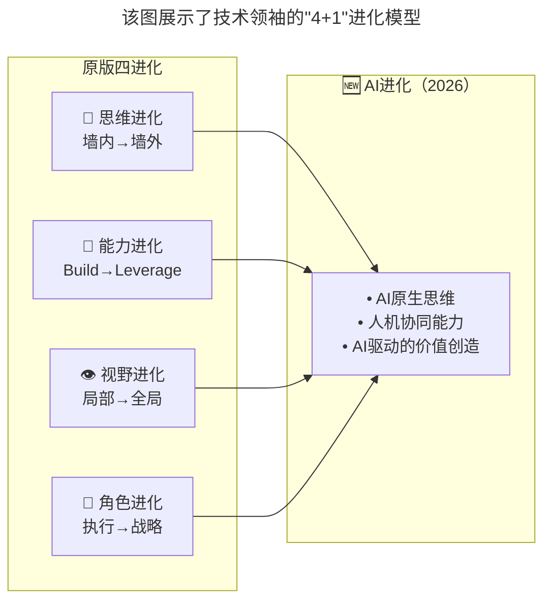

# 第62讲 | 张溪梦：技术领袖需要具备的商业价值思维

> **适用范围**：从技术执行者向战略决策者转型的技术领袖、关注AI时代技术领导力进化的CTO/CIO、探索技术驱动业务增长的管理者
>
> **更新摘要**（v2）：在保留原文核心框架（思维进化、技术领导力进化、视野进化、角色进化四大维度）的基础上，融入2026年AI时代新增的第五进化——AI原生思维，将原文升级为"4+1"进化模型。新增AI增强版各维度对照、AI-Native Integration能力层级、CAO（首席AI官）趋势预测，以及技术领袖的可执行行动清单，将原文升级为适用于AI浪潮下技术领袖成长的完整指南。

---

## 一、导言

本文整理自GrowingIO创始人兼CEO张溪梦在GTLC全球技术领导力峰会上的精彩分享。在创立GrowingIO之前，张溪梦曾任LinkedIn美国商业分析部高级总监，创建了LinkedIn近百人的商业数据分析和数据科学团队，也被美国DataScienceCentral评选为"世界前十位前沿数据科学家"。

核心命题：**Growth is connecting more people to the existing value of a product——增长的核心是产品价值与用户连接，技术领袖必须具备商业价值思维。**

**关键术语对照**：
- Growth（增长）：连接更多用户与产品既有价值
- CTO（Chief Technology Officer）：首席技术官
- CIO（Chief Information Officer）：首席信息官
- CGO（Chief Growth Officer）：首席增长官
- CAO（Chief AI Officer）：首席AI官
- Focus inside/outside the wall：墙内思维（支持部门）/墙外思维（以客户为中心）
- Build Everything vs Leverage Others：自研一切 vs 整合他人
- Strategic Partnership：战略伙伴关系
- AI-Native Integration：AI原生整合
- Orchestrate AI Ecosystem：编排AI生态系统

---

## 二、核心方法论

### 2.1 思维进化：从墙内到墙外

很多时候，我们的思维还停留在墙内，以支持各部门为中心，做的更多的是满足各个不同部门的需求。但在当今阶段，真正有技术领导力的领袖必须要到墙外去关注客户，去以客户为中心做事。

技术领导者必须要以客户未被满足的需求为主导，去思考技术创新和解决方案。否则，我们所创造的产品的价值影响力就会很低。

**以客户为中心的三个要点**：
1. 客户是谁？
2. 客户未被满足的需求是什么？
3. 如何用我们的技术、产品，来大规模地满足这种需求，解决客户的问题，同时拉动自己的业务增长。

**AI时代升级**：不仅是"客户是谁"，还要问——"AI如何让这个客户的体验提升10倍？"关注点从客户需求扩展到客户需求+AI能创造什么新需求。

### 2.2 技术领导力进化：从Build Everything到Leverage Others

过去的十年里，大部分软件都是企业内部自研的。以领英为例，分布式消息系统Kafka就是领英自己研发的。但在今天，如果想提高效率，真正把技术投入在最能满足客户需求的聚焦点上，就不能再保持Build Everything的思维，而是要具备整合能力——Leverage不同的工具和技术，迅速组合成新的产品和服务。

**领英案例**：八年前刚加入领英的时候，领英使用的外部工具非常少，基本都是内部自研的，但到离开的时候，公司里已经集成了近两百种不同的SaaS服务。五年里业务增长了接近40倍，核心原因之一就是能够善用这些产品和工具来提高内部的效率。

**AI时代升级**：从Build Everything → Leverage SaaS → Leverage AI → Orchestrate AI Ecosystem。2026核心能力不是你会用AI写代码，而是你能设计和编排多个AI Agent协作完成复杂业务流程。

### 2.3 视野进化：从局部到全局

技术更关注的可能是如何支持公司内部某个部门的需求，但本质上，技术是企业内部连接所有部门的第三种力量（第一种力量是财务，第二种力量是人力）。

想要提高内部效率或产出，无法靠招聘大量的人力来解决，而是要有效地打通内部企业的各种系统、流程，这一过程需要我们在技术上有很大的创造力、很高的执行力及整合力。

**AI时代升级**：在财务、人力之后，**AI成为第四种连接力量**——AI自动化财务分析、AI辅助招聘培训、AI驱动增长、AI监控合规。

### 2.4 角色进化：从执行到战略

即使在很多技术占主导的公司中，技术还是要跟着产品、业务往前走，更关注执行。但一个好的技术领袖，要变成一个战略思考者，而不只是一个战术执行者——通过解决业务的问题，拉动增长，完成创新-战略-执行-结果的过程。

**可口可乐案例**：2017年初，可口可乐取消了首席营销官CMO职位，取而代之设立了首席增长官CGO。CGO会管所有的业务线，除了营销之外，还会管理新品研发、创新、数据等。这意味着所有的技术领袖都有巨大的机会成为一个企业的首席增长官。

**AI时代升级**：与CEO关系从执行者变为AI战略顾问+共同决策者；与业务关系从支持角色变为业务创新驱动者；市场定位从成本中心变为利润中心（通过AI创造新收入）。到2027年，财富500强企业中50%以上将设立CAO（首席AI官）或同等职位。

---

## 三、关键流程

### 3.1 "4+1"进化模型

**图表说明**：该图展示了技术领袖的"4+1"进化模型。原版四大进化（思维、能力、视野、角色）在AI时代新增第五进化——AI原生思维。前四项进化是基础，AI进化是2026年技术领袖必须具备的全新思维方式，包含AI原生思维、人机协同能力和AI驱动的价值创造三个维度。

### 3.2 各维度AI时代升级对照

| 维度 | 2018版本 | 2026 AI增强版本 |
|-----|---------|-------------------|
| **关注点** | 客户需求 | **客户需求 + AI能创造什么新需求** |
| **方法** | 用户调研、数据分析 | **用户调研 + AI用户行为预测 + 合成用户测试** |
| **产品定义** | 解决已知痛点 | **解决已知痛点 + AI发现未知痛点** |
| **价值交付** | 产品功能 | **产品功能 + AI能力（智能化体验）** |

### 3.3 AI-Native Integration能力层级

| 能力层级 | 描述 | 2026现状 |
|---------|------|---------|
| **L1: Build Everything** | 所有东西自己造 | ❌ 已过时 |
| **L2: Leverage SaaS** | 善用第三方服务 | ✅ 基本功 |
| **L3: Leverage AI** | 用AI增强效率 | ✅ 正在进行 |
| **L4: Orchestrate AI** | 编排AI Agent工作流 | ⭐ **2026核心竞争力** |

### 3.4 AI原生思维的体现

| 维度 | AI原生思维的体现 |
|-----|-----------------|
| **问题定义** | 首先思考"这个问题AI能不能解决？" |
| **解决方案** | 默认包含AI能力，而非事后附加 |
| **团队组织** | 按"人+AI"协作模式设计 |
| **度量标准** | 包含AI效能指标（如AI使用率、人机协作效率） |

### 3.5 Gartner调研数据支撑

Gartner在2017年发布的调研表明，在全球顶尖的公司里，至少有25%的业绩是由企业内的CTO或者CIO通过创新或技术优势，直接转化为财务结果、客户优势和市场份额，实现增长。三年前CEO对技术最高的期待是数据化，近两年最高优先级是增长，第二位是如何用技术来变革企业内部，产生更大规模的增长。

---

## 四、工具与实践

### 4.1 本周立即行动

1. 用"4+1进化模型"自我评估，找出最薄弱的环节
2. 选择一个业务场景，尝试用AI重新设计方案
3. 与其他部门负责人沟通，了解他们的AI需求和痛点

### 4.2 第一个月目标

- [ ] 完成1个"AI驱动业务增长"的小项目
- [ ] 建立"跨部门AI协作"机制
- [ ] 输出1份"AI商业价值分析报告"

### 4.3 第一个季度目标

- [ ] 从"成本中心"向"利润中心"转变
- [ ] 成为公司内部的"AI战略顾问"
- [ ] 推动至少1个由AI驱动的产品创新

### 4.4 领英经验的启示

张溪梦在领英五年的经历证明了"Leverage Others"的价值：
- 加入时：外部工具非常少，基本内部自研
- 离开时：集成了近两百种不同的SaaS服务
- 结果：五年业务增长接近40倍

**核心启示**：善用产品和工具来提高内部的效率，做到高速的增长。公司能够把所有精力都放在增长核心业务上。

---

## 五、常见误区

### 陷阱一：停留在墙内思维

技术团队只关注满足各部门需求，不直接面对客户。导致创造的产品价值影响力低，对世界的影响及带来的转变也低。

**应对建议**：技术领袖必须到墙外去关注客户，以客户未被满足的需求为主导思考技术创新。

### 陷阱二：Build Everything思维

所有东西都自己造，浪费大量时间和精力在非核心能力的建设上。

**应对建议**：善用第三方服务和AI能力，把技术投入聚焦在最能满足客户需求的点上。

### 陷阱三：仅聚焦某部门或职能

技术被定位为偏向支持业务的部门，无法发挥连接企业所有部门的力量。

**应对建议**：让技术成为连接企业所有部门的第三种力量，有效打通内部各种系统和流程。

### 陷阱四：只关注执行不关注战略

技术领袖只关注交付、实施和执行（Keep the lights on），不参与商业战略决策。

**应对建议**：从战术执行者转变为Strategic Partnership，和公司的CXO们一起为企业的增长做出准备和努力。

### 陷阱五：忽视AI进化（2026新增）

固守传统四大进化，不发展AI原生思维。2026年的技术领袖，完成"AI进化"者将成为核心决策者，固守传统者将被边缘化。

**应对建议**：不仅要成为CEO的战略伙伴，更要成为公司的AI战略架构师。

---

## 六、进阶延展

### 6.1 核心金句

> "Growth is connecting more people to the existing value of a product——增长的核心是产品价值与用户连接。"

> "不仅要成为CEO的战略伙伴，更要成为公司的AI战略架构师。2026年的技术领袖，完成'AI进化'者将成为核心决策者，固守传统者将被边缘化。"

> "2026核心能力不是你会用AI写代码，而是你能设计和编排多个AI Agent协作完成复杂业务流程。"

### 6.2 CAO趋势预测

可口可乐2017年用CGO替代CMO的案例，在2026年有了新的演绎——**CAO（首席AI官）正在成为新的核心高管角色**。Forrester预测到2027年，财富500强企业中50%以上将设立CAO或同等职位。而技术领袖是最有可能担任这一角色的人选。

如果未来增长是通过技术和产品来驱动的，那么公司的第一把手就应该是技术领袖和产品领袖——在AI时代，这意味着懂AI的技术领袖。

### 6.3 相关阅读建议

- 《CTO是商业思维和技术思维交汇的那个点》——CTO的商业思维与技术思维融合
- 《谈谈CTO在商业战略中的定位》——CTO在商业战略中的角色定位
- 《如何判断业务价值的高低》——技术投入与业务价值的评估方法

---

*本文基于极客时间原文升级，融入2026年AI时代"4+1"进化模型与AI原生思维新维度，旨在帮助技术领袖在AI浪潮中完成从执行者到战略决策者的转型。*