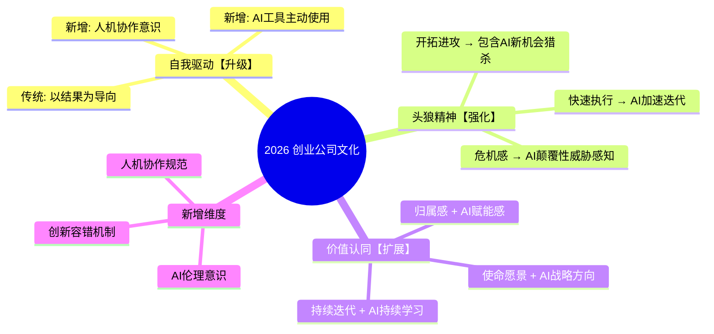
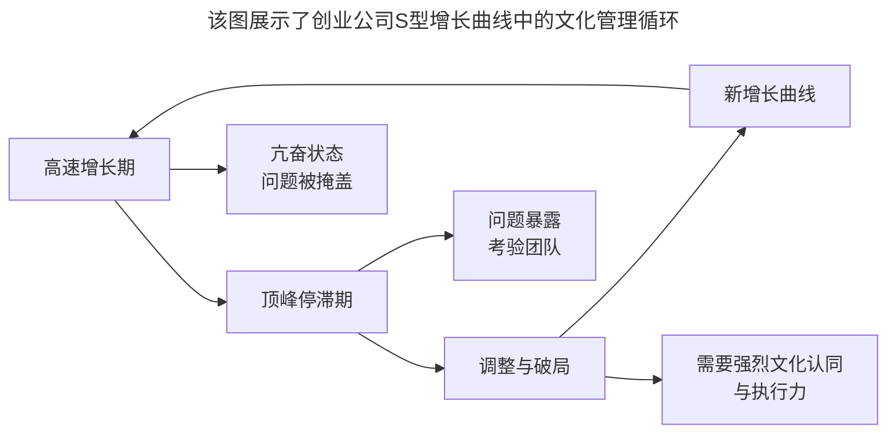

# 第100讲 | 徐裕键：团队文化建设，保持创业公司的战斗力

> **适用范围**：创业公司技术负责人与创始人、关注团队文化建设的研发管理者、探索AI时代文化升级的技术领导者
>
> **更新摘要**（v2）：在保留原文核心观点（自我驱动、头狼精神、价值认同三大文化支柱，以及Slogan传播、命名体系、技术嘉年华等文化落地方法）的基础上，融入2026年AI-Augmented文化新内涵，新增AI增强版文化落地方法、AI伦理意识与人机协作规范等新维度，将原文升级为适用于AI时代创业公司团队文化建设的实践指南。

---

## 一、导言

本文嘉宾徐裕键是贝贝网合伙人兼研发副总裁，负责贝贝技术团队管理，从0到1搭建贝贝移动电商产品和技术架构，推动集团各个技术领域快速演进，完善技术团队的梯队搭建和文化建设。围绕创业公司团队文化建设的实践进行了深入分享。

核心命题：**团队文化可以成为每个员工的行为准则，影响个人意识，当个人意识与团队文化达成一致时，团队就会逐渐走向成熟，并具备极强的战斗力。**

**关键术语对照**：
- S型增长曲线（S-Curve）：企业发展的阶段性增长模式
- 自我驱动（Self-driven）：以结果为导向的创业精神
- 头狼精神（Alpha Wolf Spirit）：开拓、进攻、猎杀的竞争意识
- 价值认同（Value Alignment）：对使命、愿景、价值观的共鸣
- 小白兔/老白兔：勤恳但不产生业绩的团队成员
- AI-Augmented文化：AI增强型组织文化
- AI Hackathon：AI黑客马拉松

---

## 二、核心方法论

### 2.1 创业公司发展路径：S型增长曲线

一个企业基业常青，它的发展路线必然会经历一个S型的增长曲线。以阿里巴巴为例，它最初专注于国内批发贸易市场做ToB业务，当ToB业务做到一定的规模后预感到天花板，又发现ToC领域有非常大的市场，于是创立了淘宝网。随后又推出支付宝、阿里旺旺、天猫商城、阿里云等。

每一个创业公司都必须经历这样的过程：不断地寻求新的业务增长点，预见问题、解决问题，并保持持续迭代，不断追求新的制高点。

**S型曲线中的团队考验**：每个S形迭代的过程中都有高速增长期和顶峰停滞期。在高速增长期，业务发展快，大家都会比较亢奋，很多问题都会被掩盖掉；然而当业务达到顶峰停滞期时，之前被掩盖的问题都会暴露出来，需要团队去做调整、寻找新的破局点。

### 2.2 自我驱动

在团队内部强调创业文化，强调自我驱动。希望在确定目标、明确方向之后，大家能够基于问题出发，以结果为导向，带着敢担当的精神做事情。同时也希望每个人都能带队伍冲锋、打胜仗。

**识别小白兔与老白兔**：团队中的Leader必须具备识别"小白兔"（勤勤恳恳干活但不生产业绩）与"老白兔"（加入团队时间较早，以过往功劳自居，也是勤恳但不产生业绩）的能力。对于这两类团队成员，管理者应该及时处理，该淘汰就淘汰，否则会影响其他团队成员的积极性与成长速度。

**AI时代升级**：从"以结果为导向"扩展到"AI工具主动使用"和"人机协作意识"。

### 2.3 头狼精神

所谓的头狼精神即开拓、进攻、猎杀。无论做到何种规模，想守住第一都很难，迟早会被别人超越，所以只有每时每刻具备危机感，保持敏锐，去发现新的机会，转守为攻，才能确保核心竞争力。

在创业公司，很多情况并不是考验员工的整体能力，而是考验员工的执行力——能否接受各种考验，能否主动突破问题、获取知识，能否做到快速执行，以及执行后能否做到持续迭代优化。

**AI时代升级**：开拓进攻包含AI新机会猎杀；快速执行靠AI加速迭代；危机感扩展到AI颠覆性威胁感知。

### 2.4 价值认同

在确定公司的使命、愿景及价值观这条文化建设道路上，需要花好几年的时间研究、借鉴优秀公司的文化价值观，逐渐形成属于自己的开发者文化。

**贝贝网的"悟空"文化**：把"悟空"设为文化关键词，发布系统叫"悟空"，新员工培训叫"大闹天宫"，老员工进阶叫"悟空训练营"，年度技术嘉年华叫"悟空说"。

**AI时代升级**：使命愿景+AI战略方向；归属感+AI赋能感；持续迭代+AI持续学习。

---

## 三、关键流程

### 3.1 2026年创业公司文化升级图

**图表说明**：该思维导图展示了2026年创业公司文化的升级框架。原有的三大支柱（自我驱动、头狼精神、价值认同）在AI时代分别进行了升级、强化和扩展，同时新增了AI伦理意识、人机协作规范和创新容错机制三个全新维度，构成了AI-Augmented文化的完整体系。

### 3.2 文化落地方法对比

| 方法 | 传统做法 | AI增强版 |
|-----|---------|---------|
| Slogan传播 | 口头强调 | +AI助手每日推送 |
| 技术分享 | 线下分享会 | +AI录制+智能检索 |
| 知识沉淀 | Wiki文档 | +AI知识图谱 |
| 文化活动 | 年度嘉年华 | +AI Hackathon |

### 3.3 S型增长曲线的文化管理

**图表说明**：该图展示了创业公司S型增长曲线中的文化管理循环。高速增长期团队亢奋但问题被掩盖；顶峰停滞期问题暴露，考验团队文化认同感和执行力；调整与破局期需要强烈的文化认同来支撑转型；随后进入新的增长曲线，循环往复。

### 3.4 技术嘉年华实践

贝贝网第一次举办技术嘉年华时：
- 针对五个领域、五大专题进行分享
- 时间定在每天晚上的七点到九点
- 每个专题每个晚上分享两到三个话题
- 虽然技术人员只有两三百人，但每天晚上会场都坐满甚至站满
- 吸引了很多产品组、运营组同学一起分享交流
- 满意度、认可度、赞赏度都非常高
- 团队成员可以互相借鉴彼此的经验，提升自己，获得成长

---

## 四、工具与实践

### 4.1 文化建设的三大支柱实践

**自我驱动**：
- 确定目标、明确方向
- 基于问题出发，以结果为导向
- 带着敢担当的精神做事情
- 每个人都能带队伍冲锋、打胜仗

**头狼精神**：
- 每时每刻具备危机感，保持敏锐
- 发现新的机会，转守为攻
- 接受各种考验，主动突破问题
- 快速执行并持续迭代优化

**价值认同**：
- 确定公司的使命、愿景及价值观
- 经常在技术团队提及公司文化的slogan
- 增强认同感、归属感与使命感
- 持续迭代对用户负责

### 4.2 文化落地的具体方法

1. **Slogan反复强调**：使大家增强认同感、归属感与使命感
2. **命名体系**：如"悟空"系列——发布系统、新员工培训、老员工进阶、技术嘉年华
3. **品牌活动**：技术嘉年华等高参与度活动
4. **满意度调研**：对活动进行满意度、认可度、赞赏度调研

### 4.3 团队成员管理

**识别与处理小白兔/老白兔**：
- 小白兔：勤勤恳恳干活，认认真真做事，但不生产业绩
- 老白兔：加入团队时间较早，以过往功劳自居，也是勤恳但不产生业绩
- 管理者应该及时处理，该淘汰就淘汰
- 否则会影响其他团队成员的积极性与成长速度

### 4.4 AI时代文化落地新方法

- [ ] 建立AI使用规范和安全指南
- [ ] 定期举办AI Hackathon
- [ ] 用AI助手每日推送文化Slogan
- [ ] 技术分享会录制+AI智能检索
- [ ] 知识沉淀从Wiki升级为AI知识图谱
- [ ] 建立"AI实践之星"月度评选机制

---

## 五、常见误区

### 陷阱一：高速增长期忽视文化建设

在高速增长期，业务发展快，大家都会比较亢奋，很多问题都会被掩盖掉。如果不在此阶段做好文化建设，到了顶峰停滞期问题暴露时就来不及了。

**应对建议**：在高速增长期就要未雨绸缪，建立文化认同感和执行力。

### 陷阱二：忽视小白兔和老白兔

勤恳但不产生业绩的成员如果不及时处理，会影响其他团队成员的积极性与成长速度，对公司的发展非常不利。

**应对建议**：团队Leader必须具备识别能力，该淘汰就淘汰。

### 陷阱三：蓝海幻想

很多人们以为是蓝海的领域，进去之后发现已经变成了红海。好的商业模式会让蓝海很快变成红海。

**应对建议**：创业者一定要有在红海中竞争的姿态。

### 陷阱四：文化建设一蹴而就的幻想

团队文化建设不是一蹴而就的事情，需要统一团队成员的文化价值观，使大家目标保持一致。

**应对建议**：持续积累和沉淀，将喊口号的内容做实、落地、体系化，并转型为生产力。

### 陷阱五：AI时代忽视文化升级（2026新增）

固守传统三大文化支柱，不注入AI基因。导致团队在AI转型中文化认同感不足，执行力下降。

**应对建议**：在自我驱动、头狼精神、价值认同三大支柱中注入AI基因，新增AI伦理意识、人机协作规范、创新容错机制。

---

## 六、进阶延展

### 6.1 核心金句

> "团队文化可以成为每个员工的行为准则，影响个人意识，当个人意识与团队文化达成一致时，团队就会逐渐走向成熟，并具备极强的战斗力。"

> "好的商业模式会让蓝海很快变成红海，所以创业者一定要有在红海中竞争的姿态。"

> "团队文化建设不是一蹴而就的事情——需要统一团队成员的文化价值观，使大家目标保持一致。"

### 6.2 贝贝网文化关键词"悟空"体系

| 活动 | 名称 | 目的 |
|------|------|------|
| 发布系统 | 悟空 | 技术品牌化 |
| 新员工培训 | 大闹天宫 | 入职文化融入 |
| 老员工进阶 | 悟空训练营 | 技能提升 |
| 年度技术嘉年华 | 悟空说 | 知识分享与交流 |

### 6.3 相关阅读建议

- 《成敏：创业公司为什么会技术文化产品缺失》——技术文化缺失的原因分析
- 《成敏：创业者不要成为自己公司产品技术文化的破坏者》——文化守护者的责任
- 《大咖对话-童剑：用合伙人管理结构打造完美团队》——团队组织模式选择

---

*本文基于极客时间原文升级，融入2026年AI-Augmented文化新内涵，旨在帮助创业公司在AI时代保持团队战斗力与文化认同感。*