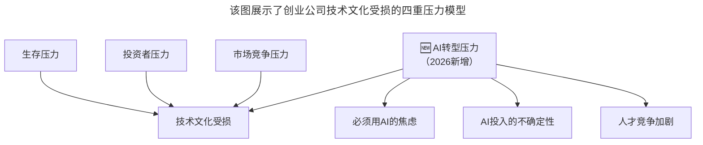
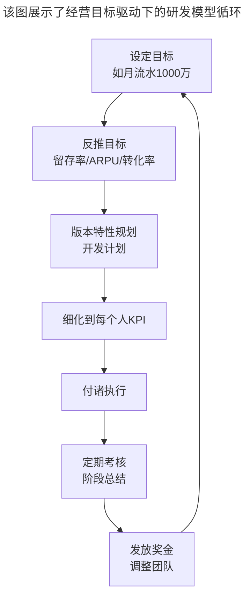

# 第110讲 | 成敏：创业公司为什么会技术文化产品缺失

> **适用范围**：创业公司创始人与技术管理者、面临生存压力与技术文化平衡的CTO、关注AI转型压力下技术文化守护的领导者
>
> **更新摘要**（v2）：在保留原文核心观点（三重生存压力导致技术文化缺失、经营目标驱动下的研发模型、市场文化压倒产品技术文化）的基础上，融入2026年AI时代新视角，新增AI转型压力作为第四重压力分析，以及AI时代带来的新机会（降低研发成本、用AI数据证明技术价值、AI创造差异化），将原文升级为适用于AI浪潮下技术文化守护的深度分析指南。

---

## 一、导言

本文嘉宾成敏围绕"创业公司为什么会技术文化产品缺失"这一话题进行了深入分析。很多创业公司的产品技术人员会觉得公司没有产品技术文化，或者市场驱动的文化盖过了产品技术文化。每个技术创业者在创业之前都是充满理想的，都会想要打造一个技术驱动、产品驱动、模式驱动的公司，但创业的压力实在是太大了。

核心命题：**资本裹挟和市场欲望是大部分创业公司的驱动力，这其实是创新缺失和产品技术文化缺失的主因。**

**关键术语对照**：
- KPI（Key Performance Indicator）：关键绩效指标
- 产品技术文化（Product & Technology Culture）：以产品和技术创新为核心的组织文化
- 经营目标驱动（Business Target Driven）：以收入和市场指标为核心的管理模式
- AI FOMO（Fear of Missing Out）：对AI潮流的错失恐惧
- AI转型压力（AI Transformation Pressure）：被迫进行AI改造的外部压力

---

## 二、核心方法论

### 2.1 三重生存压力

几乎所有创业公司从成立的第一天开始就面临巨大的生存压力：

**1. 基本的生存压力**：很多创业公司的起始资金都是创始人自己之前积累的血汗钱。公司从诞生之初就面临非常大的压力，每天一睁眼就是几千、几万甚至几十万的支出，账上的钱一直在减少，但收入却迟迟没有看到曙光。创业之前那些很优雅的想法，在生存的压力面前慢慢开始变形。

**2. 投资者压力**：投资者不是雷锋，投钱是为了获得超出预期的回报。可能投了一千万，但希望带来一个亿、十个亿甚至百个亿的回报。大部分投资者都会非常关注公司营收，经常问财务报表怎么样、营收有没有翻倍等。

**3. 激烈的市场竞争**：国内互联网行业竞争激烈，一旦出现一个新模式，马上会有几百上千家公司跟上。互联网时代的商业规则：赢家通吃，数一数二，不三不四——老大占据大部分市场，剩下的给老二，其他的都无声无息。

**AI时代新增**：AI转型压力成为第四重压力——必须用AI的焦虑、AI投入的不确定性、人才竞争加剧。

### 2.2 经营目标驱动下的研发模型

这三重生存压力带来了公司的经营压力，而有经营压力就一定会有经营目标。

很多创业公司在第一年、第二年比较随性，但到了第三年、第四年之后，就需要开始做公司的年度商业计划，公司开始向经营目标驱动的模式靠近。这时导致产品技术文化受伤的情况是：所有的计划最终都会落到一个个数据指标、一个个KPI上。

KPI本身没有原罪，它只是一个工具，只是KPI往往太过强调收入，很容易导致公司整体以经营目标为驱动，忽视了产品技术文化。

### 2.3 市场文化压倒产品技术文化

在这种市场文化之下，产品研发人员最怕的就是需求——每天面对来自市场的需求、来自领导的需求、竞争对手带来的需求、架构需求、规划需求、用户反馈的需求等。

对于开发人员来说，这些大都是在满足市场和领导的需求，其中可能还有一些很傻的需求，他们也不得不做。而在市场人员眼里，他们完全不会觉得这些需求有问题，因为都有可能给公司带来营收。

**长久处在市场驱动的文化下**：研发人员一定会疲惫，效率就必然会不断降低。面对这种现象，有些公司可能会从流程改进、绩效考核、员工激励等方面着手，但如果不从根本上解决产品技术文化缺失的问题，依然是治标不治本。

---

## 三、关键流程

### 3.1 AI时代的四重压力模型

**图表说明**：该图展示了创业公司技术文化受损的四重压力模型。传统的三重压力（生存、投资者、市场竞争）在2026年新增了AI转型压力——包括必须用AI的焦虑、AI投入的不确定性以及人才竞争加剧。这四重压力共同作用，导致技术文化进一步受损。

### 3.2 AI时代的新机会

| 挑战 | AI时代的转机 |
|-----|------------|
| 生存压力 | AI降低研发成本，小团队也能做大事 |
| 投资者压力 | 用AI数据证明技术价值 |
| 竞争压力 | AI创造差异化可能 |
| **AI转型焦虑** | **主动拥抱 vs 被动应对** |

### 3.3 经营目标驱动下的研发模型流程

**图表说明**：该图展示了经营目标驱动下的研发模型循环。从设定目标开始，反推各项指标，规划版本特性，细化到个人KPI，执行后进行定期考核和总结，最终根据考核情况发放奖金和调整团队，形成闭环。所有环节都围绕经营目标运转，产品技术人员的创意让位于KPI驱动。

### 3.4 市场文化与技术文化的冲突

产品技术文化是带有一定理想主义色彩的，每一个技术出身的创业者都希望公司是产品驱动、技术驱动、模式驱动，但实际在执行的时候，往往最先进入状态的是市场驱动。

**冲突表现**：
- 开发人员关键词：加班、版本、进度、急
- 领导施压："你们的进度怎么这么慢，新版本怎么还没做好"
- 强制执行："新版本赶快出，无论如何这周末必须给我上"
- 长期后果：研发人员疲惫，效率降低

---

## 四、工具与实践

### 4.1 技术文化守护的AI时代策略

**不要让"AI转型"成为第四重压垮技术文化的稻草，而要让AI成为解放创造力、回归产品本质的工具。**

- [ ] 用AI降低研发成本：AI辅助编码、测试、文档生成
- [ ] 用AI数据证明技术价值：用数据说话，而非"感觉"
- [ ] 用AI创造差异化：寻找AI能带来的独特竞争优势
- [ ] 主动拥抱AI而非被动应对：制定AI战略而非盲目跟风

### 4.2 平衡市场文化与技术文化

1. **需求统一管理**：将客户需求、领导需求、竞品需求、架构需求等一律放入需求池，统一管理
2. **集体决策**：通过集体决策、分工协作等方式，把各个需求分解到各个版本里去慢慢实现
3. **保持迭代节奏**：减少变更，实在不能按期完成时，也要尽可能保住节奏
4. **避免一刀切**：不要让KPI只强调收入，要包含技术指标和创新指标

### 4.3 创业者自我管理

创业者都是非常有理想的人，为了实现创业理想，即使没有外界压力，他们自身也会给自己施加很大的压力。再加上激烈的市场压力、生存压力和资本压力，更是如座座大山压在创业者肩头心头，导致公司的实际情况离最初创业时的理想模式越来越远。

**应对建议**：
- 时刻提醒自己创业的初心
- 定期反思：我们是在追求理想还是在追逐KPI？
- 在生存与理想之间找到平衡点
- 用AI工具提升效率，释放时间用于创新

---

## 五、常见误区

### 陷阱一：KPI只强调收入

KPI本身没有原罪，但往往太过强调收入，导致公司整体以经营目标为驱动，忽视了产品技术文化。

**应对建议**：KPI应包含技术指标、创新指标和团队成长指标，而非仅关注收入。

### 陷阱二：市场文化一家独大

市场驱动的文化下，研发人员疲于应对各种市场和领导压过来的需求，创意让位于KPI驱动。

**应对建议**：在市场文化和技术文化之间做出平衡，为研发人员保留一定的创新空间。

### 陷阱三：流程改进治标不治本

从流程改进、绩效考核、员工激励等方面着手提高团队效率可能起一时之功，但如果继续任由产品技术文化缺失，依然是治标不治本。

**应对建议**：从根本上解决产品技术文化缺失的问题，而非只在流程层面做修补。

### 陷阱四：AI转型焦虑（2026新增）

不要让"AI转型"成为第四重压垮技术文化的稻草。盲目投入AI基础设施、因AI恐慌做出短视决策，都会进一步损害技术文化。

**应对建议**：让AI成为解放创造力、回归产品本质的工具，而非新的压力来源。

### 陷阱五：忽视创业者的自我施压

创业者自身就会给自己施加很大的压力，再加上外界压力，容易导致理想变形。

**应对建议**：时刻提醒自己创业的初心，在生存与理想之间找到平衡点。

---

## 六、进阶延展

### 6.1 核心金句

> "资本裹挟和市场欲望是大部分创业公司的驱动力，这其实是创新缺失和产品技术文化缺失的主因。"

> "不要让'AI转型'成为第四重压垮技术文化的稻草，而要让AI成为解放创造力、回归产品本质的工具。"

> "互联网时代的商业规则：赢家通吃，数一数二，不三不四。"

### 6.2 三重压力与AI时代转机总结

| 压力类型 | 传统表现 | AI时代转机 |
|---------|---------|-----------|
| 生存压力 | 资金消耗、收入不确定 | AI降低研发成本，小团队也能做大事 |
| 投资者压力 | 高回报期望、频繁过问 | 用AI数据证明技术价值 |
| 市场竞争压力 | 赢家通吃、不进则退 | AI创造差异化可能 |
| AI转型压力（新增） | 必须用AI的焦虑 | 主动拥抱vs被动应对 |

### 6.3 相关阅读建议

- 《成敏：创业者不要成为自己公司产品技术文化的破坏者》——如何避免成为文化破坏者
- 《成敏：创业者应该具备的认知与思维方式》——创业者的认知升级
- 《徐裕键：团队文化建设，保持创业公司的战斗力》——团队文化建设的实践方法

---

*本文基于极客时间原文升级，融入2026年AI时代第四重压力分析与新机会视角，旨在帮助创业公司在AI浪潮中守护产品技术文化。*