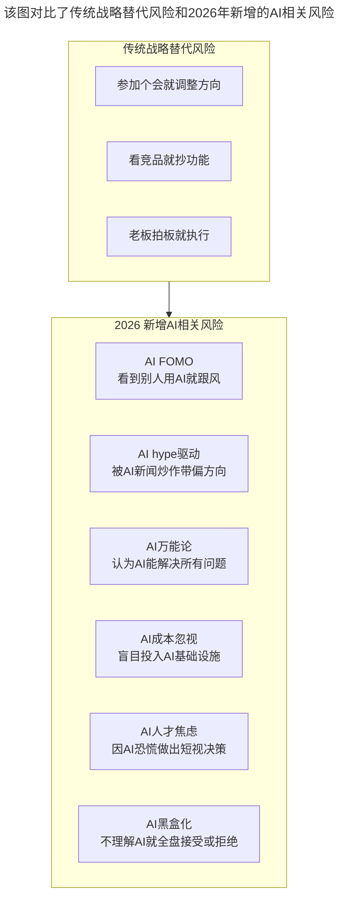
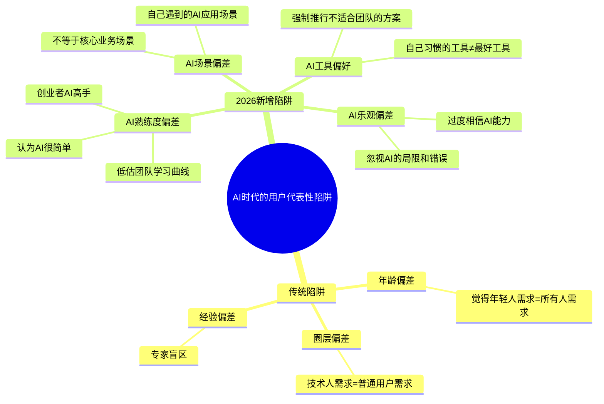

# 第137讲 | 成敏：创业者不要成为自己公司产品技术文化的破坏者

> **适用范围**：创业公司创始人与CEO、关注技术文化守护的技术管理者、面临AI转型决策的创业者
>
> **更新摘要**（v2）：在保留原文核心观点（不要用战略代替用户需求、别把自己当主流用户代表、建立与产品技术相适应的管理体系）的基础上，融入2026年AI时代新风险，新增AI FOMO等六种AI相关决策风险、AI时代用户代表性陷阱、管理体系的AI时代升级（考核激励AI适配、职业通道AI双轨制、人才梯队新分类、培训体系AI内容升级），将原文升级为适用于AI时代技术文化守护的完整实践指南。

---

## 一、导言

本文嘉宾成敏围绕"创业者不要成为自己公司产品技术文化的破坏者"这一核心命题进行了深入剖析。创业者在创业的过程中要克制自己，不要让自己成为自己公司产品文化的破坏者。但往往在现实中，很多时候创业者不自知地就扮演了这样一个角色。

核心命题：**创业者要克制自己，不要不自知地成为技术文化的破坏者。**

**关键术语对照**：
- 需求池（Requirements Pool）：统一管理所有需求的机制
- 独狼/农民/英雄：团队成员的三种类型分类
- AI FOMO（Fear of Missing Out）：对AI潮流的错失恐惧
- AI Fluency：AI素养，理解和应用AI的基本能力
- AI Pioneer：AI先锋，主动探索新AI工具、推动团队采纳的人
- AI Champion：AI推广者，在技术专长之外推动AI adoption的人

---

## 二、核心方法论

### 2.1 不要用战略代替用户需求

很多创业者创业路上走了一段时间后，往往会偏离最初的出发点。IDG资本的统计显示，大部分成功上市或成功退出的企业，最终的业务模式和战略方向，跟他们找融资时提供的商业计划书里所承诺的几乎都是不同的。

互联网行业瞬息万变，调整方向并没有什么不妥，关键在于是如何调整方向的。很多情况是创始人出去参加了个会，或是跟同行交流后，觉得人家这模式特别好，自己回来也要做，就成了所谓的"战略方向调整"——用这种上层的战略调整，替代产品的一线反馈，去驱动产品运营。

**正确方式**：通过各种用户数据、市场数据、业务数据去迭代产品，去调整方向。互联网的行业天条是要顺应用户需求去设计产品，而不能凭空创造用户需求。

**AI时代新风险**：AI FOMO（看到别人用AI就跟风）、AI hype驱动（被AI新闻炒作带偏方向）、AI万能论（认为AI能解决所有问题）、AI成本忽视（盲目投入AI基础设施）、AI人才焦虑（因AI恐慌做出短视决策）、AI黑盒化（不理解AI就全盘接受或拒绝）。

### 2.2 别把自己当成主流用户代表

创业经常犯的另外一个错误是，经常把自己当成主流用户，并把自己的需求当成主流用户的需求。而互联网行业三大理论基础中的长尾理论表示，个人的需求只是长尾中间某一个非常细分的点上的需求，只能代表自己，不能代表主流用户。

**正确方式**：把自己的需求当成所有需求的来源之一，无论是客户的、用户的、领导的、还是内部规划的，任何需求一律放入需求池，统一管理。然后通过集体决策、分工协作等方式，把各个需求分解到各个版本里去慢慢实现。

**AI时代延伸**：创业者可能是AI的超级用户（每天使用10+小时），但团队可能是初学者或抵触者。你的"AI直觉"不能代表用户的"AI需求"，更不能代表团队的"AI承受力"。

### 2.3 尽早建立与产品技术相适应的管理体系

一般创业公司在早期规模还比较小的时候，可以用"一俊遮百丑"来形容——如果公司的模式势不可挡，带来了巨大的营收和利润，那就可以掩盖公司运转中的各种问题。但从长远来看，公司还是需要尽早在内部建立起一套与产品技术相适应的管理体系，特别是当公司人数到了200人以上之后。

**三大要素**：
1. **考核、薪酬、激励制度**：在产品技术运用和市场导向中取得合理的平衡
2. **职业通道和人才梯队**：清晰可行的上升通道和各个职业层级明确的要求
3. **技术培训体系**：和产品技术职业发展通道关联的培训体系

---

## 三、关键流程

### 3.1 AI时代"用战略代替需求"的新风险



**图表说明**：该图对比了传统战略替代风险和2026年新增的AI相关风险。传统风险包括参加个会就调整方向、看竞品就抄功能、老板拍板就执行；AI时代新增了六种风险——AI FOMO、AI hype驱动、AI万能论、AI成本忽视、AI人才焦虑和AI黑盒化。这些新风险共同构成了AI时代创业者"用战略代替需求"的新表现。

### 3.2 创业者AI决策自查清单

| 检查项 | 警示信号 | 正确做法 |
|-------|---------|---------|
| **AI采用动机** | "因为竞品用了" / "因为AI很火" | **基于真实业务痛点和数据** |
| **AI投入节奏** | 一次性大规模投入 | **小步快跑、验证ROI后再扩展** |
| **AI期望管理** | "AI能帮我们省50%人力" | **设定合理预期（通常20-40%）** |
| **AI工具选择** | 追逐最新最炫的工具 | **基于团队实际能力选型** |
| **AI风险评估** | 只看收益不看风险 | **评估数据安全、依赖、成本等风险** |

### 3.3 AI时代用户代表性陷阱



**图表说明**：该思维导图展示了AI时代的用户代表性陷阱。传统陷阱包括年龄偏差、圈层偏差和经验偏差；2026年新增了AI熟练度偏差、AI乐观偏差、AI工具偏好和AI场景偏差四种新陷阱。创业者作为AI的超级用户，容易低估团队的学习曲线，过度相信AI能力，强制推行不适合团队的方案。

### 3.4 团队成员分类法的AI时代升级

| 类型 | 传统定义 | 2026定义 | 占比建议 |
|-----|---------|-----------|---------|
| **英雄** | 承担极难任务并成功 | + 能设计AI解决方案攻克难题 | 10-15% |
| **农民** | 脚踏实地配合团队 | + 可靠使用AI工具稳定产出 | 70-80% |
| **独狼** | 能力强但难合作 | + AI能力强但不愿分享/规范使用 | <5% |
| **🆕 AI Pioneer** | （无） | 主动探索新AI工具、推动团队采纳 | 5-10% |

**特别提醒**："独狼"在AI时代更加危险——他们可能使用不规范的方式使用AI（如输入敏感数据到公开LLM），给团队带来安全和合规风险。

### 3.5 职业通道的AI双轨制

```
传统单轨:
技术路线: 初级 → 中级 → 高级 → 专家 → 架构师
管理路线: 工程师 → Lead → Manager → Director → VP

2026 双轨+AI:
技术路线:
├── 传统技术轨道 (不变)
└── AI技术轨道: AI使用者 → AI熟练者 → AI架构师 → AI战略家

管理路线:
├── 传统管理轨道 (不变)
└── AI管理轨道: AI推广者 → AI Leader → AI Director → AI VP

交叉发展:
├── 技术专家可转AI Champion（不转管理也能有影响力）
├── 管理者需具备AI Fluency（不懂AI无法带好AI时代团队）
└── 鼓励"AI+X"复合型人才（AI+产品/AI+运营/AI+销售）
```

---

## 四、工具与实践

### 4.1 管理体系AI时代升级

#### 考核激励制度的AI适配

| 维度 | 传统做法 | 2026 AI增强 |
|-----|---------|--------------|
| **绩效考核** | 业务目标完成度 | + AI使用情况、AI增效指标、AI分享贡献 |
| **薪酬结构** | 工资+奖金+期权 | + AI技能津贴、算力补贴、AI项目奖金 |
| **晋升标准** | 技术深度+业务贡献 | + AI能力等级、AI影响力、AI创新成果 |
| **激励机制** | 季度/年度评优 | + 月度AI实践之星、季度AI创新奖 |

#### 培训体系的AI内容升级

| 层级 | 传统培训内容 | 2026新增内容 |
|-----|-------------|---------------|
| **新人** | 公司文化、基础流程 | + AI工具入门、AI使用规范、AI安全指南 |
| **初级** | 技术栈深入、业务理解 | + Prompt Engineering、AI辅助编程最佳实践 |
| **中级** | 架构设计、项目管理 | + AI工作流设计、AI Code Review、AI效能优化 |
| **高级** | 战略思维、领导力 | + AI战略规划、AI团队建设、AI伦理治理 |

### 4.2 创业者AI自检问卷（每月一次）

1. **我是否因为FOMO而推动某个AI项目？** → 如果是，暂停，重新评估真实需求
2. **我是否在团队准备好之前强制推行AI工具？** → 如果是，放慢速度，先做试点
3. **我对AI的期望是否现实？** → 对照行业benchmark调整预期
4. **我是否给团队足够的AI学习时间和资源？** → 如果没有，立即补充预算和时间
5. **我的AI决策是否有数据和实验支撑？** → 如果没有，先做POC再决定

### 4.3 避免"AI文化破坏者"行为清单

| ❌ 破坏行为 | ✅ 正确做法 |
|-----------|-----------|
| 在没有验证的情况下宣称"AI能解决一切" | 设定清晰的AI适用边界和预期 |
| 要求团队立即全面使用某AI工具 | 小范围试点→收集反馈→逐步推广 |
| 因为自己擅长AI就低估学习难度 | 为团队提供充足培训和过渡期 |
| 用AI新闻/竞品驱动产品决策 | 基于用户研究和数据做决策 |
| 忽视AI带来的团队焦虑和文化冲击 | 积极沟通、提供支持、建立安全感 |

### 4.4 需求管理实践

1. **统一需求池**：把所有需求（客户、用户、领导、内部规划）一律放入需求池
2. **集体决策**：通过集体决策、分工协作分解需求到各个版本
3. **保持节奏**：尽可能保持迭代节奏，减少变更
4. **马拉松思维**：稍微慢一点没关系，重要的是保持节奏

---

## 五、常见误区

### 陷阱一：用战略代替用户需求

创始人出去参加了个会，觉得人家模式特别好，回来就调整方向——这种"一拍脑袋"的需求放到市场中一试基本都不会有很好的效果，但给公司带来的伤害却非常大。

**应对建议**：通过各种用户数据、市场数据、业务数据去迭代产品，而非凭空调整。

### 陷阱二：把自己当主流用户代表

个人需求只是长尾中间某一个非常细分的点上的需求，只能代表自己，不能代表主流用户。

**应对建议**：把所有需求放入需求池统一管理，通过集体决策分解到版本中。

### 陷阱三：AI FOMO驱动决策（2026新增）

看到别人用AI就跟风，被AI新闻炒作带偏方向，认为AI能解决所有问题。

**应对建议**：基于真实业务痛点和数据做AI决策，小步快跑、验证ROI后再扩展。

### 陷阱四：忽视AI带来的团队焦虑

创业者可能是AI的超级用户，但团队可能是初学者或抵触者。强制推行AI工具会导致团队焦虑和文化冲击。

**应对建议**：为团队提供充足培训和过渡期，积极沟通、提供支持、建立安全感。

### 陷阱五："独狼"在AI时代更危险

AI时代的"独狼"可能使用不规范的方式使用AI（如输入敏感数据到公开LLM），给团队带来安全和合规风险。

**应对建议**：建立明确的AI使用规范和安全指南，控制"独狼"占比在5%以下。

### 陷阱六：一俊遮百丑

创业公司早期如果模式势不可挡，可以掩盖各种问题。但当公司人数到200人以上后，必须建立与产品技术相适应的管理体系。

**应对建议**：尽早建立考核激励制度、职业通道和人才梯队、技术培训体系。

---

## 六、进阶延展

### 6.1 核心金句

> "创业者要克制自己，不要不自知地成为技术文化的破坏者。"

> "AI是一把双刃剑：用好了效率革命、竞争力飞跃；用不好团队分裂、文化崩溃、安全危机。"

> "作为创业者，你对AI的态度和使用方式会直接塑造公司的AI文化——你理性谨慎，团队也会理性采纳；你盲目跟风，团队也会焦虑混乱。"

### 6.2 技术文化建设AI Checkpoint

- [ ] 公司是否有明确的AI使用规范和安全指南？
- [ ] 是否有AI相关的激励措施（正向+负向）？
- [ ] 是否定期举办AI分享和学习活动？
- [ ] 是否建立了AI失败案例的安全分享机制？
- [ ] 管理层是否都达到了基本的AI Fluency水平？

### 6.3 团队成员分类法详解

比较合理且合适的团队成员组成是：**1-2名英雄 + 大多数的农民 + 极少量的独狼**。

- **独狼**：优秀的程序员，但喜欢独自一人去解决问题，容易引起团队内部问题和纠纷
- **农民**：脚踏实地、有条不紊地了解周边情况、配合团队工作、推进项目运转的普通程序员
- **英雄**：能承担需要极大努力才能完成的任务并最终取得成功的人，能够与他人配合
- **AI Pioneer（2026新增）**：主动探索新AI工具、推动团队采纳的人

### 6.4 相关阅读建议

- 《成敏：创业公司为什么会技术文化产品缺失》——技术文化缺失的原因分析
- 《成敏：创业者应该具备的认知与思维方式》——创业者的认知升级
- 《徐裕键：团队文化建设，保持创业公司的战斗力》——团队文化建设的实践方法

---

*本文基于极客时间原文升级，融入2026年AI时代技术文化守护的新风险与新策略，旨在帮助创业者在AI浪潮中做"技术文化守护者"而非"AI文化破坏者"。*