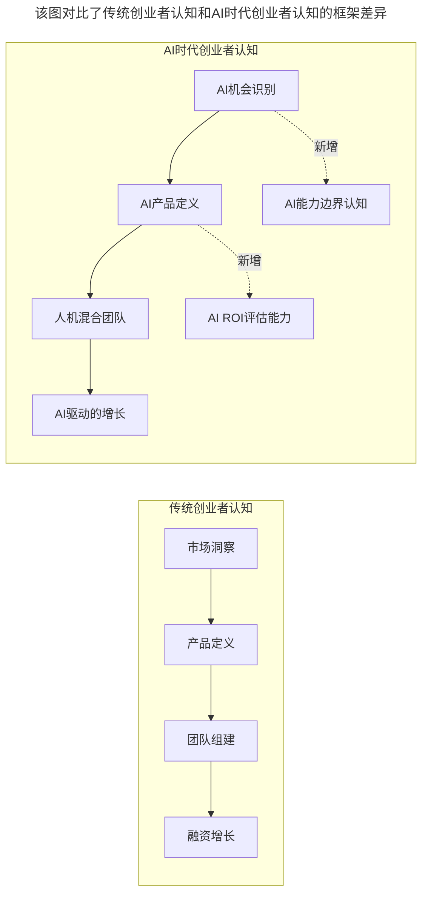
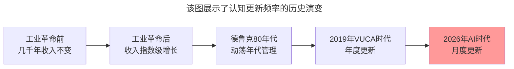

# 第139讲 | 成敏：创业者应该具备的认知与思维方式

> **适用范围**：创业公司创始人与技术管理者、关注认知升级的创业者、在AI时代寻求思维突破的技术领袖
>
> **更新摘要**（v2）：在保留原文三大核心认知（思考存在的意义、时时更新认知、创业是思维的洗礼）的基础上，融入2026年AI时代新视角，新增AI时代创业者认知升级框架、认知维度AI增强对照表，以及"以月为单位更新AI知识库"的新要求，将原文升级为适用于AI时代创业者认知与思维转型的完整指南。

---

## 一、导言

本文嘉宾成敏围绕"创业者应该具备的认知与思维方式"进行了深入分享。创业是人生一次颠覆式的选择，会对人生起到非常大的影响。如果不能够想明白自己为什么要活着，或者从来不去思考这些问题，然后就去创业，很容易在半途中迷失方向。

核心命题：**创业最大的收获是对思维的洗礼——大多数创业者创业前和创业后最本质的差别就是他们的思维方式。**

**关键术语对照**：
- VUCA时代：易变（Volatile）、不确定（Uncertain）、复杂（Complex）、模糊（Ambiguous）的时代
- 认知更新（Cognitive Renewal）：不断接触新信息、理解变化的过程
- 思维洗礼（Thinking Baptism）：创业过程中思维方式被不断重塑的经历
- AI知识库（AI Knowledge Base）：个人或组织关于AI技术和应用的认知体系

---

## 二、核心方法论

### 2.1 创业者要去思考自己存在的意义

当你想走出创业这一步的时候，一定要想清楚能支撑你去创业的核心原因是什么。这其实会上升到一些哲学的层面——你要先想明白自己存在的意义、活着的意义。

不仅是创业，几乎所有的领域中真正有成就、有杰出贡献的人都会思考这个问题。甚至于我们今天看到的社会的发展、人类的进步，都是来自于思考这些问题的人。在现实中，大多数的人可能一辈子都没有真正有效地去思考过这个问题，但如果你选择创业，就不能再忽视或逃避这个问题。

这样的思考带来的是你对自己清晰的定位——你知道自己想要什么样的生活，想要做什么样的事情，想要成为什么样的人。当你创业时，你就能找准自己的出发点和想要达成的目标，面对各种抉择时不会感到迷茫。

**AI时代扩展**：存在意义的思考从"为什么创业"扩展到"AI如何放大我的使命？"——技术不再是工具，而是使命的放大器。

### 2.2 创业者要时时更新自己的认知

创业者还要多多提升自己的认知，方式就是不断接触更多的人和事，接触更多的信息，然后理解它们。

德鲁克早在上个世纪80年代出版的《动荡年代的管理》一书中，就第一次明确提出了变化对商业社会的冲击。而现在商业社会的动荡程度和当时相比，至少多了一个量级。如今是VUCA时代——易变、不确定、复杂、模糊。

理解变化、拥抱变化成为创业者的必修课。之前一个企业要做十年、二十年才可能成长为独角兽，而如今很多创业公司短短几年之内就能成长为独角兽。与此同时，一个企业从成长起来再到失败可能也只需要很短的时间。

**AI时代强化**：成敏老师说的"时时更新认知"在AI时代意味着**以月为单位更新你的AI知识库**——这不是可选项，而是生存必需品。

### 2.3 创业最大的收获是对思维的洗礼

并不是每个创业者都会成功，但不论最终结果如何，每一次创业都是对创业者思维方式的巨大洗礼。

当你真正投入创业之后，之前想得再多还是会遇到各种各样新的情况。你会不断地被问各种各样的问题，也会不断地遇到问题。很多问题可能是你之前从来没有做过的事情，这个时候就会逼迫你在不断的决策过程中，把每件事情都真真正正地想清楚。

因为你一旦偷懒，不去想明白就去决策的时候，世界会立刻还你以颜色——你做出的决定很可能会导致特别糟糕的结果。

即使最后创业失败了，这样的思维方式也会成为最大的财富。不管面对多大的困境，创业者一定要具备某些信念，其中最重要的一点就是要永远相信未来会更好。

**AI时代新增**：创业是思维的洗礼，在AI时代还要加上"人机协作决策训练"——学会在AI建议和人类直觉之间找到平衡。

---

## 三、关键流程

### 3.1 AI时代创业者认知升级框架

**图表说明**：该图对比了传统创业者认知和AI时代创业者认知的框架差异。传统认知从市场洞察到融资增长的线性路径，在AI时代升级为从AI机会识别到AI驱动增长的新路径，新增了AI能力边界认知和AI ROI评估能力两个关键维度。

### 3.2 认知维度AI增强对照

| 认知维度 | 传统要求 | 2026年新增 |
|---------|---------|----------|
| **存在意义** | 为什么创业 | + AI如何放大我的使命？ |
| **认知更新** | 跟踪行业变化 | + 跟踪AI技术演进（月级别） |
| **思维洗礼** | 商业决策训练 | + 人机协作决策训练 |
| **信念支撑** | 相信未来 | + 理性看待AI机遇与风险 |

### 3.3 VUCA时代的认知更新频率

**图表说明**：该图展示了认知更新频率的历史演变。从工业革命前几千年收入几乎不变，到工业革命后指数级增长，再到德鲁克80年代提出动荡年代管理，2019年VUCA时代要求年度更新，2026年AI时代已经要求以月为单位更新认知——认知更新的频率在持续加速。

---

## 四、工具与实践

### 4.1 创业者认知升级实践

1. **思考存在意义**：问自己"我为什么要创业？"和"AI如何放大我的使命？"
2. **时时更新认知**：以月为单位更新AI知识库，跟踪行业和AI技术变化
3. **接受思维洗礼**：在不断的决策过程中，把每件事情都真真正正地想清楚
4. **保持信念**：永远相信未来会更好，同时理性看待AI机遇与风险

### 4.2 认知更新的具体方法

- 不断接触更多的人和事
- 接触更多的信息，然后理解它们
- 与不同行业的人交流，获取多元视角
- 用AI工具加速信息获取和理解（如AI辅助阅读行业报告）
- 定期复盘，反思自己的认知是否需要更新

### 4.3 创业决策的思维训练

创业过程中会不断面临各种决策：
- 来自用户的、客户的、合作伙伴的、员工的各种问题
- 需求要不要做、要不要招人、要不要裁员等运营决策
- 有些是之前经历过的，有些是从未做过的

**核心原则**：一旦偷懒不去想明白就去决策，世界会立刻还你以颜色。在AI时代，这意味着不能盲目依赖AI建议做决策——AI提供分析，人类做最终判断。

---

## 五、常见误区

### 陷阱一：不思考存在的意义就创业

不想明白自己为什么要活着就去创业，很容易在半途中迷失方向。虽然不排除有些人运气好没想明白也赚钱了，但这毕竟是少数，这样的创业者也很难做出真正对行业对社会有益的企业。

**应对建议**：在创业前先想清楚能支撑你创业的核心原因。

### 陷阱二：认知不更新

如果我们不时时更新自己的认知，就极有可能落后于这个世界。在AI时代，认知更新的频率需要从年度提升到月度。

**应对建议**：以月为单位更新AI知识库，持续跟踪技术和行业变化。

### 陷阱三：偷懒决策

一旦偷懒，不去想明白就去决策的时候，世界会立刻还你以颜色——做出的决定很可能会导致特别糟糕的结果。

**应对建议**：在不断的决策过程中，把每件事情都真真正正地想清楚。

### 陷阱四：失去信念

面对创业中的各种困境，如果失去信念就很难走下去。

**应对建议**：永远相信未来会更好，这样的信念会支撑你面对任何困难。

### 陷阱五：过度依赖AI决策（2026新增）

在AI时代，过度依赖AI建议做决策，忽视人类直觉和独立思考。

**应对建议**：人机协作决策训练——AI提供数据和分析，人类做最终判断。

---

## 六、进阶延展

### 6.1 核心金句

> "创业最大的收获是对思维的洗礼——大多数创业者，创业前和创业后最本质的差别就是他们的思维方式。"

> "成敏老师说的'时时更新认知'在AI时代意味着以月为单位更新你的AI知识库——这不是可选项，而是生存必需品。"

> "不管面对多大的困境，创业者一定要具备某些信念，其中最重要的一点就是要永远相信未来会更好。"

### 6.2 相关阅读建议

- 《成敏：创业公司为什么会技术文化产品缺失》——技术文化缺失的原因分析
- 《成敏：创业者不要成为自己公司产品技术文化的破坏者》——文化守护者的责任
- 《创业公司CTO的认知升级》——CTO认知升级路径

---

*本文基于极客时间原文升级，融入2026年AI时代创业者认知升级框架，旨在帮助创业者在AI浪潮中完成认知与思维的持续进化。*