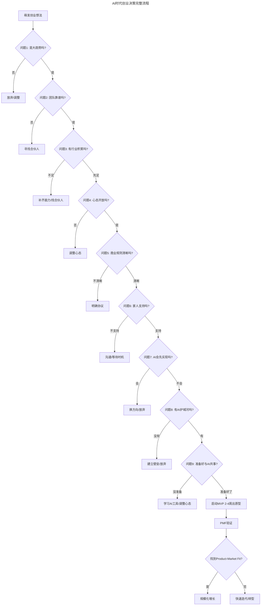
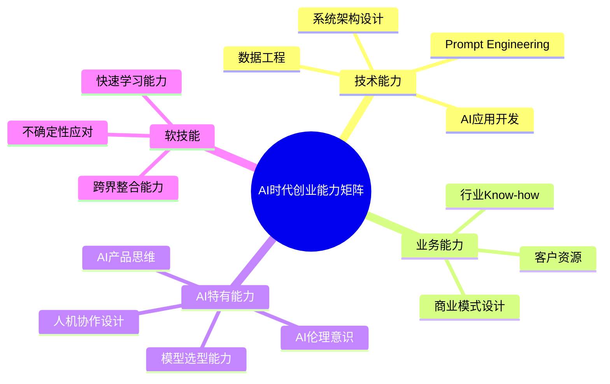

# 第41讲 | 技术人创业前要问自己的六个问题

> **适用范围**：有意向创业的技术人、正在评估创业机会的技术管理者，以及已经创业但希望复盘决策的技术创业者；同样适用于AI时代需要回答新增三个问题（AI会先实现吗/护城河是什么/准备好与AI共事吗）的技术创业者。
>
> **更新摘要（v2 · 2026-08 更新）**：
> - 结构化升级为 6 节骨架（导言 / 核心方法论 / 关键流程 / 工具与实战 / 常见误区 / 进阶延展）
> - 将张新波的"创业六问"与2026年AI时代新增三问整合为"6+3"问题框架
> - 补充AI时代创业决策完整流程图与关键数字参考
> - 保留全部Mermaid图、数据表与两段创业经历对比

---

## 1. 导言

从2002年大学毕业到现在这十几年职业生涯，虽然只经历过四家公司，但是有一半时间是在创业过程中，经历过第一次创业惨痛的失败，也体验过目前创业的快速发展小有所成。创业的过程无比精彩，也无比痛苦，它有可能让你功成名就，更有可能让你一败涂地，因此创业前做好深入的思考和充分的准备是十分有必要的。

我的第一段创业经历是在2005年，一个朋友拉我到杭州做一个短信移动搜索的创业项目。然而这次看起来美好的创业，最后却一败涂地，自己也深陷泥潭浪费了至少两年的时间。第二段创业经历是在2013年底，当我们CEO邀请我一起创业做一家专业的第三方风控公司时，如今公司已经迈入独角兽行列。

回头再看这两段创业经历，比较相似——创始人都是我非常熟悉的人，都是技术出身，一开始都拿了非常知名的投资机构的钱——但同样四年左右的时间，结果却完全不同。是什么原因导致了这两段创业结果有如此巨大的差距？总结下来，我觉得除了运气之外，在创业前的六个关键问题上的答案差异导致了完全不同的结果。

到了2026年，原文的六个问题依然有效，但需要增加AI维度的考量——当创业成本降低90%，"能不能做"不再是核心问题，"该不该做"和"AI会不会替代"才是关键。

上图展示了AI时代创业决策的完整流程：从萌发想法→六问评估→新增三问（AI会先实现吗/有AI护城河吗/准备好与AI共事）→启动MVP→PMF验证→规模化增长或快速迭代。原版六问加上AI时代新增三问，构成了更完整的创业前自我评估框架。

---

## 2. 核心方法论

### 2.1 问题一：做的事情在今后5到10年，是否是一个大的趋势

第一次创业时做短信搜索，当时虽然以功能机为主，但智能手机已经开始流行——然而我自己从来没有想过短信搜索以后是不是可以做得长久。第二次创业做同盾时，当时互联网正处在高速发展中，个人信息的保护却并不完善，网络上的各种欺诈非常猖獗，以数据驱动的模式做第三方风控是个不错的方向。

AI时代的真趋势：Agent生态爆发（多Agent协作成为标配）、AI重构工作流（每个行业都会被AI重做一遍）、人机协作新模式（AI Copilot、AI teammate）。纯AI套壳（没有真实场景和数据的伪需求）不是真趋势。

### 2.2 问题二：有没有跟对老板/合伙人

第一次创业的伙伴做事比较固执，认准一个方向就会一头扎进去，对外界的变化不是很敏感。第二次创业的CEO有对风控的热爱、出色的学习能力、有领袖气质、能吸引和说服人才加入团队，以及从体系外从零打造一个风控体系并推销到各个事业部的销售能力。

AI时代新增考察点：是否理解AI的能力边界？对AGI时间表的判断？是否亲自使用AI工具？能否接受AI辅助决策？红色警报：创始人说"我们要用AI颠覆XX"但自己从没用过ChatGPT。

### 2.3 问题三：是否有足够多的行业积累

第一次创业时只有三年纯开发的经验，既没有搜索经验，也没有自然语言处理的经历。第二次创业时经过阿里四年的锻炼，经验、见识、人脉都有了很大的提升，并且做的是风控这个老本行。

AI时代关键洞察：**行业积累+AI能力**的组合比纯技术能力更有价值。最好的创始团队是"懂行业的AI人"或"懂AI的行业人"。

### 2.4 问题四：是否有足够开放的心态

技术出身的人往往会陷入"我技术好就是比其他竞争对手牛"的虚幻中。第一次创业时老总坚持觉得技术是最牛的，没法接受移动互联网带来的变化。第二次创业时CEO迅速把自己变成了一个销售、一个全能战士。

AI时代的开放心态要求：对AI替代的坦然、对失败的宽容（AI项目失败率高达70%）、对合作的开放（愿意与AI工具、AI Agent协作）、对变化的适应（每季度都要重新评估技术栈和商业模式）。

### 2.5 问题五：是否尊重商业规则

一开始大家就要把利益分配的事情谈清楚，不管事后看来是否合理，只要是双方当时都认可的就应该遵守。

AI创业的特殊商业规则：AI生成内容的IP归属、数据资产确权、模型资产估值、AI伦理责任。建议协议条款：明确AI生成内容的IP归属、定义数据使用的边界和权限、约定模型迭代和优化的投入分配、制定AI伦理审查机制、设定里程碑式的股权兑现条件。

### 2.6 问题六：是否取得家人的支持

创业要想取得阶段性的成功是一个非常漫长的过程，早期一定是拿非常低的薪资，没有太多精力和时间照顾家人。家人是否能够理解和支持是至关重要的。

2026年的好消息：创业成本降低，经济压力减小；AI工具提升效率，工作时间可能缩短；远程办公普及。坏消息：AI创业节奏更快，需要持续高强度学习；行业变化快，职业不确定性增加。

---

## 3. 关键流程

### 3.1 AI时代创业前的三个新增问题

**问题七：这个创业方向，AI会先于我实现吗？**
- 如果OpenAI/Google/百度宣布要做这个方向，你还有优势吗？
- 你的壁垒是数据、场景还是算法？（算法最容易被复制）
- 如果巨头开源了类似方案，你的差异化在哪里？

**问题八：我的AI能力护城河是什么？**
- ❌ "我会用ChatGPT" → 这不是护城河
- ❌ "我有最新论文" → 论文很快会被复现
- ✅ "我有独家数据" → 这是真壁垒
- ✅ "我理解细分场景痛点" → 这是商业壁垒
- ✅ "我能快速迭代产品" → 这是执行壁垒

**问题九：我准备好与AI Agent共事了吗？**
- [ ] 你是否习惯让AI完成50%以上的编码工作？
- [ ] 你能否接受AI给出的方案比你想象的更好？
- [ ] 你是否建立了AI辅助决策的工作流？
- [ ] 你是否清楚哪些事情应该交给AI，哪些必须人工？

### 3.2 创业前3个月必做

1. **深度使用AI**：每天用AI工具工作8小时以上，真正理解其能力和局限
2. **验证需求真实性**：找到10个潜在客户，确认他们愿意付费
3. **构建最小可行团队**：1个创始人+1个技术合伙人+AI Agent
4. **明确退出策略**：想清楚什么情况下会放弃

---

## 4. 工具与实战

### 4.1 创业后第一个季度目标

- [ ] 用AI做出MVP并上线
- [ ] 获得100个种子用户
- [ ] 验证PMF（至少10个付费客户）
- [ ] 建立可重复的客户获取渠道
- [ ] Unit Economics跑正（LTV > 3× CAC）

### 4.2 关键数字参考（2026年）

| 指标 | 种子轮 | A轮 | B轮 |
|------|-------|-----|-----|
| 团队规模 | 2-5人 | 5-15人 | 15-50人 |
| MRR目标 | ¥5-20万 | ¥50-200万 | ¥200万+ |
| 估值区间 | ¥0.5-2亿 | ¥2-10亿 | ¥10亿+ |
| Burn Rate | ¥5-15万/月 | ¥30-100万/月 | ¥100万+/月 |

### 4.3 AI时代创业能力矩阵

上图展示了AI时代创业者的能力矩阵：技术能力（AI应用开发/Prompt Engineering/系统架构/数据工程）、业务能力（行业Know-how/客户资源/商业模式设计）、AI特有能力（模型选型/AI产品思维/人机协作设计/AI伦理意识）、软技能（快速学习/不确定性应对/跨界整合）四个维度构成完整的能力图谱。

### 4.4 两段创业经历对比

| 维度 | 第一段创业（短信搜索） | 第二段创业（同盾科技） |
|------|---------------------|---------------------|
| 趋势判断 | 智能手机已兴起但没意识到 | 互联网欺诈猖獗，长期存在 |
| 合伙人 | 固执，对外界变化不敏感 | 有领袖气质，学习能力强 |
| 行业积累 | 无搜索和NLP经验 | 阿里4年风控经验 |
| 开放心态 | 坚持技术最牛，不接受变化 | 迅速变成全能战士 |
| 结果 | 一败涂地 | 迈入独角兽 |

---

## 5. 常见误区

### 5.1 没有深入思考趋势就仓促开始

第一次创业时只是想快点开始一段新的工作和生活，从来没有想过短信搜索以后是不是可以做得长久。记住顺势而为这个道理。

### 5.2 "我是合伙人，我的意见你必须听"

千万不要有这种想法。如果最高级决策者一意孤行，那就直接配合做好执行。

### 5.3 技术好就是比竞争对手牛

技术上的先进不代表产品上的先进，技术上的成功也不代表商业上的成功。创立和运营一家公司是一个非常复杂的系统工程，技术只是其中一小部分。

### 5.4 "我会用ChatGPT"就是AI护城河

这不是护城河。真正的壁垒是独家数据、对细分场景痛点的理解、以及快速迭代产品的能力。

### 5.5 忽视AI会先于自己实现的可能性

如果你的创业方向是巨头一个功能更新就能实现的，那你的壁垒在哪里？算法最容易被复制，数据和场景才是真正的护城河。

---

## 6. 进阶延展

### 6.1 结语

创业是一件极其有挑战也极其有成就感的一件事情，如果人生当中没有经历过，肯定是一个遗憾。如果你想清楚了，就撸起袖子加油干吧，尽自己最大的努力，准备迎接最坏的打击，永远期待最好的结果。

2026年的核心洞察：AI时代创业，"能不能做"不再是核心问题（AI降低了门槛），"该不该做"（是否有真实需求和护城河）和"AI会不会替代"（巨头是否一步就能实现）才是关键。

### 6.2 作者简介与来源

张新波，同盾科技联合创始人&技术VP，TGO鲲鹏会杭州分会会长。2009年加入阿里巴巴，成为国际交易风控与反欺诈团队的早期成员。本文基于极客时间《技术领导力实战笔记》第41讲内容，并融合2026年AI时代升级注解。
