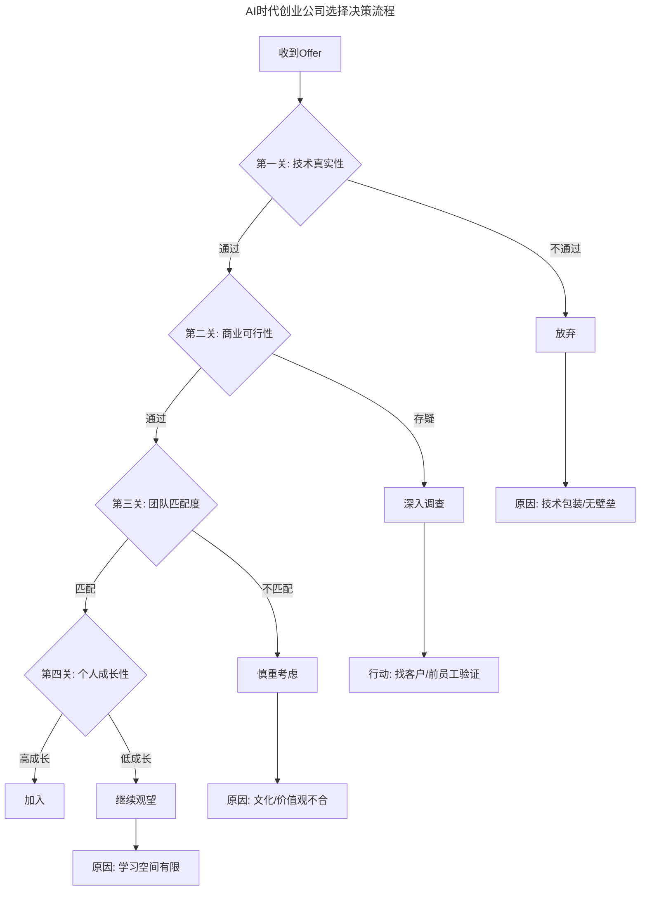
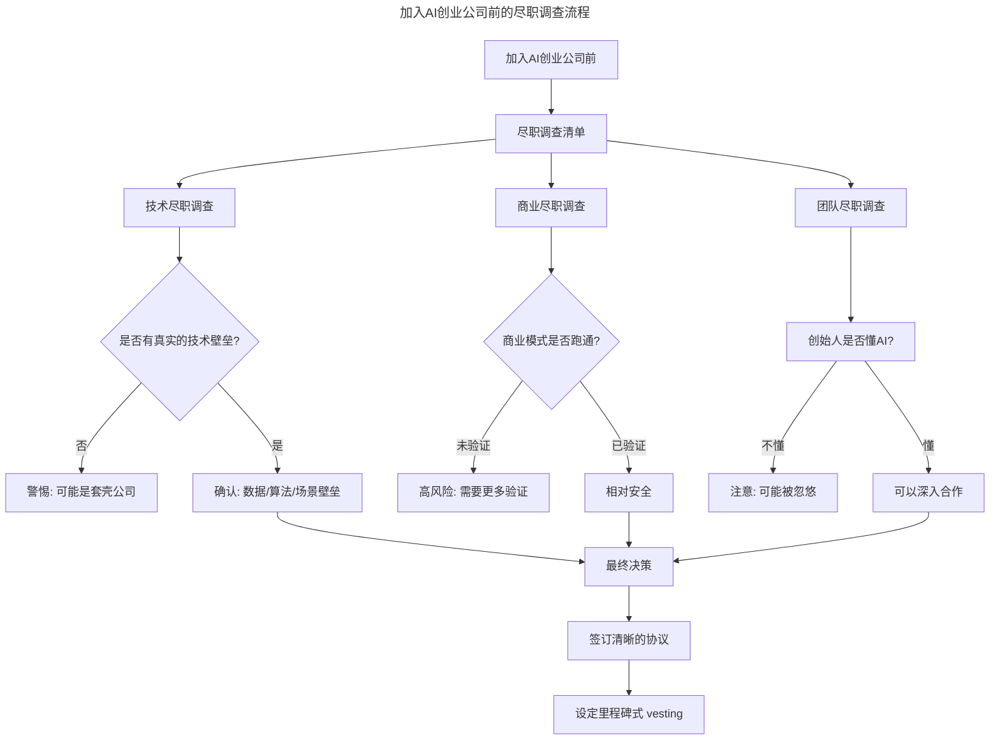

# 第40讲 | 技术人投身创业公司之前，应当考虑些什么？

> **适用范围**：准备加入创业公司或正在评估创业机会的技术人员、技术管理者、AI时代技术从业者
>
> **更新摘要**（v2）：在保留原文三大"非技术因素"考量（放下技术骄傲、加深人性认识、与业务打成一片）的基础上，融入2026年AI时代创业生态的新特征，新增AI创业公司尽职调查清单、技术真实性判断框架、AI时代创业公司选择决策流程图等内容，将原文升级为适用于AI浪潮下的结构化决策指南。

---

## 一、导言

技术人投身创业公司之前，面临的核心挑战往往不是技术问题，而是"非技术因素"。运气不好充其量是不成功，认命就好；但准备不充分，即便有好运气也可能错过甚至被坑。

本模块围绕技术人加入创业公司前必须考虑的三大非技术因素展开，并结合2026年AI时代创业生态（AI Agent可替代3-5人团队、创业成本降低90%）进行系统性升级，帮助技术人做出更理性的职业选择。

**关键术语对照**：
- 创业公司（Startup）：处于早期发展阶段、追求高速增长的创新型企业
- PMF（Product-Market Fit）：产品市场匹配，指产品满足市场需求的程度
- ARR/MRR（Annual/Monthly Recurring Revenue）：年度/月度经常性收入
- Burn Rate：资金消耗速率
- Runway：资金可支撑的运营时长
- Vesting：期权归属机制，通常按时间分期兑现

---

## 二、核心方法论

技术人投身创业公司前，需要从三个维度进行"非技术因素"的系统性评估。这三个维度在AI时代有了新的内涵，但底层逻辑不变。

### 2.1 放下技术的骄傲

许多投身创业的技术人之前已取得足够多的成绩，但往往低估了"惯性"——忘了自己之前的成绩都是在某个专门领域做出的。投身创业后，"技术"的范围相当广泛，所有和电脑、网络有关的事情都归"技术"管，所有"技术"有关的问题都只能靠少数技术人员搞定。

**AI时代的新内涵**：
- 过度依赖AI：认为有AI就能解决一切，忽视业务理解
- Prompt工程师傲慢：觉得写Prompt比理解业务更重要
- 技术栈优越感：沉迷于选择最好的AI模型而非解决真问题

**AI时代的正确心态**：
```
传统思维：我是技术专家 → 我来解决技术问题
AI时代思维：我是业务问题解决者 → 我用AI工具来加速
```

### 2.2 加深对人性的认识

创业是九死一生的博弈，能成功的人寥寥无几。技术人员对人性的认识往往不够深，没有足够的防范意识。许多技术人员选择做技术，正是因为"不喜欢、不擅长与人打交道"，思维带有计算机的惯性：这个事情就"应当"是这样。

在商业世界的利益格局里，人性的复杂体现得淋漓尽致，尤其是在"创业成功，价值增长成百上千倍"的考验下，人心如何变化实在没有保障也很难琢磨。

**AI时代新增风险点**：
- 股权稀释风险：AI公司估值波动大，期权可能大幅缩水
- 技术替代焦虑：担心自己被AI替代，影响决策理性
- 信息不对称加剧：创始人可能用AI概念包装，实际并无核心技术

### 2.3 与业务的人打成一片

创业公司的一大特点是"麻雀虽小，五脏俱全"。加入创业公司，打交道的人数变少了，但接触的业务更多了，接触的人也更复杂了——这让相当多的技术人员不适应，认为合作伙伴"心思不单纯"。

与其抱怨，不如去观察他们是怎么搞定各种事情的；与其抱怨业务繁杂，不如去了解为何业务这么繁杂，时刻记住"公司要生存"。只有和大家充分交流，你才能从完整的角度理解公司的这盘生意，从价值链的角度看待自己的工作。

**AI时代如何帮助你融入业务**：
1. 快速理解业务：用AI分析行业报告、竞品、用户反馈
2. 成为业务赋能者：主动用AI工具帮助业务团队提效
3. 建立翻译能力：成为"业务语言↔AI语言"的翻译官

---

## 三、关键流程

### 3.1 AI时代创业公司选择决策流程

以下流程图展示了技术人在收到创业公司Offer后的系统性决策流程，涵盖技术真实性、商业可行性、团队匹配度和个人成长性四道关卡：



**流程说明**：上述决策流程图展示了从收到Offer到最终决策的完整路径。每一关都是一道筛选门槛，任何一个环节不通过都应触发对应的处理动作（放弃、调查、慎重考虑或观望），避免因单一维度判断失误导致整体决策偏差。

### 3.2 加入AI创业公司前的尽职调查流程



**流程说明**：该尽职调查流程从技术、商业、团队三个维度展开，每个维度都有明确的判断标准和风险提示。最终决策需要三个维度同时通过，并辅以清晰的协议和里程碑式期权归属机制保障自身权益。

### 3.3 加入前后的行动节点

**加入前必做**：
1. 技术审计：花1周时间深入了解公司的技术栈和AI应用程度
2. 客户访谈：至少访谈3个客户，验证需求真实性
3. 财务审查：看burn rate、runway、unit economics
4. 团队评估：与每个核心成员1v1交流，了解团队文化

**加入后必做**：
1. 第一个月：专注理解业务，不要急着展示技术能力
2. 用AI建立信任：主动用AI工具帮助团队解决实际问题
3. 记录一切：保留关键决策的证据，保护自己的权益
4. 持续学习：每周花10小时学习最新的AI进展

---

## 四、工具与实践

### 4.1 AI时代创业公司的新特征对比

| 维度 | 2018年（原文时代） | 2026年（当前） |
|------|-------------------|-----------------|
| 技术门槛 | 需要专业开发团队 | AI辅助+Prompt工程 |
| 团队配置 | 5-10人全职 | 1-3人+AI Agent |
| 资金消耗 | 每月20-50万 | 每月2-5万（主要是API费用） |
| 产品迭代周期 | 2-4周/版本 | 1-3天/版本 |
| 失败成本 | 时间+金钱+机会成本 | 主要为时间成本 |

### 4.2 关键问题清单（2026版）

加入AI创业公司前，必须回答以下关键问题：

- [ ] 公司的核心竞争力是什么？（数据？算法？场景？）
- [ ] 是否有真实的付费客户？ARR/MRR是多少？
- [ ] 技术团队中，有多少人是真正在做核心研发？
- [ ] 创始人对AI的理解深度如何？
- [ ] 公司的AI策略是什么？自研模型还是调用API？
- [ ] 股权结构是否清晰？我的期权比例是多少？

### 4.3 红色警报信号

以下信号出现时，应高度警惕：

- 创始人说"我们用AI颠覆XX行业"但说不出具体场景
- 技术团队超过50人但核心产品还没上线
- 没有付费客户，只有"战略合作"
- 股权结构复杂，你的期权池不清晰

### 4.4 用AI快速了解新业务领域

```python
# 示例：用AI快速了解新业务领域
prompt = """
我刚刚加入一家[行业]创业公司，担任技术负责人。
请帮我梳理：
1. 这个行业的核心商业模式有哪些？
2. 常见的技术挑战和解决方案？
3. 我应该重点关注哪些业务指标？
4. 如何快速建立与业务团队的信任？
"""
# 用GPT-5.5/Claude等生成行业洞察
```

---

## 五、常见误区

### 陷阱一：技术骄傲导致水土不服

**原文案例**：一位技术很好的朋友加入创业公司负责技术，但干了不长时间就退出了，理由是"公司太不正规了，难以适应，连办公室Wi-Fi不稳定也总是找我"。他离开之后，公司发展得也相当好。

**AI时代的对应陷阱**：认为有AI就能解决一切，忽视业务理解；沉迷于选择最好的AI模型而非解决真问题。

**规避方法**：做好足够的心理准备，在创业公司你不仅是"用AI的人"，更是"教团队用AI的人"。

### 陷阱二：对人性的认识不足

**原文案例**：一位朋友在师兄弟的拉拢下加入某创业公司，拼死拼活干了四五年，终于盼来公司大好形势，却发现承诺给自己的股票早已在暗地里大打折扣。更悲催的是，他还不能发作，如果发作，剩下的那部分也拿不到手。

**AI时代的对应陷阱**：AI公司估值波动大，期权可能大幅缩水；创始人可能用AI概念包装，实际并无核心技术。

**规避方法**：加深对人性的理解，签订清晰的协议，设定里程碑式vesting。不要以为签了白纸黑字的合同就可以高枕无忧。

### 陷阱三：脱离业务自我隔离

**原文警告**：如果你考察一百家创业公司，起码有九十九家都是"接触业务更多、接触的人更复杂"的状态。如果一定要分个对错，那么不对的一定是你——是你没有弄清楚形势，或者说，缺乏足够的业务感知。

**AI时代的对应陷阱**：用AI工具把自己封闭在技术世界里，不去和业务团队交流，认为"有AI就够了"。

**规避方法**：主动承担非技术工作（如产品定义、用户调研），用AI提升效率但不要替代人际交流。

---

## 六、进阶延展

### 6.1 AI时代创业环境的历史性变化

当创业成本降低90%，AI Agent可以替代3-5人团队，技术人投身创业公司的决策逻辑需要全面升级——不仅要考虑"能不能成"，更要考虑"AI会不会替代这个创业方向本身"。

这意味着评估创业机会时，除了传统的市场/团队/资金分析，还需要增加一个新维度：**这个方向是否会被AI巨头直接覆盖？**如果OpenAI/Google/百度宣布要做这个方向，你还有优势吗？

### 6.2 延伸思考

技术人员加入创业公司，遇到的问题通常不是技术问题，难倒他们的也通常不是技术问题。正因为如此，重视非技术问题，在加入之前就考虑清楚，这些再怎么强调也不为过。

在AI时代，这个原则更加重要：AI降低了技术门槛，但提高了对商业判断力、人性和业务理解力的要求。最好的技术人创业者，不是技术最强的，而是最能放下技术骄傲、最能理解人性和业务的。

### 6.3 相关阅读建议

- 《技术人创业前要问自己的六个问题》——本系列配套文章，提供更系统的创业前自评框架
- 《技术创业该如何选择赛道》——赛道选择方法论
- 《大咖对话-技术人创业前衡量自我的3P3C模型》——3P3C创业能力评估模型

---

*本文基于极客时间《技术领导力实战笔记》第40讲原文升级，融入2026年AI创业生态现状，旨在帮助技术人在AI浪潮中做出更理性的职业选择。*