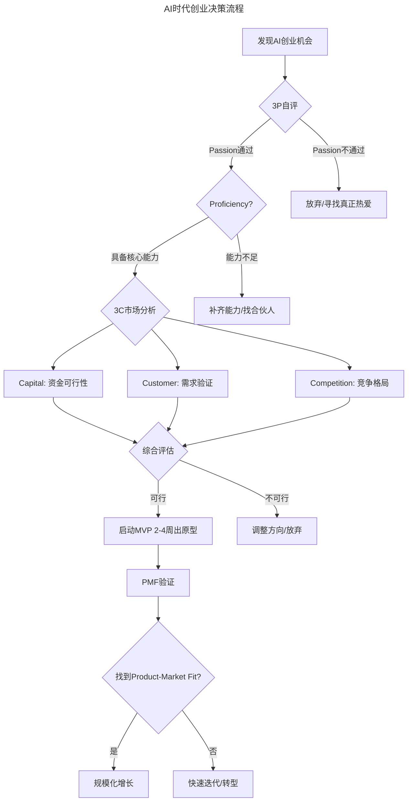
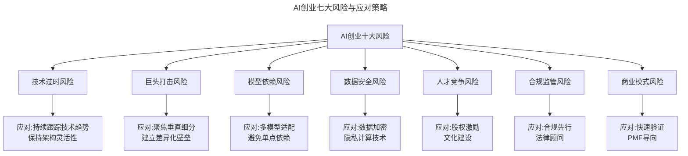

# 第37讲 | 技术创业该如何选择赛道

> **适用范围**：Infra（基础设施）领域创业者、底层架构方向技术创业者，以及正在评估创业赛道的技术管理者；同样适用于AI时代面临赛道选择重构（Agent生态、垂直AI应用、AI赋能传统行业）的技术创业者。
>
> **更新摘要（v2 · 2026-08 更新）**：
> - 结构化升级为 6 节骨架（导言 / 核心方法论 / 关键流程 / 工具与实战 / 常见误区 / 进阶延展）
> - 将熊飞的"三大方向+四要素"与2026年AI创业赛道重构整合
> - 补充AI时代创业成本断崖式下降数据与经典案例对比
> - 保留全部Mermaid图、数据表与Infra创业Tips

---

## 1. 导言

这两年，技术创业，特别是Infra创业有一些新趋势出现。第一，资本市场开始认可，国内3~5亿美金估值规模的公司大量增加。第二，商业开始认可，这些公司已经形成商业化的收入，好几家收入规模已经达到亿元量级。第三，创业机会极大增加，随着大数据、云计算在各个领域的使用越来越深入，大家对底层架构的要求越来越高。

到了2026年，当GPT-5.5、DeepSeek V4等大模型将编程成本降低90%，84%开发者已习惯AI协作编程，Agent生态进入加速落地期——技术创业的赛道选择逻辑正在发生根本性重构。

| 维度 | 2018年（原文时代） | 2026年（当前） | 变化幅度 |
|------|-------------------|-----------------|---------|
| 启动资金 | 100-500万 | 10-50万 | 降低90% |
| 团队规模 | 5-10人 | 1-3人(+AI Agent) | 减少70% |
| MVP周期 | 3-6个月 | 2-4周 | 缩短80% |
| 技术门槛 | 需要专业开发团队 | AI辅助+Prompt工程 | 大幅降低 |

---

## 2. 核心方法论

### 2.1 趋势背后的三大原因

**第一个原因是人的问题。** 人越来越贵，劳动力成本越来越高，所以大家都在思考怎么去自动化。以运维为例，运维越来越复杂化，运维人员也越来越贵、越来越不好招，所以大家拼命想把运维自动化。

**第二个原因是各行各业的业务互联网化已成为核心趋势。** 以银行为例，面对互联网金融公司的冲击，IT问题已经从锦上添花变成生死存亡的问题。以电商为例，几百万买安全产品，大促时能帮助拦截羊毛党，挽回一两个亿的损失——IT Infrastructure已经从锦上添花变成必然的基础设施。

**第三个原因是各行各业都认清了数据的价值。** 不管用不用得上，先把数据收集上来再说。数据量在暴涨，对数据处理的实时性、分布式等都提出了更高的要求。

### 2.2 三大创业方向

**方向一：数据。** 数据量暴涨带来存储、整合等领域的巨大机会；数据对实时性的要求越来越高；新型数据格式（图数据、IoT等）；在线数据分析。

**方向二：新技术架构变迁。** 容器衍生出安全、运维等多方面的问题；Lambda、Serverless；软件定义的存储、软件定义的网络。

**方向三：机器学习应用。** 自适应的安全、自适应的运维、自适应的很多方向。在安全和运维两个领域已经出现了很不错的创业公司。

### 2.3 赢得资本青睐的四要素

**一是先人一步。** 在Infra领域创业没有捷径，最笨最有效的办法就是先人半步。千万不能等到20%、30%的人都觉得这是个好方向了你再去做。只有你是行业最先行的人，你才能跟观念和理念最先行的客户碰撞在一起。

**二是在大市场中去系统性解决问题。** 技术类创业偶尔会步入一个误区——切入的点太小，虽然当前增速快但天花板太低。天花板这事儿就要比当前的增速重要无数倍。

**三是一流的相互信任和互补的团队。** GrowingIO的例子：4个人大部分来自LinkedIn，之前就共事了4-5年，彼此非常信任，团队成员间非常互补。

**四是要尽可能深入思考发展路径。** 才云的例子：和谷歌一起开源了Kubeflow（TensorFlow On Kubernetes），一下子把公司的天花板拉高了10倍。

### 2.4 2026年AI创业三大新机遇

1. **Agent生态创业**：AI Agent平台（多Agent协作框架、Agent市场）、垂直领域Agent（法律/医疗/财务/客服）、Agent基础设施（工具调用、记忆管理、多模态交互）
2. **垂直领域AI应用**：AI+SaaS（用AI重构传统SaaS）、AI+传统行业（制造/农业/教育/医疗）、AI+内容创作
3. **AI赋能传统行业**：企业AI转型咨询、AI培训与教育、AI数据处理服务

---

## 3. 关键流程

### 3.1 创业决策流程图（2026版）

上图展示了AI时代创业决策的完整流程：从发现机会→3P自评（Passion/Proficiency/Persistence）→3C市场分析（Capital/Customer/Competition）→综合评估→启动MVP（2-4周出原型）→PMF验证→规模化增长或快速迭代。

### 3.2 AI创业十大风险及应对

上图展示了AI创业的七大核心风险及对应应对策略：技术过时（持续跟踪+架构灵活）、巨头打击（聚焦垂直+差异化壁垒）、模型依赖（多模型适配）、数据安全（加密+隐私计算）、人才竞争（股权激励+文化）、合规监管（合规先行+法律顾问）、商业模式（快速验证+PMF导向）。

---

## 4. 工具与实战

### 4.1 Infra创业五个Tips

1. **选择早期标杆用户**：非常反逻辑地选那些事多钱少麻烦的客户，因为只有这样的客户才是真正能够帮助你把产品打磨成行业一流的客户。
2. **抵制项目制诱惑**：在早期项目制就是毒药，时间窗比收入重要一千倍。只有产品制才有未来。不过如果项目里有很多代码、功能是能被复用的、能标准化的，那它就是积累的资产。
3. **耐得住寂寞**：最好的Infra产品无不都是憋了1-2年，这是Infrastructure的客观规律。
4. **Leverage开源并利用口碑效应**：未来3-5年，国内每一两年至少会有2-3家很不错的开源公司出现。
5. **从科技公司到商业科技公司**：这才是公司走得更长远的必然基础。

### 4.2 经典案例对比（2026年）

| 公司 | 创立年份 | 初始团队 | 核心业务 | 2026年估值 |
|------|---------|---------|---------|-----------|
| Midjourney | 2021 | 11人 | AI图像生成 | $100亿+ |
| Cursor | 2022 | 4人 | AI代码编辑器 | $30亿+ |
| Perplexity | 2022 | 8人 | AI搜索引擎 | $90亿+ |
| HeyGen | 2020 | 3人 | AI视频生成 | $50亿+ |

> 注：上表估值为市场公开报道口径，随融资进展变动较快，仅供参考。

关键洞察：这些公司的共同点是**极小团队+AI杠杆**，证明了AI时代"小而美"的创业模式完全可行。

### 4.3 对技术创业者的建议

1. **先用AI做出MVP**：不要一开始就组建大团队，1个人+AI Agent就能验证想法
2. **选择AI能10倍提效的领域**：内容生成、数据分析、客服、代码生成等
3. **关注Agent生态机会**：这是2026年最大的结构性机会
4. **建立数据壁垒**：算法会越来越同质化，数据才是真正的护城河
5. **保持技术敏感度**：每季度评估一次技术栈是否需要调整

### 4.4 七牛云案例

七牛2012年左右开始做云存储，当时大家都觉得这个东西太早了。但后来像美图这些公司在云端存储、图片存储上遇到巨大问题，在市面上看了一圈之后，发现只有七牛能满足他们的需求。借助这样一批早期的一流客户，公司自然就跑起来了。

---

## 5. 常见误区

### 5.1 切入的点太小

技术类创业偶尔会步入一个误区——切入的点太小，虽然当前增速很快，但公司的天花板太低。天花板比当前的增速重要无数倍。

### 5.2 等大家都觉得好再去做

千万不能等到20%、30%的人都觉得这是个好方向了你再去做，这样等你把产品做出来的时候，可能80%的人都知道了，而且市面上也早就有不错的产品了。

### 5.3 早期陷入项目制

在早期项目制就是毒药，所有的人力开发都会陷进去，而时间窗比收入重要一千倍。一个Infrastructure的时间窗也就2-3年。

### 5.4 算法当作护城河

AI时代算法会越来越同质化。真正的护城河是数据、场景理解和快速迭代能力，不是算法本身。

---

## 6. 进阶延展

### 6.1 3P3C模型升级版（AI时代）

原文强调的数据、新技术架构、机器学习三大方向，在2026年演变为更系统的3P3C决策框架：

**3P - 个人维度：**
- Passion（热情）：对AI技术的真正热爱，而非跟风
- Proficiency（能力）：AI技术应用能力、Prompt Engineering、系统设计
- Persistence（坚持）：AI创业同样需要1-2年的沉淀期

**3C - 市场维度：**
- Capital（资本）：AI创业资金需求降低，但算力成本成为新考量
- Customer（客户）：找到愿意为AI付钱的真需求，而非伪需求
- Competition（竞争）：与巨头、开源、同行的三重竞争

### 6.2 对投资人的建议

1. 重新评估团队规模：3人团队的AI公司可能比30人的传统公司更有价值
2. 关注Unit Economics：AI降低了固定成本，更要关注边际成本和LTV/CAC
3. 警惕AI泡沫：区分真需求和伪需求，看收入而非用户数

### 6.3 来源

本文整理自经纬创投董事总经理熊飞在GTLC全球技术领导力峰会上的精彩分享。熊飞于2011年加入经纬中国，负责考察、筛选及评估互联网领域的投资机会。本文基于极客时间《技术领导力实战笔记》第37讲内容，并融合2026年AI时代升级注解。
