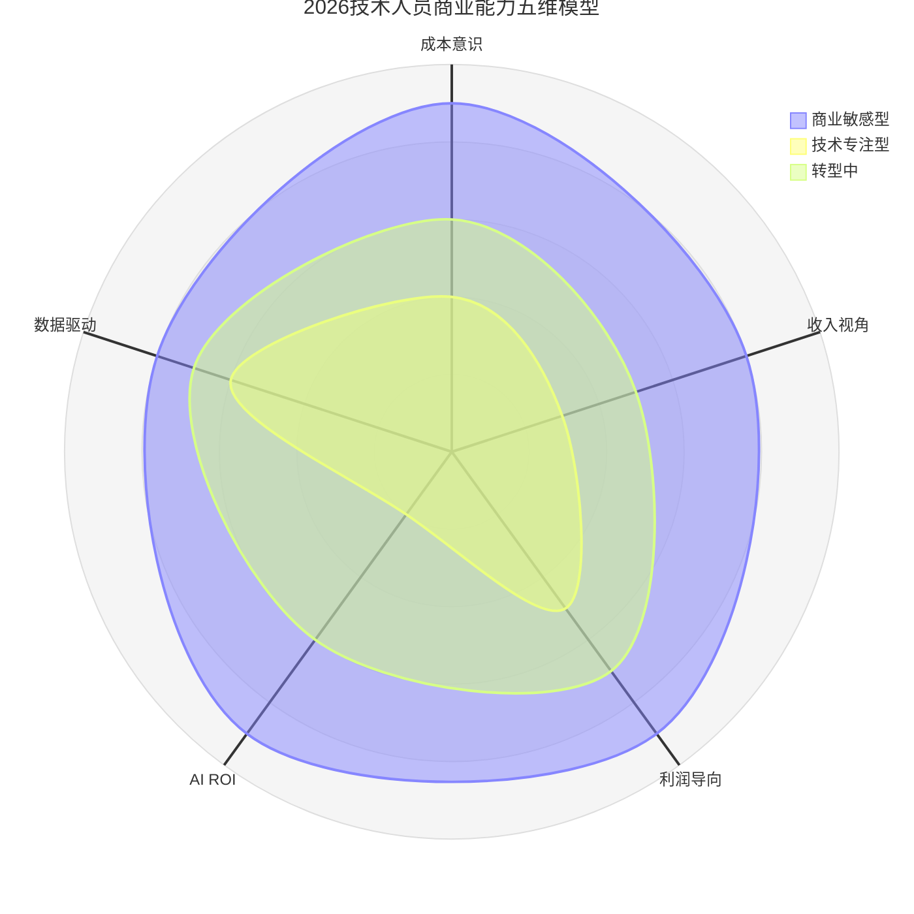
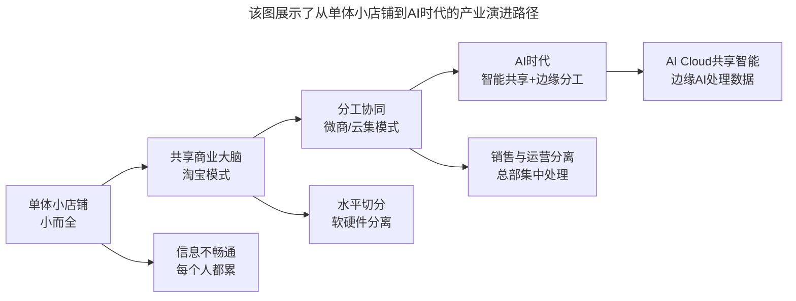

# 第145讲 | 李列为：技术人员的商业思维

> **适用范围**：从技术岗位向CTO/管理岗位转型的技术人员、希望用技术思维理解商业世界的管理者、关注AI时代商业思维升级的技术领袖
>
> **更新摘要**（v2）：在保留原文三大核心观点（从共享到分工的产业演进、用软件建模落实管理哲学的"道"、用微服务架构思维治理公司资源）的基础上，融入2026年AI时代新内涵，新增商业思维五维模型（AI增强版）、"成本-收入-利润"的AI时代重构公式、AI加速商业学习路径，将原文升级为适用于AI时代技术人员商业思维培养的完整指南。

---

## 一、导言

本文嘉宾李列为是华博集团CTO，TGO鲲鹏会会员，在消费金融分期、B2B电商、新零售等领域拥有丰富经验。以技术的眼光来看商业世界，从IT行业的发展演进出发，用IT产品建模的思想解决管理问题，用微服务架构思维管理公司资源。

核心命题：**在"道"的层面，一切道理都是通用和相似的——技术人员的商业思维可以把技术的逻辑思维方式用于对商业环境的剖析。**

**关键术语对照**：
- 共享到分工（Sharing to Division）：从集中共享到分布式分工的产业演进
- 道法术器：哲学层面的"道"、方法层面的"法"、技术层面的"术"、工具层面的"器"
- 微服务架构（Microservices Architecture）：高内聚、低耦合、可复用的架构思维
- SOA（Service-Oriented Architecture）：面向服务的架构
- AI ROI（AI投资回报率）：AI项目的投入产出比
- TCO（Total Cost of Ownership）：总拥有成本

---

## 二、核心方法论

### 2.1 从共享到分工

2000年以前，成千上万的小老板们开着自己的实体小店，走南闯北地找货、卖货，他们都很累，因为信息不畅通。2003年淘宝网出现，马云做的是信息撮合平台——创建了"商业大脑"，把海量的商品和海量的客户进行统一管理。

这种水平切分不能解决所有问题，于是分工又出现了。2014年开始微商涌现，电商行业又变了，开始"分"了——微商们只做销售的服务环节，其他环节都是总部集中处理。

**IT行业同样演进**：从单体应用，到服务"云共享"，再到云+端（边缘计算）的模式。阿里云把算力进行了共享，形成了全国算力的大脑；边缘计算将一些数据在终端进行了结构化处理，与云端进行了很好的分工协同。

**AI时代延伸**：2026年，AI进一步推动了"共享大脑"的升级——从算力共享到智能共享，AI Cloud成为新的"商业大脑"。垂直行业的各种AI大脑型公司不断产生，所有权不重要，重要的是控制权。

### 2.2 用软件的建模方法来落实管理哲学中的"道"

处理问题的原则是：发现一个问题，解决一类问题——发现一个问题，进行归纳建模，抽象成这类问题的普遍特征，然后设计软件模型，统一解决它。

哲学解决问题的逻辑是：从归纳到理论，再到演绎。IT技术解决问题的逻辑是：从梳理抽象逻辑，到建模，再应用到这一类的场景。都是从"特殊"到"一般"再到"特殊"的过程。但哲学更偏向于"道"的层面，IT建模则偏向于"器"的层面。

**实践案例**：公司组织海外旅游，几个高管缺席造成资源浪费。在OA上建立了一套管理流程（建模），把这类管理纳入福利类，从确认参与活动时签订线上契约，并冻结一定的工资金额，直到正常参与活动结束。

**核心观点**：公司有制度，手中无制度——制度都已经潜移默化进了OA中。管理思想是软件的灵魂，建模是把思想通过"器"的形式展现出来。没有灵魂的软件是没价值的，没有"器"的思想是空中楼阁。

### 2.3 用微服务架构思维来治理公司的众多资源

微服务讲究的是：高内聚、低耦合、可复用，这样的思路在企业管理里面也同样适用。

**实践案例**：将各公司的能力量化、降低颗粒度，并制定了调用结算标准。各公司间技术人员可以相互借调，按1500元/天计价；各种能力做公示（短信通道能力、金融风控能力、聚合支付能力、产品供应链能力等），上架到集团的公共资源平台。

各种独立的微服务能力，有点像扑克牌——每个公司都有一些牌，每张牌都有它的价值，通过不同的组合能产生对子、顺子、葫芦、同花顺等，通过整合可以让它们的价值得到充分发挥。

**AI时代延伸**：AI能力（如自然语言处理、图像识别、推荐算法）也成为可以上架到公共资源平台的"微服务"，各子公司按需调用。企业向平台化发展，每个企业都应该是一个微服务框架，逐渐积累自己的各种能力。

---

## 三、关键流程

### 3.1 2026技术人员商业能力五维模型



**图表说明**：该雷达图展示了2026年技术人员商业能力的五维模型。商业敏感型技术人员在所有维度上都有较高评分；技术专注型在AI ROI和数据驱动维度评分较低；转型中的技术人员处于中间状态。新增的AI ROI和数据驱动两个维度是2026年商业思维的核心要素。

### 3.2 五维模型新增维度详解

| 维度 | 定义 | 2026关键要求 |
|-----|------|------------|
| **成本意识** | 理解研发和运营成本 | + AI工具订阅费、API调用费、推理成本的核算 |
| **收入视角** | 理解产品盈利模式 | + AI增值服务的定价策略 |
| **利润导向** | 关注投入产出比 | + AI项目ROI计算和评估能力 |
| **AI ROI能力（新增）** | 能量化AI的价值贡献 | 计算AI节省的人力、提升的效率、创造的新收入 |
| **数据驱动决策（新增）** | 用数据支撑商业判断 | 用A/B Test、用户行为数据分析验证假设 |

### 3.3 "成本-收入-利润"的AI时代重构

```
传统公式：
利润 = 收入 - 成本

2026新公式：
AI增强利润 = (传统收入 + AI新增收入) - (传统成本 + AI投入成本)

其中：
- 传统收入 = 产品/服务销售收入
- AI新增收入 = AI功能带来的增量收入（如AI增值服务订阅）
- 传统成本 = 人力 + 基础设施 + 运营
- AI投入成本 = AI工具订阅 + API调用 + 模型训练 + AI人才成本

关键指标：AI ROI = AI净收益 / AI总投入 > 1 才值得做
```

### 3.4 从共享到分工的产业演进



**图表说明**：该图展示了从单体小店铺到AI时代的产业演进路径。从小而全的单体模式，到共享商业大脑的淘宝模式，再到分工协同的微商模式，最终进入AI时代的智能共享+边缘分工模式，体现了"从共享到分工"的持续演进。

---

## 四、工具与实践

### 4.1 AI加速商业学习路径

| 学习内容 | 传统方式 | 2026年AI加速方式 | 时间缩短 |
|---------|---------|-------------------|---------|
| **财务知识** | 参加培训课程、阅读书籍 | AI导师对话式学习+实时案例分析 | 70% |
| **运营指标** | 从头搭建数据体系 | AI自动生成关键指标+异常检测 | 80% |
| **客户洞察** | 用户调研、访谈 | NLP分析用户反馈+情感分析 | 85% |
| **竞品分析** | 手动收集整理 | AI Agent自动监控竞品动态 | 90% |
| **策略制定** | 高管闭门会议 | AI情景模拟+多方案推演 | 60% |

### 4.2 软件建模落实管理的实践

**核心原则**：发现一个问题，解决一类问题。

1. 发现一个问题
2. 进行归纳建模
3. 抽象成这类问题的普遍特征
4. 设计软件模型
5. 统一解决它

**案例**：
- 高管缺席旅游 → OA线上契约+冻结工资
- 企业文化落地 → 点赞卡投票流程（每月10张，必须发出）
- 公司制度 → "公司有制度，手中无制度"（潜移默化进OA）

### 4.3 微服务思维管理资源的实践

- 将各公司能力量化、降低颗粒度
- 制定调用结算标准（如技术人员1500元/天）
- 各种能力上架到公共资源平台
- 鼓励能力组合创新（如扑克牌组合）
- 目标：三提一降（提高效率、提升体验、提高品质、降低成本）

### 4.4 2026立即行动

- [ ] 用"五维模型"自评当前商业思维能力
- [ ] 选择一个当前负责的项目，计算其"AI ROI"
- [ ] 每周花1小时用AI工具学习一个商业案例

---

## 五、常见误区

### 陷阱一：只懂技术不懂商业

到了CTO这个岗位，考虑的不仅仅是做好技术支撑工作，更多的是需要根据公司的宏观战略，参与讨论后续的业务定位、组织结构、管理方案。只懂技术是混不下去的。

**应对建议**：用技术的眼光看商业世界，用IT建模的思想解决管理问题。

### 陷阱二：有"道"无"器"

哲学理论偏向于"道"的层面，如果只有道没有器，没有具体的步骤和工具，是很难落实和执行的。

**应对建议**：用IT建模的思想帮助管理者解决管理思想落地的问题。

### 陷阱三：忽视AI成本（2026新增）

AI工具订阅费、API调用费、推理成本可能占云支出的40%+，如果不建立用量监控和优化机制，可能导致成本失控。

**应对建议**：AI ROI = AI净收益 / AI总投入 > 1才值得做。

### 陷阱四：颗粒度过大

如果各公司的能力没有量化、颗粒度没有降低，就无法实现资源的最优配置和组合创新。

**应对建议**：用微服务架构思维，将能力量化、降低颗粒度、制定调用结算标准。

### 陷阱五：忽视能力组合

各种独立的微服务能力如果只是单独存在，不进行组合，就无法发挥最大价值。

**应对建议**：像扑克牌一样进行不同组合，让价值得到充分发挥。

---

## 六、进阶延展

### 6.1 核心金句

> "在'道'的层面，一切道理都是通用和相似的——技术人员的商业思维，不仅可以把技术的逻辑思维方式用于对商业环境的剖析，也能更好地解决管理中的各种问题。"

> "管理思想是软件的灵魂，建模是把思想通过'器'的形式展现出来——没有灵魂的软件是没价值的，没有'器'的思想是空中楼阁。"

> "劳心者治人，劳力者治于人——要做行业的大脑，所有权不重要，重要的是控制权。"

### 6.2 产业演进的IT类比

| IT演进 | 商业类比 | 核心特征 |
|--------|---------|---------|
| 单体应用 | 小而全的小店铺 | 信息不畅通，每个人都累 |
| 云共享 | 淘宝模式 | 水平切分，共享商业大脑 |
| 云+端 | 微商/云集模式 | 分工协同，销售与运营分离 |
| AI Cloud | 智能共享+边缘分工 | AI共享智能，边缘AI处理数据 |

### 6.3 相关阅读建议

- 《游舒帆：一流团队必备的商业思维能力》——商业思维四力框架
- 《张溪梦：技术领袖需要具备的商业价值思维》——技术领袖的四大进化
- 《如何判断业务价值的高低》——技术投入与商业价值的评估方法

---

*本文基于极客时间原文升级，融入2026年AI时代商业思维五维模型与AI ROI评估能力，旨在帮助技术人员在AI浪潮中培养和升级商业思维。*