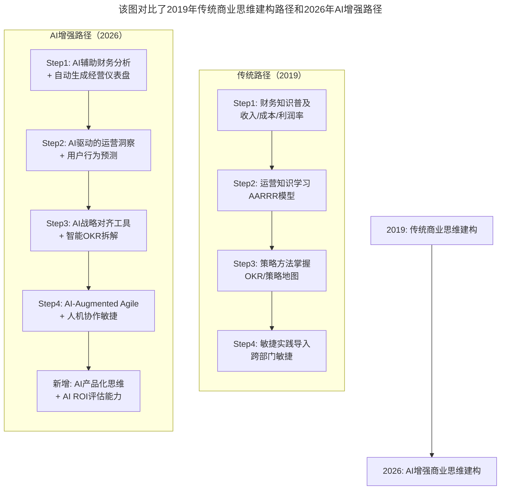

# 第81讲 | 游舒帆：一流团队必备的商业思维能力

> **适用范围**：推动研发团队商业思维建构的技术管理者、关注CTO角色进化的技术领袖、在AI时代探索组织效能提升的管理者
>
> **更新摘要**（v2）：在保留原文核心框架（商业思维四力：数据力、运营力、策略力、敏捷力）的基础上，融入2026年AI-Native商业思维新内涵，新增AI增强版商业思维建构路径、商业模式画布的AI时代新九宫格、AI ROI评估框架与AI产品化可行性判断矩阵，将原文升级为适用于AI时代一流团队商业思维培养的完整指南。

---

## 一、导言

本文嘉宾游舒帆（昵称gipi），箴亚管理顾问公司负责人、TGO鲲鹏会台北分会学习委员。技术起家，后走入管理、产品、营运相关领域，历任鼎捷软件技术总监、TutorABC研发总监，熟悉B2B软件与在线教育。围绕"商业思维建构"工程进行了深入分享。

核心命题：**CTO COO化是一个伪命题，核心问题是企业沟通与创新的低效——商业思维建构让经营的思维与知识普及到研发主管与团队身上。**

**关键术语对照**：
- CTO COO化：CTO被要求承担COO（首席运营官）的职责
- 商业思维建构（Business Acumen Construction）：让经营思维普及到研发团队
- 商业思维四力：数据力、运营力、策略力、敏捷力
- AARRR模型：获取（Acquisition）、激活（Activation）、留存（Retention）、成交（Revenue）、推荐（Referral）
- OKR（Objectives and Key Results）：目标与关键结果
- AI-Native Business Acumen：AI原生商业素养
- AI ROI（AI投资回报率）：AI项目的投资回报率

---

## 二、核心方法论

### 2.1 商业思维建构的必要性

传统CTO专注于技术领域，对公司业务理解少，对市场与客户的掌握度也不足，因此总是被动等待CEO或业务部门提出需求或下决定。研发部门手上握有技术与数据，但对商业的理解不足，很难提出具有洞见的策略。

CTO COO化的消极原因是能有效提升业务与研发对接的效率，而积极原因则是期待研发团队能成为企业的战略角色，带领企业走出另一条增长路线。

**商业思维建构的基本构想**：让团队成员更熟悉公司运作，掌握企业经营的本质，理解公司策略，弭平基层与经营层之间因为组织位阶造成的差距；同时也让团队同仁跨越研发的边界，更深入接触功能部门。

**AI时代升级**：CTO不是"COO化"，而是成为**"AI-Native Business Translator"**——能够用AI弥合技术与商业的鸿沟，并将AI能力转化为商业价值。

### 2.2 数据力

从公司的财务面开始——收入、成本与现金流的观念，涵盖固定成本、变动成本、毛利、净利等基本观念。进一步拆解收入结构，让大家清楚公司靠什么赚钱；拆解成本结构，明白钱都花在哪些地方；拆解客户结构，了解哪些族群客户最忠诚。

**核心认知**：如果你不知道手上的工作能为哪个数字产生贡献，那你根本不应该做这件事。

**AI时代升级**：从"透过数据掌握经营大小事"升级为"AI自动化的数据洞察+预测性分析"。过去空有数据等待指令，现在AI能让工程师主动发现商业机会。

### 2.3 运营力

运营力强调的不仅仅是让研发部门熟悉运营的知识，更要能善用数据与算法等技术性手法，更大规模且更精准地做好运营工作。

**核心理念**：不用人工介入，系统与算法便能持续做好运营工作。运营不能只靠出奇制胜，而是该守正出奇——先将该做且能做的先做好，剩下的才来考验创意。

**AI时代升级**：从"让用户出现期待的行为"升级为"AI个性化运营+全生命周期智能触达"。

### 2.4 策略力

过去最常问team member："你知道这项目是怎么来的？为什么而做吗？"能正确回答这个问题的人少之又少。

企业在做策略规划时，往往都是一群高管聚在一起，根据目标讨论出策略，接着就定行动方案。但高管们已经脱离一线工作太久了，他们订出来的行动方案真的能解决问题吗？出错的机率非常高。

**解决方案**：运用OKR与策略地图方法来有效连接企业、团队与个人目标。每个团队成员对自己的价值会有更清楚的认识，对企业的认同感与向上的沟通能力也会因此大幅增强。

**AI时代升级**：从"目标与行动高度一致"升级为"AI辅助战略对齐+智能OKR管理"。

### 2.5 敏捷力

敏捷所谈的快速交付、试错、迭代等观念，都是为了让企业在面临不确定性时，能套用的一些基本规则与做法。

- "快"：应变的快，调整的快
- "好"：交付的质量，说得出做得到
- "有价值"：方向与优先级正确

跨不出技术部门的敏捷都无法真正敏捷，因此也要将敏捷观念推到营销、销售与服务上。

**AI时代升级**：从"拥抱不确定性"升级为"AI-Augmented Agile（Agile 2.0）"。

---

## 三、关键流程

### 3.1 AI增强商业思维建构路径



**图表说明**：该图对比了2019年传统商业思维建构路径和2026年AI增强路径。传统路径包含四个步骤（财务知识、运营知识、策略方法、敏捷实践），AI增强路径在每个步骤中都加入了AI能力，并新增了第五个步骤——AI产品化思维和AI ROI评估能力，体现了AI对商业思维建构的全面增强。

### 3.2 商业思维四力AI增强对照

| 四力 | 原文定义 | 2026 AI增强定义 | 核心AI工具 |
|------|---------|-------------------|-----------|
| **数据力** | 透过数据掌握经营大小事 | AI自动化的数据洞察+预测性分析 | GPT-5.5数据分析、AutoML |
| **运营力** | 让用户出现期待的行为 | AI个性化运营+全生命周期智能触达 | 推荐系统、营销AI Agent |
| **策略力** | 目标与行动高度一致 | AI辅助战略对齐+智能OKR管理 | 战略规划AI、OKR工具 |
| **敏捷力** | 拥抱不确定性，与VUCA共舞 | AI-Augmented Agile（Agile 2.0） | AI项目管理、代码生成 |

### 3.3 2019 vs 2026 商业思维演进对比

| 维度 | 2019年商业思维 | 2026年AI-Native商业思维 |
|------|---------------|--------------------------|
| **核心挑战** | CTO被要求COO化 | CTO必须具备AI产品化能力 |
| **沟通壁垒** | 业务vs研发语言不通 | AI作为"通用翻译器"降低壁垒 |
| **数据价值** | 空有数据等待指令 | AI自动挖掘数据中的商业洞察 |
| **创新来源** | 依赖高管战略规划 | 一线员工+AI协同发现创新机会 |
| **技术人路径** | 需要多年业务浸润 | AI缩短商业理解周期50%+ |

### 3.4 AI产品化可行性判断矩阵

| 评估维度 | 权重 | 评估问题 | AI辅助工具 |
|---------|------|---------|-----------|
| **技术可行性** | 25% | 现有AI能否解决问题？准确率够吗？ | AI技术雷达+基准测试 |
| **数据可用性** | 20% | 有足够的高质量数据吗？ | 数据质量评估Agent |
| **商业价值** | 25% | 解决的问题值多少钱？ | 市场规模预测模型 |
| **实施成本** | 15% | 开发和维护成本可控吗？ | TCO计算器 |
| **组织准备度** | 15% | 团队能承接吗？流程支持吗？ | AI成熟度评估框架 |

**可执行建议**：在启动任何AI项目前，先用这个矩阵打分。总分<60分建议暂缓；60-80分可以试点；>80分全力推进。

---

## 四、工具与实践

### 4.1 立即开始（本周）

1. **完成个人AI商业素养自评**：使用"AI产品化可行性判断矩阵"评估当前项目
2. **为团队配置AI商业分析工具**：部署GPT-5.5企业版或类似工具，建立团队共享的"AI商业分析Prompt库"
3. **启动一次"AI+商业"交叉讨论会**：邀请业务部门分享最头疼的商业问题，用AI头脑风暴解决方案

### 4.2 短期推进（1-3个月）

4. **重构团队的商业思维培训**：将传统的"财务知识培训"升级为"AI辅助商业分析实战"，每周安排1小时"AI商业案例研讨"
5. **建立"AI创新提案"机制**：鼓励团队成员提出AI赋能业务的创意，用统一的ROI评估框架筛选项目
6. **打造跨部门的"AI商业联盟"**：产品+研发+运营+市场的定期交流，共享AI工具使用心得

### 4.3 中期深化（3-6个月）

7. **培养3-5名"AI商业翻译官"**：既懂技术又懂业务的核心人才，作为团队与高管的沟通桥梁
8. **构建企业的"AI能力地图"**：梳理现有AI能力和数据资产，识别AI应用的空白点和机会点
9. **推动一项AI驱动的商业创新项目**：选择高价值场景（如智能客服、个性化推荐），全程记录ROI

### 4.4 长期愿景（6-12个月）

10. **实现"全员AI商业思维"**：从"CTO要懂业务"进化到"每个人都能用AI思考商业"，打造真正的AI-Native组织文化

### 4.5 AI加速商业学习的30天计划

```
Week 1-2: AI辅助财务基础
├── 使用GPT-5.5学习利润表、资产负债表的核心概念
├── 让AI根据公司实际数据生成可视化报表
├── 通过对话理解每个指标的业务含义
└── 输出：能读懂公司月度经营报告

Week 3-4: AI驱动的用户洞察
├── 用AI分析1000+用户反馈，提取关键主题
├── 构建用户画像和需求优先级排序
├── 识别流失风险客户并生成预警
└── 输出：能独立完成用户分析报告

Month 2: AI增强的运营实践
├── 搭建AI运营看板（自动更新）
├── 设计A/B测试方案并由AI分析结果
├── 基于数据提出优化建议
└── 输出：能用数据驱动决策

Month 3-4: AI辅助策略参与
├── 使用AI工具进行市场趋势分析
├── 参与OKR制定，用数据支撑目标设定
├── 提出技术创新如何支持业务目标的方案
└── 输出：能在战略讨论中贡献有价值的观点
```

---

## 五、常见误区

### 陷阱一：研发与业务语言不通

做业务的不会理解研发，做研发的也不会理解业务，彼此之间总有许多误解与纠葛。在解决问题与确认需求时，往往需要经过多次修改、讨价还价，才能产生一个双方可以接受的版本。

**应对建议**：让团队同仁跨越研发的边界，更深入接触功能部门，学习业务、营销与服务相关的知识。

### 陷阱二：高管脱离一线制定行动方案

高管们熟悉策略与经营，但已经脱离一线工作太久了，订出来的行动方案出错的机率非常高。承接需求的人又没搞清楚具体要解决什么问题，就贸然投入去做，最后的结果就是多做多错。

**应对建议**：运用OKR与策略地图方法连接企业、团队与个人目标，每个团队成员对自己的价值有更清楚的认识。

### 陷阱三：空有数据等待指令

研发部门手上握有技术与数据，但过去空有数据，却在等待CEO或业务部门的指令。

**应对建议**：AI能让工程师主动发现商业机会并提出解决方案——从"被动等待"到"主动发现"。

### 陷阱四：敏捷局限于技术团队

跨不出技术部门的敏捷都无法真正敏捷。如果敏捷只在技术团队内部推动，就无法实现全组织的高效运作。

**应对建议**：将敏捷观念推到营销、销售与服务上，让所有人都理解敏捷的真正价值与必要性。

### 陷阱五：AI替代对业务的深度理解（2026新增）

AI是放大器，不是替代品。它能让好的商业思维更好，但不能替代对业务的深度理解和真诚的用户关怀。

**应对建议**：保持对人的关注，这才是商业的本质。AI让获取商业思维的能力速度提升了3-5倍，但核心原则永恒不变。

---

## 六、进阶延展

### 6.1 核心金句

> "技术不是目的，商业价值才是。但在AI时代，技术是实现商业价值的超级加速器。"

> "2026年最具价值的技术管理者，是那些既能写代码、又能读财报、还能设计AI产品的人。"

> "我们追求的不是'技术人员学一点商业皮毛'，而是用AI武装每一个人的商业大脑，让最懂技术的人，也能做出最懂商业的决策。"

### 6.2 关键数据参考（2026）

| 指标 | 数据 | 来源 |
|------|------|------|
| 使用AI编程的开发者比例 | 84% | Stack Overflow 开发者调查 2025 |
| 企业AI项目平均ROI | 156% | McKinsey AI Survey 2026 |
| 具备AI商业思维的技术管理者比例 | 23% | Gartner CTO Survey |
| AI缩短商业学习周期的效果 | 50-70% | Harvard Business School Research |
| 采用AI增强决策的企业数量 | 同比增长340% | Deloitte Tech Trends |

### 6.3 相关阅读建议

- 《李列为：技术人员的商业思维》——用技术思维理解商业世界
- 《张溪梦：技术领袖需要具备的商业价值思维》——技术领袖的四大进化
- 《如何判断业务价值的高低》——技术投入与商业价值的评估方法

---

*本文基于极客时间原文升级，融入2026年AI-Native商业思维新内涵与AI ROI评估框架，旨在帮助技术团队在AI时代完成从"被动等待"到"主动发现"的商业思维进化。*