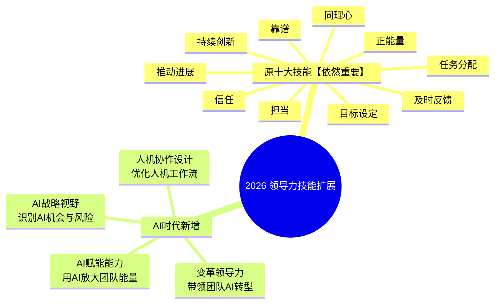
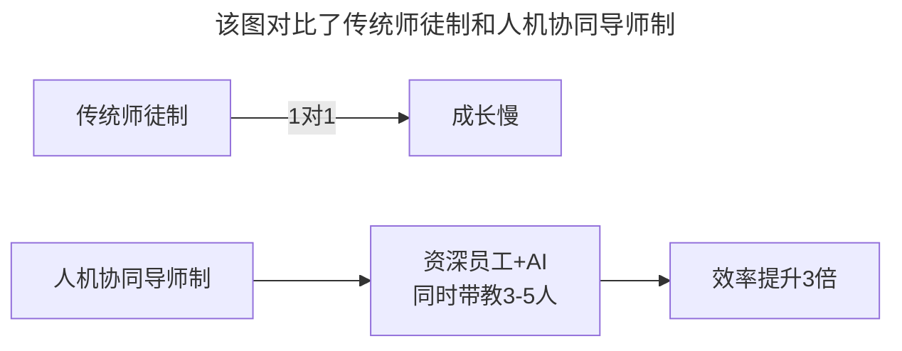

# 第148讲 | 肖德时：创业团队技术领导者必备的十个领导力技能

> **适用范围**：创业公司技术Leader与新晋CTO、关注领导力技能训练的技术管理者、在AI时代探索人机协作领导模式的技术领袖
>
> **更新摘要**（v2）：在保留原文十大领导力技能（同理心、设定合理目标、及时反馈、持续创新、有担当、信任员工、让人觉得靠谱、分配任务、正能量、推动进展）的基础上，融入2026年AI时代领导力新要求，将模型扩展为"10+4"框架——新增AI战略视野、人机协作设计、AI赋能能力、变革领导力四个AI时代技能，并给出每个原技能的AI增强版对照，将原文升级为适用于AI时代创业技术领导者的完整领导力指南。

---

## 一、导言

本文嘉宾肖德时是TGO鲲鹏会会员，容器技术专家，前数人云创始人兼CTO，曾领导Redhat内部工具开发团队，从2013年开始研究Docker技术，是中国最早一批的Docker开发者。围绕创业团队技术领导者必备的十个领导力技能进行了系统梳理。

核心命题：**领导力是一种需要训练的技能，而非当了领导者之后就能自动获得——Leadership is a process of social influence, which maximizes the efforts of others, towards the achievement of a goal.**

**关键术语对照**：
- Leadership（领导力）：一种社交影响力的过程
- Empathy（同理心）：从别人的角度想问题的能力
- WBS（Work Breakdown Structure）：工作分解结构
- TGIF（Thank God It's Friday）：硅谷周五分享会制度
- AI治理能力（AI Governance）：管理和引导AI应用的能力
- 人机协作设计（Human-AI Collaboration Design）：优化人机工作流的能力

---

## 二、核心方法论

### 2.1 技能一：善用同理心技能给员工最合适的任务

同理心不是发慈悲，而是一种策略。它要求你能了解下属的能力，并善于发挥下属的能力。在创业公司，人少活多的状况下，所有的事情都是开创性的，时间紧任务重。

如果没有同理心，你很难完成培养计划的制定，也很难拿到第一手的反馈。应该立刻和员工交流，梳理他的能力范畴，帮助他规划成长的路线，给他设定一个成长目标，并定期维护这个成长计划。

**AI时代增强**：从"观察+沟通"升级为"AI分析代码质量、项目贡献、学习速度"，AI推荐最优任务分配，AI生成个性化成长路径——但人类情感关怀AI无法替代。

### 2.2 技能二：设定合理目标的能力

创业公司野蛮生长，业务目标时刻都在变化中。本质上创业公司的目标一直没有变，就是业务要增长，公司要赚钱。在制定个人工作计划的时候，一定要有设定合理目标的能力。

创业公司的衡量标准就是业务成长，能赚钱，其他都是务虚的。创业公司真没有必要去模仿大公司组织没用的团建活动，踏踏实实地解决生存问题是最好的收获。

**AI时代增强**：新增AI预测目标可行性（基于历史数据和团队能力）、AI分解目标（自动生成OKR/KPI分解树）、AI追踪进度（实时仪表盘+异常预警）。

### 2.3 技能三：及时反馈的能力

在创业公司，大家都是一个人干好几件事情，其他部门或者同事给你交代的事情，你其实很难完全理解，都是在被动中被推动着前进。但在信息流的传播中，就不能抓大放小，尤其对领导者来说，任何员工对你的反馈都是他个人比较看重的地方。

很多创业员工都是到实在干不下去要离职了才和领导见上一面，等真到这个时候，你再反馈就已经晚了。

**AI时代增强**：从"公开邮箱+人工回复"升级为"AI分类+优先级排序+领导即时收到+AI建议回复+领导确认发送+AI跟踪落实情况"。

### 2.4 技能四：持续创新的能力

这种创新能力并不是指发明一个技术或写了一大堆新算法，而是涉猎广泛一点，在尝试解决公司难题的前提下，能不断小步尝试一些未能证明的假设。可能100个假设中有20个假设能成功，把成功的假设加以总结和推广，就是一种强有力的创新能力。

最关键的地方不是追求新东西，而是在你现有能力的基础之上去强化和丰富你的能力。

**AI时代增强**：AI可以每天测试100个假设（而非人工100个），AI自动筛选成功案例，人类做最终判断和推广决策。

### 2.5 技能五：有担当的能力

从技能的角度出发，担当的技能就是当员工的陪练，带着这个员工一起成长。很多大公司在新员工入职后都有师傅制度——一个资深的员工带着几个新手一起干活。如果老员工没有担当的能力，很可能就是一个分任务的机器人，把团队成员都给带坏了。

**AI时代增强**：从传统1对1师徒制升级为"资深员工+AI同时带教3-5人"的人机协同导师制，效率提升3倍。

### 2.6 技能六：能信任员工的能力

信任是需要花时间来培养的。关键是在给下属交代任务的时候，一定要把任务讲清楚，让下属能完全理解你的任务。同时要定义员工行为什么是对的，什么是不对的，一旦发现决定错误了，也要能真的向大家诚恳道歉。

**AI时代增强**：从"定期检查进度"升级为"+AI自动追踪任务状态"。

### 2.7 技能七：让人觉得靠谱的能力

什么是靠谱，就是能把领导交代的任务完成的能力。让别人觉得靠谱的能力，更上一层就是需要动脑筋，把任务计划规划好，在时刻拥抱变化的同时，能运用一些科学的时间管理方法。要学会拒绝大部分和业务无关的任务，抓住业务核心。

**AI时代增强**：从"加班赶工"升级为"+AI辅助提升效率3-5倍"。

### 2.8 技能八：分配任务的能力

分配的概念是你知道任务应该给谁，而不是让员工自己去接任务。在适当的时候，要指定人去干他不擅长的任务，目的无非是让员工能定期审视自己，了解自己的边界。

**AI时代增强**：从"人工判断谁适合"升级为"+人机协作任务分配模型"。

### 2.9 技能九：正能量的能力

关心员工，能和团队成员时不时调侃两句。能记得同事的名字，鼓励同事的好行为。能真正地帮助到你的同事。不随波逐流地发表一些对行业的看法，并与员工分享交流。和同事建立深厚的协作友谊——他们不是朋友，是你的战友。

**AI时代增强**：从"团建活动"升级为"+AI赋能让员工更强"。

### 2.10 技能十：推动进展的能力

看准一件事情并推动起来是很好的提高工作效率的方式。作为领导者，要能直言对公司行为不同的看法，并能提出自己的方案。只有看法没有方案，那就根本无法起到推动的作用。创业的本质就是试错，小错误没大事，积累多了就不得了。

**AI时代增强**：从"个人推动"升级为"+AI Agent辅助执行"。

---

## 三、关键流程

### 3.1 "10+4"领导力技能模型



**图表说明**：该思维导图展示了2026年领导力技能的"10+4"模型。原十大技能（同理心、目标设定、及时反馈、持续创新、担当、信任、靠谱、任务分配、正能量、推动进展）依然重要，AI时代新增了AI战略视野、人机协作设计、AI赋能能力、变革领导力四个技能，构成了完整的AI时代领导力体系。

### 3.2 十大技能AI增强对照

| 领导力技能 | 传统做法 | 2026年AI增强 |
|-----------|---------|------------|
| **同理心** | 观察+沟通 | +AI分析员工能力雷达图 |
| **目标设定** | 经验判断 | +AI预测目标可行性 |
| **及时反馈** | 公开邮箱 | +AI分类+优先级+建议回复 |
| **持续创新** | 人工测试假设 | +AI每天测试100个假设 |
| **担当** | 1对1师徒制 | +人机协同导师制（1对3-5） |
| **信任** | 定期检查进度 | +AI自动追踪任务状态 |
| **靠谱** | 加班赶工 | +AI辅助提升效率3-5倍 |
| **分配** | 人工判断 | +人机协作任务分配模型 |
| **正能量** | 团建活动 | +AI赋能让员工更强 |
| **推动进展** | 个人推动 | +AI Agent辅助执行 |

### 3.3 AI增强反馈闭环

```
传统反馈链路：
员工反馈 → 领导收到 → 领导回复 → （可能延迟或遗漏）

AI增强反馈链路：
员工反馈 → AI分类+优先级 → 领导即时收到 → AI建议回复 → 领导确认发送
                ↓
         AI跟踪落实情况 → 自动提醒
```

### 3.4 人机协同导师制



**图表说明**：该图对比了传统师徒制和人机协同导师制。传统师徒制是1对1模式，成长速度慢；人机协同导师制由资深员工配合AI工具同时带教3-5人，效率提升3倍，体现了AI对领导力技能的放大效应。

---

## 四、工具与实践

### 4.1 创业Leader本周行动

1. **用AI评估团队现状**：AI分析项目贡献、代码质量、协作效率，输出团队能力雷达图
2. **建立AI辅助反馈机制**：设置AI分类的反馈收集渠道，承诺24小时内回应所有反馈
3. **启动第一个"AI导师制"试点**：选1位资深员工+AI工具，带教2-3位新人，1个月后评估效果

### 4.2 领导力技能训练方法

领导力是需要不断磨练的能力，而不是创业当了领导就可以具备的。以下方法可以帮助训练：

1. **同理心训练**：每天与至少一位员工深度交流，了解他的能力和困难
2. **目标设定训练**：每周制定个人工作计划，用业务成长作为衡量标准
3. **反馈训练**：对任何同事给你的反馈，都做到及时反馈信息
4. **创新训练**：每周尝试解决一个未证明的假设，记录结果
5. **担当训练**：主动承担带教新人的任务，在一个项目周期内培养新人独立能力

### 4.3 避坑指南

| 坑 | 表现 | 解决方案 |
|----|------|----------|
| **AI替代人情味** | 只用AI管理，缺乏人文关怀 | AI处理数据，人类处理情感 |
| **目标虚高** | AI预测过于乐观 | 加入人类经验修正系数 |
| **创新泛滥** | AI生成太多想法无法落地 | 设定明确的筛选标准 |
| **担当变甩锅** | "AI说的不是我说的" | 对AI建议的结果负责 |

---

## 五、常见误区

### 陷阱一：领导力自动获得幻想

领导力显然是一项非常重要的能力，并且是一项需要不断磨练的能力，而不是创业当了领导就可以具备的。

**应对建议**：领导力是需要训练的技能，刻意训练以上十大技能。

### 陷阱二：业务压太重忽视软实力

很大一部分企业的领导者并不具备完善的领导力，就是因为平时业务压得太重，心思都在业务上，很难有心思来锤炼这些软实力。

**应对建议**：很多软性的东西是不得不去做的。如果不做，就只能用一些笨办法来强制员工或自己实现目标。

### 陷阱三：AI替代人情味（2026新增）

只用AI管理，缺乏人文关怀。AI可以让领导者更高效，但真正的领导力来自于你对他人的真诚关心。

**应对建议**：AI处理数据，人类处理情感。记住：AI可以让领导者更高效，但真正的领导力来自于你对他人的真诚关心。

### 陷阱四：担当变甩锅（2026新增）

"AI说的不是我说的"——把AI建议的不良结果归咎于AI。

**应对建议**：对AI建议的结果负责。AI是工具，决策权在领导者。

### 陷阱五：无脑执行

在缺乏合适的领导力培训的环境下，员工经常无脑执行领导安排的任务。员工需要花费大量精力来理解和支持你的决定。

**应对建议**：善用同理心技能，从别人的角度想问题，给手下最合适的任务。

---

## 六、进阶延展

### 6.1 核心金句

> "领导力是一种需要训练的技能——Leadership is a process of social influence, which maximizes the efforts of others, towards the achievement of a goal."

> "在AI时代，关键是用AI放大这些技能的效果，而不是用AI替代人类的情感连接和判断力。记住：AI可以让领导者更高效，但真正的领导力来自于你对他人的真诚关心。"

> "创业的本质就是试错，小错误没大事，积累多了就不得了。"

### 6.2 领导力技能总览

| 技能 | 核心要点 |
|------|---------|
| 1. 同理心 | 从别人的角度想问题，给手下最合适的任务 |
| 2. 设定目标 | 业务要增长，公司要赚钱 |
| 3. 及时反馈 | 任何员工对你的反馈都是他个人比较看重的地方 |
| 4. 持续创新 | 100个假设中20个成功就推广 |
| 5. 有担当 | 当员工的陪练，带着一起成长 |
| 6. 信任员工 | 把任务讲清楚，定义对错标准 |
| 7. 让人靠谱 | 从小事做起，日拱一卒 |
| 8. 分配任务 | 你知道任务应该给谁，而非让员工自己接 |
| 9. 正能量 | 关心员工，不随波逐流，战友而非朋友 |
| 10. 推动进展 | 有看法更要有方案，创业本质是试错 |
| **+1. AI战略视野** | **识别AI机会与风险** |
| **+2. 人机协作设计** | **优化人机工作流** |
| **+3. AI赋能能力** | **用AI放大团队能量** |
| **+4. 变革领导力** | **带领团队AI转型** |

### 6.3 相关阅读建议

- 《蔡锐涛：从0到1再到100，创业不同阶段的技术管理思考》——不同阶段的技术管理重点
- 《陈崇磐：管事与管人-如何避开创业公司组队陷阱》——团队组建与管理
- 《创业公司CTO的认知升级》——CTO认知升级路径

---

*本文基于极客时间原文（上下两篇合并）升级，融入2026年AI时代"10+4"领导力技能模型，旨在帮助创业技术领导者在AI浪潮中训练和提升领导力。*