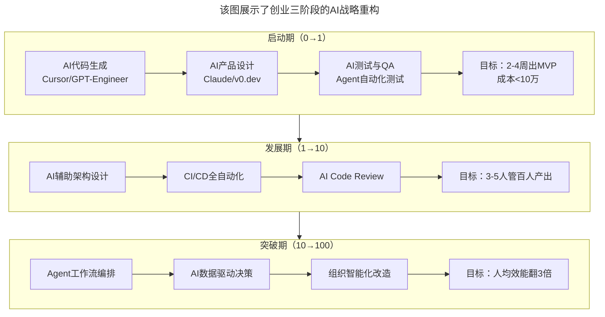
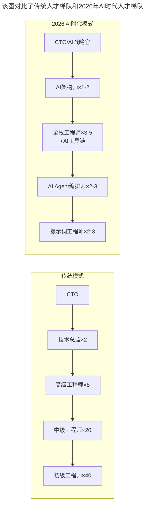

# 第111讲 | 蔡锐涛：从0到1再到100，创业不同阶段的技术管理思考

> **适用范围**：创业公司CTO与技术联合创始人、关注不同阶段技术管理策略的创业者、在AI时代寻求技术管理升级的管理者
>
> **更新摘要**（v2）：在保留原文三阶段框架（创业启动期、高速发展期、寻求突破期）及每个阶段的人财物管理要点的基础上，融入2026年AI时代创业成本结构性变革，新增AI原生创业成本对比、三阶段AI战略重构、创业成本公式变化，以及AI时代创业的三大机遇与十大风险，将原文升级为适用于AI时代创业全生命周期的技术管理指南。

---

## 一、导言

本文嘉宾蔡锐涛是有米科技CTO、联合创始人，中国最早的移动营销技术专家，专注于移动广告平台及移动应用商业化变现方向相关产品技术的研究。围绕创业启动期、高速发展期与寻求突破期这三个阶段的技术管理思考进行了系统分享。

核心命题：**每个公司都会经历5个发展时期（技术萌芽期、狂热期、幻想破灭期、复苏期与平稳期），技术管理需要围绕"人、财、物"三个维度在不同阶段做出调整。**

**关键术语对照**：
- 5个发展时期：技术萌芽期、狂热期、幻想破灭期、复苏期、平稳期
- Design for Growth：为10倍增长设计
- TGIF（Thank God It's Friday）：硅谷周五分享会制度
- OKRS（Objectives and Key Results）：目标与关键结果
- WIKI系统：团队知识库
- AI Native创业：以AI为核心构建的创业模式
- MVP（Minimum Viable Product）：最小可行产品

---

## 二、核心方法论

### 2.1 了解行业发展趋势

创业前有必要了解行业发展趋势，做好心理预期、人才准备、资金储备等。每个公司都会经历5个发展时期：技术萌芽期、狂热期、幻想破灭期、复苏期与平稳期。

公司在不同时期，技术团队的状态也会不同。在技术萌芽期，所有人都非常兴奋；进入狂热期，可能接到大量风投与外界资源，泡沫最大；紧接着跌入谷底，幻想破灭，需寻求新的增长点；扛过这段时期进入复苏期，是高速发展阶段；最后进入平稳期，遇到行业天花板，需考察新机会。

**AI时代变化**：2026年，这个框架依然有效，但每个阶段的成本结构、时间周期和关键要素发生了根本性变化。传统创业：10人团队 × 6个月 = MVP；AI原生创业：(2-3人 + AI Agent) × 1-2个月 = MVP，效率提升3-5倍，成本降低80-90%。

### 2.2 创业启动期：技术栈选择与文化建设

**团队状态**：创业前期，团队成员目标一致，凝聚力非常高，急需出产品、推向市场、快速迭代。

**技术栈选择**：技术创业应该尽量避免使用新潮技术，尽可能减少技术成本，使用成熟、稳定的技术。早期使用MongoDB 2.4时数据量不到一亿非常顺畅，但达到十亿时平均两天出现一次故障，最后迫不得已改用MySQL——虽然又老又无聊，但稳定、好用。

**技术文化建设**：
1. 重视知识储备：创业第一年就建立WIKI系统，将产品设计、架构、故障和解决方案写进去
2. 启动技术文化建设：每周五学习硅谷TGIF分享会制度

**AI时代升级**：技术选型黄金法则——"AI能帮你写的 + 出了问题能搜到答案的 = 好选择"。知识储备从传统WIKI升级为AI增强的知识库（支持自然语言问答）。

### 2.3 高速发展期：架构设计与人才梯队

**团队状态**：业务可能一个月翻一倍，团队像打了兴奋剂一样冲劲满满。业务增长非常迅速，人员大规模扩张，沟通、协作效率逐渐降低。

**技术架构三个关键点**：
1. Design for Growth——为10倍增长设计
2. 重视人员的知识储备，未雨绸缪
3. 设立基础研发部门，实现基础组件服务化

**沟通协作**：重视内部流程自动化，不要吝啬对工具化的投入；从人管人、人带人到文化、制度管人，培养人。

**人才梯队建设**：保持社招，重视校招，引入OKRS；从靠人到靠系统自动化管理；组织架构分层、拆分；建立领域委员会和学习机制。

**AI时代升级**：架构要支撑10倍增长+AI Agent的无缝接入能力。人才梯队从传统金字塔升级为AI时代模式——CTO/AI战略官→AI架构师→全栈工程师+AI工具链→AI Agent编排师→提示词工程师。

### 2.4 寻求突破期：试错成本与组织变革

**团队状态**：业务多且稳定，在满足财务指标的同时需要寻找新的突破点。人员流动较大，新项目尝试的失败率非常高，相当于再次创业。

**技术架构需求**：不断提高组件化能力，降低试错成本；围绕数据，建立在数据之上挖掘需求。

**寻找突破点三点建议**：
1. 走出去，强化情报和线索搜集能力
2. 保住人，核心人才保留计划
3. 强技术，提供更好的技术研发条件

**组织变革**：拥抱不确定性。弱化部门，强调项目组，提高组织的灵活性，鼓励大家用脚投票。

**AI时代升级**：试错成本大幅压缩——传统验证一个新想法需要2-3个月+5-10人，AI增强方式只需1-2周+1-2人+AI原型工具。

---

## 三、关键流程

### 3.1 创业三阶段的AI战略重构

**图表说明**：该图展示了创业三阶段的AI战略重构。启动期用AI代码生成、设计和测试实现2-4周出MVP；发展期用AI辅助架构设计和CI/CD全自动化实现3-5人管百人产出；突破期用Agent工作流编排和AI数据驱动决策实现人均效能翻3倍。

### 3.2 创业成本对比：2018 vs 2026

| 维度 | 2018年传统创业 | 2026年AI原生创业 | 变化幅度 |
|------|---------------|-----------------|---------|
| **MVP开发成本** | 50-200万人民币 | 5-20万人民币 | 降低90% |
| **初始团队规模** | 8-15人 | 2-5人+AI工具 | 降低70% |
| **产品验证周期** | 6-12个月 | 1-3个月 | 缩短75% |
| **技术栈学习成本** | 3-6个月熟练 | 1-2周+AI辅助 | 缩短85% |
| **单兵产出能力** | 1人/功能模块 | 1人/3-5功能模块 | 提升300% |
| **融资门槛** | 天使轮300万起 | 种子轮30-50万可启动 | 降低85% |

### 3.3 人才梯队AI重构

**图表说明**：该图对比了传统人才梯队和2026年AI时代人才梯队。传统模式是5层金字塔结构（CTO→技术总监→高级→中级→初级）；AI时代模式压缩为5层但角色完全不同（CTO/AI战略官→AI架构师→全栈工程师+AI工具链→AI Agent编排师→提示词工程师），体现了AI对团队结构的根本性重塑。

### 3.4 AI时代创业的三大机遇与十大风险

**三大核心机遇**：

| 机遇领域 | 具体表现 | 可执行动作 |
|---------|---------|-----------|
| **超个体创业者** | 1-2人+AI工具可完成原来10人团队的产出 | 立即学习AI编程工具链 |
| **垂直行业AI化** | 每个传统行业都有被AI重塑的机会 | 选择熟悉的垂直领域用AI重新设计产品 |
| **AI基础设施机会** | Agent工具链、AI安全、AI评测等新赛道 | 关注AI生态中的"卖铲子"机会 |

**十大关键风险**：技术风险（AI幻觉、数据隐私、供应商锁定、能力衰减）、商业风险（同质化竞争、客户信任建立难、盈利模式不清）、组织风险（人才结构错配、决策过度依赖AI、组织文化冲击）。

---

## 四、工具与实践

### 4.1 启动期："3人+AI=10人产出"落地方法

| 角色 | 传统配置 | AI增强配置 | AI工具推荐 |
|------|---------|-----------|-----------|
| 全栈开发 | 3-4人 | 1-2人 | Cursor, GitHub Copilot Workspace, v0.dev |
| 产品/设计 | 1-2人 | 0.5-1人 | Figma AI, Midjourney, Claude |
| 测试/QA | 1-2人 | 0.5人(兼职) | Agent自动化测试, AI Code Review |
| 运维/DevOps | 1人 | 0.3人(兼职) | Terraform AI, Serverless平台 |

### 4.2 高速发展期：知识管理AI革命

- **AI驱动的知识图谱**：自动关联项目文档、代码、决策记录
- **智能Onboarding**：新员工通过AI对话式引导快速上手
- **隐性知识显性化**：AI记录分析日常沟通，提取最佳实践
- **CTO中的T是Talk**：多谈话、多分享、多宣讲正能量、多营造交流氛围

### 4.3 突破期：数据驱动决策AI进化

- 传统BI报表 → AI实时商业洞察（自然语言查询业务数据）
- 定期数据分析 → 7×24小时AI监控预警（异常自动告警+原因分析）
- 经验判断 → AI预测模型（基于历史数据的趋势预判）

### 4.4 2026创业者AI能力清单

**Tier 1：基础必备（立即掌握）**
- [ ] AI辅助编程：熟练使用Cursor/Copilot进行日常开发
- [ ] AI产品设计：能用AI工具快速出原型
- [ ] AI写作与沟通：用Claude/GPT撰写文档、邮件、PRD
- [ ] AI信息检索：用Perplexity/ChatGPT快速调研

**Tier 2：进阶能力（3个月内掌握）**
- [ ] Agent基础开发：理解并能简单开发AI Agent工作流
- [ ] Prompt Engineering进阶：掌握复杂任务的提示词设计
- [ ] AI数据处理：用AI工具做数据分析、清洗、可视化
- [ ] RAG应用搭建：构建企业级知识库问答系统

**Tier 3：战略能力（持续学习）**
- [ ] AI技术选型：能评估不同AI方案的适用场景和成本
- [ ] AI团队能力建设：知道如何培养团队的AI协作能力
- [ ] AI伦理与合规：了解AI应用的法律法规边界
- [ ] AI商业模式创新：能识别AI带来的新商业机会

---

## 五、常见误区

### 陷阱一：技术栈选择炫技

技术合伙人想法过于天马行空，喜欢炫技。早期使用MongoDB 2.4时数据量达到十亿时平均两天出现一次故障。

**应对建议**：尽可能减少技术成本，使用成熟、稳定的技术。AI时代黄金法则——"AI能帮你写的 + 出了问题能搜到答案的 = 好选择"。

### 陷阱二：不重视知识储备

创业前期人少，容易忽视知识储备。但知识积累后会变成宝藏，甚至在招聘与培养人才时都能用到。

**应对建议**：创业第一年就建立WIKI系统，将产品设计、架构、故障和解决方案都写进去。AI时代升级为AI增强的知识库。

### 陷阱三：沟通复杂度线性增长

高速发展期人员大规模扩张，沟通、协作效率逐渐降低。

**应对建议**：重视内部流程自动化，从人管人到文化、制度管人。让核心技术人员写下最佳实践存入知识库，用文字来沟通传递信息。

### 陷阱四：试错成本过高

寻求突破期新项目尝试的失败率非常高，相当于再次创业。

**应对建议**：不断提高组件化能力，降低试错成本。AI时代验证一个新想法只需1-2周+1-2人+AI原型工具。

### 陷阱五：AI幻觉风险（2026新增）

AI生成的内容可能存在幻觉（hallucination），如果不加审核直接使用，可能导致严重后果。

**应对建议**：人工审核关键输出，建立AI使用规范。

### 陷阱六：决策过度依赖AI（2026新增）

过度依赖AI建议做决策，缺乏独立思考和人类直觉。

**应对建议**：保持人的最终决策权，AI提供分析建议。

---

## 六、进阶延展

### 6.1 核心金句

> "AI不会取代创业者，但善用AI的创业者会取代不用的。"

> "创业初期比较容易忽略文化建设；高速发展期，重要的是人才梯队建设和知识沉淀，以便传承；而寻求突破期，就要营造氛围，加深人员之间的联动，碰撞出最大能力。"

> "CTO中的T是Talk（讲话），你要多谈话、多分享，多宣讲正能量，多营造交流氛围。"

### 6.2 三阶段管理要点总结

| 阶段 | 团队状态 | 技术重点 | 管理重点 |
|------|---------|---------|---------|
| **启动期** | 目标一致、凝聚力高 | 成熟稳定技术栈 | 知识储备、技术文化建设 |
| **高速发展期** | 人员扩张、效率降低 | Design for Growth | 人才梯队、知识沉淀、沟通协作 |
| **突破期** | 业务稳定、寻找新点 | 组件化、数据驱动 | 组织变革、拥抱不确定性 |

### 6.3 相关阅读建议

- 《肖德时：创业团队技术领导者必备的十个领导力技能》——领导力技能训练
- 《创业公司CTO的认知升级》——CTO认知升级路径
- 《大咖对话-胡哲人：技术人创业要跨过的思维坎》——技术人创业思维转型

---

*本文基于极客时间原文升级，融入2026年AI时代创业成本结构性变革与三阶段AI战略重构，旨在帮助创业CTO在AI浪潮中实现从0到1再到100的高效技术管理。*