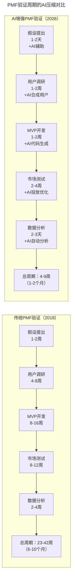
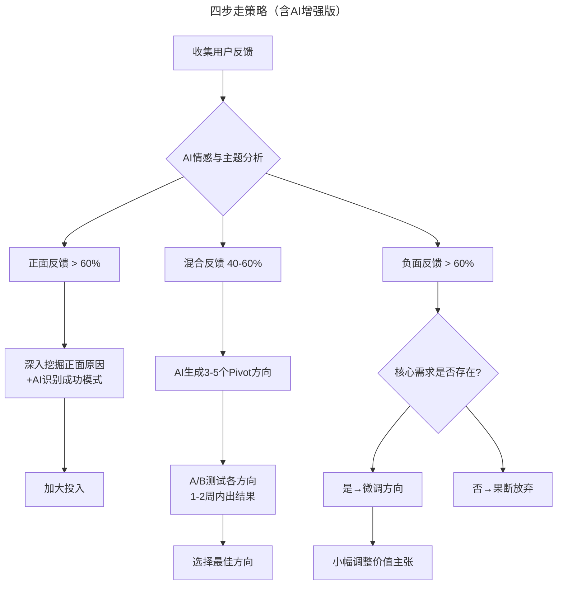

# 第140讲 | 袁店明：创业产品必须迈过的鸿沟

> **适用范围**：初创产品负责人、正在验证产品-市场匹配的创业者、希望用精益创业方法降低试错成本的技术管理者
>
> **更新摘要**（v2）：在保留原文价值主张与用户细分理论、四步走验证策略、三个辅导案例的基础上，融入2026年AI时代视角，新增AI增强PMF验证流程图、AI合成用户研究方法、AI极速原型工具链，以及AI驱动的Pivot决策框架，将原文升级为适用于AI时代创业产品验证的完整操作指南。

---

## 一、导言

据福布斯数据统计，创业产品的20种死法中，排名第一位的是没有市场需求（No Market Need），很多创业公司在创业时根本没有明确产品的市场需求，就推出产品，这是失败的主因。如何明确产品有市场需求并与市场匹配？最直接的方法就是提出假设并验证它——用一句玩笑话来说，就是把投资人的钱烧光之前找到可行的商业模式和正确的产品逻辑、产品路径。

**关键术语对照**：
- 产品-市场匹配（Product-Market Fit, PMF）：产品价值主张与目标用户需求之间达成有效匹配的状态
- 价值主张（Value Propositions）：产品要提供给用户的价值，是产品的内涵，而非产品本身
- 用户细分（Customer Segments）：将目标用户按特征、场景、需求进行分组的过程
- 商业模式画布（Business Model Canvas）：描述商业逻辑九大模块的可视化工具
- Pivot（转型）：基于验证结果调整产品方向或价值主张的决策行为

---

## 二、核心方法论

### 2.1 价值主张与用户细分

商业模式画布在一款产品开始前可能只是猜想。正中间的模块——价值主张（Value Propositions），不是产品，更不是创意，而是产品要提供给用户的价值。价值主张是产品的内涵，是你真正所要表现的东西，而产品是你给用户提供价值的媒介。

明确价值主张后，需要思考商业模式画布中的第二步——用户细分（Customer Segments）：
- 用户是谁，是哪一个细分人群？
- 他们所处的场景是什么，为什么要买我们的产品？

> **案例**：2014年辅导的一个视频服务创业产品，创始人将目标用户和场景列出后发现，所需数据流量价格太贵，难以做起来。结果未听取建议，不久后放弃。这说明对于APP产品，除了时间与地点，关键还在于网络环境（WiFi/非WiFi、4G高速/低速等）。

产品-市场匹配（PMF）模型图中，顶层的UX是用户体验，UX下层是产品功能集，再下一层是价值主张。价值主张根据最深层的用户需求而来。明确价值主张与用户之间的匹配关系，就可以确定产品与市场的匹配关系。

**AI时代扩展**：在2026年，PMF验证周期被AI压缩了5-10倍，但"没有市场需求"仍然是创业失败的第一原因。验证逻辑不变，但验证速度和手段发生了革命性变化。

### 2.2 PMF验证的核心逻辑

可以按照一套行之有效的逻辑进行验证：**提出假设 → 设计实验 → 验证和学习**。假设用户细分人群和场景，设计实验验证假设，收集反馈结果，通过不断的学习和有价值的用户反馈，对产品进行快速迭代优化，以期匹配市场。

**⭐2026 PMF公式更新**：

```
传统PMF = 假设 → 调研 → 开发 → 测试 → 验证（6-10个月）
AI增强PMF = (假设 → 调研 → 开发 → 测试 → 验证) × AI加速(5-10倍)
           = 1-2个月的快速验证循环
```

---

## 三、关键流程

### 3.1 PMF验证周期的AI压缩对比

下图展示了传统PMF验证与AI增强PMF验证在周期上的巨大差异：



> **流程说明**：AI将PMF验证的总周期从6-10个月压缩至1-2个月，每个环节都被AI工具加速。但注意：速度的提升不等于成功率的提升——AI让你更快地失败、更快地找到正确方向。

### 3.2 四步走策略（含AI增强版）

#### 第一步：提出假设

假设的前提是建立价值主张，明确产品创意和解决方案以及你想带给用户的价值。

> **反例**：某创业公司中有七八个人，但每个人对产品的价值理解都不同，对产品的未来方向理解不一，这就是典型的价值主张不明确。

| 传统做法 | AI增强做法 | 推荐工具 |
|---------|-----------|---------|
| 头脑风暴写白板 | AI生成10-20个价值主张变体 | Claude, ChatGPT |
| 手动画商业模式画布 | AI自动填充并质疑每个模块 | Business Model AI |
| 团队讨论达成一致 | AI模拟不同用户视角的反馈 | Persona AI |

> 💡 **Prompt模板示例**："我正在做一个[领域]的创业产品，目标用户是[用户描述]，请帮我生成10个可能的价值主张，并用批判性思维指出每个主张的潜在漏洞。"

#### 第二步：验证假设

基于价值主张进行逻辑推理：用户人群细分（尽可能发散）→ 针对每个用户细分人群列出场景（时间、地点、人物）→ 考虑问题并拆解 → 设计访谈问题 → 走出办公室验证。

**⭐2026升级版**：真实用户 + AI合成用户的混合验证

| 验证方式 | 成本 | 速度 | 适用场景 |
|---------|------|------|---------|
| 真实用户访谈 | 高（每人1-2小时） | 慢（需预约） | 最终决策前的关键验证 |
| AI合成用户访谈 | 极低 | 快（分钟级） | 初步筛选假设、快速排除明显错误选项 |
| AI分析现有数据 | 低 | 快 | 从客服记录、评论中提取洞察 |
| 在线问卷+AI分析 | 中 | 中 | 量化验证，大样本 |

> ⭐重要提醒：**AI合成用户不能完全替代真实用户**，但可以帮你排除80%的糟糕想法、设计更好的访谈问题、发现可能忽略的模式。

#### 第三步：提出验证方案

开发高保真产品原型，找到最终用户进行真实试用，并验证方案的可行度。

> **案例**：远程视频医疗服务创始人认为医生需要看患者化验报告单，但访谈医生后发现并不需要——如果要看，可以让患者拍照。这验证了远程视频医疗的猜想不可行。

| 原型类型 | 传统时间 | AI增强时间 | 工具推荐 |
|---------|---------|-----------|---------|
| 低保真原型（纸面/线框） | 1-2天 | 2-4小时 | Figma AI, Uizard |
| 高保真原型（可交互） | 1-2周 | 1-3天 | v0.dev, Galileo AI |
| 功能性MVP | 4-8周 | 1-2周 | Cursor, Bolt.new, Lovable |
| 数据驱动原型 | 2-4周 | 3-7天 | AI + Mock Data API |

#### 第四步：证实或转向

验证猜想时得到真实用户反馈，明确最终用户是否认为产品能解决他们的问题。如果是，继续验证下一个问题或用户细分人群；如果多个问题被否决，重新考虑价值主张，即创业产品的转型（Pivot）。

**⭐2026升级版**：AI量化的Pivot决策框架



> **流程说明**：AI将Pivot决策从"凭直觉"升级为"数据驱动"。通过AI情感分析和主题聚类，快速判断反馈倾向，并生成可选的转型方向，用A/B测试在1-2周内验证最佳方向。

### 3.3 案例的AI时代重演

原文三个2014年辅导案例在2026年AI增强路径下的对比：

| 案例 | 2014年实际情况 | 2026年AI增强路径 |
|-----|---------------|-----------------|
| **简七理财** | 投入2年摸索方向，最终选择理财教育 | AI在2周内帮助测试3个方向可行性，提前6个月确认教育方向最优 |
| **VEO纽视科技** | 直接做PAAS平台，逐一否定各细分方向，回到代理服务 | AI竞品分析提前预警平台模式难度，并行模拟10个细分市场可行性 |
| **美人工厂** | 用户细分人群有问题，事后才发现成本过高 | AI在假设阶段就通过市场规模数据预警，Day 1给出详细成本模型 |

---

## 四、工具与实践

### 4.1 2026创业者的PMF工具箱

| 阶段 | 工具名称 | 用途 | 成本 |
|-----|---------|------|------|
| 假设生成 | Claude / GPT-5.5 | 价值主张头脑风暴 | $20/月 |
| 用户调研 | Synthetic Users AI | 合成用户访谈 | 免费试用 |
| 原型设计 | v0.dev / Galileo AI | UI/UX原型生成 | 免费-$20/月 |
| MVP开发 | Cursor / Bolt.new | 功能性应用开发 | 免费-$40/月 |
| 市场测试 | AI Ad Generator | 广告文案和投放优化 | 按需付费 |
| 数据分析 | Mixpanel AI / Amplitude | 用户行为分析 | $49/月起 |
| 竞品监测 | Crayon / Kompyte | 竞品动态追踪 | $29/月起 |
| 决策支持 | Custom GPTs / Claude Projects | 综合分析和建议 | $20/月 |

### 4.2 PMF验证的AI Prompt模板库

> 📋 **模板1：价值主张压力测试**
> ```
> "我有一个创业想法：[描述你的想法]。请扮演一位挑剔的投资人和一位苛刻的潜在用户，
> 分别从这两个视角提出最尖锐的问题，帮我找出这个想法的致命缺陷。"
> ```

> 📋 **模板2：用户细分AI分析**
> ```
> "我的产品面向[描述目标市场]。请帮我分析：
> 1. 这个市场可以细分为哪5-10个子群体？
> 2. 每个子群体的痛点是什么？
> 3. 哪个子群体的痛点最强烈且最愿意付费？
> 4. 我应该首先聚焦哪个子群体？为什么？"
> ```

> 📋 **模板3：竞品差距分析**
> ```
> "请分析[你的产品]与[竞品1]、[竞品2]、[竞品3]之间的差异。
> 重点分析：功能差异、用户体验差异、定价策略差异、目标用户差异。
> 最后给我3个差异化定位的建议。"
> ```

### 4.3 PMF快速启动包（本周行动）

1. **Day 1**：用AI生成20个潜在的价值主张变体
2. **Day 2**：用AI合成用户测试这些价值主张，筛选出Top 3
3. **Day 3-4**：用AI工具生成这3个方向的可交互原型
4. **Day 5**：找5个真实用户进行快速测试
5. **Day 6-7**：AI分析反馈，决定下一步方向

---

## 五、常见误区

### 5.1 价值主张不明确

> **典型表现**：团队中每个人对产品的价值理解都不同，对产品的未来方向理解不一。

这是创业产品最常见的起点错误。没有明确的价值主张，再多的用户也可能一夜之间流失。

### 5.2 平台幻觉

> **典型表现**：未进行每一个细分领域的产品-市场匹配，直接决定做平台服务，认为用户一定会用。

技术出身的创业者喜欢一上来就做平台。AI可以通过数据分析告诉你：你的资源、能力和时机是否真的适合做平台。

### 5.3 用户细分不当

> **典型表现**：合作品牌定位与目标城市消费人群不匹配，导致消费人群受限，得不到扩展。

必须在假设阶段就通过数据验证用户细分的可行性，而不是事后才发现成本过高或市场太小。

### 5.4 过度依赖AI的陷阱

> ⭐坦诚的回答：AI让PMF更容易了吗？**是的，也不是。**

**是的，因为**：
- ✅ 验证速度提升了5-10倍
- ✅ 试错成本降低了80-90%
- ✅ 你可以在更短的时间内测试更多的假设

**不是，因为**：
- ❌ "没有市场需求"这个问题AI无法替你解决
- ❌ AI生成的原型再好，也不能代替真实的用户使用体验
- ❌ 过度依赖AI可能导致你跳过了重要的深度思考过程

---

## 六、进阶延展

### 6.1 核心总结

面对创业产品可能遇到的各种问题，都可以执行这套推理逻辑：基于价值主张 → 寻找用户细分人群 → 以人物、时间、地点出发 → 提出假设问题 → 猜想构成问题的所有因素 → 逐一验证所有假设 → 针对证实的问题和痛点提出解决方案。

**终极建议**：把AI当作你的"超级研究员"和"极速原型师"，但不要让它代替你和真实用户的每一次对话。PMF的本质是人与人的连接，这一点AI永远无法替代。

### 6.2 作者简介

袁店明，DellEMC资深敏捷咨询师、Program Manager，精益创业导师。曾任职于百度，辅导过多个产品线转型，在阿尔卡特朗讯就职期间，负责上海贝尔多个产品线的敏捷教练和敏捷培训师工作。目前担任Dell EMC产品线的Program Manager，负责整个产品线的项目集管理与转型。曾担任Agile China 2012的执行副主席，Scrum Gathering Shanghai 2012年和2013年的评审委员会负责人，QCon上海和北京专题出品人，《敏捷教练-如何打造优秀的敏捷团队》合译者。致力于探索团队发展和组织转型、团队引导、可视化管理、精益创业、持续集成、欣赏式探询、演讲和培训。

### 6.3 延伸阅读建议

- 《精益创业》（Eric Ries）：提出假设-验证-学习的精益创业方法论
- 《价值主张设计》（Alex Osterwalder）：商业模式画布的深入应用
- 《跨越鸿沟》（Geoffrey Moore）：技术产品从早期用户到主流市场的跨越策略
- 2026年关注方向：AI合成用户研究、AI辅助Pivot决策、数据飞轮构建PMF壁垒

---

*本注解基于2026年6月的技术环境编写，随着AI技术的快速发展，部分具体工具和建议可能需要定期更新。建议每季度回顾一次本文内容，结合最新技术动态调整策略。*