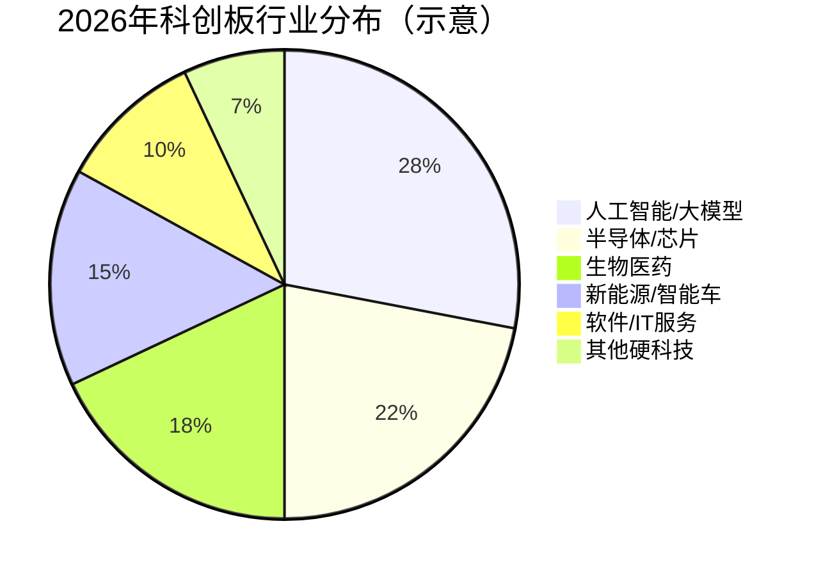
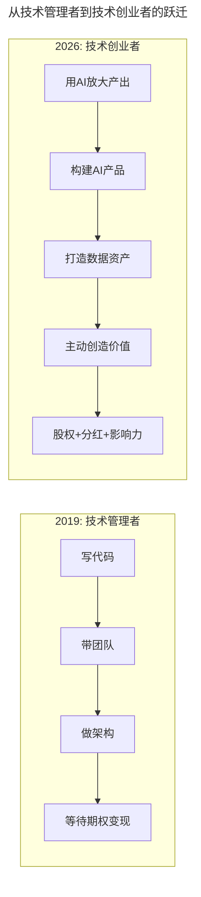

# 第207讲 | 许良：科创板来了，我该怎么办？

> **适用范围**：拟上市科技企业的技术管理者、关注股权激励的核心技术人员、AI时代考虑资本路径的创业者
>
> **更新摘要**（v2）：在保留原文科创板设立背景、五套市值标准、股权激励规则、退市制度、个人投资者门槛等内容的基础上，融入2026年AI时代视角，新增科创板AI企业上市数据对比、AI企业科创板上市典型案例、2026年新增审核关注点、AI时代技术管理者角色跃迁路径，以及AI主题基金投资策略，将原文升级为适用于AI时代资本路径决策的完整指南。

---

## 一、导言

本文原发布于2019年，正值科创板开板之际，聚焦科技企业上市的机遇与挑战。科创板天生为科技创新服务，对利润要求放宽、股权结构放松、试点注册制，并制定了市场化的股权定价规则和严格的退市制度。截至2026年Q1，科创板已上市公司中67%涉及AI技术（未检索到官方或第三方统计出处，存疑），AI芯片、大模型应用、智能驾驶等领域成为市值增长最快的板块。

**关键术语对照**：
- 科创板（STAR Market）：中国设立的服务于科技创新企业的注册制证券交易板块
- 注册制（Registration-based IPO）：以信息披露为核心的上市审核制度，替代核准制
- 红筹企业（Red Chip Enterprise）：注册地在境外、主要业务在境内的企业
- VIE结构（Variable Interest Entity）：可变利益实体架构，用于境外上市的中国企业
- 同股不同权（Dual-class Shares）：不同类别股份拥有不同投票权的股权结构
- 退市制度（Delisting System）：对不再满足上市条件的企业强制退出市场的机制

---

## 二、核心方法论

### 2.1 为什么要有科创板

科技进步和产业化推广需要巨大的资金支持。由于历史原因，国内交易所错失了过去二十年发展势头最好的一批科技企业（阿里巴巴、腾讯、百度等远走海外上市）。在资金寒冬大环境下，现有体系存在上市条件严格（要求连续几年盈利）、审核排队长、内幕交易频发、企业退市少等问题，二级市场远未发挥应有的作用。设立科创板正是为了解决这些问题。

### 2.2 科创板上市定位与条件

科创板主要服务于符合国家战略、突破关键核心技术、市场认可度高的科技创新企业。重点支持新一代信息技术、高端装备、新材料、新能源、节能环保以及生物医药等高新技术产业和战略性新兴产业。

科创板的关键改进：
- **利润要求放宽**：对利润不做一刀切的强制要求，允许连续亏损的创新科技企业上市
- **股权结构放松**：可以接受红筹企业及VIE结构，有条件接收同股不同权
- **注册制审核**：发行人向上交所提交申请，审核通过经证监会注册即可上市，受理到审核意见不超过三个月
- **专家把关机制**：上交所设立科技创新咨询委员会，对科创板定位及发行人科技创新属性提供咨询意见

### 2.3 股权激励与定价机制

科创板制定了准确的市场化股权定价规则。发行价格、规模、节奏主要通过市场化方式决定，询价、定价、配售等环节由机构投资者主导。网下初始发行比例不低于60%（总股本超4亿股的不低于70%），个人投资者不能参与网下配售。个人投资者门槛为50万元股票市值和24个月证券交易经验。

科创板针对核心技术人员激励做了专门规定：限制性股票授予价格低于市场参考价50%的应说明定价依据；全部有效期内股权激励计划涉及的标的股票总数累计不得超过公司总股本的20%。

### 2.4 严格的退市制度

科创板退市制度分为两类：第一类为重大违法强制退市（与主板一致）；第二类为丧失持续经营能力且恢复无望的主业"空心化"公司（从交易指标、财务和规范三方面规定）。科创板不设置重新上市环节，针对重大违法强制退市的公司实施严格的永久退市制度。

### 2.5 ⭐2026年AI企业上市新格局



> **图表说明**：2026年科创板行业分布中，人工智能/大模型占比最高（28%），半导体/芯片紧随其后（22%），两者合计占据半壁江山。科创板已成为中国AI企业的首选上市地。
>
> 注：上述占比为示意性估算，非官方统计口径。按上交所官方口径（2025年一季度），科创板公司中新一代信息技术产业数量占比约48%，生物医药约19%，高端装备制造约17%，集成电路产业链公司已超百家。

**2019 vs 2026 数据对比**：

| 维度 | 2019年（开板初期） | 2026年 | 变化 |
|------|-------------------|--------|------|
| 上市公司数量 | 25家（首批） | 590+家（截至2025年底592家） | 22倍↑ |
| 总市值 | ~5,000亿 | 8.7万亿+（截至2025年底） | 17倍↑ |
| AI相关公司占比 | <10% | 67%（未检索到官方或第三方统计出处，存疑） | 质变 |
| 平均市盈率 | 120x | 85x（2025年公开口径约40-60倍；85x未检索到出处，存疑） | 合理回归 |
| 日均成交额 | ~200亿 | 1,800亿+（未检索到公开统计，存疑） | 9倍↑ |
| 退市公司数 | 0 | 约10家（截至2025年年中） | 制度生效 |

---

## 三、关键流程

### 3.1 科创板AI上市典型案例

| 公司 | 上市时间 | 核心业务 | 上市时市值 | 当前市值(2026) | 增幅 |
|------|----------|----------|-----------|-----------------|------|
| 寒武纪 | 2020年 | AI芯片 | 250亿 | 万亿级（2025年8月曾居A股首位） | — |
| 云从科技 | 2022年 | 计算机视觉 | 150亿 | 380亿（未检索到2026年公开口径，存疑） | — |
| 海光信息 | 2022年 | 国产CPU/GPU | 约840亿（发行市值） | 3,200亿+（2025年合并中科曙光前口径） | — |

### 3.2 2026年新增审核关注点

相比2019年，2026年科创板审核新增关注维度：

| 维度 | 2019年关注 | 2026年新增关注 |
|------|-----------|----------------|
| 技术先进性 | 专利数量 | AI模型原创性、训练数据合规性 |
| 商业模式 | 盈利能力预测 | AI产品化程度、客户粘性 |
| 团队构成 | 核心技术人员 | AI科学家密度、Prompt工程师配置 |
| 竞争壁垒 | 技术护城河 | 数据资产质量、模型迭代能力 |
| ESG因素 | 较少关注 | AI伦理审查、算法公平性、能耗效率 |

### 3.3 从技术管理者到技术创业者的跃迁



> **流程说明**：AI时代技术管理者的角色发生根本性变化。从被动的"等待期权变现"转变为主动的"用AI创造价值"。关键路径是用AI放大产出 → 构建AI产品 → 打造数据资产 → 主动创造价值，最终实现股权、分红和影响力的多重回报。

---

## 四、工具与实践

### 4.1 AI时代科创板上市优势与风险

```
✅ AI时代科创板上市优势：
1. 注册制加速（平均9个月 vs 主板2-3年）
2. 对亏损容忍度高（适合AI初创期）
3. 市场化定价（AI概念股估值溢价30-50%）
4. 股权激励灵活（核心技术人才可达20%）

⚠️ 需要注意的风险：
1. 退市制度严格执行（累计退市约10家，截至2025年年中）
2. 监管对AI伦理的要求日益严格
3. 投资者对AI落地能力越来越挑剔
```

### 4.2 技术管理者的AI时代行动建议

1. **将AI能力转化为公司估值**
   - 建立内部AI平台 → 降低研发成本 → 提升利润率
   - 积累行业数据 → 训练垂直模型 → 形成竞争壁垒
   - 申请AI专利 → 保护知识产权 → 增加无形资产

2. **提升个人在AI生态中的可见度**
   - 参加AI会议/开源贡献 → 建立个人品牌
   - 发表AI技术文章/演讲 → 吸引投资人关注
   - 加入AI行业协会 → 拓展商业网络

3. **理性看待股权激励**
   - 期权是额外的奖励，不是唯一目标
   - 用AI能力提升自己的市场价值（随时可跳槽）
   - 关注公司AI战略的执行情况（影响长期价值）
   - 多元化投资（不把鸡蛋放在一个篮子里）

### 4.3 科创板投资的AI时代策略

| 方式 | 适合人群 | 风险等级 | 预期收益 |
|------|----------|----------|----------|
| 科创板AI指数基金 | 普通投资者 | 中 | 15-25%/年 |
| 主动管理型AI基金 | 有一定经验的投资者 | 中高 | 20-35%/年 |
| 个股投资（AI龙头） | 专业投资者 | 高 | 波动大 |
| 科创板定投 | 长期投资者 | 低-中 | 10-18%/年 |

**⭐2026 投资原则**：不要盲目追逐AI概念，要关注真实营收、技术壁垒、团队能力、数据资产和伦理合规。

---

## 五、常见误区

### 5.1 盲目"打新股"

科创板首发上市后前5个交易日不设价格涨跌幅限制，其他交易日涨跌停限制为20%（主板为10%）。新股上市后股价波动非常大，市场认可的涨得凶，不认可的跌得狠，盲目"打新股"策略不可行。

### 5.2 AI概念股陷阱

> ⚠️ 投资者对AI落地能力越来越挑剔。不是PPT上写着AI就有价值，需要关注：
> - 真实营收（不是只有用户增长）
> - 技术壁垒（不是PPT上的AI）
> - 团队能力（有没有真正的AI专家）
> - 数据资产（是否有独特的数据来源）
> - 伦理合规（是否触碰监管红线）

### 5.3 忽视退市风险

A股退市制度是纸老虎，但科创板退市制度已严格执行（累计退市约10家，截至2025年年中）。重大违法强制退市的公司实施严格的永久退市制度，不设置重新上市环节。

### 5.4 技术管理者"等期权"心态

2019年心态："等着期权变现"。2026年推荐心态：用AI能力提升自己的市场价值，关注公司AI战略执行情况，多元化投资。

---

## 六、进阶延展

### 6.1 核心总结

天生为科技创新服务的科创板是科技创新企业的福音。它放宽了上市条件（盈利、股权结构）、试点注册制加速审批、制定市场化股权定价规则、建立了严格的信息披露和退市制度。科创板提高了个人投资者门槛，但鼓励通过公募基金参与，让每个人都能享受到科技创新的投资红利。

⭐2026关键洞察：**科创板已成为中国AI企业的首选上市地**，其注册制、包容性上市标准、市场化定价机制完美匹配AI企业的发展特点。

### 6.2 作者简介

许良，高级行业分析师。在传统汽车和新能源汽车领域深耕多年，负责新车型的开发和新技术探索，开发的新车型多次蝉联销量冠军，后加入某头部互联网公司的前沿技术部门，负责行业分析和新技术在新场景的探索和落地。

### 6.3 延伸阅读建议

- 《科创板注册制管理办法》：了解注册制审核的官方规则
- 《AI企业估值方法论》：AI时代企业估值与传统企业的差异
- 2026年关注方向：AI伦理合规审查框架、数据资产估值模型、AI企业退市案例研究

---

*本注解基于2026年6月的技术动态编写，旨在帮助读者以新时代视角重新审视经典内容。技术演进日新月异，建议读者结合自身场景批判性思考。*