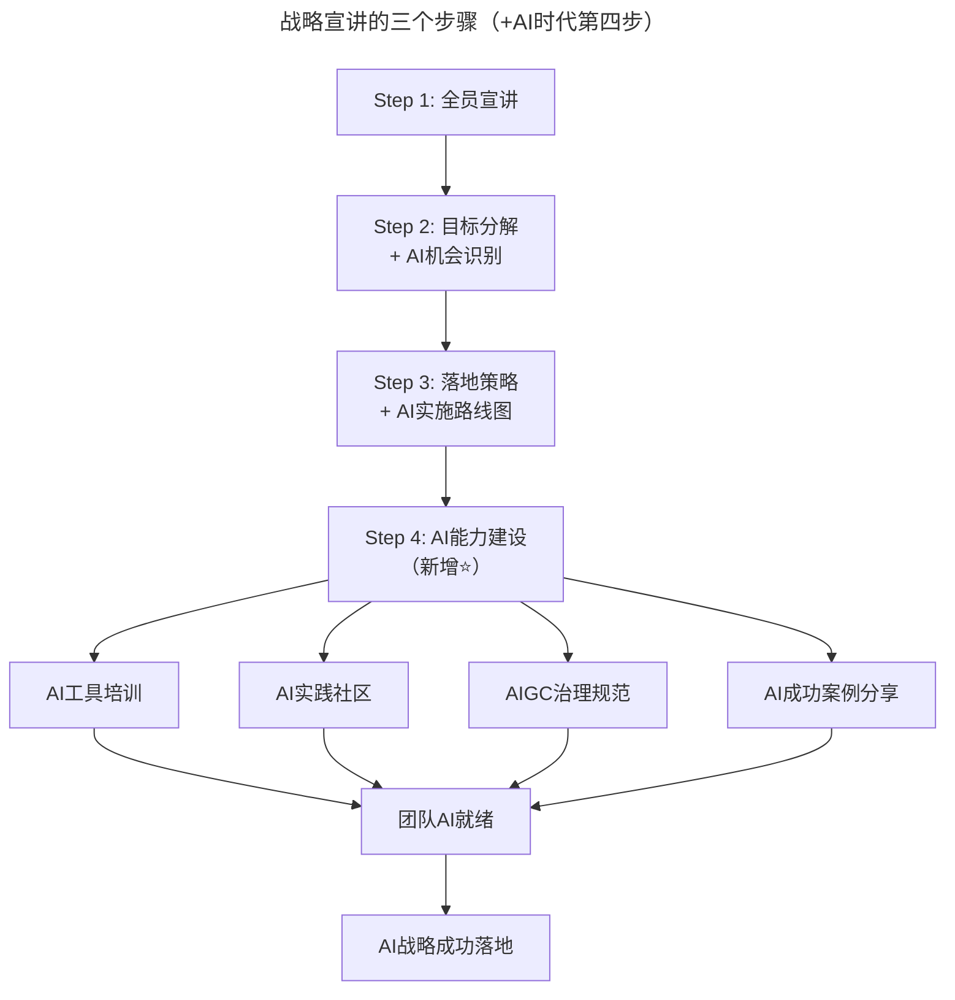
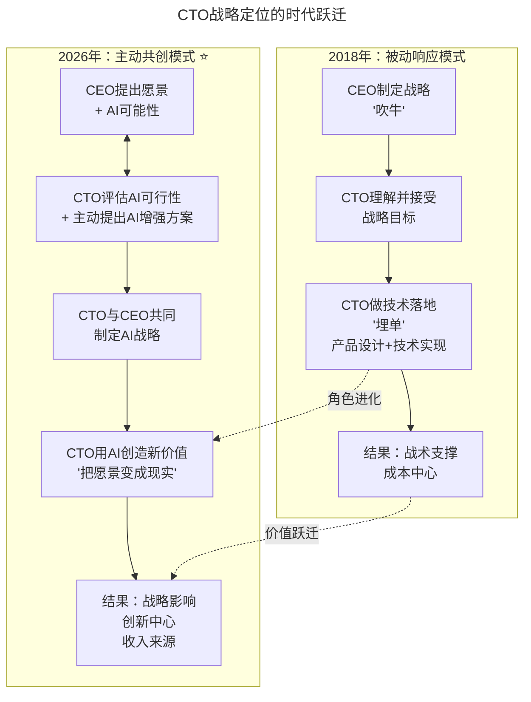
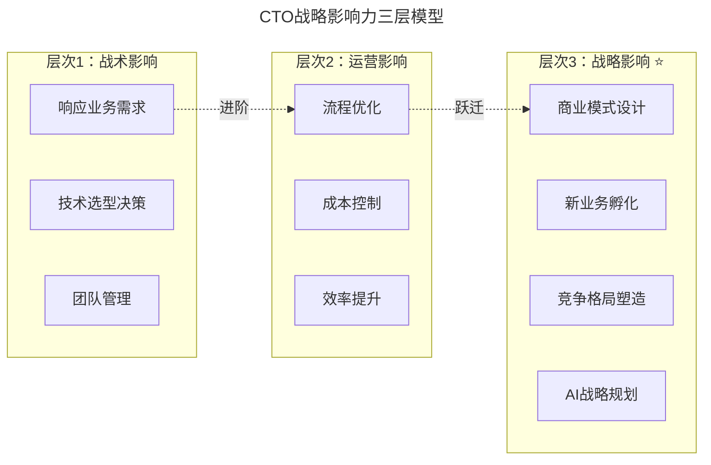

# 第12讲 | 谈谈CTO在商业战略中的定位

> **适用范围**：参与公司战略制定的技术领导者（CTO/技术VP）、希望提升战略影响力的技术管理者、在AI时代寻求角色升级的技术高管
>
> **更新摘要**（v2）：在保留原文战略认可与接受、战略宣讲三步骤、CTO合格素质等核心内容的基础上，融入2026年AI时代视角，新增CTO从"埋单者"到"共谋者"的角色跃迁图、AI战略宣讲第四步、CTO战略影响力三层模型、AI商业敏感度建设路径，以及AI战略沟通术公式，将原文升级为适用于AI时代CTO战略定位的完整指南。

---

## 一、导言

"战略"一词最早是军事概念，战略的特征是发现谋略的纲领。战略是一种从全局考虑谋划实现全局目标的规划，而战术只为实现战略的手段之一。在互联网企业中，一般由CEO制定战略，那么CTO在其中应该扮演什么角色？

核心命题：**CTO永远是要为CEO的"吹牛"去埋单的**——但2026年，"埋单"的方式和内容发生了根本性变化，AI让CTO从被动的"技术实现者"变成了主动的"业务重塑者"。

**关键术语对照**：
- 战略（Strategy）：从全局考虑谋划实现全局目标的规划
- 战术（Tactics）：实现战略的具体手段
- CTO（Chief Technology Officer）：首席技术官，公司技术最高指挥官
- AI战略共创（AI Strategy Co-creation）：CTO与CEO共同制定AI驱动的商业战略
- AI ROI：AI投资回报率，衡量AI项目商业价值的关键指标
- AI Organization：AI驱动的组织形态转型目标

---

## 二、核心方法论

### 2.1 战略必须被认可和接受

作为技术领导者，首先要参与讨论战略，充分认可战略目标，并站在决策者立场上接受。用一句俗语来说：CTO永远是要为CEO的"吹牛"去埋单的，但从职业角度来说，不能玩死了。

在总体战略下，CTO至少需要从产品设计、技术落地两个层面支撑战略在产品上的落地。若不能理解并接受，产品无法及时有效落地，连试错的机会也会失去。

**⭐2026升级**："埋单"内容的时代变化——从"理解CEO商业目标"到"评估AI如何改变商业目标的实现路径"；从"用现有技术实现功能"到"设计AI驱动的产品和业务模式"。

关键转变：
- ❌ 旧模式：CEO说"我们要做AI"，CTO说"好的，我来安排人做"
- ✅ 新模式：CEO说"我们要增长50%"，CTO说"我分析了我们的数据和场景，有3个AI应用可以在6个月内帮我们实现这个目标"

### 2.2 战略宣讲的三个步骤（+AI时代第四步）

**第一步**：战略制定者从全公司层面对来年目标、运营模式进行宣讲。最大问题不是无法讲清目标，而是如何清楚描述为什么能够完成这些目标，底气和信心来自哪里。

**第二步**：战略和目标分解。每个团队根据目标认领自己团队的目标，团队负责人对团队目标进行分解。核心是在产品和技术层面的支持——产品设计思路、技术架构设计、技术路线和落地策略。

**第三步**：落地策略、资源调配。CTO要带领产品、技术团队，在既定战略思维指导下，对产品目标、策略进行设计，确定产品范畴，明确产品诉求、目标客户群体，设计具体运营玩法。

**⭐2026新增第四步：AI能力建设与文化建设**

> **流程说明**：AI时代的战略宣讲在原有三步基础上新增第四步——AI能力建设。通过工具培训、实践社区、治理规范和案例分享，让团队达到AI就绪状态，确保AI战略成功落地。AI战略宣讲的新挑战包括：如何向非技术团队解释AI能力边界、如何消除团队对AI的恐惧、如何激发使用AI的热情、如何建立合理的AI期望值。

### 2.3 能解决问题才是合格的CTO

确定产品设计思路后，CTO要在现有资源上进行最优化配置，合理利用资源，最大化利用资源合理设计并执行落地。CTO应该跟每个团队（尤其不属于CTO负责的团队）充分沟通，理解痛点，换位思考，对症下药。

**⭐2026升级**：AI扩展了CTO的"问题解决工具箱"

| 问题类型 | 传统解决方案 | AI增强解决方案 | 价值提升 |
|---------|-------------|-----------------|---------|
| 效率问题 | 流程优化、自动化脚本 | Agentic Workflow + AI Agent | 效率提升3-10倍 |
| 成本问题 | 砍预算、裁员 | AI替代重复性工作 | 成本降低50-80% |
| 体验问题 | UI/UX改进 | 个性化AI体验 + 智能推荐 | 用户满意度提升40%+ |
| 创新问题 | 头脑风暴、用户调研 | AI辅助创意生成 + 数据驱动洞察 | 创新速度提升5倍 |
| 决策问题 | 经验判断、数据分析 | AI预测模型 + 模拟推演 | 决策质量显著提升 |

> **关键洞察**：2018年CTO解决的问题大多是"已知问题的更好解法"；2026年CTO可以用AI解决"以前无法解决的问题"（如超个性化、实时决策、大规模内容生成等）。

### 2.4 合格CTO的素质要求

| 原文素质 | 2018年定义 | ⭐2026年AI时代升级 |
|---------|-----------|-------------------|
| 技术领域独当一面 | 在某个技术领域有深度经验 | + 对AI技术栈有深入理解（LLM、Agent、RAG、Fine-tuning等） |
| 懂编程原理 | 不被技术人员忽悠 | + 能评估AI方案的合理性（不被AI hype忽悠） |
| 架构设计能力 | 了解各种架构优缺点 | + 能设计AI系统架构（模型选择、数据流、推理优化） |
| 沟通能力 | 表达能力+理解能力 | + AI翻译能力（将AI技术转化为商业语言，反之亦然） |
| 产品&商业意识 | 将技术与业务结合 | + AI商业嗅觉（识别AI驱动的商业机会，评估AI ROI） |

---

## 三、关键流程

### 3.1 CTO战略定位的时代跃迁

> **流程说明**：CTO的战略定位从2018年的"被动响应模式"（CEO制定战略→CTO理解接受→技术落地→成本中心）跃迁到2026年的"主动共创模式"（CEO提出愿景→CTO评估AI可行性→共同制定AI战略→用AI创造新价值→创新中心与收入来源）。角色从"埋单者"进化为"共谋者"，价值从"成本中心"跃迁为"收入来源"。

### 3.2 CTO战略影响力三层模型

> **模型说明**：CTO战略影响力分三层。战术影响（基础层，<30%时间）：响应业务需求、技术选型、团队管理；运营影响（进阶层，~40%时间）：流程优化、成本控制、效率提升；战略影响（领袖层，≥30%时间）：商业模式设计、新业务孵化、竞争格局塑造、AI战略规划。AI时代给了所有CTO快速进入战略影响层的机会。

---

## 四、工具与实践

### 4.1 建立AI商业敏感度（每周4小时）

1. **行业AI动态追踪**（1小时）：同行业AI应用案例、AI监管政策变化、新AI工具和平台发布
2. **内部AI机会扫描**（1小时）：审视公司业务流程哪些可以用AI优化、分析公司数据资产能否通过AI变现
3. **AI实验与小规模验证**（1小时）：在非核心业务上试验新AI工具或方法，记录实验结果
4. **AI知识输出与分享**（1小时）：向CEO和管理团队汇报AI洞察，在团队内部分享学习心得

### 4.2 掌握AI战略沟通术

**沟通公式**：具体的业务指标 + 可量化的AI贡献 + 清晰的时间线和ROI

❌ 错误的沟通方式：
- "我们应该用GPT-5.5，因为它很先进"
- "竞争对手都在用AI，我们也要用"

✅ 正确的沟通方式：
- "我分析了我们的客户服务数据，引入AI客服可以将响应时间从2小时缩短到30秒，同时节省60%的人力成本，预计6个月内ROI达到300%"
- "我们的用户数据显示，个性化推荐可以将转化率提升25%，这相当于每年增加$500万的收入"

### 4.3 打造AI成功案例库

1. **Quick Win（1-3个月）**：选择低风险、高可见度场景（如AI自动生成周报摘要），证明AI能用
2. **Pilot Project（3-6个月）**：选择中等价值业务场景（如AI优化客服流程），量化AI业务价值
3. **Strategic Initiative（6-12个月）**：推动AI驱动战略性项目（如AI推荐系统、AI SaaS产品化），建立AI作为竞争优势

### 4.4 2026年CTO战略影响力市场数据

- 67% 的CEO希望CTO更主动地参与战略制定（Gartner 2025）
- 45% 的CTO表示他们"经常被排除在战略讨论之外"（IDC 2026调研）
- 3倍 是具有战略影响力的CTO vs 纯战术型CTO的薪资差距（LinkedIn 2025）
- 78% 的成功AI转型企业中，CTO都是核心战略决策者之一（McKinsey 2025）
- 最大的瓶颈不是技术能力，而是商业思维和战略沟通能力（TGO鲲鹏会2025调查）

---

## 五、常见误区

### 5.1 CTO不理解公司目标定位

很多技术领导者觉得不知道自己该为战略做什么，一般是因为CTO尚未理解公司的目标定位，即便知道也是一知半解。或者能完全理解但并不清楚公司在这种目标定位下团队短板在哪里，需要补充什么资源。

### 5.2 仅停留在战术影响层

如果大部分"战略影响层"的问题答案是NO，说明需要刻意练习进入战略层面：
- 是否参与公司年度战略规划的讨论？
- 能否主动向CEO提出基于技术的商业建议？
- 是否了解AI如何改变行业竞争格局？
- 能否评估AI项目的商业价值和风险？
- 能否用AI为公司创造新的收入来源？

### 5.3 用技术语言而非商业语言沟通

CTO与CEO和董事会沟通AI战略时，最忌讳用技术语言。不要说"我们应该用GPT-5.5因为它很先进"，而要用"具体的业务指标 + 可量化的AI贡献 + 清晰的时间线和ROI"的公式。

### 5.4 AI hype盲目跟风

不被AI hype忽悠——能评估AI方案的合理性，识别哪些是真正的AI应用，哪些只是"套壳GPT"。

---

## 六、进阶延展

### 6.1 核心总结

CTO是为CEO的吹牛而埋单的。在2026年，CTO不仅是为CEO的"吹牛"埋单的人，更是帮CEO把AI愿景变成现实的人，甚至是主动提出AI战略、与CEO共同"吹牛"、然后一起把"牛"变成现实的人。

当AI正在重塑每个行业的游戏规则时，CTO的战略影响力从未像今天这样重要。不要满足于做一个"技术实现者"，而要努力成为一个"战略共创者"。

**记住**：在AI时代，不能参与战略制定的CTO，终将被边缘化；能够用AI重塑业务的CTO，将成为最稀缺的企业资产。

### 6.2 作者简介

吴万港，前中恒云能源CTO，TGO鲲鹏会杭州分会服务委员&学习委员。10多年的互联网行业从业经验，带领多个团队完成设计、研发了分布式K/V、分布式数据库，日处理达到百T级别的分布式文件系统。8年以上互联网行业大型的产品、技术团队的建设、团队发展、团队管理经验。对于从产品需求、技术实现等管理方面有全面的认识和实践经验，深入理解敏捷研发管理办法以及多年的实践经验。

### 6.3 延伸阅读建议

- 《CTO的战略思维》：从技术管理者到战略决策者的思维转型
- Gartner年度CTO报告：了解全球CTO角色发展趋势
- 2026年关注方向：AI治理框架、AI ROI评估模型、AI组织转型案例

---

*本注解基于2026年6月的技术动态编写，旨在帮助读者以新时代视角重新审视经典内容。技术演进日新月异，建议读者结合自身场景批判性思考。*