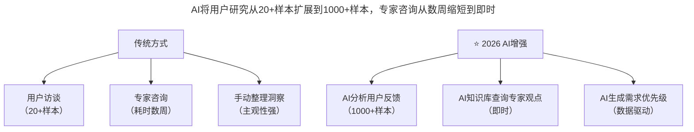
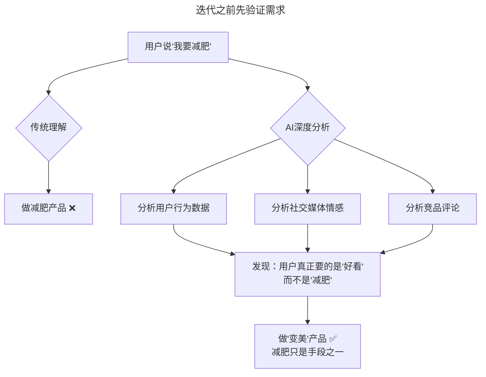

# 第109讲 | 谢呈：关于垂直互联网创业的一些经验之谈

> **适用范围**：垂直领域创业者、转型垂直行业的技术管理者、希望在AI时代用行业深耕构建壁垒的创业团队
>
> **更新摘要**（v2）：在保留原文找用户与找专家方法论、把产品做出来的团队配合、迭代前先验证需求、拥抱不确定性等核心内容的基础上，融入2026年AI时代视角，新增AI增强用户研究流程图、AI深度需求挖掘模型、AI时代不确定性应对矩阵，以及垂直领域创业AI准备清单，将原文升级为适用于AI时代垂直互联网创业的完整指南。

---

## 一、导言

创业很难避开某个领域直接做纯互联网的商业模式，实际做的往往是传统行业+互联网的模式，避不开的一个话题就是垂直领域。本文基于春雨医生和木仓科技的创业经历，分享垂直行业创业的经验与心得——找用户&找专家、把产品做出来、迭代之前先验证需求、拥抱不确定性。

核心命题：**AI改变的是方法，不是本质；垂直领域的成功关键依然是真正理解用户和行业。**

**关键术语对照**：
- 垂直领域（Vertical Domain）：聚焦特定行业或人群的商业模式
- 深层需求（Deep Need）：用户表面需求背后的真正动机
- 产品-市场匹配（Product-Market Fit, PMF）：产品价值与市场需求的匹配状态
- AI合成用户（Synthetic Users）：AI生成的虚拟用户画像用于需求验证
- 人机协作（Human-AI Collaboration）：人与AI协同完成任务的协作模式
- AI抗脆弱性（AI Antifragility）：在AI技术快速变化中保持核心竞争力的能力

---

## 二、核心方法论

### 2.1 找用户&找专家

很多想在垂直领域创业的人会困扰：创业方向应该是找用户还是找专家？答案是都要找。

- **什么时候找用户**：当你想判断一个需求是否存在时（如是否有线上问诊的需求）。在垂直行业，必须始终以用户需求为出发点。
- **什么时候找专家**：当你想寻求一个更合适的解决方案时（如线上问诊如何解决误诊问题）。

> **案例**：春雨医生与二十多个医生交谈发现支持率不高，但近百名用户中超过50%支持率。医生担心线上问诊能否给出有效建议、资质是否合法、医疗纠纷怎么办，而用户只担心医生是否专业，但对线上问诊的方便很期待。最终听从用户建议启动项目，第一期效果出乎意料。

**⭐2026升级**：AI让用户研究和专家咨询更高效

> **图表说明**：AI将用户研究从20+样本扩展到1000+样本，专家咨询从数周缩短到即时，洞察整理从主观手动变为数据驱动自动。但注意：AI增强的是效率，判断权仍在创业者手中。

### 2.2 把产品做出来

有了具体创业想法和充分验证需求后，需要将想法落地，搭建团队，做出产品。

**解决问题与发现问题**：技术人员是非常优秀的解题高手，但在创业过程中，思路要从代码中跳出来，去发现公司存在的问题，去解决开放性问题。想法不能再局限于如何做好一个产品，而是要思考如何做好一个企业。从"解决问题"转化为"发现问题"，只有真正站在公司的角度，才能看到公司的问题所在。

**⭐2026新增**：从"解题高手"到"AI协同者"——"这个功能AI可以生成80%，我审核优化"、"这个架构AI提供3个方案，我选最优"、"这个Bug AI定位了根因，我确认修复方案"。

**团队配合**：一个高效团队必备的素质是尊重专业人士，寻找优势互补人员。

> **案例**：技术团队做2B的OA系统，产品很好但去客户公司宣讲"四大特点八大优势"后无回信。引荐的销售朋友不展示PPT，而是请对方负责人喝咖啡，询问工作压力和当前OA系统使用感受。几天后整理产品PPT，一通电话促成合作。关键在于销售人员懂得为客户解决问题——对方怕麻烦、需要向老板汇报，销售针对性地解决了这些隐忧。

**⭐2026技能互补的AI版本**：

| 缺失能力 | 传统解决方案 | AI解决方案 |
|---------|------------|-----------|
| 销售能力 | 找销售合伙人 | AI SDR工具 + 销售培训 |
| 产品设计 | 找产品经理 | AI辅助设计 + 用户研究 |
| 运营推广 | 找运营专家 | AI内容生成 + 自动化投放 |
| 客户服务 | 建客服团队 | AI客服系统 + 人工兜底 |

### 2.3 迭代之前先验证需求

迭代是必须的，但迭代最大的坑就是没有需求——此处指的是没有理解用户的深层需求。

> **案例**：减肥是女生的需求吗？不是。女生要的是"好看"，减肥只是手段。春雨医生曾根据专家建议做过30天瘦6斤的健康减肥计划，反响不理想，因为减肥并不是需求，不节食不运动的减肥才是需求。

对于验证标准：只要有一个指标让你觉得兴奋，就能称之为标准。

> **案例**：春雨医生线上问诊最初只找两位医生兼职，要求每人每天答100个问题。上线第一天涌现300个问题，通过限号、分批限号、迅速扩量，两个月内将产品变为平台模式。

**⭐2026升级**：AI帮助发现深层需求

> **流程说明**：AI通过分析用户行为数据、社交媒体情感和竞品评论，发现用户表面需求（减肥）背后的深层需求（好看）。传统理解会直接做减肥产品，AI深度分析引导做"变美"产品，减肥只是手段之一。

### 2.4 拥抱不确定性

创业非常辛苦，总会出现各种不确定因素——BAT也开始做了、合伙人有新的创业想法想退出等。面对各种不确定性，要做好心理准备，去拥抱它，与不确定性同行。

要多学习、多实践、多跟人交流、早接触尝试。实践不只有辞职创业一条路，可以参加技术大会、与已创业的同事交流、做开源项目等。

**⭐2026新解读**：AI降低了某些不确定性，但带来了新的不确定性

| 不确定性类型 | 传统应对 | AI时代应对 |
|------------|---------|-----------|
| 技术可行性 | 试错成本高 | AI快速原型降低试错成本 |
| 市场需求 | 难以预测 | AI数据分析提高预测准确性 |
| 竞争威胁 | BAT入场 | 新威胁：AI可能颠覆你的模式 |
| 人才流失 | 合伙人退出 | 新挑战：AI人才争夺战 |
| 技术迭代 | 半年一变 | 更快：AI技术月月新 |

---

## 三、关键流程

### 3.1 AI需求验证实战流程

| 步骤 | 操作 | AI工具 |
|------|------|--------|
| 1. 收集用户声音 | 社交媒体、评论、客服记录 | AI情感分析工具 |
| 2. 识别模式 | 找出反复出现的问题/期望 | GPT-5.5模式识别 |
| 3. 挖掘深层需求 | 问5次Why | AI追问式分析 |
| 4. 验证假设 | A/B Test | AI实验设计 + 数据分析 |

### 3.2 AI时代的"兴奋点指标"

| 验证方式 | 传统 | AI增强 |
|---------|------|--------|
| 用户需求验证 | 访谈20人，50%支持率 | AI分析1000+用户反馈 + 情感分析 |
| 市场规模估算 | 行业报告 + 猜测 | AI聚合多源数据 + 自动计算TAM |
| 竞争分析 | 手动调研竞品 | AI自动监控竞品动态 + SWOT分析 |
| MVP测试 | 手工做原型（2-4周） | AI辅助生成MVP（2-3天） |

### 3.3 AI时代新不确定性应对策略

1. **建立AI雷达**：每月追踪AI技术动态，评估新技术对业务的影响，提前布局或防御
2. **保持人类核心竞争力**：AI能做的（代码生成、数据分析、内容创作）；人类必须做的（战略决策、情感连接、伦理判断、创意方向）
3. **构建AI抗脆弱性**：不过度依赖单一AI工具，保持核心技术功底，培养"AI + X"的复合能力

---

## 四、工具与实践

### 4.1 垂直领域创业AI准备清单

1. **行业Know-how + AI = 新壁垒**
   - 我的行业有哪些AI尚未解决的痛点？
   - 我有什么独特的数据资产？
   - 我如何用AI重塑行业效率？

2. **MVP开发AI加速**
   - 用AI工具在1周内完成原型
   - 用AI进行用户测试和分析
   - 快速迭代，验证PMF

3. **组建AI-ready团队**
   - 至少1人精通AI工具链
   - 建立"AI First"的开发流程
   - 持续学习最新AI技术

### 4.2 多学习多实践的AI时代路径

- 参加AI技术大会，与已创业的同事交流经验
- 利用互联网做开源AI项目
- 建立AI个人品牌（技术博客/公众号）
- 参与AI开源社区贡献

---

## 五、常见误区

### 5.1 伪需求AI版

AI能做不等于应该做。先验证商业价值，再考虑AI方案。不是所有问题都需要AI解决，有时候简单的方案更有效。

### 5.2 技术自嗨

过度追求AI先进性。用户价值 > 技术炫技。用户不在乎你用的是GPT-5.5还是DeepSeek V4，他们在乎的是产品是否解决了他们的问题。

### 5.3 忽视行业本质

以为AI能颠覆一切。垂直行业的本质规律不变——医疗的核心是医患信任，教育的核心是学习效果，金融的核心是风险控制。AI改变的是实现方式，不是行业本质。

### 5.4 AI依赖症

离了AI不会干活。AI是放大器不是替代品。保持核心技术功底，培养"AI + X"的复合能力，避免在AI工具不可用时完全瘫痪。

---

## 六、进阶延展

### 6.1 核心总结

谢呈的垂直互联网创业经验在AI时代依然宝贵——找用户、找专家、验证需求、拥抱不确定性这些方法论没有过时。但AI让每个环节都更快、更准、更便宜。2026年的垂直领域创业者需要具备"AI思维"——用AI加速验证，用人类保持判断，用行业深耕构建壁垒。

**记住**：AI改变的是方法，不是本质；垂直领域的成功关键依然是真正理解用户和行业。

### 6.2 作者简介

谢呈，木仓科技副总裁，前春雨医生副总裁及联合创始人，曾任网易有道移动事业部技术负责人。在多年的创业中，分析垂直行业发展、制定并调整战略方向、思考业务和商业模式，对创业和互联网+的模式有丰富经验、教训和独到的见解。

### 6.3 延伸阅读建议

- 《精益创业》（Eric Ries）：假设-验证-学习的迭代方法论
- 《跨越鸿沟》（Geoffrey Moore）：垂直产品从早期用户到主流市场
- 2026年关注方向：垂直行业AI Agent应用、行业大模型微调实践、AI数据飞轮构建

---

*本注解基于2026年6月的技术环境编写，随着AI技术的快速发展，部分具体工具和建议可能需要定期更新。建议每季度回顾一次本文内容，结合最新技术动态调整策略。*