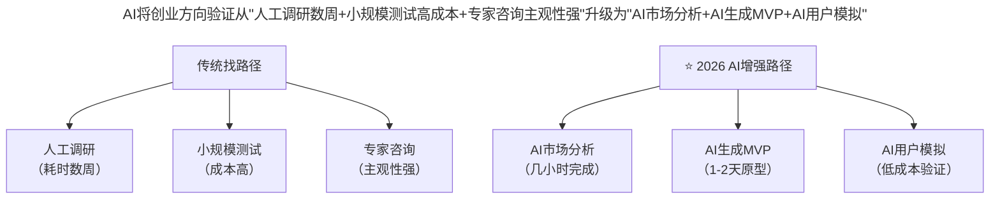
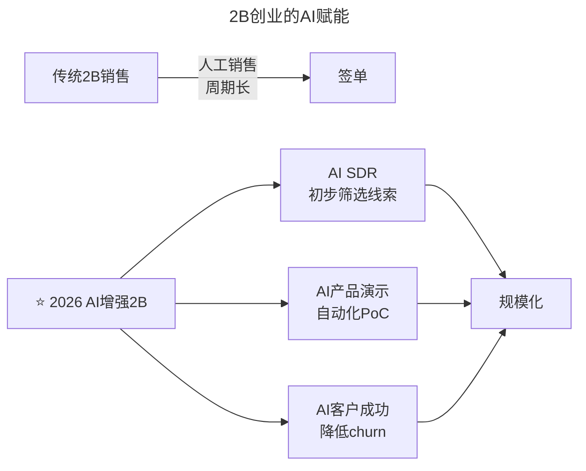

# 第108讲 | 谢呈：技术高手转身创业的坑和坡

> **适用范围**：正在考虑从技术岗位转身创业的技术高手、已有创业想法但尚未实践的技术管理者、在AI时代寻求创业方向的技术人才
>
> **更新摘要**（v2）：在保留原文找方向、找人、找钱三部曲及2B/2BAT方向选择经验的基础上，融入2026年AI时代视角，新增AI增强创业方向验证路径图、AI时代团队配置对比表、VC关注点变化矩阵、2B AI赋能流程图，以及技术人创业前AI准备清单和避坑指南，将原文升级为适用于AI时代技术创业者转型的完整指南。

---

## 一、导言

创业中的坑是难以避开的挑战，坡是迎难而上实现目标的路径。本文从三个方面讲创业：找方向、找人、找钱。正确的顺序应该是先找方向，然后找人才，最后才是找资金——没有明确方向，团队组建会乱了阵脚；没有方向和团队，获取资金难上加难。

核心命题：**2026年的技术创业者需要具备"AI思维"——不是盲目追逐AI热点，而是思考如何利用AI创造真正的商业价值。AI是工具，创业的本质（解决真实问题、创造用户价值）从未改变。**

**关键术语对照**：
- 创业方向验证（Direction Validation）：对创业方向进行市场调研和可行性确认的过程
- PMF（Product-Market Fit）：产品-市场匹配
- 2B（To Business）：面向企业客户的商业模式
- 2BAT：面向BAT（百度/阿里/腾讯）的商业模式
- AI SDR（AI Sales Development Representative）：AI驱动的销售开发代表
- AI-ready团队：具备AI工具使用能力和AI First文化的创业团队

---

## 二、核心方法论

### 2.1 找方向：方向第一，人才第二，资金末位

创业方向非常重要，但"找方向"中的"找"代表验证。多数成功的创业公司往往不是有了创业冲动后去找方向，而是已有明确方向，再通过各种方法验证方向。

对于初次创业者，判断是创业想法还是创业冲动的标准：创业方向是否足够明确、是否已进行验证、对此方向是否足够笃定。

**小方向找机会：make money，看重商业模式**

创业公司至少有两点优势：
1. BAT强大，斩掉了创业路上的许多荆棘（如移动互联网普及、移动支付习惯）
2. BAT不能吞掉所有食物，初创公司可以吃到它吃剩或看不上的"小鱼"

> **案例**：木仓科技的驾考宝典App，通过用户和流量卖广告变现。4年前尝试2C收费项目，日均收入小几千徘徊；1年后类似业务第一天就收入上千元，第二天破万。前后变化归根结底是支付方式发生了改变——移动支付成为正常消费习惯。

**大风口拼刺刀：why me？理清竞争优势**

如果创业方向较大（估值百亿以上），要问自己"为什么是你"——为什么你可以做或为什么你是最适合做这个事情的人。大方向也需要具体，需要多做考量与验证，多用竞争的思路看问题。

**⭐2026升级**：AI改变创业方向的验证方式



> **图表说明**：AI将创业方向验证从"人工调研数周+小规模测试高成本+专家咨询主观性强"升级为"AI市场分析几小时+AI生成MVP 1-2天+AI用户模拟低成本"。验证效率提升10倍以上。

### 2.2 2B与2BAT

**2B**：技术人在2B方向有不少优势，需要特别注重销售与资源。

> **案例**：技术背景出身的朋友与两位技术朋友合伙做2B企业，产品和商业模式非常扎实，但最初忽略了销售的作用，导致产品销售困难，后来找了一位销售合伙人。

**2BAT**：需要注重两点——抓住需求，铺垫关系。将企业卖给BAT是正常的退出渠道，但2BAT的成功离不开需求分析。如滴滴、快的抓住了BAT需要移动支付的需求。内部关系也能在必要时助你一臂之力。

### 2.3 找人才：价值观相近 + 技能互补

找人才就像找结婚对象，一定要价值观相近，而最重要的是技能互补。

> **案例**：2B的技术团队缺少销售人才，导致再好的产品也遇到销售困境。

互补依托于人脉的积累。如果有创业梦，需要积累来自各方面的人脉（产品、销售、运营等），他们都可能成为未来的合伙人。

**⭐2026升级**：技能互补的新维度

| 传统团队配置 | AI时代团队配置 | 新增角色 |
|------------|---------------|---------|
| 技术 + 产品 + 运营 | 技术+AI+产品+运营 | AI Engineer |
| 销售 + 客服 | 销售+AI客服系统 | AI Product Manager |
| CEO + CTO | CEO+CTO+CAO | Chief AI Officer |

### 2.4 找资金：方向正确、产品过硬、团队扎实

找资金没有多少大坑，这是一个坡。两极分化：一部分人根本不需要找，发个朋友圈投资人就上门；另一部分人联系过一百多家VC。当方向正确、产品过硬、团队扎实时，找钱自然不是难事。

---

## 三、关键流程

### 3.1 AI时代的新"小鱼"机会

AI创造了全新的"小鱼"机会（BAT吃剩或看不上的小生意）：

| AI时代的新机会 | 案例 | 预估市场规模 |
|---------------|------|-------------|
| AI工具代理 | 为中小企业部署AI工具 | 年营收千万级 |
| Prompt工程服务 | 企业Prompt优化咨询 | 刚起步，增长快 |
| AI训练数据标注 | 高质量数据清洗 | 稳定现金流 |
| 垂直领域AI应用 | 如"AI驾考教练" | 取决于行业 |
| AI内容生成 | 批量生成营销内容 | 低门槛高竞争 |

### 3.2 Why Me? 的AI版本

传统三问：
- 为什么是你做这个方向？
- 你的团队有什么优势？
- 你的资源有什么不同？

AI时代新增三问：
- 你如何利用AI建立壁垒？（而非被AI颠覆）
- 你的数据资产是否独特？（AI需要数据）
- 你的人机协同能力是否领先？（这是新护城河）

### 3.3 2B创业的AI赋能



> **流程说明**：AI增强2B销售从三个环节赋能：AI SDR初步筛选线索、AI产品演示自动化PoC验证、AI客户成功降低流失率，最终实现规模化。传统2B靠人工销售周期长，AI增强后各环节并行推进。

### 3.4 AI时代VC关注点变化

| 维度 | 传统VC关注 | AI时代VC关注 |
|------|----------|--------------|
| 团队 | 名校名企背景 | AI实战经验+人机协作案例 |
| 产品 | 用户增长数据 | AI使用深度+效率提升指标 |
| 技术 | 技术壁垒 | 数据资产+AI模型优势 |
| 市场 | TAM/SAM/SOM | AI渗透率+替代可能性 |

---

## 四、工具与实践

### 4.1 技术人创业前的AI准备清单

1. **AI能力自评**
   - 我能用AI独立完成一个MVP吗？
   - 我理解当前AI的能力边界吗？
   - 我有人机协作的实际经验吗？

2. **AI创业方向验证**
   - 用AI分析10个潜在方向的市场机会
   - 用AI生成竞品分析报告
   - 用AI模拟用户反馈

3. **组建AI-ready团队**
   - 至少1人精通AI工具使用
   - 至少1人理解AI商业应用
   - 建立"AI First"的文化共识

### 4.2 AI时代团队配置案例

```
场景：AI创业团队常见配置错误

❌ 错误配置：
├─ 3个AI算法专家
├─ 1个全栈开发
└─ 结果：技术很强但找不到PMF

✅ 正确配置：
├─ 1个AI算法专家（核心技术）
├─ 1个AI产品经理（懂业务+懂AI能力边界）
├─ 1个全栈开发（快速实现）
├─ 1个领域专家（行业Know-how）
└─ 结果：技术与商业平衡，更容易成功
```

### 4.3 2BAT的AI时代机会与挑战

| 机会 | 挑战 |
|------|------|
| BAT都在布局AI，需要合作伙伴 | 竞争激烈，要求更高 |
| AI基础设施外包机会 | 利润率可能较低 |
| 垂直领域AI解决方案 | 需要深厚行业积累 |

---

## 五、常见误区

### 5.1 AI伪需求

为了用AI而用AI。先验证需求真实性，再考虑AI方案。不是所有问题都需要AI，有时候传统方案更可靠。

### 5.2 技术陷阱

过度追求AI技术先进性。商业价值 > 技术炫技。用户不在乎你用的是什么模型，他们在乎的是你解决了什么问题。

### 5.3 人才错配

招了算法大牛但不懂业务。优先招"AI+业务"复合型人才。一个懂业务的AI产品经理比三个纯算法专家更有价值。

### 5.4 资金误区

以为AI概念就好融资。投资人看重的是真实的AI应用效果，不是PPT上的AI概念。2025-2026年AI赛道融资占比超40%，但竞争更激烈，投资人更挑剔。

### 5.5 方向不清就找人找钱

没有明确而笃定且可落地的方向，往往代表这不是一个成熟或容易成功的创业模式。先找方向，再找人，最后找钱。

---

## 六、进阶延展

### 6.1 核心总结

谢呈的"找方向、找人、找钱"创业三部曲在AI时代依然成立，但每个环节都被AI深刻改变了。2026年的技术创业者需要具备"AI思维"——不是盲目追逐AI热点，而是思考如何利用AI创造真正的商业价值。

**记住**：AI是工具，创业的本质（解决真实问题、创造用户价值）从未改变。

### 6.2 作者简介

谢呈，木仓科技副总裁，前春雨医生副总裁及联合创始人，曾任网易有道移动事业部技术负责人。在多年的创业中，分析垂直行业发展、制定并调整战略方向、思考业务和商业模式，对创业和互联网+的模式有丰富经验、教训和独到的见解。

### 6.3 延伸阅读建议

- 《从0到1》（Peter Thiel）：创业方向选择与垄断思维
- 《创始人的困境》（Noam Wasserman）：创始团队配置与冲突管理
- 2026年关注方向：AI Agent创业模式、垂直行业大模型应用、AI Native产品方法论

---

*本注解基于2026年6月的技术环境编写，随着AI技术的快速发展，部分具体工具和建议可能需要定期更新。建议每季度回顾一次本文内容，结合最新技术动态调整策略。*