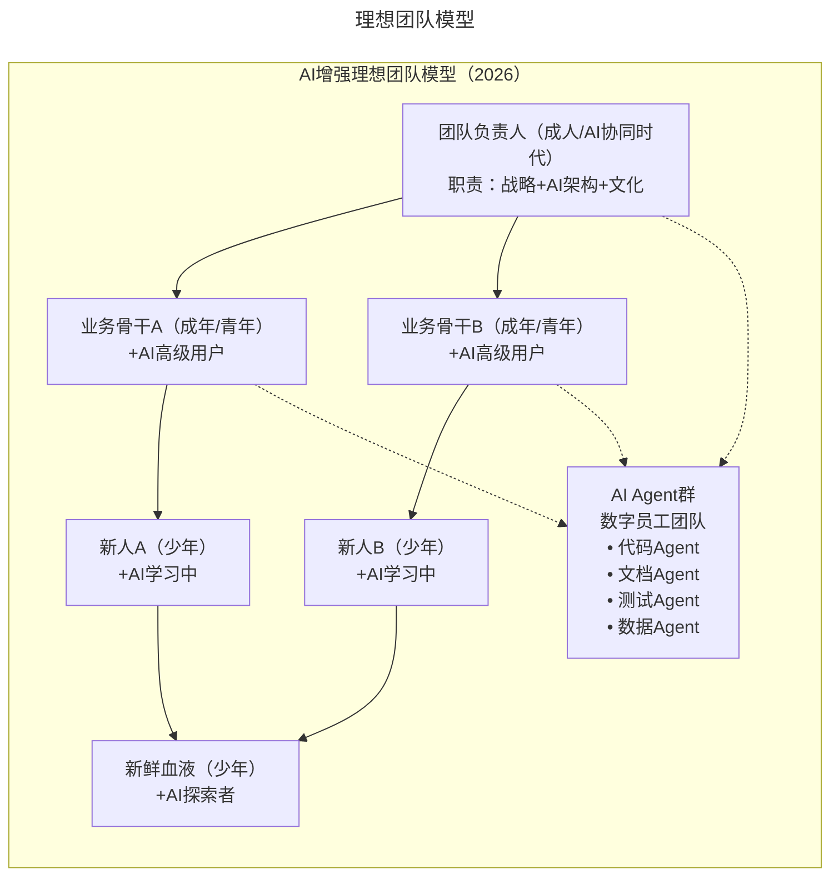
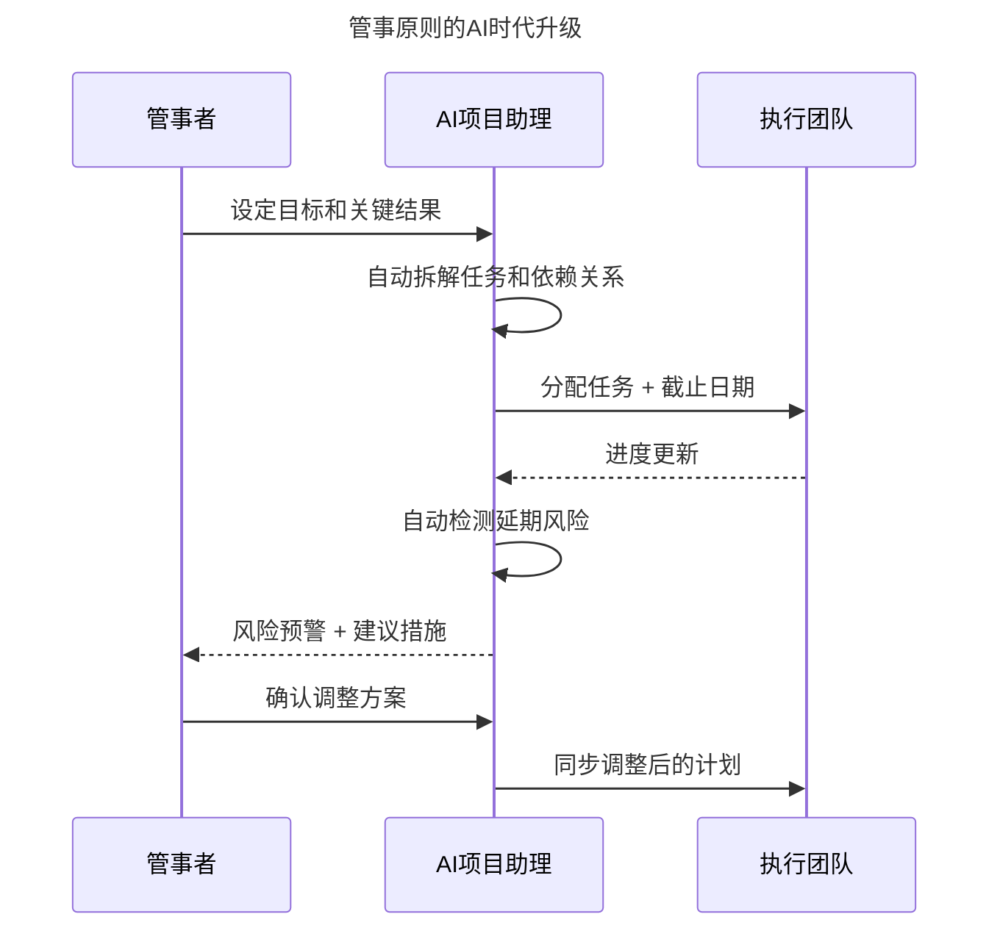

# 第165讲 | 陈崇磐：管事与管人 - 如何避开创业公司组队陷阱

> **适用范围**：创业公司技术管理者（CTO/技术Leader）、正在搭建团队的创始人、在AI时代需要管理"人机协作"团队的技术领导者
>
> **更新摘要**（v2）：在保留原文理想团队模型、做事→管事→管人成长路径、管事五原则、管人四原则等核心内容的基础上，融入2026年AI时代视角，新增AI增强理想团队模型图、AI时代成长路径重构表、管事原则AI升级版、管人原则AI升级版、AI时代招聘评估维度，以及可执行行动清单，将原文升级为适用于AI时代创业公司团队管理的完整指南。

---

## 一、导言

一个都是孙悟空的团队不是好团队。效率来自分工，分工需要协作，配合和协作是一个团队的基石。专业技能的短板决定了团队能不能做起一件事，而心理年龄的长板决定了能把这件事做到多大。本文从组队、管事、管人三个维度，分享如何避开创业公司组队陷阱。

核心命题：**未来管理者的精力分配 = 50%战略思考 + 30%人际连接 + 20%AI工具驾驭。把重复性的"管事"工作交给AI，把精力集中在真正需要"人"的地方——理解人、激励人、成就人。**

**关键术语对照**：
- 理想团队模型（Ideal Team Model）：基于专业技能与心理年龄的团队配置框架
- 管事（Managing Tasks）：驱动他人做事的管理行为
- 管人（Managing People）：通过成就他人来成就自己的管理行为
- 受益原则（Beneficiary Principle）：谁受益谁驱动的协作原则
- AI Agent：AI智能体，可作为"数字员工"参与团队协作
- 人机协同领导（Human-AI Collaborative Leadership）：管理人与AI协作团队的新型领导模式

---

## 二、核心方法论

### 2.1 理想团队模型

针对每个团队成员，专业技能决定他能解决什么样的问题，心理年龄决定他能解决多大的问题。理想模型设计要点：

- 处于管理位置的必须是成人，否则团队正常运转无法保证
- 业务骨干有2个（成人或青年），有竞争也有备份，防止被业务骨干绑架
- 每个业务骨干各带一个业务新手（少年或青年），团队有后备力量
- 再配备一名少年业务小白，补充新鲜血液
- 每个人都有上升空间：成为业务骨干前是专业技能的上升，业务骨干到团队负责人是业务到管理的突变
- 团队负责人重心放在团队管理和带领团队突破业务上

**⭐2026升级**：AI增强理想团队模型



> **模型说明**：在原有理想团队模型基础上，新增AI Agent群作为"数字员工团队"，包含代码Agent、文档Agent、测试Agent、数据Agent等。团队负责人、业务骨干均与AI Agent群建立协作关系（虚线表示），形成"人+AI"的混合团队结构。

### 2.2 做事→管事→管人的成长路径

从做事到管事，是"自己做事"到"驱动做事"的区别，也是动手到动嘴的转变。从管事到管人，是"成就自己"和"成就他人"的区别。学而优则仕，需要以青年到成人的心理成熟度突变作为基础。

创业公司常犯的问题：让做事还不错（专业技能不错）的员工直接从"做事"跃迁到"管人"，跳过"管事"阶段。应尽量避免这条红色升迁路线，如果团队内部没有合适的人，宁愿外招。

**⭐2026版新路径**：

```
做事 → AI辅助做事 → 管事 → AI增强管事 → 管人 → 人机协同领导
```

| 阶段 | 传统定义 | AI时代新定义 | 关键能力变化 |
|-----|---------|------------|------------|
| 做事 | 自己完成任务 | 人机协作完成任务 | 从"手写代码"到"审核AI生成的代码" |
| 管事 | 驱动他人做事 | 驱动人+AI Agent做事 | 新增"Agent编排能力" |
| 管人 | 成就他人 | 成就他人+优化人机分工 | 新增"AI协作效率优化" |

### 2.3 管事的原则

1. **受益原则**：谁受益谁驱动。在团队协作边界不清晰时，约定谁受益谁驱动，让问题在边界划分清楚前快速得到解决。

2. **基准原则**：时间节点是协作的基准。所有相关方共同认可的时间节点表是团队协作的基准，没有就不要贸然启动。

3. **推动原则**：从目标到范围、从工作量到计划，从跟踪到关闭。确定目标→确定人和事→确定工作量→形成计划→启动并监控→关闭。

4. **受阻原则**：如果推不动，尝试改变协调方式而不是停止。管事者最需要在过程中找到原因，改变协调方式，而不是在冲破时间节点时找责任方。

5. **好人原则**：当面的妥协并不是真正的好人。把事情推到底落地，才是一个真正好的管事者。

### 2.4 管人的原则

1. **基本规则**：右手棒子、左手甜枣。打一棒子给个甜枣，既不会把团队管死，也保持原则性。

2. **换位原则**：了解对方的需求层级，满足对方最在意的。管人者最高境界是所有人都觉得老板对自己特别好。

3. **招人原则**：不为事，不引诱。因事设岗、因岗招人；不强调利诱而强调公司目标和意义。

4. **提拔原则**：先证明能力再给名分。组织协作关系只是实际协作关系的追认，而不是先行。提拔没有退路。

---

## 三、关键流程

### 3.1 管事原则的AI时代升级

#### 受益原则 → "受益原则 + AI责任界定"

```
传统版：谁受益 → 谁驱动 → 谁负责
AI版：谁受益 → 谁驱动 → 谁(AI)负责 → 人工审核点在哪？
```

#### 基准原则 → "时间节点 + AI里程碑"

| 传统里程碑 | AI增强里程碑 |
|-----------|------------|
| 需求评审完成 | 需求文档AI生成初稿完成 |
| 设计稿确认 | AI原型可用性测试通过 |
| 开发完成 | AI生成代码Code Review通过 |
| 测试完成 | AI自动化测试覆盖率 > 80% |
| 上线发布 | AI监控告警规则配置完成 |

#### 推动原则 → "推动 + AI自动追踪"



> **流程说明**：AI项目助理自动拆解任务、分配截止日期、检测延期风险并预警。管事者从手动跟踪转变为确认调整方案，大幅提升管事效率。推荐工具：Linear AI、Notion AI Projects、Asana Intelligence、Jira AI。

#### 受阻原则 → "受阻 + AI备选方案"

| 受阻场景 | 传统解决方式 | AI增强方式 |
|---------|-----------|-----------|
| 对方没时间 | 等待/升级汇报 | 用AI先出初稿，对方只需审核修改 |
| 配合意愿低 | 反复沟通/施压 | 用数据说话，AI生成影响力报告 |
| 技术分歧 | 无休止讨论 | AI快速POC验证，用结果说话 |
| 跨时区协作 | 会议难安排 | 异步AI协作 + 异步决策记录 |

#### 好人原则 → "好人原则 + AI透明度"

好管事者还要确保AI使用的透明度和可追溯性：所有AI生成的关键产出都有版本记录，AI参与决策的过程可追溯，团队成员清楚哪些工作是AI完成的。

### 3.2 管人原则的AI时代升级

#### 基本规则 → "棒子甜枣 + AI公正性"

| 管理动作 | 传统做法 | AI增强做法 |
|---------|---------|-----------|
| 绩效评估 | 主观印象为主 | AI数据分析 + 客观指标 |
| 奖励分配 | 领导拍板 | AI建议 + 人做最终决定 |
| 问题发现 | 靠观察和举报 | AI异常检测 + 早期预警 |
| 反馈沟通 | 定期一对一 | AI生成个性化反馈建议 |

> ⚠️ 重要提醒：AI可以提供数据支持，但最终的决定权和人情味必须保留在人手中。不要用AI代替面对面的真诚沟通。

#### 换位原则 → "换位 + AI洞察"

| 需求类型 | 传统了解方式 | AI增强方式 |
|---------|-----------|-----------|
| 工作负荷 | 问"忙不忙？" | AI分析任务分布和工作时长 |
| 成长需求 | 年度面谈 | AI追踪技能发展轨迹 |
| 情绪状态 | 观察和感知 | AI分析沟通内容情感倾向 |
| 职业规划 | 直接询问 | AI匹配内部机会 + 外部市场 |

#### 招人原则 → "不为事招人 + AI匹配"

AI时代招聘新增评估维度：

| 评估项 | 面试问题 | 观察要点 |
|-------|---------|---------|
| AI工具使用经验 | 你常用哪些AI工具？怎么用的？ | 广度和深度 |
| AI输出判断力 | 你怎么验证AI给出答案的正确性？ | 批判性思维 |
| 人机协作风格 | 描述一次你和AI合作完成任务的经历？ | 协作自然度 |
| AI学习能力 | 你最近学会了什么新的AI用法？ | 学习主动性 |
| AI伦理意识 | 你认为使用AI时应该注意什么？ | 责任感 |

> ⭐2026招聘黄金法则：与其招一个不用AI的高级工程师，不如招一个善用AI的中级工程师+给他配最好的AI工具。

#### 提拔原则 → "先证明 + AI效能"

| 提拔前需证明的能力 | 传统要求 | AI时代新增 |
|-----------------|---------|-----------|
| 业务能力 | 个人产出优秀 | 个人+AI协作产出优秀 |
| 影响力 | 能带动他人 | 能带动他人用好AI |
| 管理潜质 | 有组织协调能力 | 有人机协作的组织设计能力 |
| 文化贡献 | 符合价值观 | 推动AI正向使用的文化 |

---

## 四、工具与实践

### 4.1 本周立即行动

1. **Day 1-2**：梳理当前团队的任务分配，标注哪些环节已有AI介入
2. **Day 3-4**：为团队建立"AI使用规范"（至少包含：工具清单、使用场景、审核流程）
3. **Day 5-7**：与每位核心成员进行一次关于"AI协作期望"的一对一沟通

### 4.2 第一个月目标

- 建立团队的"AI任务分配矩阵"（谁做什么、AI做什么、审核点在哪）
- 引入至少1个AI项目管理工具，全团队试用
- 完成1轮"AI协作效率"复盘，识别改进点

### 4.3 第一个季度目标

- 团队的"管事"效率提升50%（量化指标）
- 形成"人+AI"协作的团队文化（非强制但自发使用）
- 至少培养1名"AI协同时代"的潜在管理者

### 4.4 AI不会取代"管事"和"管人"吗？

**会被AI替代的部分**：任务分配和进度追踪、例行绩效数据收集和分析、标准化流程执行监督

**不会被AI替代的部分**：复杂情况下的判断和决策、对人的理解和激励、文化和价值观的塑造、危机时刻的担当和领导

---

## 五、常见误区

### 5.1 从"做事"直接跳到"管人"

跳过"管事"阶段的红色升迁路线要尽量避免。并不是所有人都有能力或意愿完成突变。如果团队内部没有合适的人，宁愿外招。

### 5.2 间接推动效率太低而直接介入

管人新手容易犯的错误：觉得间接推动效率太低而直接介入，由管人降级为管事。这会让团队成员失去成长机会。

### 5.3 只用棒子或只用甜枣

太有管理意识凡事使用棒子导致团队失去积极性；不好意思凡事使用甜枣哄骗导致团队没有甜枣就不出活。正确做法是右手棒子左手甜枣。

### 5.4 为事招人

招人的出发点不应该是团队里面有个具体的问题没人解决（否则问题解决了人怎么安排？），而应该是因事设岗、因岗招人。

### 5.5 AI代替管理沟通

AI可以提供数据支持，但最终的决定权和人情味必须保留在人手中。不要用AI代替面对面的真诚沟通。

---

## 六、进阶延展

### 6.1 核心总结

未来的管理者 = 50%的战略思考 + 30%的人际连接 + 20%的AI工具驾驭。把那些重复性的"管事"工作交给AI，把精力集中在真正需要"人"的地方——理解人、激励人、成就人。

**关键原则回顾**：
- 管事五原则：受益原则、基准原则、推动原则、受阻原则、好人原则
- 管人四原则：基本规则（棒子甜枣）、换位原则、招人原则、提拔原则
- AI时代新增：AI责任界定、AI里程碑、AI自动追踪、AI备选方案、AI透明度

### 6.2 作者简介

陈崇磐，德信随寓CTO兼COO，TGO鲲鹏会会员，多次从零开始搭建团队，有丰富的团队打造经验，曾在通信领域扎根10多年，先后就职于华为、摩托罗拉、诺西通信等公司。2013年开始自主创业，并随后加入创业社交平台微链担任CTO，目前专注长租公寓领域。

### 6.3 延伸阅读建议

- 《团队拓扑学》（Matthew Skelton）：团队组织结构与流动式团队设计
- 《赋能》（Stanley McChrystal）：从指挥控制到团队赋能的管理转型
- 2026年关注方向：AI Agent团队协作模式、人机混合团队管理框架、AI辅助绩效评估实践

---

*本注解基于2026年6月的技术环境编写，随着AI技术的快速发展，部分具体工具和建议可能需要定期更新。建议每季度回顾一次本文内容，结合最新技术动态调整策略。*