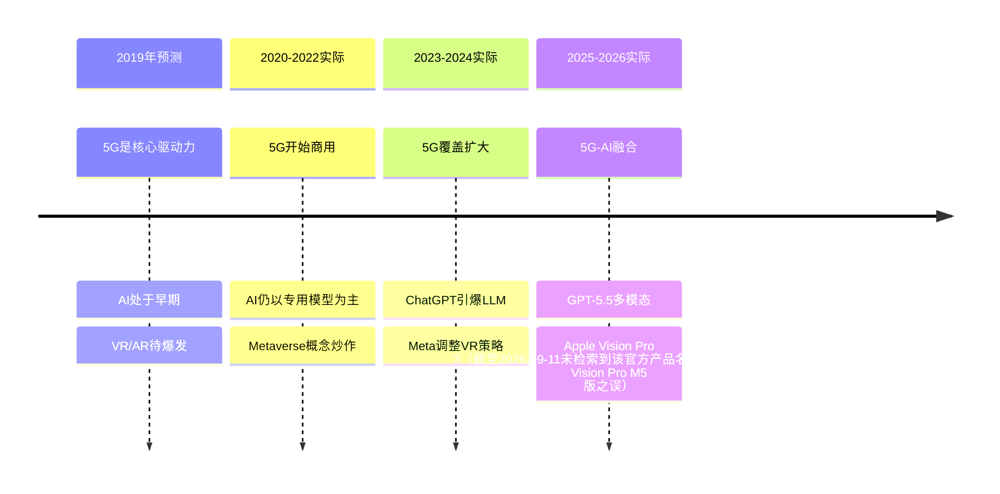

# 第208讲 | 陈阳：科创板投资，未来哪些行业受益最大？

> **适用范围**：关注科创板投资机会的技术从业者、希望把握AI时代投资红利的技术管理者、计划上市或融资的科技创业者
>
> **更新摘要**（v2）：在保留原文百年大局观、纳斯达克对标分析、科创板规则、5G/VR/AI/无人驾驶/物联网行业预测的基础上，融入2026年AI时代视角，新增原文预测准确度评估、2026年新增热门赛道（大模型/AI芯片/AI Agent/具身智能/AI安全）、投资框架更新公式、技术从业者机遇对比，以及个人投资者AI时代配置建议，将原文升级为适用于AI时代科创板投资的完整指南。

---

## 一、导言

周期大王周金涛说过，人生发财靠康波，每一次机会都出现在时代的转折点。2019年是财富重新分配的新起点，而科创板就是以金融支持科技最重要的一个环节。本文从百年发展大局出发，分析科创板对中国经济转型的战略意义，并预测未来受益最大的行业。

核心命题：**陈阳在2019年的行业判断方向完全正确，但对AI的发展速度严重低估——没人能预料到LLM会在2022-2024年爆发式增长。选择正确的行业 > 努力程度，这在2026年依然成立。**

**关键术语对照**：
- 科创板（STAR Market）：中国设立的服务于科技创新企业的注册制证券交易板块
- 纳斯达克（NASDAQ）：美国全国证券交易商协会自动报价系统，美国"科创板"
- 康波（Kondratiev Wave）：康德拉季耶夫长波，约50-60年的经济长周期
- TAM/SAM/SOM：总可用市场/可服务可用市场/可服务获得市场
- AGI（Artificial General Intelligence）：通用人工智能
- 具身智能（Embodied AI）：具有物理实体并能与真实世界交互的AI系统

---

## 二、核心方法论

### 2.1 百年大局：科创板的战略意义

改革开放四十多年来，中国经济经历了劳动密集型到资本密集型的发展，规模跃居全球第二，但发展质量依然落后。两大亟需面对的问题：
1. 经济总量庞大，高科技产业发展跟不上经济发展步伐
2. 人口老龄化带来劳动力不足，人口红利变为人口负担

转型升级只有一条路：从以数量取胜走向以质量取胜的技术密集型发展道路。科技兴国不是空话，而是关乎百年发展大局的重大转折点。设立科创板就是以金融支持科技最重要的环节。

> **数据支撑**：按国家统计局口径，2018年信息传输、软件和信息技术服务业增加值占GDP比重约3.6%，仍低于金融业（约7.7%）、房地产业（约6.6%）和建筑业（约6.9%）——高科技产业规模与经济总量并不匹配，转型升级空间巨大。

### 2.2 美国的科创板：纳斯达克

纳斯达克创立于1971年，专门为计算机、电信、生物技术公司等新兴技术行业提供融资渠道。降低了上市门槛，培育出了英特尔、微软、戴尔、苹果、思科等高科技巨头。纳斯达克成交量超过了任何单一证券市场，纳指成为全球最具影响力的股票指数之一。

### 2.3 科创板的规则

- **定位**：落实创新驱动和科技强国战略
- **发行制度**：采取注册制，简化发行流程，缩短上市时间（约9个月）
- **投资门槛**：50万投资门槛，鼓励专业机构投资者
- **行业集中**：大部分集中在半导体芯片、集成电路、人工智能、互联网、生物科技等领域

### 2.4 ⭐2026投资框架更新

原文提到的投资逻辑：选择正确的行业 > 努力程度

**2026版投资公式**：

```
投资回报 = f(
  赛道选择(30%),      # AI > 半导体 > 生物医药
  技术壁垒(25%),      # 数据/算法/算力护城河
  团队能力(20%),      # AI科学家密度
  商业化程度(15%),    # 落地能力 > PPT
  伦理合规(10%)       # AI治理能力（新增！）
)
```

---

## 三、关键流程

### 3.1 原文预测的2026验证结果

| 预测行业 | 2019年观点 | 2026年现状 | 准确度 |
|----------|-----------|------------|--------|
| 5G网络 | "科技之母"，将催生新行业 | ✅ 方向正确：5G移动电话用户渗透率约60%（2025年，工信部口径），成为基础设施 | ✅ |
| 虚拟现实(VR) | 医疗、工业、娱乐广泛应用 | ⚠️ 部分实现：Apple Vision Pro推动，但未成主流 | ⚠️ |
| 人工智能 | 算法和思维提升，应用广阔 | ✅✅ 严重低估：GPT-5.5远超"阿尔法狗"级别 | 低估 |
| 无人驾驶 | 5G普及后将兴起 | ✅ 正在验证：L3/L4已在特定场景商用 | ✅ |
| 物联网(IoT) | 普及只是时间问题 | ✅ 基本实现：智能家居渗透率提升（"超40%"未检索到公开统计出处，存疑） | ✅ |

### 3.2 原文预测 vs 实际演进



> **时间线说明**：2019年预测5G为核心驱动力，实际5G在2020年开始商用并逐步扩大覆盖；AI在2023年由ChatGPT引爆大语言模型，远超2019年预期；VR/AR经历了Metaverse炒作和策略调整，2026年由Apple Vision Pro推动但尚未成为主流。

### 3.3 2026年新增热门赛道

| 赛道 | 2019年关注度 | 2026年地位 | 代表公司 |
|------|-------------|-----------|----------|
| 大模型/AGI | 未提及 | 最热 | 月之暗面、智谱AI、MiniMax |
| AI芯片 | 隐含在AI中 | 第二热 | 寒武纪、海光信息 |
| AI Agent | 不存在 | 新兴 | 多家初创公司 |
| 具身智能 | 不存在 | 前沿 | 宇树科技、逐际动力 |
| AI安全/治理 | 未提及 | 必需 | 数世信息（截至2026-09-11未检索到对应公开主体，存疑）、瑞莱智慧 |

---

## 四、工具与实践

### 4.1 个人投资者AI时代配置建议

```
✅ 推荐配置（2026）：

1. 科创板AI ETF（40%）
   - 跟踪科创板AI龙头指数
   - 适合长期持有（3-5年+）

2. 全球AI主题基金（30%）
   - 分散地域风险（美股+A股）
   - 关注NVIDIA、Microsoft、ASML等

3. 科创板定投（20%）
   - 每月定投，平滑波动
   - 降低择时风险

4. 现金/货币基金（10%）
   - 应急储备
   - 等待抄底机会

❌ 不推荐：
- 追涨杀跌（AI板块波动极大）
- 全仓单一股票（退市风险真实存在）
- 杠杆投资（除非你是专业投资者）
```

### 4.2 技术从业者的2026行动清单

```
□ 评估自己的AI技能水平（使用AI Literacy Self-Assessment）
□ 至少掌握1个AI开发框架（LangChain / CrewAI / Vercel AI SDK）
□ 建立 GitHub 项目展示AI能力（比简历更有说服力）
□ 参与1个开源AI项目（贡献代码或文档）
□ 关注3-5家科创板AI公司的动态（了解行业趋势）
□ 开始写技术博客/公众号（建立个人品牌）
□ 学习基本的商业和财务知识（理解估值逻辑）
□ 考虑是否应该创业或加入早期AI创业公司
```

### 4.3 2019 vs 2026 从业者机遇对比

| 维度 | 2019年 | 2026年 |
|------|--------|--------|
| 高薪岗位稀缺度 | 较高 | 极高（AI人才缺口超500万，工信部人才交流中心口径） |
| 创业门槛 | 较高 | 降低（AI工具降低启动成本） |
| 股权变现周期 | 3-5年 | 1-3年（AI公司上市更快） |
| 个人影响力 | 局限于公司内 | 可快速建立全网影响力 |
| 职业路径 | 相对固定 | 多元化（AI专家/创业者/投资人/教育者） |

---

## 五、常见误区

### 5.1 对科创板半信半疑

很多人对国家设立科创板抱着半信半疑的态度，并没有深刻认识。如果站在百年发展大局来看，设立科创板对中国经济发展具有跨时代的战略意义——只许成功不许失败，因为已经没有退路。

### 5.2 盲目追逐AI概念

不要盲目追逐AI概念，要关注：
1. 真实营收（不是只有用户增长）
2. 技术壁垒（不是PPT上的AI）
3. 团队能力（有没有真正的AI专家）
4. 数据资产（是否有独特的数据来源）
5. 伦理合规（是否触碰监管红线）

### 5.3 低估AI发展速度

陈阳在2019年虽然预测了AI的重要性，但严重低估了其发展速度。GPT-5.5多模态大模型远超当年"阿尔法狗"级别的预期。投资者和从业者都需要对AI技术演进速度保持高度敏感。

### 5.4 忽视退市风险

科创板退市制度严格执行，累计退市约10家（截至2025年年中）。重大违法强制退市的公司实施严格的永久退市制度。全仓单一股票的风险真实存在。

---

## 六、进阶延展

### 6.1 核心总结

未来技术创新推动经济发展的路径已经非常清晰，技术创新的核心就在于5G网络的普及，在此基础上衍生出大量新兴行业。2019年预测的多数趋势已变为现实——5G已普及、AI进入GPT-5.5时代、智能驾驶开始商业化、Agent加速落地。但AI的演进深度远超预期。

⭐2026核心结论：**选择正确的行业 > 努力程度**，这在AI时代更加明显。最好的时机是"你熟悉的行业 + AI能力的结合点"。

### 6.2 作者简介

陈阳，一个具有工科背景和超过十年投资经验的独立投资人。

### 6.3 延伸阅读建议

- 《康波周期理论》（周金涛）：经济长周期与投资机会
- 《纳斯达克崛起之路》：美国科创板如何培育科技巨头
- 2026年关注方向：AI Agent商业化、具身智能产业化、AI安全合规赛道

---

*本注解基于2026年6月的技术环境编写，旨在帮助读者以新时代视角重新审视经典内容。技术演进日新月异，建议读者结合自身场景批判性思考。*