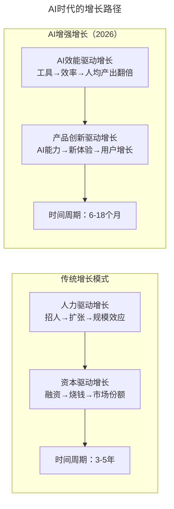
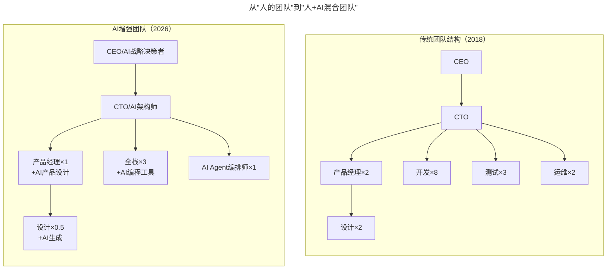
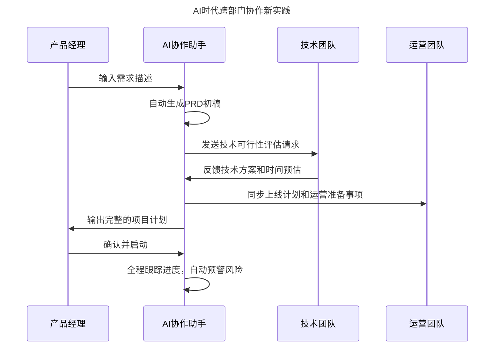

# 第122讲 | 黄伟坚：创业中那些永远回避不了的问题

> **适用范围**：正在经历快速增长期的创业公司创始人/CTO、面临人员管理和跨部门协作挑战的技术管理者、在AI时代需要重新设计激励机制和团队结构的创业者
>
> **更新摘要**（v2）：在保留原文"增长解决一切问题"核心观点、人的问题两原则、部门协作三原则、激励四方面等核心内容的基础上，融入2026年AI时代视角，新增AI时代增长公式更新、AI增强团队结构对比图、AI时代识人新标准、AI消除跨部门摩擦矩阵、AI时代激励体系新维度，以及可执行行动清单，将原文升级为适用于AI时代创业管理的完整指南。

---

## 一、导言

在2013年到2017年短短四年内，公司经历了裂变式增长：团队从4人扩张为500人，营收从5千万增长到20亿（翻40倍），点击量从每天1千万增长到每天四个亿。这些经历带来了很多思考。创业中有些问题永远回避不了，有些坑即使知道也不得不再去踩一遍。本文从人的问题、部门协作问题和激励问题三个方向分享创业中难以避免的挑战。

核心命题：**增长可以解决创业公司在发展过程中遇到的所有问题。AI是放大器——它既能放大你的优势，也能放大你的劣势。用得好，事半功倍；用不好，加速灭亡。**

**关键术语对照**：
- 增长（Growth）：公司发展的主要矛盾，解决增长其他问题迎刃而解
- PMF（Product-Market Fit）：产品-市场匹配
- AI乘数（AI Multiplier）：AI对增长效率的放大倍数（3-10倍）
- AI效能积分制（AI Efficiency Point System）：基于AI工具使用效率的激励机制
- 人机协作（Human-AI Collaboration）：人与AI协同完成任务的协作模式
- AI Native创业公司：以AI为核心能力构建的创业公司

---

## 二、核心方法论

### 2.1 什么是最重要的事情——增长

对于初创团队来说，增长可以解决创业过程中遇到的所有问题。因为增长是公司发展的主要矛盾，解决了主要矛盾，其他问题都会迎刃而解。

> **案例**：员工离职有两个主要因素——对收入或物质回报不满、得不到足够的成长空间。公司快速增长可以解决这两个问题：快速增长意味着物质回报不成问题，业务推动所有人向前走迫使个人快速成长。

如何做到增长？两个词：**时机**和**团队**。
- 时机：在合适的时间节点做有潜力的市场
- 团队："独行者速，众行者远"，团队是否足够强大高效决定能否脱颖而出

再展开用四个词：需求、产品、技术、运营。再展开八个词：战略、战术、融资、产品、研发、管理、营销和财务。

**⭐2026增长公式更新**：

```
2018版：增长 = 时机 + 团队 + 资本
2026版：增长 = (时机 + 团队 + 资本) × AI乘数(3-10倍)
```

| 增长维度 | 传统方式 | AI增强方式 | 效率提升 |
|---------|---------|-----------|---------|
| 产品迭代速度 | 2周/版本 | 2-3天/版本 | 5-7倍 |
| 客户响应能力 | 24小时 | 实时（AI客服） | ∞倍 |
| 市场验证周期 | 6个月 | 2-4周 | 6-8倍 |
| 人才利用效率 | 1人/角色 | 1人/3-5角色（+AI） | 3-5倍 |

### 2.2 有关人的问题

**第一原则：不要因为人的问题而调整组织架构。**

某员工在某部门与同事或上级关系不好，调到其他部门非常危险。在公司规模较小的情况下，负面因素可能在整个公司内传播，而且没有从根本上解决问题。是否调整组织架构只有一个判断标准——业务，应该根据业务来调整组织架构，而不是因为个人。

**第二原则：尽早解聘不合适的员工。**

只要你作出解聘决定，你会觉得为什么不早点做这件事。解聘不合适的员工是绝对不会让你后悔的事情。

**⭐2026识人新标准**：在AI时代，评估一个员工是否"合适"需要新增维度——AI工具使用熟练度、AI输出判断力、人机协作能力、AI学习能力、能否用AI放大自身价值。

**⭐2026"解聘"新思考**：不是人不合适，可能是人+AI的协作方式不合适。决定淘汰前先尝试：AI赋能测试（给员工配备AI工具观察1-2个月）、角色重新匹配、培训投资回报计算。

### 2.3 部门协作的问题

技术团队通常面对商务、运营、产品等多个部门的夹击，内部摩擦很难避免。三个原则：

1. **主动汇报**：主动汇报项目进度，及时反馈问题，而不是等做完了再解释缘由。有时对方问什么时候能做完，真正目的是想知道一个时间点让自己心里有底。

2. **充分沟通**：跨部门沟通很重要，许多问题由沟通不足引起。信息透明、沟通顺畅能大大减少误解。

3. **参加对方部门的会议**：鼓励部门leader或核心人员参加协作部门的核心会议（如milestone会议），了解项目进度和困难，做预见性准备。

### 2.4 激励的问题

激励机制可以看作反馈机制，让每个人认识到自己做的好与不好。四方面做法：
1. 制定阶段性任务，完成得荣誉奖励
2. 偶尔超预期鼓励（年终奖远超年初制定目标）
3. 针对技术部门举办活动激发荣誉感和归属感（技术之星、技术创新奖、最佳新人）
4. 反向激励（线上事故P0到P5评级，P0从CTO到责任人自上而下全罚并公示）

---

## 三、关键流程

### 3.1 AI时代的增长路径



> **流程说明**：传统增长依赖人力和资本驱动，周期3-5年；AI增强增长通过AI效能和产品创新双轮驱动，周期缩短至6-18个月。关键变化是从"招人扩张"到"AI工具提升人均产出"，从"烧钱换市场份额"到"AI能力创造新用户体验"。

### 3.2 从"人的团队"到"人+AI混合团队"



> **模型说明**：传统团队需要19人（CEO+CTO+2PM+8开发+3测试+2运维+2设计），AI增强团队仅需7.5人（CEO+CTO+1PM+3全栈+1 Agent编排师+0.5设计），通过AI工具和Agent编排实现同等甚至更高产出。

### 3.3 AI消除跨部门摩擦

| 传统痛点 | AI解决方案 | 工具推荐 |
|---------|-----------|---------|
| 进度不透明 | AI自动同步项目状态 | Linear AI、Notion AI |
| 信息不对称 | AI自动摘要会议纪要 | Otter.ai、Fireflies |
| 需求理解偏差 | AI辅助PRD澄清 | Claude、ChatGPT |
| 责任边界不清 | AI追踪任务依赖关系 | Jira AI、Asana Intelligence |
| 反馈不及时 | AI实时收集用户反馈 | Dovetail、Maze |

### 3.4 AI时代跨部门协作新实践



> **流程说明**：AI协作助手充当跨部门协作的中枢——自动生成PRD、评估技术可行性、同步运营计划、全程跟踪进度并预警风险。产品经理从"手动协调各方"转变为"确认并启动"，大幅减少跨部门摩擦。

### 3.5 AI时代激励体系新维度

| 激励类型 | 传统做法 | AI时代新增 |
|---------|---------|-----------|
| 任务奖励 | 完成目标给奖金 | AI效率提升奖（使用AI工具提升团队整体效率） |
| 超预期鼓励 | 年终超发奖金 | AI创新奖（发现新的AI应用场景） |
| 荣誉激励 | 技术之星评选 | AI协作之星（Prompt质量高、人机协作好） |
| 反向激励 | 线上事故罚款 | AI误用追责（未经审核直接使用AI输出导致问题） |

> 📌 **案例：某AI原生公司的"AI效能积分制"**：每月统计员工使用AI工具节省的时间（通过工具日志），节省时间TOP10%的员工获得额外奖金，分享AI最佳实践的员工获得双倍积分。结果：3个月内团队整体效率提升65%。

---

## 四、工具与实践

### 4.1 本周立即行动

1. **Day 1-2**：盘点团队中每个人的AI工具使用情况，建立基线数据
2. **Day 3-4**：识别团队协作中的最大痛点，寻找对应的AI解决方案
3. **Day 5-7**：选择1-2个AI工具进行试点，记录效果变化

### 4.2 第一个月目标

- 核心成员AI工具使用率达到80%以上
- 建立"AI最佳实践分享"机制（每周一次）
- 重新审视招聘标准，加入AI协作能力评估

### 4.3 第一个季度目标

- 团队整体效率提升50%（量化指标）
- 形成"人+AI"协作的组织文化
- 建立AI时代的激励机制（至少覆盖3种激励类型）

### 4.4 AI时代团队成员核心能力变化

| 能力维度 | 2018年要求 | 2026年要求 | 变化趋势 |
|---------|-----------|-----------|---------|
| 编码能力 | 手写高质量代码 | AI协作编码 + 代码审查 | 从执行到审核 |
| 问题解决 | 个人独立解决 | AI辅助分析 + 人做决策 | 效率大幅提升 |
| 沟通协作 | 人际沟通为主 | 人机沟通 + 人际沟通 | 新增技能维度 |
| 学习能力 | 自学新技术 | 快速掌握AI工具链 | 学习内容变化 |
| 创新能力 | 经验驱动 | AI启发 + 人判断 | 创新范式转变 |

---

## 五、常见误区

### 5.1 因人的问题调整组织架构

因为某员工与同事关系不好就调换部门非常危险。负面因素可能在整个公司内传播，而且没有从根本上解决问题。是否调整组织架构只有一个判断标准——业务。

### 5.2 心软不解聘不合适的员工

很多做技术的人都会比较心软，对于那些不符合要求的人认为可以再给一些时间。但解聘不合适的员工是绝对不会让你后悔的事情，它会让管理负担变轻，收拾烂摊子的机会也会变少。

### 5.3 管人新手直接介入降级为管事

觉得间接推动效率太低而直接介入，由管人降级为管事，会让团队成员失去成长机会。

### 5.4 AI能解决所有问题

AI可以加速增长，但也可能加速失败。以下问题AI无法解决：
- ❌ 创始团队的价值观冲突
- ❌ 缺乏真实的用户需求
- ❌ 商业模式的根本缺陷
- ❌ 合规和伦理问题

**AI是放大器**：它既能放大你的优势，也能放大你的劣势。用得好，事半功倍；用不好，加速灭亡。

### 5.5 忽视可持续增长

黄伟坚说的"增长解决一切问题"在AI时代需要加一个限定条件——**可持续的增长**。靠AI概念炒作的短期增长不可持续，真正的增长来自用户价值的创造。

---

## 六、进阶延展

### 6.1 核心总结

创业中解决问题最好的办法就是实现增长。创业是一个漫长而艰辛的过程，总会遇到各种各样无法回避的问题——人员问题、协作问题、激励问题等。这些经验都基于创业过程中遇到的具体问题而提炼。

**AI时代关键提醒**：AI是放大器，既能放大优势也能放大劣势。把AI当作"增长加速器"而非"问题解决器"——真正的问题（价值观冲突、缺乏需求、商业模式缺陷、合规伦理）AI无法解决，需要人来做决策。

### 6.2 作者简介

黄伟坚，Mobvista联合创始人，TGO鲲鹏会会员，从0到1经历公司裂变式增长，从初创公司成长为亚洲最大的移动广告平台。曾负责公司整体技术架构规划、研发团队和研发体系搭建、运维自动化等工作，在高并发、大数据处理方面有丰富实战经验。

### 6.3 延伸阅读建议

- 《高速增长》（Verne Harnish）：创业公司规模化增长的管理框架
- 《赋能》（Stanley McChrystal）：从指挥控制到团队赋能
- 2026年关注方向：AI Native组织设计、AI效能度量体系、人机协作激励机制

---

*本注解基于2026年6月的技术环境编写，随着AI技术的快速发展，部分具体工具和建议可能需要定期更新。建议每季度回顾一次本文内容，结合最新技术动态调整策略。*