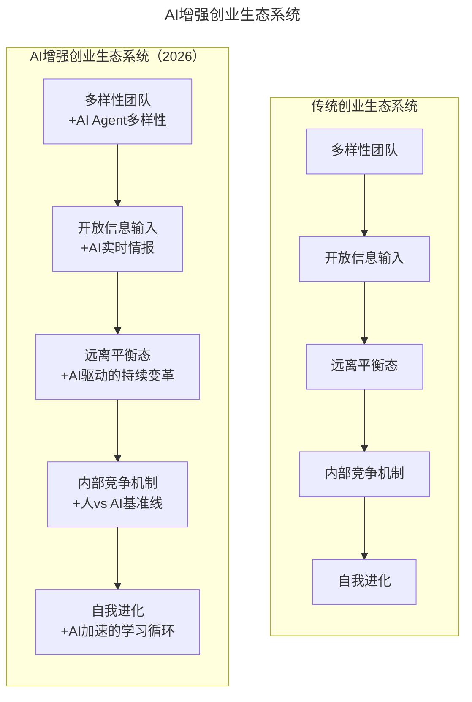
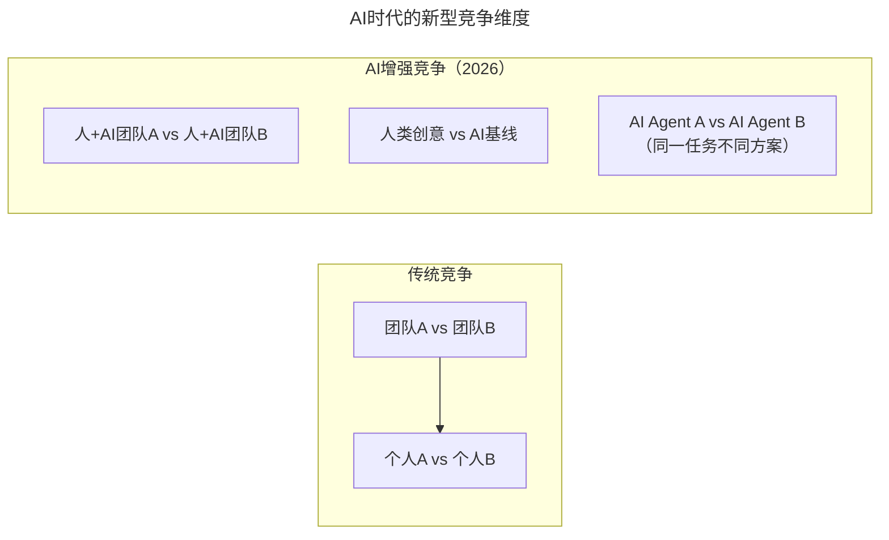

# 第123讲 | 黄伟坚：用系统性思维看待创业

> **适用范围**：创业公司创始人/CTO、希望建立系统性管理框架的技术领导者、在AI时代需要升级组织思维模式的创业者
>
> **更新摘要**（v2）：在保留原文生态系统隐喻、进化论三大原则（多样性/遗传变异/适者生存）、四大创业系统原则（保持多样性/打造开放系统/远离平衡态/竞争机制）等核心内容的基础上，融入2026年AI时代视角，新增AI增强创业生态系统对比图、四大原则AI升级版、AI基准线制度、系统健康度自评表，以及系统性思维检查清单，将原文升级为适用于AI时代创业系统设计的完整指南。

---

## 一、导言

创业是一个系统工程，可以用四个词概括（需求、产品、技术、运营），展开用八个词（战略、战术、融资、产品、研发、管理、营销、财务）。创业过程中面对的问题成百上千且纷繁交错，不可能通过控制单一变量来掌控整个系统，需要用系统性思维去看待创业。

核心命题：**在AI时代，系统性思维比任何时候都重要。真正的AI时代创业者，不是会用最多AI工具的人，而是能够系统性设计和优化"人+AI"协作系统的人。**

**关键术语对照**：
- 系统性思维（Systems Thinking）：从整体而非局部看待复杂问题的思维方式
- 生态系统（Ecosystem）：具有自我适应、自我修复、自我进化能力的系统
- 负熵（Negative Entropy）：从外部引入能量对抗系统熵增的过程
- 远离平衡态（Far From Equilibrium）：系统处于不稳定状态时能量最高
- AI基准线（AI Baseline）：对任何任务先让AI完成建立的质量和时间基准
- 人机协同系统（Human-AI Collaborative System）：人与AI系统性协作的组织形态

---

## 二、核心方法论

### 2.1 向生态系统学习

自然界中的生态系统有非常强的自我适应、自我修复、自我进化的能力。公司也可以像生态系统一样，在外部与内部不断变化的条件和环境中，不断适应与进化。

进化论三个核心原则：
1. **生物的多样性**：为遗传变异提供来源与物质基础
2. **遗传变异**：提供进化的方向
3. **物竞天择，适者生存**：通过竞争，适合的物种留下

### 2.2 原则一：保持多样性

强调团队的多样性和包容性，只有多样性的团队才有可能产生化学反应、发生变异。多样性团队是来自不同专业、不同性格、不同理念、不同文化的一群人。在技术团队中，如果大家理念极度一致、讨论时无人发表意见、一团和气，是非常危险的现象。

鼓励冲突，接受不同观念，碰撞出新想法。比如有些管理者觉得上班刷知乎、刷微博不可容忍，但如果业绩超预期，就可以包容。

**⭐2026升级**："生物多样性 + AI多样性"

| 多样性类型 | 传统做法 | AI时代新增 |
|-----------|---------|-----------|
| 专业背景 | 技术/产品/运营混合 | +AI工程师、Prompt工程师、Agent架构师 |
| 思维方式 | 不同性格和理念 | +AI思维（概率性、生成式）vs 人类思维（确定性、逻辑性） |
| 工具偏好 | 不同技术栈选择 | +不同AI工具链偏好（OpenAI系/Anthropic系/开源系） |
| 认知风格 | 直觉型/分析型 | +AI协作型/独立型/AI怀疑型 |

> 💡 **实践建议**：在你的团队中至少保留1-2个"AI怀疑者"——他们会对AI输出保持批判性思维，这是团队质量控制的重要防线。

### 2.3 原则二：打造开放系统

热力学定律：一个封闭的系统熵永远在增加且不可逆，最终导致系统崩溃。一个系统只有通过能量交换，不断从外部引入能量进行负熵，才能保持活力。

公司需要源源不断从外部接入信息。不仅创始团队、核心团队需要走出去，也鼓励基层到中层的员工面向市场，了解客户、竞争对手、行业上下游。机制上定期举办中层管理会议（在度假村举行，请内外部讲师分享），也有针对初入职员工的星星之火培训。

**⭐2026升级**："信息开放 + AI感知"

| 信息类型 | 传统获取方式 | AI增强方式 |
|---------|-----------|-----------|
| 行业动态 | 参加会议、阅读报告 | AI实时监控 + 智能摘要推送 |
| 竞争对手 | 人工调研、竞品分析 | AI竞品追踪 + 自动对比分析 |
| 技术趋势 | 技术博客、社区讨论 | AI论文摘要 + 技术雷达自动更新 |
| 用户反馈 | 客服记录、调研问卷 | AI情感分析 + 用户声音聚合 |
| 人才市场 | 招聘网站、猎头推荐 | AI人才画像 + 被动候选人挖掘 |

### 2.4 原则三：远离平衡态

很多公司发展到较大规模后追求流程规章制度都在掌握中，一切尽在掌控。越追求控制越追求稳定，就越会给公司增加条条框框的约束，反而导致活力下降。当一个系统处于稳定状态时能量在最低点，处于不稳定状态时能量在最高点。一旦感觉进入掌控状态、一切都尽在掌握，才是可能出现危险的时候。

**⭐2026升级**："主动失衡 + AI导航"

| 维度 | 传统理解 | AI时代新理解 |
|-----|---------|------------|
| 组织结构 | 扁平化、灵活调整 | +AI Agent作为"液态组织节点" |
| 业务边界 | 核心业务+探索业务 | +AI快速验证多个方向（并行Pivot） |
| 决策模式 | 集中决策+授权 | +AI辅助决策 + 人做最终判断 |
| 创新节奏 | 渐进式创新 | +AI加速的激进式实验 |

> ⭐核心理念：**AI让"快速试错"的成本降低了10倍，这意味着你可以同时保持10个"不平衡态"，而不是只能赌一个方向。**

### 2.5 原则四：竞争机制

商业社会竞争是人类进步的动力之一。腾讯有内部竞争的传统（微信的诞生就是内部竞争的结果），网易游戏的滚动研发机制（多个团队同时进行上百款游戏研发，竞争上线机会）。

危机意识是每个企业员工和领导人应保持的基本状态。可以刻意在内部引入竞争机制，让不同团队竞争同一个项目。也可以通过绩效考核、末位淘汰营造竞争氛围，适度引入外部新鲜血液刺激内部竞争（"鲶鱼效应"）。注意把内部良性冲突控制在一定范围内，不影响团队间配合和效率。

---

## 三、关键流程

### 3.1 AI增强创业生态系统



> **模型说明**：传统创业生态系统的四大原则在AI时代均获得升级：多样性增加AI Agent多样性，信息输入增加AI实时情报，远离平衡态增加AI驱动的持续变革，竞争机制增加人vs AI基准线。最终自我进化升级为AI加速的学习循环。

### 3.2 AI时代的新型竞争维度



> **模型说明**：AI时代的竞争从"人对人"扩展为三个维度：人+AI团队间的竞争、人类创意与AI基准线的竞争、以及不同AI Agent方案间的竞争。这种多维竞争机制能更全面地激发团队进化。

### 3.3 "AI基准线"制度实践

> 📌 **什么是AI基准线？**
>
> 对于任何任务，先让AI尝试完成，建立一个"基准质量"和"基准时间"。然后人类的产出必须显著优于这个基准线才能被认为是有价值的。
>
> 这不是为了淘汰人，而是为了：
> 1. 让每个人清楚知道AI能做到什么程度
> 2. 激励人们去挑战"超越AI"的高价值工作
> 3. 识别哪些工作应该交给AI，哪些需要人的独特能力

### 3.4 ⭐2026推荐的信息摄入系统

```
每日：
├── AI新闻摘要（Perplexity/ChatGPT） - 15分钟
├── 竞品动态监控（自定义Agent） - 自动推送
└── 团队内部信息同步（AI会议纪要） - 自动

每周：
├── 技术深度阅读（ArXiv AI摘要） - 2小时
├── 行业报告研读（AI辅助分析） - 1小时
└── 外部交流（线上/线下） - 视情况

每月：
├── 战略复盘（AI数据驱动） - 半天
├── 团队走出去（客户/合作伙伴） - 1-2天
└── 新技术评估（POC测试） - 持续
```

---

## 四、工具与实践

### 4.1 创业者系统思维检查清单

| 系统要素 | 关键问题 | AI时代新增考量 |
|---------|---------|--------------|
| 输入 | 我们从外部获得什么信息？ | AI情报系统的覆盖度和准确性如何？ |
| 处理 | 我们如何消化和利用信息？ | AI辅助分析的深度和广度够不够？ |
| 输出 | 我们创造什么价值？ | 这个价值是否能被AI替代或增强？ |
| 反馈 | 我们如何学习和调整？ | 学习循环的速度能否跟上市场变化？ |
| 进化 | 我们如何变得更好？ | AI是否在帮助我们加速进化？ |

### 4.2 AI时代创业系统健康度自评

```
请为你的创业系统打分（1-10分）：

□ 团队多样性指数（含AI工具多样性）：___分
□ 外部信息接入效率（AI增强后）：___分
□ 组织灵活性（响应变化的速度）：___分
□ 内部竞争健康度（良性 vs 恶性）：___分
□ AI工具整合度（使用率×熟练度）：___分
□ 人机协作成熟度（配合默契度）：___分
□ 学习进化速度（知识迭代周期）：___分

总分：___ / 70分
- 60-70分：优秀的AI增强创业系统
- 45-59分：良好的系统，有优化空间
- 30-44分：需要重点加强AI整合
- <30分：系统可能面临生存风险
```

### 4.3 本周立即行动

1. **Day 1-2**：绘制你当前的"创业系统图"，标注所有关键要素和信息流
2. **Day 3-4**：识别系统中最大的瓶颈环节，寻找AI解决方案
3. **Day 5-7**：建立第一个"AI基准线"——选一个重复性任务，让AI先做一遍

### 4.4 第一个季度目标

- 实现"远离平衡态"——同时推进2-3个探索性项目（AI降低试错成本）
- 建立内部竞争机制——包含人机协作的新维度
- 形成系统的"AI进化循环"——每季度复盘并优化系统设计

---

## 五、常见误区

### 5.1 一团和气是危险的

在技术团队中，如果大家理念极度一致、讨论时无人发表意见、一团和气，是非常危险的现象。需要鼓励冲突，接受不同观念，才能碰撞出新想法。

### 5.2 追求控制导致活力下降

越追求控制越追求稳定，就越会给公司增加条条框框的约束，反而导致活力下降。一旦感觉进入掌控状态、一切都尽在掌握，才是可能出现危险的时候。

### 5.3 工具堆砌陷阱

在AI时代，如果没有系统性的思考，很容易陷入"工具堆砌"的陷阱——今天用这个AI，明天用那个AI，但整体效率并没有提升。真正的AI时代创业者是能够系统性设计和优化"人+AI"协作系统的人。

### 5.4 内部竞争形成对立

要把内部的良性冲突控制在一定范围之内，而不是简单的让内部团队形成对立冲突面，最终反而影响到团队间的工作配合和效率、整体的团队氛围和文化。

### 5.5 封闭系统导致熵增

一个封闭的系统熵永远在增加且不可逆，最终导致系统崩溃。不走出去、不引入外部信息和能量，公司就会失去活力。

---

## 六、进阶延展

### 6.1 核心总结

创业是一个系统工程，一定要用系统性思维去看待创业。在实践中可以借鉴自然界生态系统的核心原则——保持多样性和包容性、打造开放系统、远离平衡态、打造竞争机制，将公司构建成像自然界中生态系统一样，拥有自我适应、自我修复、自我进化的能力。

**AI时代核心观点**：系统性思维比任何时候都重要。AI工具越来越多、越来越强，如果没有系统性思考，很容易陷入"工具堆砌"的陷阱。真正的AI时代创业者，不是会用最多AI工具的人，而是能够系统性设计和优化"人+AI"协作系统的人。

### 6.2 作者简介

黄伟坚，Mobvista联合创始人，TGO鲲鹏会会员，从0到1经历公司裂变式增长，从初创公司成长为亚洲最大的移动广告平台。曾负责公司整体技术架构规划、研发团队和研发体系搭建、运维自动化等工作，在高并发、大数据处理方面有丰富实战经验。

### 6.3 延伸阅读建议

- 《系统之美》（Donella Meadows）：系统性思维的经典入门
- 《反脆弱》（Nassim Taleb）：从不确定性中获益的系统设计
- 2026年关注方向：AI Agent生态系统设计、人机协作组织进化、AI驱动的系统动力学

---

*本注解基于2026年6月的技术环境编写，随着AI技术的快速发展，部分具体工具和建议可能需要定期更新。建议每季度回顾一次本文内容，结合最新技术动态调整策略。*