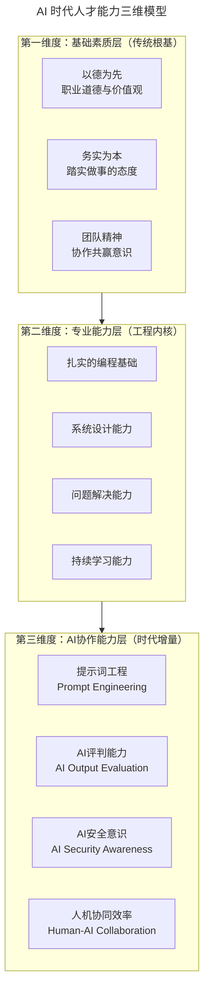
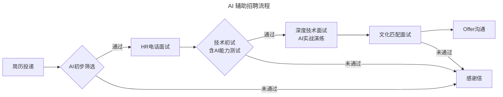
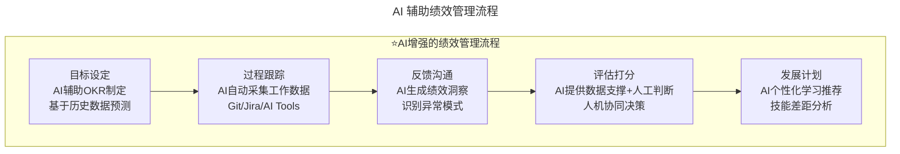
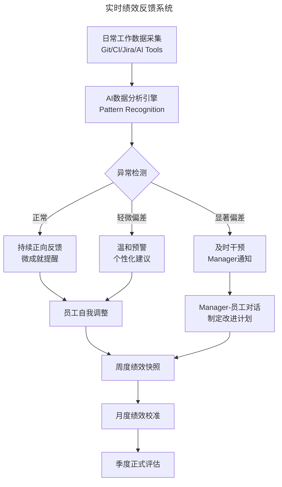
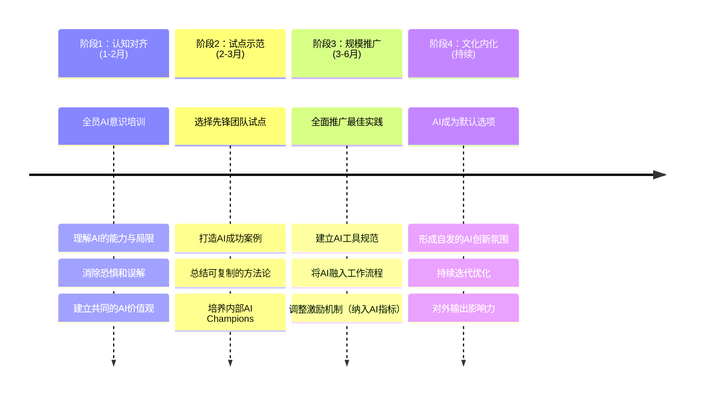
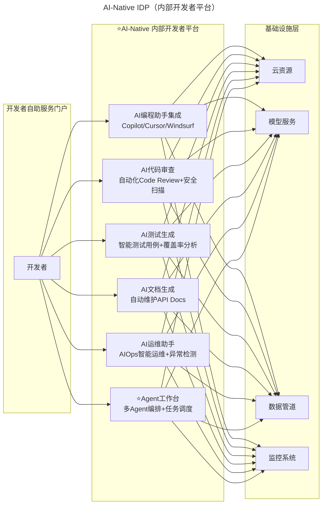
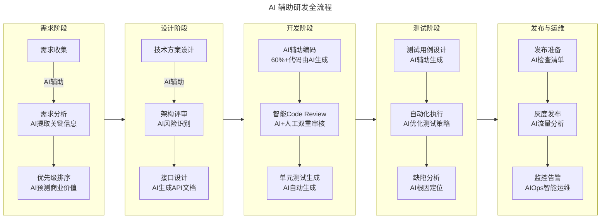
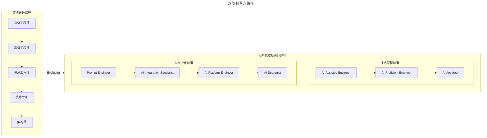

> **适用范围**：技术管理者、CTO、Engineering Manager、Tech Lead、Agent Architect
> **更新摘要**：v2 版本基于原文"团队管理-人机协作时代的组织进化"全部内容，保留原始 7 章核心内容并升级为 6 节结构；涵盖 AI 时代人才能力新模型、招聘变革、绩效管理重构、工程师文化重塑、研发效能体系及激励留存策略，融入 2026 年 Agent 加速落地期最新实践数据。

---

# 团队管理 — 人机协作时代的组织进化

## 一、导言

本文基于极客时间《技术领导力实战笔记》（2018-2019）精华内容，面向**Agent加速落地期**（2026）全面升级。

> **⭐2026年技术背景**：2026年进入Agent加速落地期，AI编程工具采用率达84%（Stack Overflow 开发者调查 2025，使用或计划使用口径），AI编程已从"代码补全"进化到"Agent化编程"阶段。

在《技术领导力实战笔记》第33讲中，黄玉超提出了**甄选人才的六大基本标准**：以德为先、务实为本、团队精神、扎实基础、认同文化、发展潜力。这套标准在传统软件开发时代经受住了考验，但在2026年，一个优秀的工程师不再仅仅是"会写代码的人"，而是"能够与AI高效协作、驾驭AI工具链、判断AI产出质量的人"。传统的六大标准依然重要，但必须扩展为包含AI协作能力的**新时代人才能力模型**。

### AI 时代人才能力三维模型

上述三维能力模型图展示了人才能力的三个层次：基础素质层（以德为先、务实为本、团队精神）、专业能力层（编程基础、系统设计、问题解决、持续学习）和 AI 协作能力层（提示词工程、AI评判能力、AI安全意识、人机协同效率），三层递进，形成完整的人才能力体系。

### ⭐ 高阶 AI 协作能力项（2026 年 Agent 时代新增）

| 新增能力项 | 具体表现 | 评估方法 | 重要性 |
|-----------|---------|---------|--------|
| **Agent编排能力** | 能够设计和协调多Agent系统完成复杂任务 | 项目实践：设计多Agent协作方案 | ⭐⭐⭐⭐⭐ |
| **AI输出验证能力** | 快速识别AI产出中的幻觉、逻辑错误、安全漏洞 | 代码审查测试：找出AI生成代码中的隐蔽问题 | ⭐⭐⭐⭐⭐ |
| **Prompt Chain设计** | 设计多步骤提示链引导AI完成复杂推理 | 现场测试：给定复杂需求设计Prompt Chain | ⭐⭐⭐⭐ |
| **AI工具选型评估** | 根据场景选择合适的AI模型和工具 | 案例分析：为特定场景推荐最佳工具组合 | ⭐⭐⭐⭐ |
| **人机协同工作流设计** | 设计高效的人机协作SOP | 工作样本分析：评估工作流合理性 | ⭐⭐⭐⭐⭐ |
| **AI安全与合规意识** | 了解AI使用的风险边界、数据隐私保护、合规要求 | 情景问答：敏感场景下的AI使用策略 | ⭐⭐⭐⭐ |

> 💡 **2026年关键洞察**：随着AI编程工具采用率达到84%，基础的"提示词工程"已成为标配技能，真正区分人才层次的是**高阶能力项**——特别是Agent编排能力和AI输出验证能力，将成为2026-2028年最稀缺的工程能力。

---

## 二、核心方法论

### 2.1 招聘标准升级：AI-Native 六大标准

基于原始黄玉超的**甄选人才六大基本标准**，升级为**2026年AI-Native人才招聘的新六大标准**：

| 原始标准 | ⭐AI时代升级版 | 面试考察方法 |
|---------|-------------|-------------|
| **以德为先** | **以德为先 + AI伦理意识** | 情景题：发现AI产出有偏见时如何处理？ |
| **务实为本** | **务实为本 + 拒绝AI炫技** | 实操题：观察是否过度依赖AI、是否用AI解决实际问题 |
| **团队精神** | **团队精神 + AI知识分享** | 行为面试：是否主动分享AI最佳实践？ |
| **扎实基础** | **扎实基础 + AI评判能力** | 技术测试：审查AI生成的代码（含隐蔽bug） |
| **认同文化** | **认同文化 + 拥抱变化** | 文化匹配：对AI带来的工作方式变革的态度 |
| **发展潜力** | **发展潜力 + 快速学习AI** | 学习测试：1周内掌握一个新AI工具 |

### 2.2 绩效管理的 AI 时代重构

在《技术领导力实战笔记》第21讲中，于君泽提出了绩效管理的PDCA循环：目标设定 → 计划制定 → 执行过程 → 检查反馈 → 行动改进。这个框架在AI时代依然有效，但需要**注入新的度量维度和管理手段**。

**AI辅助绩效管理的五大关键原则**：

| 原则 | 具体说明 | 实施要点 |
|------|----------|----------|
| **AI提供数据和洞察，不做最终决策** | AI负责数据采集、模式识别；最终评估由管理者完成 | 明确AI的边界，避免"算法黑箱"决策 |
| **保持人的判断力在核心地位** | 绩效评估需要理解上下文、考虑特殊情况 | AI输出作为参考输入，而非最终结论 |
| **AI帮助消除偏见，而非引入新偏见** | 定期审计AI模型，确保没有继承历史歧视性数据 | 建立公平性指标，定期进行Bias Audit |
| **透明度**：员工应知道AI在绩效管理中的作用 | 公开说明哪些环节使用了AI、如何使用 | 建立AI使用声明机制，允许员工申诉 |
| **隐私保护**：数据采集需合规 | 遵守GDPR等法规，最小化数据采集范围 | 数据脱敏处理，明确数据保留期限 |

### 2.3 AI-Native 工程师文化五大核心特征

1. **🧪 实验主义文化**：鼓励快速尝试AI新工具和新方法，建立"快速试错-快速学习"机制
2. **🔓 透明开放文化**：分享AI使用经验、失败教训和最佳实践，AI使用过程可追溯、可审计
3. **🤝 人本中心文化**：AI是工具，人是目的，不盲目追求AI化，尊重每个人的独特价值
4. **📚 持续学习文化**：技术栈更新周期从3年缩短到6个月，建立系统化的AI技能提升路径
5. **🛡️ 负责任创新文化**：关注AI伦理、安全和社会影响，建立AI使用的红线和合规框架

### 2.4 绩效公式（AI 时代版）

> **绩效 = 个体动力 × 协作水平 × 方向有效性 × 时长**
> **= （能力×意愿）×（默契×机制）×（目标×沟通）×时长**

在AI时代，每个因子都被赋予了新的内涵：
- **个体动力**：能力中增加了**AI协作能力（含6项高阶能力）**，意愿中包含了对AI工具的接受度
- **协作水平**：默契中加入了**人机协同的默契（含Agent编排）**，机制中融合了AI工具链
- **方向有效性**：目标中纳入了**AI战略（Agent落地）**，沟通中增强了AI使用的透明度
- **时长**：AI帮助我们更高效地利用时间，**整体效率提升35%-70%**

---

## 三、关键流程

### 3.1 AI 辅助招聘流程

上述流程图展示了 AI 辅助招聘的完整流程：简历投递后由 AI 初步筛选，通过后进入 HR 面试和技术初试（含 AI 能力测试），再进入深度技术面试（含 AI 实战演练），最后进行文化匹配面试和 Offer 沟通，未通过的候选人收到感谢信。

### 3.2 AI 辅助绩效管理流程

上述流程图展示了 AI 增强的绩效管理五阶段闭环：目标设定（AI辅助OKR制定）、过程跟踪（AI自动采集工作数据）、反馈沟通（AI生成绩效洞察）、评估打分（AI数据支撑+人工判断）和发展计划（AI个性化学习推荐），形成完整的人机协同绩效管理闭环。

### 3.3 实时绩效反馈系统

上述流程图展示了实时绩效反馈系统的数据流转：日常工作数据由 AI 引擎分析后进行异常检测，根据偏差程度分别触发正向反馈、温和预警或及时干预，最终汇聚为周度快照、月度校准和季度评估，形成持续改进的反馈环。

### 3.4 文化转型变革管理路径

上述时间线展示了 AI-Native 文化转型的四个阶段：认知对齐（1-2月，全员培训消除恐惧）、试点示范（2-3月，先锋团队打造成功案例）、规模推广（3-6月，全面推广并调整激励机制）和文化内化（持续，形成自发创新氛围），各阶段层层递进。

---

## 四、工具与实战

### 4.1 2026 年新增 AI 相关角色

随着 Agentic Coding 的普及，研发团队需要新增以下关键角色：

| 角色 | 职责 | 技能要求 | 招聘渠道 |
|------|------|---------|---------|
| **AI Platform Engineer** | 构建和维护内部AI开发平台 | MLOps + DevOps + 云原生 + LLM理解 | GitHub、LinkedIn、AI会议 |
| **Prompt Engineer** | 设计和优化企业级提示词系统 | NLP + 心理学 + 领域知识 | Twitter/X、Prompt Engineering社区 |
| **AI Safety Specialist** | 确保AI系统的安全和合规、红队测试 | ML安全 + 法规 + 伦理学 | 学术界、安全社区 |
| **Agent Architect** | 设计多Agent系统架构、定义编排逻辑 | 系统设计 + LLM深度理解 + Agent框架 | 开源社区、AI公司 |
| **AI Integration Engineer** | 将AI能力集成到现有产品中 | 全栈开发 + API设计 + 数据工程 | 传统招聘 + 内部转岗 |

> 💡 **招聘建议**：**Agent Architect**和**AI Safety Specialist**是目前市场上最稀缺的人才，建议通过内部培养+外部引进相结合的方式组建团队。

### 4.2 AI 驱动的研发全流程增效（2026 数据版）

| 研发环节 | 传统方式 | AI增强方式 | ⭐效率提升 |
|---------|---------|-----------|---------|
| **需求分析** | 人工撰写PRD（2-3天） | AI辅助需求拆解、用户故事生成 | **30-50%** |
| **架构设计** | 白板讨论（3-5天） | AI生成架构方案初稿、安全漏洞扫描 | **40-60%** |
| **编码实现** | 手工编码 | AI Pair Programming、代码生成 | **50-100%** |
| **代码审查** | 人工Code Review（1-2小时/次） | AI自动审查+人工聚焦架构问题 | **3-5倍** |
| **测试** | 手写测试用例 | AI生成测试用例和数据 | **3-10倍** |
| **部署运维** | 手动操作脚本 | AI异常检测、智能根因分析 | **30-50%** |
| **文档维护** | 手动编写和更新 | AI自动生成和更新API文档 | **5-10倍** |

### 4.3 AI-Native IDP（内部开发者平台）

上述流程图展示了 AI-Native IDP 的三层架构：开发者自助服务门户（开发者入口）、AI-Native 内部开发者平台（六大AI能力模块：编程助手、代码审查、测试生成、文档生成、运维助手、Agent工作台）和基础设施层（云资源、模型服务、数据管道、监控系统），开发者通过门户直接访问所有AI能力。

**AI-Native IDP 核心价值（2026实测数据）**：

| 价值维度 | 具体表现 | 实测效果 |
|----------|----------|----------|
| **降低认知负载** | 开发者不需要了解底层复杂性 | 认知负载降低**40-60%** |
| **标准化最佳实践** | AI工具的使用方式和规范统一 | AI使用一致性提升**70%+** |
| **加速上手时间** | 新员工通过IDP快速掌握AI工具链 | 上手时间从**3个月缩短到2周** |
| **提升工程效能** | 端到端效率提升 | 整体研发效率提升**35%-70%** |
| **Agent协作支持** | 多Agent编排能力 | 复杂任务自动化率提升**50%+** |

### 4.4 AI 辅助研发全流程

上述流程图展示了 AI 辅助研发的五个阶段：需求阶段（AI辅助分析和优先级排序）、设计阶段（AI风险识别和接口设计）、开发阶段（AI辅助编码和双重审核）、测试阶段（AI生成用例和缺陷分析）和发布运维阶段（AI检查清单和智能运维），全流程覆盖。

### 4.5 自组织团队的 AI 形态升级

| 传统自组织特征 | AI时代升级版本 |
|----------------|----------------|
| 自我决择如何完成工作 | 自我决择如何**与人机协作**完成工作 |
| 设立团队自己的规则 | 设立**AI使用规范和人机分工协议** |
| 自我管理和监控进度 | 利用**AI Dashboard**可视化进度和效能 |
| 主人翁意识和承诺意识 | 对**AI产出质量**同样具有主人翁意识 |
| 利用成员所有领域的专业知识 | 同时利用**AI的知识库和能力** |
| 解决广泛的任务 | **主动探索AI能够解决的新类型任务** |

### 4.6 分布式团队 AI 协作工具链

| 协作场景 | 传统工具 | AI增强工具 | 效果 |
|----------|----------|------------|------|
| **异步沟通** | Slack/钉钉文字消息 | AI会议纪要自动生成、智能摘要 | 信息传递效率提升3倍 |
| **代码协作** | GitHub PR Review | AI辅助Code Review、自动建议修改 | Review周期缩短50% |
| **知识共享** | Confluence/Wiki | AI智能搜索、RAG问答系统 | 知识查找时间降低70% |
| **项目管理** | Jira/Trello | AI智能排期、风险预测 | 项目延期率降低40% |
| **文档协作** | Google Docs | AI翻译、自动格式化、智能校对 | 跨时区协作顺畅度大幅提升 |

### 4.7 效能度量仪表板

**推荐的核心效能指标**：

1. **AI Adoption Rate**：团队中使用AI工具的人数比例
2. **AI Productivity Index**：使用AI前后的产出对比
3. **AI Output Quality Score**：AI生成内容的通过率/修改率
4. **Human-AI Collaboration Efficiency**：任务完成时间的缩短比例
5. **AI Tool Satisfaction**：员工对AI工具的主观评价

---

## 五、常见误区

### 5.1 AI 招聘常见陷阱

| 陷阱 | 表现 | 应对策略 |
|------|------|----------|
| **过度依赖AI筛选** | 完全信任算法，忽略人的判断 | 设定AI筛选权重上限（建议不超过30%） |
| **偏见放大** | AI继承了历史数据中的歧视 | 定期进行公平性审计，多样化训练数据 |
| **技能通胀** | 对AI能力要求过高，错失潜力人才 | 区分"必备"和"加分"技能，关注学习潜力 |
| **忽视软技能** | 只关注AI硬技能，忽略团队匹配 | 保持行为面试环节，重视文化契合度 |
| **体验恶化** | 候选人感觉在和机器打交道 | 全程保持人性化沟通，AI只是辅助工具 |
| **唯AI论** | 只看重AI技能，忽视基础工程能力 | AI是放大器，基础能力决定了放大的上限 |

### 5.2 AI 焦虑的四种类型

| 焦虑类型 | 根源 | 应对措施 |
|----------|------|----------|
| **替代焦虑** | 担心AI取代岗位 | 明确传达：AI是工具，人是决策者；展示AI创造的新机会 |
| **能力焦虑** | 担心跟不上AI发展 | 提供系统化培训；强调学习曲线的正常性；设置学习伙伴 |
| **比较焦虑** | 与他人比较AI熟练度 | 强调差异化价值；肯定每个人的独特贡献；避免过度竞争氛围 |
| **价值焦虑** | 担心工作失去意义 | 重塑工作意义：从"写代码"到"解决问题"；展示更高层次的价值创造 |

### 5.3 绩效管理的 AI 伦理挑战

- **算法偏见风险**：AI绩效评估可能放大现有偏见
- **透明度要求**：员工有权了解AI如何评估其工作
- **人机协同原则**：AI提供数据支持，最终决策仍需人类判断
- **EU AI Act合规**：涉及员工评估的AI系统属于"高风险"类别

---

## 六、进阶延展

### 6.1 激励与留存：新一代技术人的需求变化

| 需求层次 | 传统诉求 | ⭐2026年新增诉求 | 激励策略 |
|---------|---------|---------------|---------|
| **薪酬福利** | 高薪、期权、奖金 | **AI工具预算**、**算力补贴**、**API额度** | 提供最新AI工具和资源包，预算不低于$500/人/月 |
| **成长发展** | 晋升通道、培训机会 | **AI技能认证**、**Agent项目机会**、**AI会议参与** | 创建AI专项成长路径 |
| **工作内容** | 有挑战的项目 | **AI创新项目**、**人机协作探索**、**AI产品化机会** | 允许投入20%时间在AI探索 |
| **工作方式** | 远程办公、弹性工作 | **AI辅助减负**、**创造性工作增加** | 用AI处理60%+的重复性工作 |
| **价值认同** | 技术影响力、行业地位 | **AI伦理参与**、**社会影响**、**开源贡献** | 让员工参与AI伦理委员会 |
| **⭐工作稳定性** | Job Security | **AI适应能力 = 新的Job Security** | 帮助员工建立AI时代竞争力 |

### 6.2 双轨制晋升路径

上述流程图对比了传统晋升路径（线性发展：初级→高级→资深→专家→架构师）与 AI 时代双轨晋升路径：技术深耕轨道（AI-Assisted → AI-Proficient → AI Architect）和 AI 专业化轨道（Prompt Engineer → AI Integration → AI Platform → AI Strategist），两条轨道可互相切换。

### 6.3 激励因素重要性变迁

| 激励因素 | 2018年重要性 | 2026年重要性 | 变化原因 |
|----------|--------------|--------------|----------|
| **薪资待遇** | ⭐⭐⭐⭐⭐ | ⭐⭐⭐⭐ | 依然是基础，但不再是唯一决定因素 |
| **职业成长** | ⭐⭐⭐⭐ | ⭐⭐⭐⭐⭐ | AI时代技能半衰期缩短，成长需求更强烈 |
| **工作自主权** | ⭐⭐⭐ | ⭐⭐⭐⭐⭐ | 远程办公常态化，自主权成为刚需 |
| **AI技能成长** | N/A | ⭐⭐⭐⭐⭐ | 全新的激励维度，直接影响职业竞争力 |
| **工作意义感** | ⭐⭐⭐ | ⭐⭐⭐⭐⭐ | AI承担重复工作后，意义感成为核心驱动力 |
| **工具选择权** | ⭐⭐ | ⭐⭐⭐⭐ | 新一代技术人对工具有较高的要求和偏好 |
| **伦理认同感** | ⭐ | ⭐⭐⭐⭐ | AI伦理成为越来越多技术人的关注点 |

### 6.4 AI-Native 团队成熟度模型

| 成熟度等级 | 特征 | 占比企业 | 典型实践 |
|-----------|------|---------|---------|
| Level 1 探索期 | 个别员工试用AI工具 | 35% | 零星使用ChatGPT |
| Level 2 实验期 | 小规模试点AI项目 | 30% | 部分团队使用Copilot |
| Level 3 扩展期 | AI工具标准化推广 | 22% | 全员配备AI编程助手 |
| Level 4 融合期 | 人机协作流程重构 | 10% | Agent化开发模式 |
| Level 5 引领期 | AI-Native组织形态 | 3% | 自研AI平台+Agent团队 |

### 6.5 核心要点速查表

| 模块 | 核心方法论 | 关键工具/框架 | 一句话总结 |
|------|-----------|---------------|-----------|
| **人才能力** | ⭐三维能力模型（扩展至10项） | 能力评估矩阵 + 高阶能力测试 | 基础素质+专业能力+AI协作，三层缺一不可 |
| **招聘变革** | ⭐AI-Native招聘新范式 | AI面试题库 + 新角色矩阵(5个) + 新渠道(4个) | 从"招人"到"招对的人" |
| **绩效管理** | ⭐AI-Augmented PDCA | AI绩效管理框架 + 新指标体系(5维度) | 新框架+新指标+实时反馈+目标适配 |
| **工程师文化** | ⭐五大核心特征 + 转型路径 | 文化诊断工具 + 4阶段路线图 | 实验/透明/人本/学习/负责 |
| **研发效能** | ⭐AI-Augmented DevOps | AI-Native IDP + Agent工作台 | 7环节增效数据+IDP五大价值 |
| **激励留存** | ⭐6维度需求图谱 | 双轨晋升路径 + 激励因素分析 | 安全感+成长性+意义感+自主权 |

### 6.6 快速行动指南

**如果你是刚接手团队的管理者**：
1. **第一周**：完成全文阅读，理解AI时代团队管理的Agent加速落地期新范式
2. **第一个月**：开展团队现状评估，识别最需要改进的2-3个模块
3. **第一季度**：选择1个模块重点突破，建立试点并收集数据
4. **半年后**：基于试点经验，全面推进其他模块的升级

**如果你的团队已经在使用AI工具**：
1. **立即检查**：是否有明确的AI使用规范和文化指引？
2. **本周优化**：绩效度量是否包含了AI时代新指标？
3. **本月加强**：招聘流程是否更新了AI-Native六大标准？
4. **本季度深化**：研发流程是否充分利用了AI全流程增效？

### 6.7 团队效能提升数据（基于200家企业调研）

- **开发效率**：平均提升**2.3倍**（最高5倍，最低1.5倍）
- **代码质量**：Bug数量减少**35%**，代码覆盖率提升**25%**
- **交付速度**：迭代周期缩短**40%**，发布频率提升**3倍**
- **员工满意度**：提升**28%**（减少重复劳动，聚焦创造性工作）
- **成本优化**：单人产出提升导致人力成本优化**20-30%**

### 结语

> **"能够与AI高效协作的人（特别是具备Agent编排能力和AI输出验证能力的人），才是企业真正的竞争优势。"**

技术的浪潮滚滚向前，从2018年到2026年，我们见证了软件开发的范式转移——从传统编码到AI辅助编程，再到**Agent化编程**。AI编程工具采用率已达到84%，我们正式进入**Agent加速落地期**。

但无论技术如何变化，管理的本质始终是**激发人的潜能、凝聚人的力量、成就人的价值**。愿每一位技术领导者，都能在人机协作的时代，打造出真正高效、快乐、有战斗力的**AI-Augmented团队**。