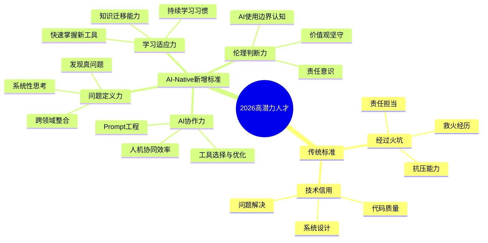
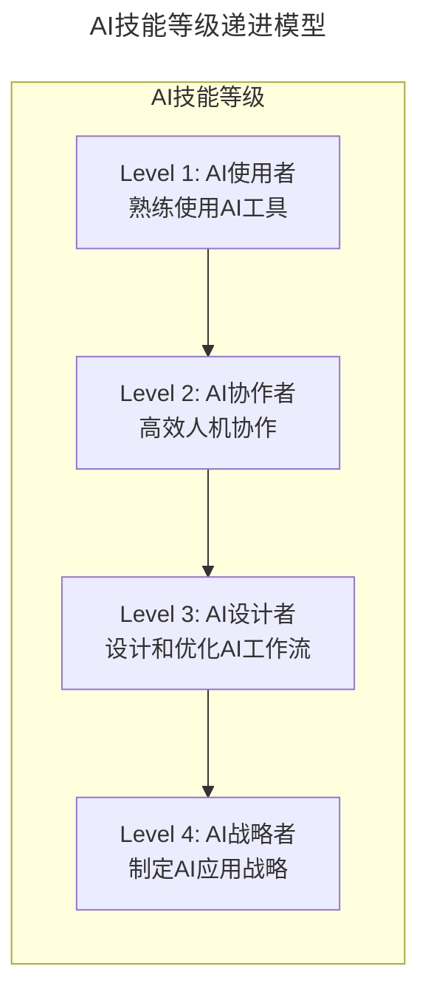

> **适用范围**：技术团队 Leader、CTO、HRBP、组织发展负责人
> **更新摘要**：v2 版本基于原文第 36 讲内容，保留全部原始观点并升级为 6 节结构；融入 2026 年 AI 时代注解，新增 AI-Native 高潜力人才标准、AI 技能认证体系及 AI 实战演练场等升级内容。

---

# 第36讲 | "高潜力人才"的内部培养

## 一、导言

> **⭐ 2026 年技术背景**：2026 年，GPT-5.5 和 DeepSeek V4 让 AI Agent 能力达到新高度，**84% 的开发者使用 AI 编程工具**。在这样的背景下，"高潜力人才（High-Potential Talent）"的标准正在发生**根本性变化**——从"技术深度"转向**"问题定义力 + AI 协作力 + 系统思维力"**。

高潜力人才的识别和培养是技术团队可持续发展的核心命题。原文提出了两个经典的选拔标准，并主张"高级岗位尽量内部培养"。在 AI 时代，这些原则依然成立，但人才标准的内涵需要全面升级。

---

## 二、核心方法论

### 2.1 原文选拔标准回顾

> **两个选拔标准**：
> 1. 技术一定要 OK（有"技术的信用"）
> 2. 经历过火坑（愿意承担挑战性任务）

原文强调，高潜力人才必须具备技术信用和抗压经验，二者缺一不可。技术信用保证其专业判断的可信度，火坑经历则验证其责任担当和心理韧性。

### 2.2 ⭐ AI-Native 高潜力人才标准（2026 版）

上述思维导图展示了高潜力人才标准从传统向 AI-Native 的演进：在技术信用和火坑经历的基础上，新增了 AI 协作力、问题定义力、学习适应力和伦理判断力四个维度，形成更完整的人才画像。

### 2.3 新旧标准对比

| 维度 | 传统标准 | AI-Native 标准 | 为什么重要 |
|------|---------|---------------|-----------|
| **核心能力** | 技术深度 | **问题定义 + AI 协作** | AI 降低技术门槛，提升问题定义价值 |
| **成长速度** | 经验积累 | **学习适应力** | 技术半衰期 18 个月，学习力决定竞争力 |
| **协作模式** | 团队合作 | **人机协同网络** | AI 成为新的"团队成员" |
| **成功要素** | 个人英雄 | **系统思维 + 影响力** | 复杂问题需要系统性解决方案 |

### 2.4 原文培养理念

> - 高级岗位尽量内部培养，其次校招，最后空降
> - 空降不如内部培养（磨合成本高）
> - 愿意"拔苗助长"，给年轻人机会

原文主张内部培养优先于外部空降，核心原因是磨合成本低、文化认同度高。同时提倡给予年轻人超出当前能力的机会，通过实战加速成长。

---

## 三、关键流程

### 3.1 AI-Native 培养策略（2026 版）

#### 第一步：从"技术培养"到"AI 能力培养"

| 传统培养内容 | AI-Native 新增内容 |
|-------------|------------------|
| 编程语言、框架 | **Prompt Engineering、Agent 设计** |
| 系统架构设计 | **AI-Native 架构设计** |
| 项目管理 | **人机协作项目管理** |
| 沟通表达 | **AI 辅助沟通和知识管理** |

#### 第二步：建立"AI 技能认证体系"

上述流程图展示了 AI 技能从使用者到战略者的四个等级递进：Level 1 要求熟练使用 AI 工具，Level 2 强调高效人机协作，Level 3 聚焦 AI 工作流设计，Level 4 面向 AI 应用战略制定。

**具体做法**：
- 为每个级别设定**清晰的技能要求和认证标准**
- 提供**系统的培训课程和实践项目**
- 将**AI 技能等级**与晋升和薪酬挂钩

#### 第三步：打造"AI 实战演练场"

**传统做法**：让员工参与真实项目的救火
**AI-Native 做法**：建立 **AI 实验沙箱和创新基金**

具体措施：
- 设立**"AI 创新基金"**，支持员工尝试 AI 新技术
- 提供**算力和工具资源**，降低实验门槛
- 定期举办**"AI 黑客马拉松"**，激发创新活力
- 建立**"失败宽容"机制**，鼓励探索和试错

### 3.2 ⭐ 2026 可执行建议

#### 对于技术领导者：

1. **重新定义"高潜力"画像**
   - 更新岗位的胜任力模型，加入 **AI 相关能力要求**
   - 在招聘和晋升评估中，增加 **AI 协作能力考察**
   - 识别团队中的 **"AI 种子选手"**，重点培养

2. **建立 AI 人才培养机制**
   - 制定 **年度 AI 技能发展计划**
   - 为每位员工提供 **个性化的 AI 学习路径**
   - 建立 **导师制度**，让 AI 高手带新人

3. **创造 AI 实践机会**
   - 在项目中 **主动引入 AI 工具和流程**
   - 给予员工 **足够的试错空间**
   - 表彰和奖励 **AI 创新的优秀案例**

#### 对于 HR/组织发展：

1. **升级人才发展体系**
   - 将 **AI 能力**纳入任职资格标准
   - 设计 **AI 专项培训计划**
   - 建立 **AI 人才库和继任计划**

2. **优化激励机制**
   - 设立 **"AI 创新奖"**
   - 提供 **AI 工具和算力补贴**
   - 将 **AI 贡献度**纳入绩效评估

---

## 四、工具与实战

### 4.1 人才识别工具

| 工具类型 | 推荐工具 | 用途 |
|---------|---------|------|
| **能力评估** | 360 度反馈 + AI 能力矩阵 | 多维度评估员工能力 |
| **潜力预测** | 九宫格人才盘点 | 识别高潜力人才 |
| **AI 技能测评** | AI 工具实操测试 | 评估 AI 协作能力 |
| **学习追踪** | LMS + 技能矩阵 | 追踪学习进度和技能成长 |

### 4.2 培养项目案例

**AI 导师制试点方案**：
- 选 1 位资深员工，配备 AI 工具（Copilot 等）
- 带教 2-3 位新人，1 个月后评估效果
- 将成功经验固化为标准流程

---

## 五、常见误区

| 误区 | 表现 | 应对策略 |
|------|------|----------|
| **唯技术论** | 只看技术深度，忽视 AI 协作能力 | 引入 AI-Native 标准的全面评估 |
| **空降万能论** | 迷信外部高端人才，忽视内部培养成本 | 优先内部培养，空降作为补充 |
| **拔苗过度** | 给机会但缺乏指导，导致新人受挫 | 配备导师和 AI 辅助，降低试错成本 |
| **AI 焦虑忽视** | 不关注员工对 AI 的恐惧和抵触 | 建立心理建设机制，提供转型支持 |

---

## 六、进阶延展

### 🔮 2026 年展望：从"技术精英"到"AI-Native 领袖"

| 维度 | 传统视角 | AI-Native 视角 |
|------|---------|---------------|
| **人才定义** | 技术深度强的人 | **问题定义力 + AI 协作力强的人** |
| **培养重点** | 技术能力提升 | **综合素质 + AI 素养** |
| **成长路径** | 技术→管理双通道 | **技术→AI→业务多通道** |
| **留任关键** | 薪酬和发展空间 | **AI 适应能力 = 新 job security** |
| **组织价值** | 完成项目交付 | **驱动创新和变革** |

### 核心洞察

> AI 时代的高潜力人才不是"技术最强的人"，而是"最能定义正确问题并与 AI 高效协作的人"；帮助员工建立 AI 能力不仅是培养手段，更是最有效的留任保障。

### 参考阅读

- 大前研一《思考的技术》：提供刻意练习洞察力的方法论
- 极客时间《技术领导力实战笔记》第 36 讲原文
- Stack Overflow 开发者调查 2025：开发者 AI 工具采用率数据（84%）

---

**升级时间**：2026 年 6 月
**适用场景**：技术团队高潜力人才的识别和培养参考
**核心观点**：AI 时代的高潜力人才不是"技术最强的人"，而是"最能定义正确问题并与 AI 高效协作的人"；帮助员工建立 AI 能力不仅是培养手段，更是最有效的留任保障