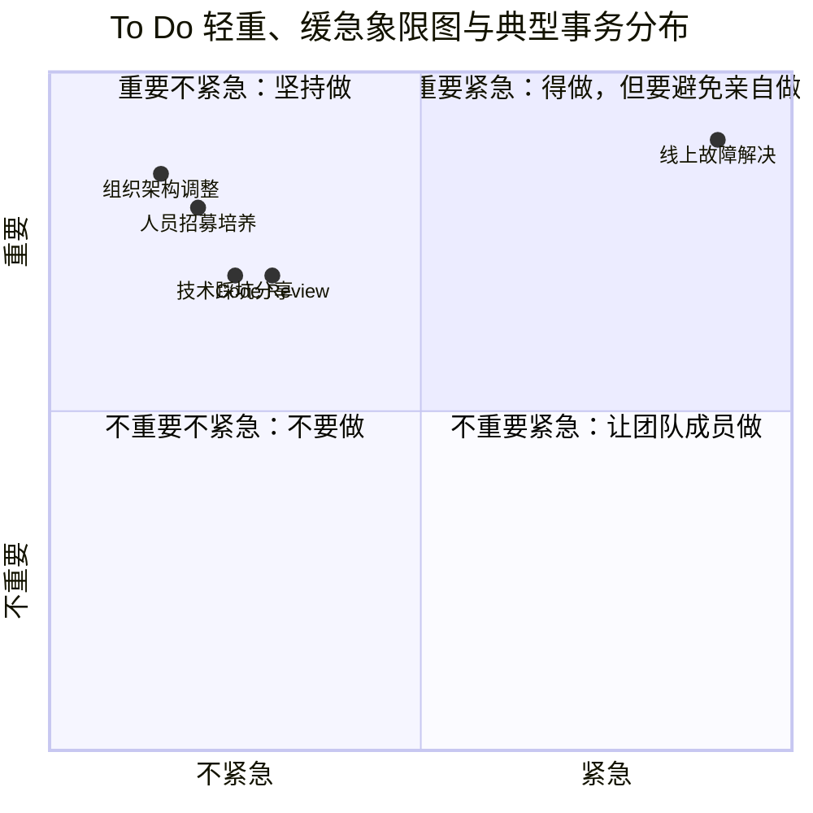
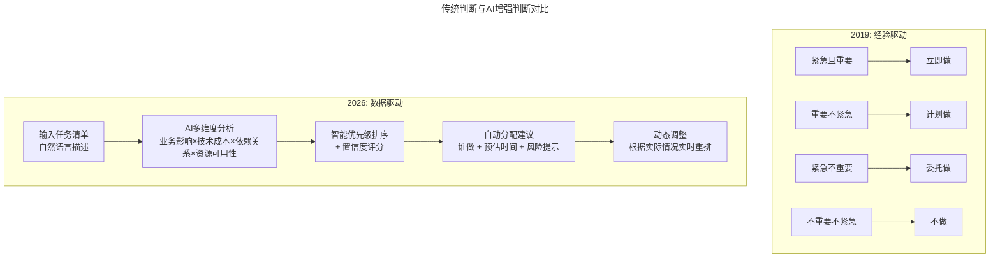

> **适用范围**：CTO、技术副总裁、高速成长期技术管理者
> **更新摘要**：v2 版本基于原文第 28 讲内容，保留全部原始内容并升级为 6 节结构；融入 2026 年 AI 时代注解，新增 AI 增强优先级判断、AI 预案能力及 AI 时代节奏控制策略。

---

# 第28讲 | 业务高速增长期的团队管理："知轻重、重绸缪、调缓急"

## 一、导言

作为企业的技术管理者，如技术总监、技术副总裁或是 CTO，必定会期望企业业务快速发展，这样技术团队对业务的价值才能最大程度得到体现。但业务的爆炸式增长将不可避免地带来组织结构的变化和管理上的挑战，那么作为技术管理者，你是否做好了迎接这些挑战的准备？

本文将结合我过往在创业公司以及大公司新业务扩张时期的经历，来讲述如何在企业快速成长时做好技术团队管理，我将通过"再识技术管理"来聊聊对技术管理的理解，再通过"边开飞机边换引擎"来聊聊企业快速成长时技术团队管理面临的挑战，并给出一些管理团队的建议。

> **⭐ 2026 年技术背景**：AI 时代的"高速增长"有了全新定义——产品开发周期从月级降到周级，增长可能更迅猛；组织扩展模式从"加人"变为"人+AI"混合扩展；管理复杂度因人机协作而非线性上升。

---

## 二、核心方法论

### 2.1 再识技术管理

技术管理者大多都是从技术专业人才转变成为管理者的，极少情况下存在着没有技术背景的技术管理者，一般都是在企业发展过程中，需要在专业能力或业务贡献上已经被证明过的技术专业人才来成为技术管理者，期望他们将自身的业务能力进行复制，带给整个团队，以让企业的技术团队正向发展。晋升为技术管理者，这是一个令人振奋的新角色，但同时也需要不少新的技能和能力来面对这个职位带来的挑战。我们先来看技术专家与管理者在日常工作输出上的区别：

技术专家
- 与产品、QA 团队日常撕
- 分析业务需求并制定技术方案
- 编写代码实现功能需求以及修复 bug
- 解决线上故障或突发问题
- 经验知识沉淀及技术学习

管理者
- 设立团队目标、制定工作流程
- 协调必要资源来支持团队、并与其它团队保持良好沟通
- 观察团队工作进展、向上输出业务进度报告
- 招募并培训技术人才
- 评定团队成员业绩

从上面对比不难发现，这两个角色实际是从不同角度来看相同的业务挑战，因此日常需要完成的工作内容是完全不一样的。简而言之，技术人才或技术专家是面向任务来工作，而管理者或经理的角色是面向人来工作，他是要驱动激励团队来完成业务需要，并根据公司远景来提前布局。

### 2.2 边开飞机边换引擎

在业务高速发展的公司，例如创业公司 B 轮融资后开始冲业绩、又或是被媒体报道后的激增，一般业务量会有几倍甚至于几十上百倍的增长，这取决于公司的业务模式，这时企业的技术团队将面临巨大的挑战，比如业务系统能否抗住高并发、业务系统的响应速度以及业务代码是否存在影响严重 bug 等。这里我们要聊的是在这种情况下的技术团队管理该如何做，所以我们不过多关注具体的细节问题，而要以管理者的角度来更加全局性地来审视这样情况下面临的核心冲突或矛盾是什么。

大家会经常听到的一个比喻是"边开飞机边换引擎"，这个比喻十分形象地将这种困境描述了出来，我们简化来看这个困境，实际面临的是两个问题，一个是时间，我们需要驾驶这架飞机在最短的时间内安全到达目的地；另一个便是资源，我们拥有的飞机就只有这一架，并没有其它备用飞机提供给我们来进行替换使用，因此我们只能在这架飞机上进行修修补补继续飞。

不难看出我们在企业高速成长时技术团队管理面临的两个核心矛盾或问题就是时间和资源。时间上的矛盾在于业务系统开发和完善、以及技术储备等都需要时间来进行开发维护以及沉淀，但业务增长的速度和时间窗口并不会给技术团队以太多喘息机会，那么在这个时间矛盾下，怎么做好技术团队管理呢？精简来说就是"知轻重、重绸缪、调缓急"。

### 2.3 ⭐ 2026 高速增长的对比

| 维度 | 2019 年的增长 | 2026 年的 AI 加速增长 |
|------|------------|-------------------|
| **产品迭代速度** | 2 周/Sprint | 2-3 天/Iteration（AI 生成 80% 代码） |
| **团队扩张方式** | 招聘更多工程师 | 招聘少量工程师 + AI 工具赋能 |
| **技术债积累速度** | 快（赶工期） | 更快（AI 生成的代码需要审查） |
| **管理半径** | 1 个 Manager 管 7-10 人 | 1 个 Manager 管 15-20 人（AI 辅助管理） |
| **最大风险** | 团队文化稀释 | **AI 能力不均 + 人机角色混乱** |

---

## 三、关键流程

### 3.1 知轻重：优先级判断

管理者需要从公司业务未来发展趋势上来做规划，进而来看自己所负责事情的轻重缓急，例如招募并培训技术人才、Code Review、设立团队目标、制定工作流程这样的事情，对于企业和团队来说是至关重要的，但是并不会马上有明显产出。但需要持续坚持做，是利于长期的事情，那么我们到底该怎么从众多的事务中来做区分呢，下面我们先看一张图：

To Do 轻重、缓急象限图，以及典型事务分布

从上面象限图来看，作为技术管理者我们应该怎么分配时间和资源呢，以下是我简单的总结。

- **重要紧急**：得做，但要避免做。例如线上故障解决，这种问题重要又紧急，可能目前只能你来处理，但是应该是有各种故障后备用方案，让团队成员去实施，先保障业务然后团队再进行问题定位。

- **重要不紧急**：坚持做。例如人员招募培养、组织架构调整、Code Review 以及技术踩坑分享等，这些事务做了不会马上产生收益，坚持做的话日后收益会很大。

- **不重要紧急**：让团队成员做。将锻炼机会留给团队成员，自己做好支持工作。

- **不重要不紧急**：不要做。在时间和资源有些许喘息机会时，可以安排成本低的方式来处理。

#### ⭐ 2026 "知轻重"的 AI 增强

上述对比图展示了优先级判断从经验驱动到数据驱动的演进：传统方式依赖管理者经验进行四象限分类；AI 增强方式通过多维度分析和智能排序，实现动态优先级调整。

### 3.2 重绸缪：提前准备

因此，技术管理者应该未雨绸缪地将未来发展所需事务列举出来，也就是说要有技术管理者的远见，然后再将目前要处理的事务列举出来，放置在上面的象限图中，你需要关注的一个象限是"重要不紧急"，另外需要培养团队成员来处理的两个象限事务是"重要紧急"和"不重要紧急"。象限里的事务并非是固定的，会产生事务移动的情况，有些移动是需要技术管理者自己总结和主动发起的，最后跟大家分享两个小案例，希望对大家有些启发。

**案例一：运营活动支撑，"重要紧急"变为"重要不紧急"**

之前公司有做过一款社交 App，运营同学定期会进行运营活动策划，例如情人节、春节、七夕等，活动类型比较多且比较频繁，涉及到活动广告位、活动着陆页、活动参与页、活动结算以及 App 内状态标识等诸多 App 内相关的修改变更。对于社交 App 来说，运营活动能够提升客户活跃以及营收，属于是"重要紧急"的事情，一般来说都是分配 1 到 2 位开发人员进行运营活动的开发工作，开发人员一般不太愿意接这样的活，因为技术挑战不大且重复性工作较多，面对这样的矛盾局面，我们是怎么处理的呢？

很明显这样的运营活动一定会持续办下去，那么将"重要紧急"变为"重要不紧急"就尤为重要了，然后我们在研发团队内部立了个小项目——"运营活动定制系统"，对于过往经常使用的运营活动策划手法进行了总结整理，可以将 App 内广告位、着陆页、活动参与页以及状态标识修改等诸多内容可以通过该系统进行定制，通过运营、iOS/Android、前端、服务端同学的一起参与，将该项目开发完成，运营仅通过后台便可以完成常规活动的定制、审核以及发布。

**案例二：提前部署组织架构调整，典型的"重要不紧急"**

企业业务初期时，业务线比较少，一般研发团队组织架构按照岗位职责来划分，例如前端团队、服务端团队、运维团队以及客户端团队等。但随着业务不断的发展，会出来很多的子系统和产品，例如产品 A、产品 B、内部运营系统以及数据可视化系统等，这时按照职能划分团队方式的弊端就很明显，研发团队成员需要身兼多项工作任务，如何在各项工作任务之间弄清楚优先级，会出来很多扯皮的现象，并且团队越大，团队负责人专门的管理成本会升高。

面对上述问题，通过提前部署好组织架构调整，可以进行化解。我们先将运维、数据、服务端团队划分部分人员到基础服务团队，将前端、服务端、客户端团队按照项目组来进行划分，项目组里加上运营、产品团队成员来形成小团队，降低内部沟通成本，提升组织运作效率，同时研发团队绩效考核上会加上项目组业务的权重评分，这样保证项目组目标一致高效运作。

#### ⭐ 2026 "重绸缪"的 AI 增强

| 准备维度 | 传统做法 | AI 增强做法 |
|---------|---------|-----------|
| **人才储备** | 提前招聘、建立 candidate pool | **AI 面试助手**提高招聘效率 3 倍；**AI Onboarding**缩短新人适应期 70% |
| **技术储备** | 技术调研、POC 开发 | **AI 技术雷达**自动扫描行业趋势；**AI POC Generator**快速验证想法 |
| **流程准备** | 文档化 SOP | **AI SOP 生成器**基于最佳实践自动生成；**AI 流程挖掘**发现瓶颈 |
| **文化准备** | 团队建设活动 | **AI 文化诊断**定期扫描团队氛围；**AI 个性化激励**提升归属感 |

### 3.3 调缓急：节奏控制

#### ⭐ 2026 新的紧急情况类型

| 类型 | 示例 | 应对策略 |
|------|------|---------|
| **传统紧急** | 生产故障、客户投诉 | 已有成熟流程 |
| **AI 特有紧急-1** | AI API 宕机/限流导致服务降级 | **Multi-vendor Strategy** + Fallback 机制 |
| **AI 特有紧急-2** | AI 生成内容出现严重错误 | **Human-in-the-loop** + 自动熔断 |
| **AI 特有紧急-3** | 数据隐私事件（敏感数据输入公有云 AI） | **DLP 系统** + 访问审计 |

---

## 四、工具与实战

### 4.1 "边开飞机边换引擎"的 AI 时代实践

**2026 现实**：
- ✅ **AI 降低了换引擎的成本**：代码迁移、重构可以由 AI 辅助完成，效率提升 5-10 倍
- 🆕 **新挑战**：引擎本身在变——从"传统引擎"换成"AI-Native 引擎"
- 🆕 **实践建议**：渐进式 AI 化、双轨运行、A/B Testing

### 4.2 ⭐ 2026 高速增长期的 CTO Dashboard

| 维度 | 关键指标 | 告警阈值 | AI 辅助 |
|------|---------|---------|--------|
| **业务健康度** | DAU/收入增长率 | <预期值的 80% | AI 预测下周趋势 |
| **交付效率** | Sprint 完成率/Velocity | 连续 2 周下降 | AI 分析根因 |
| **代码质量** | Bug 率/技术债比例 | Bug 率>5% | AI Code Quality Score |
| **团队状态** | eNPS/离职率意向 | eNPS<30 | AI 情感分析（匿名） |
| **AI 使用情况** | AI 工具采用率/API 费用 | 费用超预算 20% | AI ROI 追踪 |
| **系统稳定性** | SLA/MTTR | SLA<99.9% | AI 异常检测 |

### 4.3 ⭐ 2026 可执行建议

1. **部署 AI Priority Agent**：自动分析 Backlog，给出优先级建议和理由
2. **建立价值量化模型**：每个任务都要能回答"这值多少钱"
3. **每周 Priority Review**：用数据验证上周的优先级决策是否正确
4. **建立 AI Incident Response Playbook**：针对 AI 特有的故障场景制定预案
5. **设置 AI Budget Alert**：API 费用异常时自动告警

---

## 五、常见误区

### 5.1 误区：事务性工作亲力亲为

- **误区**：管理者事必躬亲，亲自处理所有重要紧急的事务
- **正确做法**：培养团队成员处理"重要紧急"和"不重要紧急"事务，自己聚焦"重要不紧急"

### 5.2 误区：忽视组织架构提前调整

- **误区**：等到问题爆发才调整组织架构
- **正确做法**：提前部署组织架构调整，将"重要紧急"变为"重要不紧急"

### 5.3 ⭐ 2026 误区：为了快而牺牲 AI 质量

- **现象**：赶工期时关闭 AI Code Review，或者不审查 AI 生成的代码
- **对策**：质量底线不可妥协；分级审查（核心模块人工 Review，非核心模块 AI Review）；技术债登记

### 5.4 ⭐ 2026 误区：忽视文化稀释

- **现象**：新人太多，原有文化被冲淡，团队凝聚力下降
- **对策**：强化 AI Onboarding；保留"老火种"；越忙越要有 Team Building

---

## 六、进阶延展

### 6.1 核心总结

原文的"知轻重、重绸缪、调缓急"九字真言是**极具智慧的管理哲学**。在 2026 年，这个框架依然有效，但需要**注入 AI 时代的新内涵**：

1. **知轻重** → 用 **AI 数据分析**辅助优先级判断，而非仅靠直觉
2. **重绸缪** → 用 **AI 预测和模拟**提前发现问题，而非被动响应
3. **调缓急** → 建立**包含 AI 特有场景**的应急响应机制

### 6.2 作者简介

刘俊强（微信公众号：程序员精进），现任腾讯云资深架构师，TGO 鲲鹏会深圳分会会员。曾任迅雷技术总监、某互联网公司技术副总裁。10+ 年以上互联网开发经验，8 年以上技术管理经验。

### 6.3 关键洞察

> 2026 年的高速增长比以往任何时候都快，但也比以往任何时候都更需要**定力和节奏感**。AI 给了你超级加速度，但你必须是那个**握着方向盘、知道何时加速何时刹车的人**。记住温格的话："足球不是为了赢，而是为了踢得漂亮。"同样，**技术管理的目的不仅是为了快，更是为了在快速增长中保持团队的卓越和文化。**

### 6.4 延伸思考

- "再识技术管理"需新增 AI 治理、数据战略、人机协同设计、伦理合规等能力维度
- "边开飞机边换引擎"的 AI 时代实践需采用渐进式 AI 化、双轨运行策略
- 优先级判断需从经验驱动升级为 AI 数据驱动
- 节奏控制需建立包含 AI 特有场景的应急响应机制

---

*本注解基于 2026 年 6 月的最新技术动态生成，包括 GPT-5.5、DeepSeek V4 的普及，以及 84% 开发者使用 AI 编程的行业现状。*