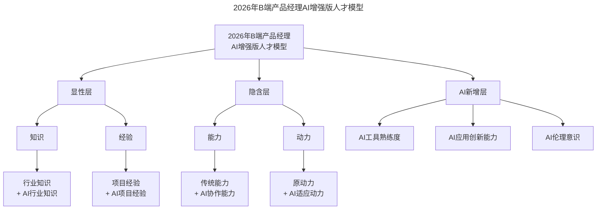
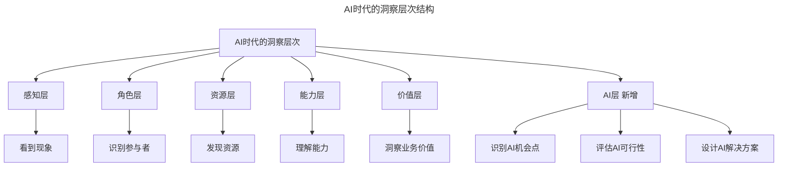
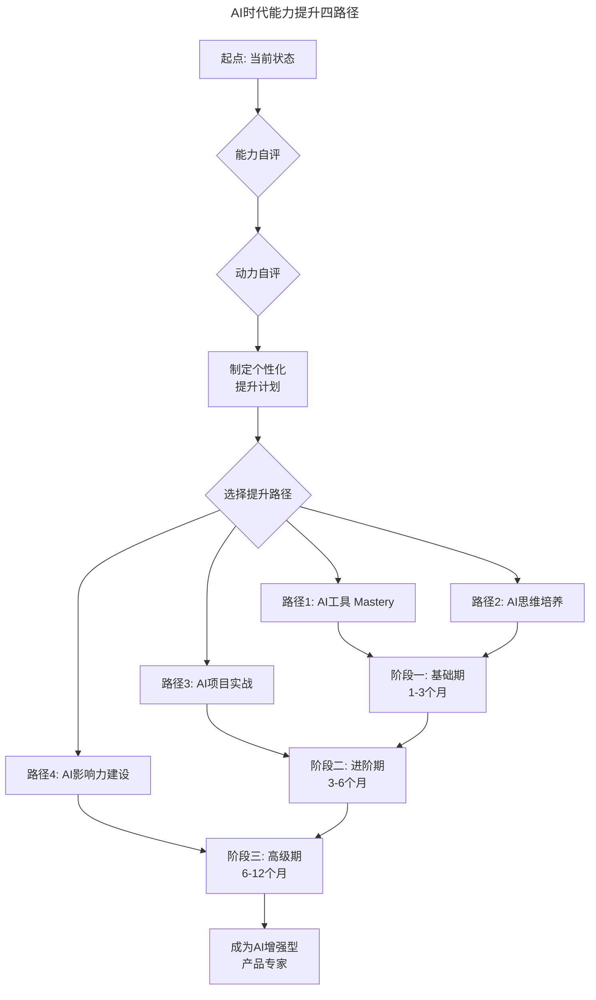

> **适用范围**：B 端产品经理、技术管理者、个人成长追求者
> **更新摘要**：v2 版本基于原文第 144 讲内容，保留全部原始内容并升级为 6 节结构；融入 2026 年 AI 时代注解，新增 AI 增强版人才模型、能力公式 AI 升级、动力公式 AI 重建及四条能力提升路径。

---

# 第144讲 | 于艺：如何提升自己的能力与动力

## 一、导言

在我看来，B 端产品不是用于娱乐或消费，而是让经营者、工作者更好的收获利益的，因此，B 端产品定位的关键是生存，一切相关的判断与决策都可以围绕这个关键点来思考。而在方法论层面，我们可以用财务结构定位、组织结构定位与实施模式定位等方法来做产品定位。然而，对于产品定位，我觉得只有方法论还不够，还需要提升我们自身的能力，才能更准确的对产品进行定位。

> **⭐ 2026 年能力与动力的 AI 重构**：当 AI 可以完成 70% 的编码工作，Agent 能替代 3-5 人团队，"能力 = 实践 + 学习 + 洞察"的公式需要升级为 **"能力 =（实践 + 学习 + 洞察）× AI 放大器"**，而"动力 = 热爱 - 恐惧"的动力公式也需要重新审视——AI 既是新的恐惧来源，也是放大热爱的加速器。

---

## 二、核心方法论

### 2.1 B 端产品经理的人才模型

要提升，就要先找到提升的方向和路径，我们先来看 B 端产品经理的人才模型：

首先，显性的是知识与经验，知识的来源可以是业务可以是互联网，经验则来源于工作及项目等经历中的积累，二者都可以通过不断学习和刻意积累获取到。

比如，我接触经纪人招聘这个系统的时候，对招聘这种业务只是参与过面试，但在专业角度一无所知，所以从招聘的知识角度，我不但调研了专业招聘团队的工作场景，访谈了招聘的上下游用户，还关注了大概 10 多个人力资源公众号，阅读了不少人力资源基础的书籍，甚至还有经纪人行业研究方面的报告和书籍。从经验角度，我开始自己尝试着招募经纪人，研究各种招聘网站，一个月在 boss 直聘上沟通了 2000 多个人，推荐了 100 多次面试，还亲自面试了很多人。从一无所知到一个多月过去之后，和一些城市的 HR 总监聊招聘业务时，对方会很惊讶，你一个做系统的怎么这么懂招聘业务。

其次，隐性的部分，藏在冰山海面下的是能力与动力，这两点是在面试过程中比较难衡量的，也是在自我认知中比较模糊的方面。

### 2.2 ⭐ AI 增强版人才模型（2026）

上述模型图展示了 2026 年 B 端产品经理人才模型的三层结构：在原有的显性层（知识 + 经验）和隐含层（能力 + 动力）基础上，新增 AI 层（AI 工具熟练度、AI 应用创新能力、AI 伦理意识），形成更完整的人才画像。

### 2.3 能力公式的 AI 版本

**原文**：能力 = 实践 + 学习 + 洞察

**AI 版**：能力 = (实践 + 学习 + 洞察) × AI 放大器

| 组成部分 | 原文含义 | AI 增强效果 |
|---------|---------|------------|
| 实践 | 通过实际工作积累 | 用 AI 辅助完成更多实践（效率提升 3-5 倍） |
| 学习 | 通过学习获取知识 | 用 AI 加速学习过程（速度提升 5-10 倍） |
| 洞察 | 发现事物本质的能力 | 用 AI 增强分析能力（深度和广度提升） |
| AI 放大器 | — | 将上述三者效果放大 2-3 倍 |

### 2.4 动力公式的 AI 版本

**原文**：动力 = 热爱 - 恐惧

**AI 版**：动力 = (热爱 + AI 热爱) - (恐惧 - AI 降低的恐惧)

| 组成部分 | 原文含义 | AI 时代变化 |
|---------|---------|------------|
| 热爱 | 对工作本身的热情 | 不变 |
| AI 热爱 | — | 对 AI 赋能可能性的兴奋（新增） |
| 恐惧 | 对失败、能力不足的担忧 | 不变 |
| AI 降低的恐惧 | — | AI 降低了尝试新事物的门槛和风险（新增正效应） |

---

## 三、关键流程

### 3.1 识别自己的能力适配性

先来看能力这个维度，我们可以记住这个公式：能力 = 实践 + 学习 + 洞察，在这个公式中，实践与学习可以得到知识与经验，因为知识可以通过学习获取，经验可以通过实践积累。那洞察又该如何理解呢？

"懂业务"浅层的理解，只是我可以像一个招聘专员一样作业，其实伴随深入的逻辑分析和思考，我发现其实很多招聘专员也说不清楚业务的本质，而这种"发现本质"的行为就是洞察。

洞察本身也有深浅之分，我们看待一件事情或者一个业务时，都有一个渐入的层次结构，由感知到角色到资源到能力最后到业务价值。

### 3.2 ⭐ AI 时代的洞察层次（2026 版）

上述层次图在原有的感知、角色、资源、能力、价值五层基础上，新增了 AI 层：识别 AI 机会点、评估 AI 可行性、设计 AI 解决方案，为洞察力提供了 AI 时代的全新维度。

### 3.3 识别自己的动力适配器

再来看动力这个维度，我认为动力 = 热爱 - 恐惧，因为动力源于发自内心的热爱，但很多时候这种热爱都伴随着恐惧。

热爱源于视野，眼界越宽，体验的事物越多，就越容易知道自己的兴趣所在。而恐惧源于能力的不足，最终，动力等于热爱减去恐惧，不是光看你爱什么，还要看你看你怕什么。

### 3.4 ⭐ 2026 年能力提升路径图

上述流程图展示了四条能力提升路径：AI 工具 Mastery（适合所有人）、AI 思维培养（适合有基础的人）、AI 项目实战（适合有经验的人）、AI 影响力建设（适合资深人士），通过三个阶段的递进，最终成为 AI 增强型产品专家。

---

## 四、工具与实战

### 4.1 各路径详细说明

**路径 1：AI 工具 Mastery（适合所有人）**
- Month 1：掌握 ChatGPT/Claude 等对话式 AI 的使用
- Month 2：掌握 AI 编程助手（如 Cursor）的基本使用
- Month 3：将 AI 工具集成到日常工作流，量化效率提升效果
- 产出：个人工作效率提升 50%+

**路径 2：AI 思维培养（适合有基础的人）**
- Month 1-2：学习 AI 基础知识，了解 AI 应用案例
- Month 3-4：培养"这个能否用 AI 解决？"的思维习惯
- Month 5-6：能够独立设计简单的 AI 解决方案
- 产出：具备 AI 产品思维的产品经理

**路径 3：AI 项目实战（适合有经验的人）**
- Phase 1（1-2 月）：参与或主导一个 AI 功能的设计和落地
- Phase 2（2-3 月）：主导一个完整的 AI 产品模块
- Phase 3（3-4 月）：总结 AI 产品方法论，指导他人
- 产出：有实战经验的 AI 产品专家

**路径 4：AI 影响力建设（适合资深人士）**
- Q1-2：输出 AI 相关的文章、分享、课程
- Q3-4：参与行业 AI 社区的讨论和贡献
- Year 2：成为行业认可的 AI 产品专家
- 产出：有影响力的 AI 思想领袖

### 4.2 30 天快速启动计划

| Week | 重点任务 |
|------|---------|
| Week 1 | 评估与准备：完成能力和动力自评，选择提升路径 |
| Week 2 | 基础建立：每日使用 AI 工具完成 1 项工作任务（30 分钟） |
| Week 3 | 实践深化：尝试用 AI 解决一个工作中的实际问题 |
| Week 4 | 总结与规划：量化 30 天成果，制定下一阶段计划 |

### 4.3 恐惧来源的 AI 时代变化

| 恐惧类型 | 传统表现 | AI 时代新表现 | 应对策略 |
|---------|---------|-------------|---------|
| 能力恐惧 | "我不够好" | "AI 比我强，我没用了" | 理解 AI 是工具不是替代者 |
| 失败恐惧 | "做错了怎么办" | "AI 项目失败率很高" | 建立科学的试错机制 |
| 变化恐惧 | "不想改变" | "AI 变化太快跟不上" | 拥抱持续学习的文化 |
| 价值恐惧 | "我没有价值" | "AI 能做我的工作" | 强化 AI 无法替代的能力 |

---

## 五、常见误区

| 误区 | 表现 | 应对策略 |
|------|------|----------|
| **AI 万能论** | 认为引入 AI 就能解决一切问题 | 理解 AI 是放大器，不是替代品 |
| **AI 恐惧论** | 拒绝使用 AI，担心被替代 | 从小胜开始，积累成功经验 |
| **重工具轻思维** | 只学工具用法，不培养 AI 思维 | 工具和思维并重 |
| **忽视洞察力** | 满足于使用 AI，不深入思考 | 持续练习洞察事物本质的能力 |

---

## 六、进阶延展

### 总结

本文分享了 B 端产品经理的人才模型，以及如何在能力和动力两个维度提升的方法论。其实，专业选手和业余选手最大的区别就在于正确的方法论加刻意的实践，这两点可以有效提高我们的能力，若是再扩大视野，就可以让我们不论是选择 B 端产品、C 端产品，还是选择技术方向，都能获得不错的提升与成就。

> **2026 年版**：在 AI 时代，**"AI 增强的专业选手"和"纯人类业余选手"的区别在于：是否能够将 AI 作为能力的放大器，将 AI 作为动力的加速器。** 正确的方法论 + 刻意的实践 + AI 工具的加持 = 10 倍的成长速度。

不要问"AI 会不会替代我"，而要问"我如何用 AI 让自己不可替代"。

### 季度成长 OKR 示例

**Q1 OKR：AI 能力基础建设**
- Objective：建立 AI 工具使用习惯，提升工作效率 30%
- KR1：每日使用 AI 工具完成至少 2 项工作
- KR2：完成 10 个 AI 辅助的实际工作案例
- KR3：个人工作效率量化提升 30%

### 推荐阅读

- 大前研一《思考的技术》：提供刻意练习洞察力的方法论
- Stack Overflow 开发者调查 2025：开发者 AI 工具采用率数据（84%）

### 作者简介

于艺，贝壳找房店面平台及客户赋能平台事业部总经理，致力于用互联网的产品技术帮助贝壳平台上的加盟商更高效的开店，更高效的招人育人。之前在链家负责链家网上海 app 的研发工作，在经营分析系统、楼盘字典、真房源和 O2O 的行为追踪方面有诸多创新。

---

*本注解基于 2026 年 AI 技术生态编写，帮助每个人在 AI 时代找到适合自己的能力提升和动力激发之路。记住：最好的投资是投资自己，而在 AI 时代，投资自己的 AI 能力是回报率最高的选择！*