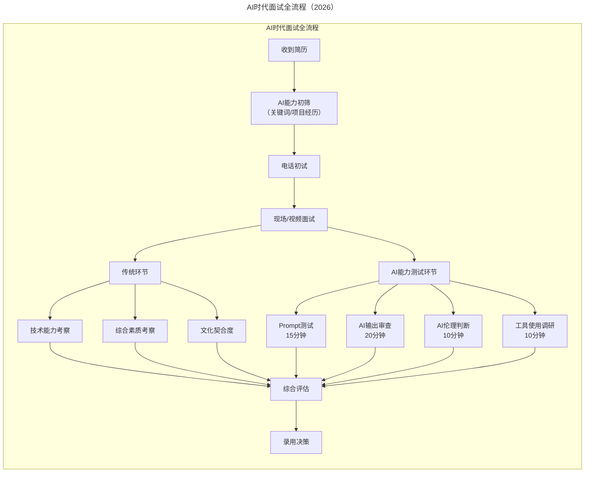
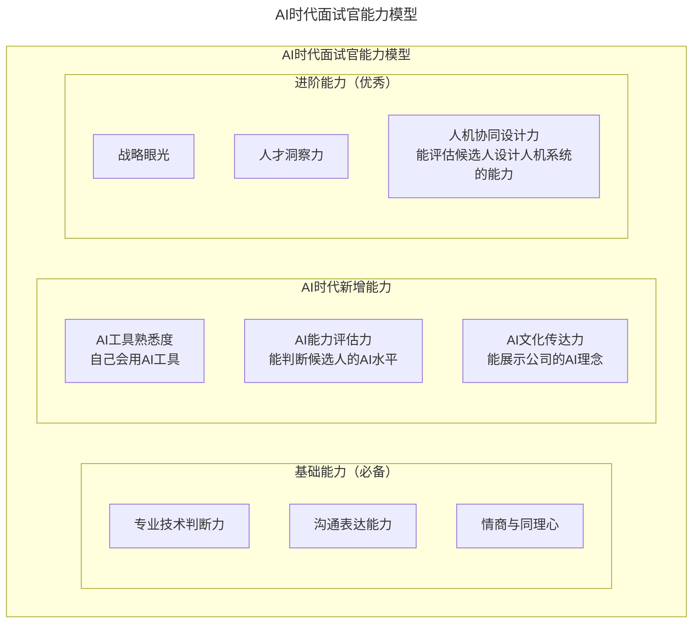

> **适用范围**：技术面试官、Tech Lead、CTO、招聘负责人
> **更新摘要**：v2 版本基于原文第 35 讲内容，保留全部原始内容并升级为 6 节结构；融入 2026 年 AI 时代注解，新增 AI 能力测试环节详解、AI 时代面试官能力模型及 AI 相关面试忌讳。

---

# 第35讲 | 做个合格的技术岗位面试官

## 一、导言

昨天的文章中，我分享了如何做好技术团队招聘的基础工作。那么，当有了较合适的简历，应该如何有效的面试，在满足自己岗位需求的同时，将不符合要求的候选人挡在门外？本文将详细讲述，作为一个技术领导者，如何做好面试的工作。

> **⭐ 2026 年技术背景**：2026 年，**面试官的角色发生了质变**。原文提到的面试技巧——关注综合素质、技术能力、临场发挥——依然重要，但**必须增加 AI 能力的评估维度**。核心变化：从"会不会写代码" → **"能不能用好 AI 写代码并判断质量"**；面试不再只是"考候选人"，还要**展示企业的 AI 文化和吸引力**；**84% 的开发者使用 AI 工具**意味着：不懂 AI 评估的面试官会被质疑专业性。

---

## 二、核心方法论

### 2.1 不同岗位关注点不同

由于个性，知识背景，每个 CTO 在招聘过程中，面试的技巧都不一样，有人偏向技术，有人偏向情怀，等等，各人各异。本人认为对于不同的岗位面试技巧，不同的候选人，面试技巧应该因人而异。

在定岗定级时，基本上就确定了，不同岗位在团队中扮演的角色的差别，有些岗位是核心岗位，而有些岗位则是辅助性的，相对来说没有那么重要。

对于核心岗位，根据岗位的需求，针对候选人的简历，在短短的不到 2 个小时的面对面沟通中，主要考察的是候选人对该岗位描述中使用到的技术的掌控能力，以及候选人过去的工作中是否真如其描述的那样的经历和经验。

针对核心岗位候选人的面试，在面试过程中，考察的重点往往是候选人过往的经历是否对该岗位负责的事情起到带头的作用，候选人的经历和经验会成为考察的重心，作为技术领导者，要能一眼看穿候选人是否夸大其自身经历和经验，不至于被忽悠了。

另外，对于核心岗位，公司都是非常希望候选人作为核心骨干能够与公司长期共同发展，共同成长的。这里要表达的意思是，应该要给候选人卖一点情怀，让候选人能够明确的感觉到团队希望其能共同成长，共同发展，而不是仅仅为其提供一个工作的岗位。

而对于一般的岗位，最重要的是考察其能力，是否能够胜任岗位所描述的需求，若能够满足，实际上可以录用的，否则就算了。针对这些岗位的候选人，本人觉得比较忌讳的是大谈特谈所谓的忠诚度，谈贡献，而忽略了个人利益。很有可能对于候选人来说，他们所需要的可能仅仅只是一份工作而已。

### 2.2 不同岗位的 AI 面试侧重点（2026 版）

| 岗位类型 | 传统重点 | 🆕 AI 面试重点 | 建议时长 |
|----------|---------|--------------|---------|
| **核心岗位（Tech Lead+）** | 经验、架构能力、带队能力 | **AI 战略思维、人机协同设计、AI 治理能力** | AI 环节 30-40 分钟 |
| **高级工程师（P7）** | 技术深度、解决问题能力 | **AI 评判能力、Prompt Engineering、工具选型** | AI 环节 25-30 分钟 |
| **中级工程师（P6）** | 独立工作、技术广度 | **AI 工具熟练度、工作流优化、安全意识** | AI 环节 20-25 分钟 |
| **初级工程师（P5）** | 基础能力、学习潜力 | **AI 学习意愿、基础工具使用、成长空间** | AI 环节 15-20 分钟 |
| **🆕 AI 专项岗位** | - | **专业 AI 能力深度测试、实战演练** | AI 环节 40-60 分钟 |

---

## 三、关键流程

### 3.1 如何考察技术能力

针对技术岗位的候选人的面试，随着面试慢慢的深入，往往候选人会放下戒心，有些 CTO 会抓住这种机会，在自己认为重要的技术点上，采用压力面试（Stress Interview），实际上考察的是候选人在面对危机时的临场处理能力，面试官也未必比候选人就这些知识点了解的更加透彻。本人就非常喜欢根据面试气氛的变化，采用这种方法。

面试过程实际上是双方相互之间第一次了解和试探的过程，候选人向面试官详细描述了自身的背景、经历之后，出于互相尊重的需要，尤其是对于核心岗位的候选人，面试官需要将公司的商业模式，公司的 vision，团队的现状告知候选人，向候选人描述团队对该岗位的定义和诉求，以期达到双方对该岗位预期诉求的基本认同。

对于技术岗位的面试，很多公司往往会进行临场的编码考察。这种面试方法本人也比较喜欢，尤其是定位在 P7/P6 以及以下级别的岗位，这个定级的岗位在日后的工作中往往是方案设计、编码的主力，对于性能、可靠性等关键的质量要素的敏感性往往很高。

### 3.2 面试全流程的 AI 时代升级

上述流程图展示了 AI 时代面试全流程的升级：在传统技术能力、综合素质、文化契合度考察的基础上，新增 Prompt 测试、AI 输出审查、AI 伦理判断和工具使用调研四个 AI 专项环节，形成更全面的候选人评估体系。

### 3.3 AI 能力测试环节详解

#### 环节 1：Prompt 测试（15 分钟）

| 难度 | 题目 | 考察点 |
|------|------|--------|
| 初级 | "让 AI 写一个 Python 函数，计算斐波那契数列第 n 项" | 基本 Prompt 能力 |
| 中级 | "让 AI 重构一段给定的代码，要求提高可读性和性能" | 迭代优化能力 |
| 高级 | "设计一套 Prompt Chain，让 AI 完成从需求到测试的全流程" | 系统化设计能力 |

#### 环节 2：AI 输出审查（20 分钟）

**操作方式**：提供一段 AI 生成的代码（故意包含 3-5 个问题），让候选人在规定时间内找出所有问题。

**预设问题类型**：逻辑错误、安全漏洞、性能问题、代码风格问题、过度工程。

#### 环节 3：AI 伦理判断（10 分钟）

| 场景 | 期望回答方向 |
|------|-------------|
| "项目紧急，同事建议把代码喂给 ChatGPT 来加速开发" | 应该拒绝，指出安全和合规风险 |
| "AI 生成的代码看起来没问题，要不要跳过 Code Review" | 不应该，AI 可能引入隐蔽问题 |
| "发现团队有人在用 AI 写代码但标注为自己写的" | 应该指出诚信问题，建议正确标注 |

#### 环节 4：工具使用调研（10 分钟）

**问题示例**：
1. "你日常使用哪些 AI 工具？分别用在什么场景？"
2. "你认为哪个 AI 工具最好用？为什么？"
3. "有没有遇到过 AI 工具'帮倒忙'的情况？怎么处理的？"
4. "如果让你推荐一款 AI 工具给团队，你会推荐什么？"

---

## 四、工具与实战

### 4.1 AI 时代面试官能力模型

上述能力模型图展示了 AI 时代面试官的三层能力结构：基础能力（专业技术判断、沟通表达、情商）是必备项；AI 时代新增能力（AI 工具熟悉度、AI 能力评估力、AI 文化传达力）是区分项；进阶能力（战略眼光、人才洞察力、人机协同设计力）是优秀项。

### 4.2 2026 年面试官 Checklist

- [ ] 自己**熟练使用至少 2 款 AI 工具**（Copilot/Cursor/ChatGPT 等）
- [ ] 掌握 **AI 能力评估的基本方法**（Prompt 测试、输出审查等）
- [ ] 准备 **AI 面试题库**（分难度、分岗位类型）
- [ ] 制定 **AI 能力评分标准**（团队内部统一）
- [ ] 了解 **公司 AI 战略和文化**，能在面试中准确传达
- [ ] 避免 **AI 相关的言行禁忌**（无知、歧视、过度崇拜）
- [ ] 每次 **面试后复盘 AI 环节的有效性**，持续优化

---

## 五、常见误区

### 5.1 原文忌讳

**忌讳一：惹恼候选人**

切忌一时口快，而让候选人觉得受到了质疑。面试官在控场的同时，要把握好面谈氛围，尽量让候选人觉得愉快，从而能够让其放下戒心，清楚的表达其真实想法。

**忌讳二：偏离主题**

在面试过程中和候选人海阔天空，夸夸其谈，偏离了面试的本质，最后什么面试结果都没有。这种面试过程，其结果多数是候选人反映面试官不专业，不切实际。

### 5.2 AI 时代新增忌讳

| 忌讳类型 | 表现 | 后果 |
|----------|------|------|
| **惹恼候选人**（原有） | 质疑背景、不尊重 | 企业形象受损 |
| **偏离主题**（原有） | 海阔天空聊无关话题 | 浪费时间、无有效评估 |
| **🆕 显示 AI 无知** | 对 AI 工具一无所知、问外行话 | 候选人质疑公司技术水平 |
| **🆕 AI 歧视** | 认为用 AI 的人"不是真正会写代码" | 错失优秀 AI 人才 |
| **🆕 AI 过度崇拜** | 认为会用 AI 就是大神，忽视基础 | 招到华而不实的人 |

### 5.3 AI 时代面试的陷阱

**陷阱 1：AI 测试流于形式** — 加了 AI 测试环节但不知道怎么评分。对策：提前设计评分标准和参考答案。

**陷阱 2：用 AI 代替人工判断** — 完全依赖 AI 工具给出的候选人评估。对策：AI 只能辅助，最终决策必须由人做出。

**陷阱 3：忽视候选人的 AI 焦虑** — 候选人对 AI 测试感到紧张或抵触。对策：营造轻松氛围，强调这是了解而非考试。

---

## 六、进阶延展

### 结语

CTO 等技术领导者是核心团队的核心领导者，对于运营、产品到最后研发落地等岗位，招聘中对于候选人的考核，尤其对于核心人员，请将综合素质摆在第一位，宁缺毋滥是第一原则。同时，在关注候选人素质的同时，也要不断提升自身面试技巧，并充分尊重候选人。只有这样，才能赢得合适的候选人的认可，从而提高入职率。

> **一句话总结（2026 版）**：做一个合格的面试官，在 2026 年意味着：**你不仅要懂技术、懂人，还要懂 AI**。面试的核心从"考核候选人会不会干活"升级为 **"评估候选人能不能在人机协同的新环境中成功"**。记住：**最好的面试官不是最难倒候选人的，而是能最准确识别出候选人真实能力的——包括他的 AI 协作能力**。

### 面试官自我提升建议

1. **自己先用起来**：面试官必须是 AI 工具的积极使用者
2. **了解 AI 前沿**：知道 GPT-5.5、DeepSeek V4、Agent 等基本概念
3. **建立 AI 评估标准**：团队内部统一 AI 能力的评判尺度
4. **避免偏见**：既不歧视 AI 使用者，也不盲目崇拜

### 作者简介

吴万港，前中恒云能源 CTO，TGO 鲲鹏会杭州分会服务委员 & 学习委员。10 多年的互联网行业从业经验，带领多个团队完成设计、研发了分布式 K/V，分布式数据库，日处理达到百 T 级别的分布式文件系统。8 年以上互联网行业大型的产品、技术团队的建设、团队发展、团队管理经验。