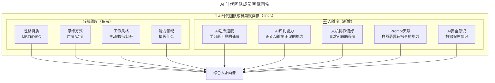
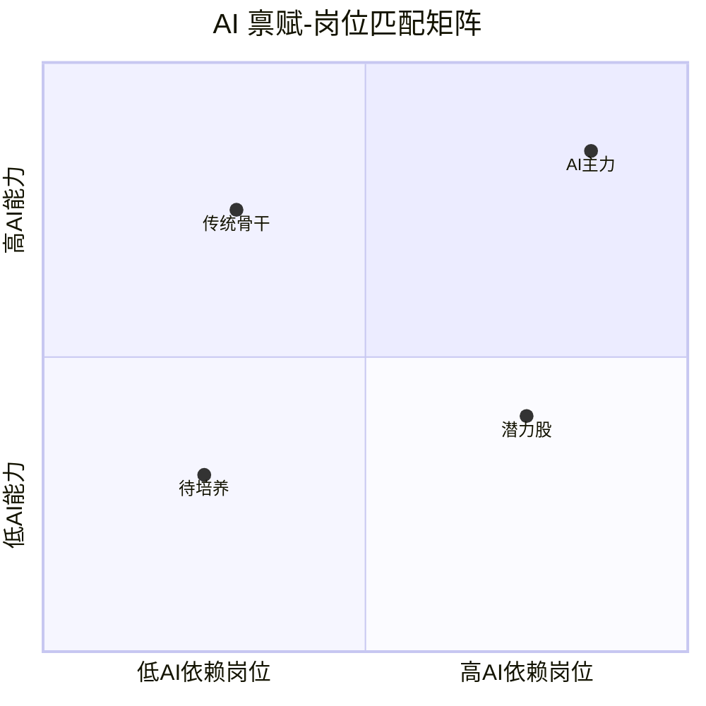
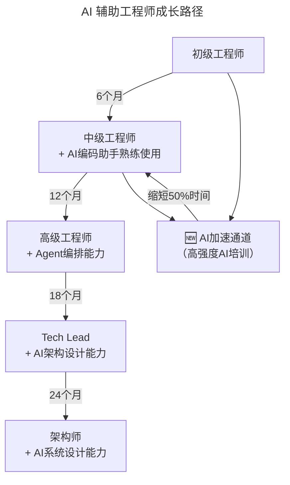
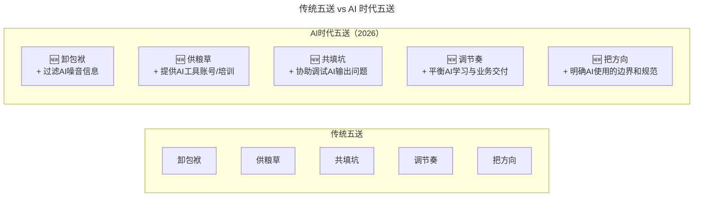
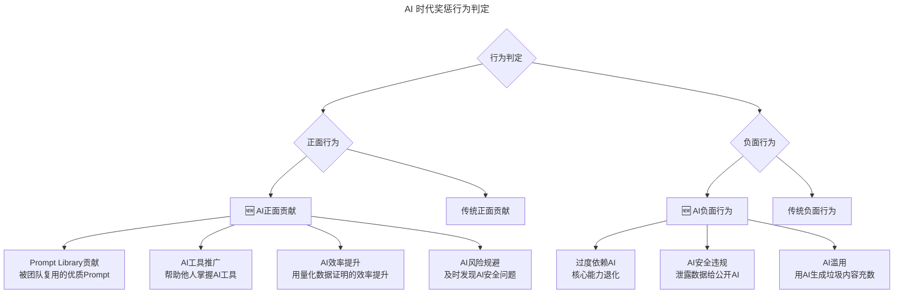

# 第18讲 | 做到这四点，团队必定飞速成长

> **适用范围**：团队牵头人、技术管理者（一线 Tech Lead、技术总监、CTO）、项目经理、HR（协同团队建设），以及希望激发团队斗志、促进成员成长、设定合理目标的团队负责人。适用于团队组建、目标管理、绩效激励等场景。
>
> **更新摘要（v2 · 2026-08 更新）**：
> - 结构化升级为 6 节骨架（导言 / 核心方法论 / 关键流程 / 工具与实战 / 常见误区 / 进阶延展）
> - 整合原"AI 时代升级注解（2026）"内容，将团队成长四要素升级为 AI 时代新内涵
> - 为全部 Mermaid 图补充 `--- title: ... ---` frontmatter，并在每张图后追加文字解读
> - 补充 AI 时代人才画像、SMART-AI 原则、五送升级、激励机制创新
> - 将原"作者简介"融入导言，原"Checklist"融入进阶延展

---

## 1. 导言

### 1.1 团队成长的共性问题

如何激发团队的斗志？如何促进团队成员的成长？如何帮助团队成员设定工作目标？这几个问题一定反复困扰着每一个团队的牵头人。

方法很多、理论也不少，从 KPI 到 OKR，每个都是很多企业和团队实践的经验，但从十多年的团队管理经验来看，这些方法和理论其实有一个共同的内核：**摸清禀赋、认清目标、扫清障碍、列清奖惩**。

### 1.2 作者简介

洪倍，AdMaster 创始人兼首席技术官，TGO 鲲鹏会上海分会会员。毕业于上海交通大学，于 2006 年与闫曌共同创立 AdMaster。拥有超过 13 年大数据产品构架、挖掘、处理和创新技术研发经验。带领 AdMaster 研发团队，架构了国内领先的涵盖广告监播、社交聆听、电商渠道及移动应用等多种数据源的营销大数据采集和处理集群。

### 1.3 2026 年 AI 时代技术背景

2026 年，**团队成长的四要素——摸清禀赋、认清目标、扫清障碍、列清奖惩——都被 AI 重新定义**。84% 的开发者使用 AI 编程工具意味着：**每个人的"禀赋"都包含了一个新维度——AI 协作能力**；**目标设定可以借助 AI 更精准**；**障碍可以用 AI 更快扫除**；**奖惩机制需要考虑 AI 贡献**。

原文的核心方法论依然有效，但需要注入 AI 时代的新内涵。

---

## 2. 核心方法论

### 2.1 四要素：团队飞速成长的核心

#### 摸清禀赋，力求人和事的匹配

摸清禀赋是第一步。孙子兵法的"知己知彼，百战不殆"是众人皆知的古训。作为团队牵头人，摸清每一个团队成员的性格、能力甚至是健康和家庭状况，是帮助团队成员成长的第一步。摸清了成员的禀赋，也更有利于团队的分工，帮助成员找到合适的角色和位置。

一般来说，我们总能将一位同事从几个角度来评价，不管是 MBTI、九型人格还是近年流行的 DISC，其实都在做同样的事情——摸清团队成员的禀赋。工作的特性匹配了成员的特质，至少可以避免时间、人力和资源错配导致的浪费，也为团队的组建、短板的补强提供了方向。

#### 认清目标，规划合理的成长路径

如果说摸清禀赋更多的指成员的现状，那么认清目标讲的就是筹备未来。未来包含两层含义：成为什么样的人，做成什么样的事。

大家都大致了解"一万小时理论"，但是往往忽略了这里的"一万小时"指的是刻意实践所累积的时间，而不仅仅是打发消磨的时间。和团队成员一起深入沟通，找到一个既能帮团队做成事、也能帮助成员个人获得训练积累成长 1 万小时的目标，是重中之重。

#### 扫清障碍，扶上马还得送一程

认清了人和事的大目标、分解逐个突破的小目标后，团队牵头人要做的一件事就是帮助成员一起扫清路径上的各种障碍，俗语也叫"扶上马还得送一程"。送一程干的事情无外乎卸包袱、供粮草、共填坑、调节奏、把方向之类。

#### 列清奖惩，用惩罚警示，用奖励提速

对于快速成长的团队，奖惩也要列清，尤其要避免功过相抵的糊涂帐。奖惩不仅仅是物质上的得失，更多是一种仪式，奖是仪式上的凯歌，惩是仪式上的警钟。

### 2.2 目标设定的 S.M.A.R.T 原则

一个好目标一定具有：S 特定领域、M 衡量方法、A 实现路径、R 所需资源、T 时间范围 这五个要素。

这里尤其要提醒大家近年来管理学界的一些补充：R 字母更有指导意义的解释是达成目标所需要的资源 Resources，这一观点在 2013 年由 John Lawler 和 Andy Bilson 提出。一个团队成员除了自身的能力、经验和人脉这些内部潜力外，最大的外部资源往往来自于团队其他成员的互补、来自于团队牵头人更丰富的阅历、经验和人脉。

### 2.3 找出个人成长目标的三步法

找出个人的成长目标一般分三步：**找寻榜样，自省差距，分解突破**。

榜样可以是身边更出色的前辈，也可以是业界的大牛，甚至是几个实例的综合体；自省差距往往也可以和摸清禀赋结合在一起；然后从众多的差距中找到一个相对好入手、好训练、有助于成事的点，进行突破。

### 2.4 人的禀赋与事的特性匹配

"专注执行不容错型"和"勇于创新敢于试错型"显然也需要不太一样的成员。我们不太会赶鸭子上架，让一个设计师去写数据库的代码。工作时，一定要和 HR 同事密切沟通，是不是要招人、招多少人、招什么样角色的人、补强短板还是建立优势壁垒，都需要和 HR 同事有统一的推演和规划。面试、背调就是一次全面摸清禀赋的过程。

### 2.5 扫清障碍的"五送"方法论

"扶上马还得送一程"送一程干的事情无外乎：

- **卸包袱**：合理的分配任务，尽量排除偏离个人成长目标（但是可能适合其他成员）、又耗费工时的工作事项；
- **供粮草**：提供攻坚所需的关键性的数据、硬件甚至是经费；
- **共填坑**：遇到困难和棘手问题，作为牵头人自己不能退缩，不能甩锅，甚至要敢于背锅，授权成员去试错，要和成员一起战斗；
- **调节奏**：企业环境不断变化，小目标需要因应调整，及时调整前进的步点和节奏；
- **把方向**：提醒个人成长目标和做事的初衷，避免为了成事而疲于奔命，一起把握既定的大方向。

在成长之路上提速的整个过程，也和驾驶手动挡汽车起步提速一样：踩离合（卸包袱）、给油（供粮草）都必不可少，坡起时还要借助刹车（共填坑），即使右手不断换挡（调节奏），也要紧握方向盘目视前方（把方向）。

---

## 3. 关键流程

### 3.1 要素一：摸清禀赋 → AI 时代的人才画像升级

原文提到用 MBTI、DISC 等工具评估团队成员禀赋。在 2026 年，需要增加 **AI 能力维度**：

图解：AI 时代团队成员禀赋画像在传统维度（性格特质、思维方式、工作风格、能力领域）基础上，新增 AI 维度（AI 适应速度、AI 评判能力、人机协作偏好、Prompt 天赋、AI 安全意识），两者共同汇入综合人才画像，实现更全面的禀赋评估。

**⭐ AI 禀赋评估实用方法**：

| 评估方法 | 具体操作 | 判断依据 |
|----------|---------|---------|
| **AI 工具使用调查** | 询问日常使用的 AI 工具及频率 | AI 适应速度 |
| **Prompt 测试** | 给出同一任务，观察其提示词质量 | Prompt 天赋 |
| **AI 输出审阅** | 让其审查一段 AI 生成的代码 | AI 评判能力 |
| **工作流访谈** | 了解其如何将 AI 融入日常工作 | 人机协作偏好 |

**AI 禀赋与岗位匹配**：

图解：AI 禀赋-岗位匹配矩阵将成员分为四类：AI 主力（高 AI 能力+高 AI 依赖岗位，重点培养）、传统骨干（高能力+低 AI 依赖，尊重其选择逐步引导）、潜力股（高 AI 依赖岗位+能力待提升，优先培训对象）、待培养（低 AI 能力+低 AI 依赖，不急于推动）。

### 3.2 要素二：认清目标 → AI 辅助的成长路径规划

从"一万小时"到"AI 加速的一万小时"。原文引用"一万小时理论"强调刻意练习，在 AI 时代，**AI 可以大幅压缩达到精通所需的时间**：

| 技能领域 | 传统达到熟练时间 | AI 辅助达到熟练时间 | 加速比 |
|----------|------------------|-------------------|--------|
| 新语言入门 | 500 小时 | **100 小时** | 5x |
| 框架上手 | 200 小时 | **40 小时** | 5x |
| 代码调试 | 1000 小时（经验积累） | **200 小时** | 5x |
| 文档编写 | 500 小时 | **50 小时** | 10x |
| 单元测试 | 300 小时 | **60 小时** | 5x |

**⭐ AI 时代成长目标设定的 SMART-AI 原则**：

| 字母 | 原含义 | 🆕 AI 时代补充 |
|------|--------|--------------|
| S 特定 | 目标清晰明确 | **明确哪些环节使用 AI** |
| M 可衡量 | 有量化指标 | **包含 AI 使用率和 AI 效能指标** |
| A 可实现 | 有实现路径 | **AI 工具作为实现路径的一部分** |
| R 资源 | 所需资源 | **包括 AI 工具、算力、Prompt 库等 AI 资源** |
| T 时限 | 时间范围 | **考虑 AI 学习曲线时间** |

**AI 辅助成长路径示例**：

图解：AI 辅助成长路径在传统职级晋升路径（初级→中级→高级→Tech Lead→架构师）旁，增加了 AI 加速通道。高强度 AI 培训可缩短 50% 的升级时间，且 AI 加速通道与成长路径形成循环反馈，持续迭代提升。

### 3.3 要素三：扫清障碍 → AI 时代的"送一程"升级

**传统障碍 vs AI 时代新障碍**：

| 障碍类型 | 传统做法 | 🆕 AI 时代新障碍 | AI 解决方案 |
|----------|---------|-----------------|-----------|
| 技术难题 | 导师指导、集体攻关 | **AI 工具选择困难** | **统一工具栈、提供培训** |
| 信息不对称 | 同步会议、文档共享 | **AI 能力参差不齐** | **分层培训、Buddy 制度** |
| 资源不足 | 申请预算、协调资源 | **AI 使用焦虑** | **心理疏导、成功案例分享** |
| 方向迷失 | 定期对齐、OKR review | **AI 依赖过度** | **无 AI 日、能力考核** |

**⭐ AI 时代的"五送"升级**：

图解：AI 时代五送在传统五送基础上叠加 AI 支持：卸包袱增加过滤 AI 噪音信息、供粮草增加提供 AI 工具账号/培训、共填坑增加协助调试 AI 输出问题、调节奏增加平衡 AI 学习与业务交付、把方向增加明确 AI 使用的边界和规范。

**具体可执行措施**：
1. **卸包袱（AI 版）**：帮成员过滤无效的 AI 工具推荐，避免"工具疲劳"
2. **供粮草（AI 版）**：为团队采购 Copilot/Cursor 等付费 AI 工具，提供算力支持
3. **共填坑（AI 版）**：当 AI 生成的代码有问题时，管理者协助 debug
4. **调节奏（AI 版）**：在项目紧张期适当降低 AI 学习要求，专注交付
5. **把方向（AI 版）**：明确哪些任务必须人工完成，哪些可以交给 AI

### 3.4 要素四：列清奖惩 → AI 时代的激励机制创新

原文强调"功过相抵的糊涂帐"要避免。在 2026 年，需要明确 **AI 贡献的认定标准**：

图解：AI 时代奖惩行为判定将行为分为正面与负面两类。AI 正面贡献包括 Prompt Library 贡献、AI 工具推广、AI 效率提升、AI 风险规避；AI 负面行为包括过度依赖 AI、AI 安全违规、AI 滥用。管理者需明确这些 AI 行为的认定标准，避免糊涂帐。

---

## 4. 工具与实战

### 4.1 AI 时代的创新奖励

| 奖励类型 | 具体形式 | 触发条件 |
|----------|---------|---------|
| **AI 创新之星** | 月度表彰+奖金 | AI 工具使用效率提升显著 |
| **Prompt 大师** | 荣誉称号+津贴 | Prompt 被收录进企业 Prompt Library |
| **AI 布道师** | 晋升加分 | 内部分享 AI 内容≥3 次/季度 |
| **AI 安全卫士** | 特别奖励 | 发现并阻止 AI 安全事故 |
| **AI 探索基金** | 个人预算 | 用于探索新 AI 工具（需提交试用报告）|

### 4.2 AI 时代的惩罚警示

| 负面行为 | 后果 | 教育措施 |
|----------|------|---------|
| AI 安全违规 | 严重警告+再培训 | 强制参加 AI 安全培训 |
| 过度依赖 AI | 绩效扣减 | 安排无 AI 周的强化训练 |
| AI 输出造假 | 记过处理 | 一对一沟通，了解原因 |

### 4.3 有温度的奖励设计

关于奖励，请告别庸俗的纯物质奖励。金钱固然好，但是并不一定是团队成员需要的。因此和 HR 一起，设计更有温度的奖品，会让成员更有归属感和求胜欲：

- 在团队成功的完成短期闭关冲刺的交付目标后，集体休个小长假就是团队最需要的奖励；
- 将奖品奖金和团队的谢意，直接寄送给获奖成员的家人，让军功章的另一半一起分享成员的成就；
- 忽略年龄和资历的桎梏，给予充分的授权，允许年轻的杰出成员，独立带领一支年轻的新团队；
- 帮助成员完成梦想，哪怕是资助成员停薪续保去留学深造、去创业，更是一种有温度也有气度的奖励。

### 4.4 惩罚前的自我检讨

在对具体的成员进行惩罚之前，请各位团队牵头人先自我检讨三个问题：

1. 我有没有错配人和事，让成员从事了既不胜任亦不享受的工作？
2. 我有没有帮助成员找到明确的目标和清晰的路径，并在路径上做好保障？
3. 我的三个问题中，有任何一个问题的答案是否定的吗？

如果这三个问题中，有任何一个问题的答案是否定的，那么请先检讨你自己的工作缺位。甚至对成员个人的惩罚有时也不需要处罚金钱，也不需要记过存档，而仅仅需要的是集体复盘、自我检讨，然后修订目标，制定改进计划。与其纠结如何惩罚既成事实，不如把亡羊补牢、改进未来作为一种惩罚方式。

---

## 5. 常见误区

### 5.1 用 AI 能力替代基础能力评估

**错误**：认为会用 AI 就够了，忽视编程基础。

**对策**：**双轨评估**——既看 AI 使用能力，也看基础功底。

### 5.2 成长目标过于激进

**错误**：期望所有人快速成为 AI 高手。

**对策**：**尊重个体差异**，允许不同的 AI adoption 速度。

### 5.3 奖励只看 AI 产出数量

**错误**：谁用 AI 多谁就优秀。

**对策**：**关注质量而非数量**，AI 产出的质量更重要。

### 5.4 功过相抵的糊涂帐

**误区**：将成员的功劳和过失相抵，导致奖惩不明。

**正确认知**：奖惩要列清，尤其要避免功过相抵的糊涂帐。团队成员和团队牵头人一起设定的目标，既是承诺也是对赌；一个人的工作瑕疵就会拖累其他成员乃至整个团队。因此奖惩不仅仅是物质上的得失，更多是一种仪式。

### 5.5 长期闭关冲刺、错将时长当效率

**误区**：长期执行闭关冲刺这种不健康的工时制度。

**正确认知**：我们非常不推荐长期执行闭关冲刺这种不健康的、错将时长当效率的工时制度。团队牵头人也要避免自己成为"施压型"角色，在成员成长路上要用帮助而非鞭子。

### 5.6 带领团队成长不是自己的成长目标

**误区**：作为团队牵头人却不享受带领团队成长的过程，勉强担任管理角色。

**正确认知**：如果团队的牵头人并不享受带领团队成长"扶上马送一程"的过程，也不认为成为一个好的团队牵头人是自己的成长目标，那么请大胆的告诉你的领导，你更适合技术专家、科学家、架构师的角色。请不要把你自己的刻意训练时间累计在你不想要、不享受的目标上。

---

## 6. 进阶延展

### 6.1 2026 年团队飞速成长 Checklist

- [ ] 为每位团队成员建立 **AI 能力档案**（初始评估+定期更新）
- [ ] 制定 **个人 AI 成长目标**，纳入 IDP（个人发展计划）
- [ ] 提供 **分级 AI 培训**（入门/进阶/专家），覆盖全员
- [ ] 建立 **AI 贡献认定机制**，明确奖励标准
- [ ] 设立 **AI 安全红线**，违规必究
- [ ] 每季度进行 **AI 成长复盘**，调整培养策略
- [ ] 培养 **至少 2 名 AI Mentor**，负责团队 AI 辅导

### 6.2 一句话总结（2026 版）

> 团队飞速成长的四要素没有变——**摸清禀赋、认清目标、扫清障碍、列清奖惩**。但每一个要素都有了 **AI 时代的新内涵和新方法**。2026 年的管理者需要做的是：**用 AI 增强诊断能力、用 AI 加速成长路径、用 AI 扫除新型障碍、用 AI 创新激励机制**。记住：**AI 是放大器，能让好的更好，也能让差的更差**——所以选人和育人更加重要。

### 6.3 结语：人己共欲，施之援手

人在工作和生活中主动或被动的扮演很多的角色，但是趋利避害、改善境遇是共通的发自人性的需求。如果说"己所不欲，勿施于人"是一种不作为，那么"人己共欲，施之援手"就是一种共赢的主动选择。

带领团队快速成长，靠的一定不是鞭子，而是每个成员各自所需、且无法拒绝的果子；找到那颗果子、那棵果树，规划前往果园之路，这条路才会是有助于成员成长的高速公路。

### 6.4 延伸阅读

- 第 18 讲之后的团队管理系列文章（《技术领导力 300 讲》）
- TGO 鲲鹏会：https://tgo.geekbang.org

---

*本内容基于 2026 年 GPT-5.5、DeepSeek V4、84% 开发者用 AI 编程等最新技术动态编写。适用对象：团队牵头人、技术管理者、项目经理、HR。*
