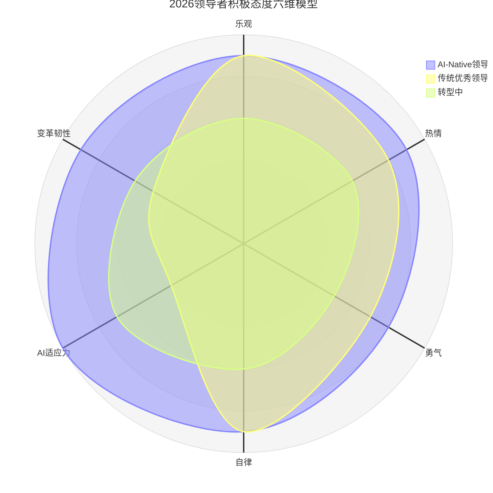

> **适用范围**：技术管理者、Team Leader、Engineering Manager
> **更新摘要**：v2 版本基于原文第 101 讲内容，保留全部原始内容并升级为 6 节结构；融入 2026 年 AI 时代注解，新增 AI 适应力和变革韧性两个态度维度，以及 AI 增强的态度培养方法。

---

# 第101讲 | 刘俊强：领导力提升指南之培养积极的态度

## 一、导言

作为技术管理者需要负责的事情繁多，需要培养并带领团队完成工作目标，会面临诸多不如人意或突发的情况，稍加不注意就会让自己陷入到负面情绪中。我们必须及时处理工作中的负面情绪，不论是团队成员的或是自己的，毕竟负面情绪是可以传播的，我们当然不想给团队增加消极性，从而影响士气和团队表现。

> **⭐ 2026 年技术背景**：2026 年，原文核心方法论"积极态度四要素（乐观-热情-勇气-自律）"在 AI 时代需要重新诠释——**AI 时代的工作环境变化更快，不确定性更高，但同时也提供了更多工具来辅助保持积极心态**。84% 开发者使用 AI 编程，"与 AI 协作"成为新的工作常态，对态度提出了新要求。

一般来讲，我们在工作中常见的负面情绪及典型场景有以下这些：

1. **挫败（Frustration）**：当我们感到卡住或陷入困境时，通常会有挫败感。有可能是团队没有按照你的期望完成好项目，抑或是上司或老板未按时出席你主持的会议。
2. **愤怒（Anger）**：失控的愤怒可能是人们在工作场所中经历的最具破坏性的情绪。同时这也是我们大多数人处理得不好的情绪，作为管理者更要学会控制愤怒的情绪。
3. **忧虑（Anxiety）**：是对尚未到来事情的担忧和焦虑，例如公司业务发展受阻，需要对技术团队进行人员优化，抑或是工作挑战大担心完成不了等。忧虑的情绪不加以控制的话，很容易扩散影响自己的身心健康和工作效率，同时也容易让你在工作中不太愿意承担风险。
4. **失望（Disappointment）**：当事情未达到我们期望时，一般会产生失望的情绪，例如团队成员认为未取得应得的晋升时。失望的情绪也会让我们趋向避免承担风险，影响到我们的工作效率。

不得不承认的是，工作场所中不出现负面情绪是不可能的，不论是因为管理者糟糕的决策引起的，亦或是由团队成员的个人问题引起的，作为技术管理者，我们不能对负面情绪视而不见，不去处理，任由它们在团队中蔓延，影响团队效率和士气。作为合格的管理者，我们应该学会在团队中培养积极的态度，学习洞察和处理负面情绪。

---

## 二、核心方法论

### 2.1 原文四要素回顾

原文提出积极态度的四要素：
1. **乐观（Optimism）**：相信未来会更好，关注机会而非困难
2. **热情（Passion）**：对工作的热爱和投入
3. **勇气（Courage）**：面对挑战不退缩
4. **自律（Self-discipline）**：自我管理和持续学习

### 2.2 ⭐ 2026 四要素升级模型

上述雷达图对比了三类领导者在六个态度维度上的表现：AI-Native 领导者在 AI 适应力和变革韧性两个新增维度上显著领先；传统优秀领导者在这两个维度上明显不足；转型中的领导者处于中间状态，正在向 AI-Native 演进。

#### 新增两维详解

| 新维度 | 定义 | AI 时代重要性 |
|-------|------|------------|
| **AI 适应力（AI Adaptability）** | 快速接受并善用新技术的能力 | 技术迭代加速，不会用 AI = 被淘汰 |
| **变革韧性（Change Resilience）** | 在快速变化中保持稳定的能力 | AI 带来的组织变革频繁，需要心理韧性 |

### 2.3 培养积极态度的方法

#### 原文方法回顾

- 自我对话（调整内心独白）
- 持续学习（阅读/培训）
- 寻找导师
- 设定目标

#### ⭐ 2026 AI-Augmented 方法

| 方法 | 传统做法 | AI 增强做法 |
|-----|---------|-----------|
| **自我对话** | 写日记反思 | **+ AI 情绪日记助手**（分析情绪模式） |
| **持续学习** | 读书/上课 | **+ AI 个性化学习路径推荐** |
| **寻找导师** | 人际网络 | **+ AI Mentor（24 小时可用）** |
| **设定目标** | 年度计划 | **+ AI 目标分解与进度追踪** |
| **压力管理** | 运动/冥想 | **+ AI 健康提醒 + 工作负荷预测** |

---

## 三、关键流程

### 3.1 应对挫败感

无论是基于什么原因，快速处理挫败感很重要，因为它很容易导致更多的负面情绪，比如愤怒。对于处理挫败感原文建议：

1. **首先是停下来评估**：当你感到挫败时，能够做的最好的事情之一就是先停下来，当然这里说的停下来是指精神和思维上，回顾下遇到的情况，问问自己为什么感到沮丧，记录下来并具体来看这些事情，想想所遇到情况的积极方面。
2. **寻找情况的积极面**：考虑你所遇到情况的积极方面会帮助你以不同的方式看待事物，角度微小的改变能够对我们的心情进行改善，因为造成你挫败感的人，他们可能并不是刻意让你沮丧或困扰的。
3. **消除脑里的负面词语**：一般产生挫败感时，我们的脑子里会不自主产生些负面词汇或语句，让我们陷入这种负面情绪的影响之中，可以使用语气不那么重的词汇及语句来替换，例如"事情进展有些不顺利""完成情况低于预期"等。

### 3.2 控制愤怒

没有人会喜欢自己发怒的样子，作为管理者更不应该对团队成员发怒，因为这样会很容易将之前建立的团队信任摧毁掉。原文建议：

1. **注意愤怒的早期迹象**：只有你知道愤怒发生时的危险信号，所以我们要学会在它们开始时识别它们。尽早制止你的愤怒是关键。
2. **当生气时想象自己生气的样子**：例如，如果你要对团队大喊大叫，想象一下你自己的样子，是不是面红耳赤、手舞足蹈，你自己是否愿意和这样的人一起工作。
3. **学会聆听**：团队管理中经常会遇到的愤怒场景，便是团队成员对未完成好的事情进行解释或辩解，这很容易让管理者情绪达到临界点，进而爆发，因此我们要学会聆听，保持冷静沉着的风度。

### 3.3 解除忧虑

原文建议的忧虑处理方法：

1. **正面处理员工的恐惧**：坦诚地与团队成员沟通现状，并探讨接下来该怎么改善处理，唯有行动才能打破忧虑与恐惧。
2. **帮助员工避免夸大风险**：当事情失去控制时，人们难免会产生恐惧并可能会放大忧虑。作为管理者，我们应该通过自己的经验和分析，帮助员工正视现状及问题。
3. **记下你的担忧**：如果你发现有些事情总是烦恼着自己，那么请将它们记录下来，然后安排时间处理它们。

### 3.4 宽容失望

原文建议的失望应对措施：

1. **调整自己的心态**：花一点时间让自己意识到事情并不总是一帆风顺的。
2. **适当调整目标**：如果你对团队未达到目标感到失望，并不意味着目标不可到达，可能是需要再多点的时间，那么是否可以调整下截止日期呢。
3. **帮助员工调整**：员工可能会因为未取得自己期望的晋升而感到沮丧和迷失方向，在沟通时要有同理心，不要要求他们怎么怎么做，而是引导他们如果要达到自己的期望，应该要解决哪些问题。

---

## 四、工具与实战

### 4.1 态度自评工具

使用"六维模型"进行自我评估：

| 维度 | 自评问题 | 评分（1-10） |
|-------|---------|-------------|
| 乐观 | "我相信团队和公司的未来会更好" | ___ |
| 热情 | "我对每天的工作充满期待" | ___ |
| 勇气 | "我敢于面对棘手问题和冲突" | ___ |
| 自律 | "我能持续学习和自我管理" | ___ |
| AI 适应力 | "我快速接受并善用 AI 新技术" | ___ |
| 变革韧性 | "我在快速变化中能保持稳定" | ___ |

### 4.2 团队情绪管理工具

| 工具类型 | 推荐工具 | 用途 |
|---------|---------|------|
| **情绪监测** | 团队 pulse survey + AI 情感分析 | 定期感知团队情绪状态 |
| **沟通辅助** | AI 会议纪要 + 行动项追踪 | 减少沟通误解和遗漏 |
| **学习支持** | AI 个性化学习推荐 | 降低学习焦虑 |
| **压力预警** | AI 工作负荷分析 | 提前识别过载风险 |

### 4.3 ⭐ 2026 立即行动清单

- [ ] 用上述"六维模型"自评当前态度状态
- [ ] 识别最需要提升的维度，制定针对性改进计划
- [ ] 为团队引入至少一种 AI 辅助工具，帮助成员保持积极状态

---

## 五、常见误区

| 误区 | 表现 | 应对策略 |
|------|------|----------|
| **忽视 AI 焦虑** | 认为 AI 焦虑会自行消散 | 正面沟通，提供培训和转型支持 |
| **强装积极** | 压抑负面情绪，不处理 | 允许情绪表达，提供疏导渠道 |
| **工具万能论** | 以为引入 AI 工具就能解决态度问题 | 工具是辅助，核心还是人的关怀和沟通 |
| **忽视自身情绪** | 只关注团队，不关注自己 | 管理者自身的情绪管理同样重要 |

---

## 六、进阶延展

### 核心洞察

> 在 AI 时代，积极的态度是领导力的基础——但积极的态度需要包含"拥抱变化"和"善用 AI"的新内涵。**AI 既是新的不确定性来源，也是保持积极心态的强大工具。**

### 总结

我们在上面谈到了一些常见的负面情绪，以及如何应对它们。我认为作为管理者应该明白的一点是，不论你自己或团队产生了负面情绪、士气低落，这些都是你要承担责任的，因为你是管理者，需要你来带领大家走出困境解决问题。

做个阳光积极的管理者并不容易，需要我们保持对团队负面情绪的洞察，并采取适当的方法进行处理，而这需要管理者不断训练精进。

### 思考题

你最近一次发现团队负面情绪是什么呢？你又是如何应对的？在 AI 时代，你是否注意到团队成员对 AI 的焦虑情绪？

### 作者简介

刘俊强（微信公众号：程序员精进）现任腾讯云资深架构师，曾任迅雷技术总监、某互联网公司技术副总裁，10+ 年以上互联网开发经验，8 年以上技术管理经验。

---

**注解说明**：本章节基于 2026 年 AI 深度改变工作环境的现状，对原文"培养积极的态度"进行 AI 时代升级。核心理念不变——积极的态度是领导力的基础——但在 AI 时代，积极的态度需要包含"拥抱变化"和"善用 AI"的新内涵。